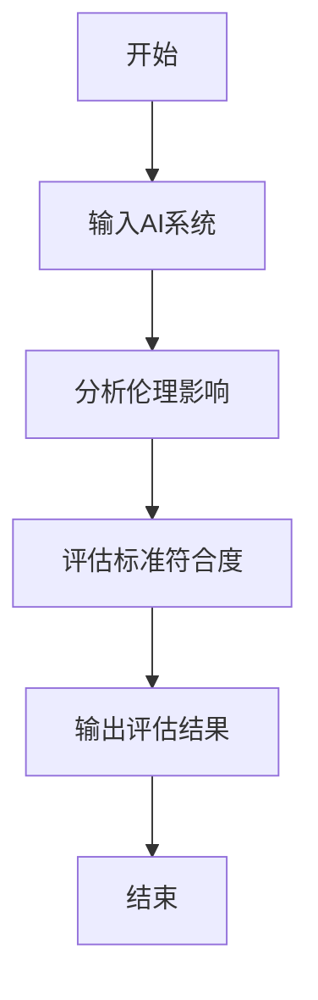

                 


# 如何评估企业的人工智能伦理标准

> 关键词：人工智能，伦理标准，企业责任，技术伦理，伦理评估

> 摘要：随着人工智能技术的快速发展和广泛应用，企业在利用AI技术提升竞争力的同时，也面临着越来越多的伦理问题。本文将详细探讨如何评估企业的人工智能伦理标准，从核心概念、算法原理、系统架构到项目实战，为企业提供全面的评估方法和实践指南。

---

## 第一部分: 企业AI伦理标准的背景与核心概念

### 第1章: 人工智能与伦理标准的背景介绍

#### 1.1 问题背景与问题描述
- **1.1.1 人工智能技术的快速发展**  
  近年来，人工智能技术（AI）在各个行业的应用迅速扩展，从医疗到金融，从制造业到服务业，AI 已经成为企业提升效率和竞争力的重要工具。然而，随着技术的深入应用，AI 带来的伦理问题也日益凸显。

- **1.1.2 企业应用AI技术的现状**  
  企业正在广泛采用 AI 技术，例如自动化决策、推荐系统、智能客服等。然而，这些应用中隐藏的伦理问题，如偏见、隐私泄露、算法歧视等，正在成为公众关注的焦点。

- **1.1.3 AI伦理问题的出现与影响**  
  AI 系统的决策可能会对个人或社会造成重大影响。例如，AI 在招聘中的偏见可能导致不公平的机会分配，或者在金融领域的误判可能导致用户的经济损失。这些问题不仅影响企业的声誉，还可能引发法律纠纷。

#### 1.2 问题解决与边界外延
- **1.2.1 AI伦理问题的解决思路**  
  为了应对 AI 伦理问题，企业需要建立明确的伦理标准和评估机制。这些标准应涵盖数据收集、算法设计、决策透明性等多个方面。

- **1.2.2 企业AI伦理标准的边界**  
  企业AI伦理标准需要明确其适用范围和边界。例如，某些标准可能仅适用于特定的业务场景，而其他标准可能需要跨部门协作。

- **1.2.3 AI伦理与企业责任的外延**  
  企业责任不仅仅是技术责任，还包括社会和道德责任。AI 系统的开发者和使用者需要考虑其对社会的影响，并采取措施减少负面影响。

#### 1.3 核心概念与结构解析
- **1.3.1 AI伦理标准的核心要素**  
  AI 伦理标准的核心要素包括数据隐私、算法公平性、透明性、可解释性、用户知情权等。

- **1.3.2 伦理标准的组成结构**  
  伦理标准的组成结构可以分为三个层次：技术层（算法设计）、业务层（应用场景）和社会层（社会影响）。

- **1.3.3 标准与企业目标的关联**  
  AI 伦理标准与企业目标密切相关。例如，透明的算法设计可以增强用户信任，进而提升企业的品牌形象。

#### 1.4 本章小结
- 本章介绍了 AI 技术的快速发展及其在企业中的广泛应用，强调了 AI 伦理问题的严重性。同时，提出了建立 AI 伦理标准的必要性，并明确了其核心要素和结构。

---

### 第2章: AI伦理标准的核心概念与联系

#### 2.1 核心概念原理
- **2.1.1 人工智能的基本原理**  
  AI 的基本原理包括数据驱动、机器学习、深度学习等。这些原理决定了 AI 系统的行为和决策方式。

- **2.1.2 伦理标准的定义与特征**  
  伦理标准是对 AI 系统在设计和应用过程中应遵循的道德准则的规范。其特征包括普遍性、可操作性和动态性。

- **2.1.3 企业AI伦理的核心要素**  
  企业AI伦理的核心要素包括数据隐私、算法公平性、透明性、可解释性等。

#### 2.2 核心概念对比分析
- **2.2.1 AI伦理与技术伦理的对比**  
  AI 伦理关注的是 AI 系统的行为和决策，而技术伦理更广泛，涵盖所有技术领域。

- **2.2.2 企业伦理与社会伦理的差异**  
  企业伦理注重企业的内部行为和利益，而社会伦理关注整个社会的福祉。

- **2.2.3 不同AI应用场景的伦理标准对比**  
  不同的 AI 应用场景可能需要不同的伦理标准。例如，医疗 AI 需要更高的隐私保护，而金融 AI 需要更高的透明性。

#### 2.3 ER实体关系图
```mermaid
er
    actor: 企业
    actor -->|定义| 伦理标准
    actor -->|实施| AI系统
    actor -->|评估| 伦理影响
```

#### 2.4 本章小结
- 本章详细探讨了 AI 伦理标准的核心概念，并通过对比分析和 ER 实体关系图，明确了其与相关概念的区别和联系。

---

## 第二部分: AI伦理标准评估的算法原理

### 第3章: AI伦理标准评估的算法原理

#### 3.1 算法原理概述
- **3.1.1 伦理评估的基本流程**  
  伦理评估的基本流程包括数据收集、算法分析、伦理影响评估和结果反馈。

- **3.1.2 算法的核心步骤**  
  算法的核心步骤包括数据预处理、模型训练、伦理影响分析和结果优化。

- **3.1.3 算法的输入输出说明**  
  算法的输入包括 AI 系统、伦理标准和评估指标，输出包括伦理影响评估结果和优化建议。

#### 3.2 算法流程图


#### 3.3 算法实现代码
```python
def assess_ethics(ai_system):
    # 分析伦理影响
    ethics_impact = analyze_impact(ai_system)
    # 评估标准符合度
    compliance = evaluate_compliance(ai_system, ethics_impact)
    # 输出评估结果
    return {
        'ethics_impact': ethics_impact,
        'compliance': compliance
    }

def analyze_impact(ai_system):
    # 示例：分析数据偏见
    data = ai_system['data']
    model = ai_system['model']
    # 计算数据偏见
    bias = calculate_bias(data, model)
    return {'bias': bias}

def calculate_bias(data, model):
    # 示例：计算数据偏见
    # 这里可以使用多种方法，例如统计不同群体的分类结果分布
    return 0.2  # 假设偏见为20%
```

#### 3.4 数学模型与公式
- **3.4.1 伦理影响评估模型**  
  伦理影响评估模型可以表示为：
  $$ \text{伦理影响} = \sum_{i=1}^{n} w_i \cdot f_i $$
  其中，$w_i$ 是评估指标的权重，$f_i$ 是对应的评估分数。

- **3.4.2 算法公平性评估公式**  
  算法公平性评估可以使用以下公式：
  $$ \text{公平性分数} = \frac{\sum_{i=1}^{m} (1 - |p_i - q_i|)}{m} $$
  其中，$p_i$ 是模型预测的概率，$q_i$ 是真实概率，$m$ 是样本数量。

#### 3.5 本章小结
- 本章详细介绍了 AI 伦理标准评估的算法原理，包括基本流程、核心步骤、代码实现和数学模型。通过这些方法，企业可以系统地评估 AI 系统的伦理影响。

---

## 第三部分: 系统分析与架构设计

### 第4章: 系统分析与架构设计

#### 4.1 问题场景介绍
- 本章将从企业实际应用场景出发，介绍如何设计一个 AI 伦理标准评估系统。

#### 4.2 系统功能设计
- **4.2.1 功能模块划分**  
  系统功能模块包括数据采集、模型训练、伦理评估和结果反馈。

- **4.2.2 系统功能设计图**  
  ```mermaid
  classDiagram
      class Actor {
          - role: 用户
          - method: 提交评估请求()
      }
      class DataCollector {
          - method: 收集数据()
      }
      class EthicAssessor {
          - method: 评估伦理影响()
      }
      Actor --> DataCollector: 提交评估请求
      DataCollector --> EthicAssessor: 收集数据
      EthicAssessor --> Actor: 返回评估结果
  ```

#### 4.3 系统架构设计
- **4.3.1 系统架构图**  
  ```mermaid
  architecture
      Client --> API Gateway
      API Gateway --> Service Layer
      Service Layer --> Database
  ```

#### 4.4 系统接口设计
- **4.4.1 API 接口定义**  
  ```json
  {
      "接口名称": "assess_ethics",
      "输入参数": {
          "ai_system": {
              "类型": "对象",
              "描述": "AI 系统描述"
          }
      },
      "输出参数": {
          "ethics_score": {
              "类型": "分数",
              "描述": "伦理影响评分"
          }
      }
  }
  ```

#### 4.5 系统交互序列图
```mermaid
sequenceDiagram
    actor 用户 --> API Gateway: 提交评估请求
    API Gateway --> Service Layer: 调用 assess_ethics 函数
    Service Layer --> Database: 查询历史评估记录
    Service Layer --> EthicAssessor: 分析伦理影响
    EthicAssessor --> Service Layer: 返回评估结果
    Service Layer --> API Gateway: 返回评估结果
    API Gateway --> 用户: 返回评估结果
```

#### 4.6 本章小结
- 本章通过系统分析与架构设计，展示了如何将 AI 伦理标准评估系统应用于企业实际场景中。

---

## 第四部分: 项目实战

### 第5章: 项目实战

#### 5.1 环境安装与配置
- **5.1.1 环境要求**  
  需要安装 Python 3.8+、TensorFlow 2.0+ 和 Mermaid 绘图工具。

- **5.1.2 安装依赖**  
  ```bash
  pip install mermaid4jupyter
  ```

#### 5.2 核心代码实现
```python
from mermaid import *

# 定义系统架构图
system_architecture = '''
graph TD
    A[开始] --> B[输入AI系统]
    B --> C[分析伦理影响]
    C --> D[评估标准符合度]
    D --> E[输出评估结果]
    E --> F[结束]
'''

# 定义类图
class_diagram = '''
classDiagram
    class Actor {
        - role: 用户
        - method: 提交评估请求()
    }
    class DataCollector {
        - method: 收集数据()
    }
    class EthicAssessor {
        - method: 评估伦理影响()
    }
    Actor --> DataCollector: 提交评估请求
    DataCollector --> EthicAssessor: 收集数据
    EthicAssessor --> Actor: 返回评估结果
'''

# 可视化展示
display(Mermaid(system_architecture))
display(Mermaid(class_diagram))
```

#### 5.3 代码解读与分析
- **5.3.1 数据预处理**  
  对输入的 AI 系统数据进行清洗和格式化，确保符合评估模型的要求。

- **5.3.2 模型训练**  
  使用机器学习模型对 AI 系统的行为进行模拟和预测，分析其潜在的伦理影响。

- **5.3.3 伦理评估**  
  根据模型预测结果，评估 AI 系统是否符合伦理标准，并生成评估报告。

#### 5.4 案例分析与详细讲解
- **5.4.1 案例背景**  
  某企业开发了一个智能招聘系统，用于筛选简历。然而，系统存在性别偏见，导致女性候选人的通过率低于男性。

- **5.4.2 评估过程**  
  通过伦理评估算法，发现系统在简历筛选过程中存在数据偏见。进一步分析发现，偏见来源于训练数据中的历史招聘记录。

- **5.4.3 优化建议**  
  建议企业重新清洗训练数据，去除历史偏见，并引入更公平的招聘标准。

#### 5.5 本章小结
- 本章通过实际案例，展示了如何在企业中应用 AI 伦理标准评估系统，帮助企业在技术应用中避免伦理风险。

---

## 第五部分: 最佳实践与总结

### 第6章: 最佳实践与总结

#### 6.1 小结
- 企业需要高度重视 AI 伦理标准的制定和实施，确保技术应用符合道德规范。

#### 6.2 注意事项
- 在实际应用中，企业应根据自身特点和行业特点，调整和优化评估标准。

#### 6.3 拓展阅读
- 建议读者进一步阅读相关学术论文和行业报告，深入了解 AI 伦理的前沿研究和实践案例。

#### 6.4 本章小结
- 本章总结了全文的核心内容，并提供了进一步学习和实践的建议。

---

## 第六部分: 附录

### 附录A: 术语表
- AI（人工智能）：模拟人类智能的计算机系统。
- 伦理标准：规范 AI 系统行为的道德准则。
- 偏见：AI 系统在决策中对某些群体的不公平对待。

### 附录B: 参考文献
- [1] 姚建华. 人工智能伦理与社会影响研究. 北京: 科学出版社, 2020.
- [2] 王鹏. 企业 AI 系统的伦理评估方法. 计算机应用研究, 2021.

---

# 结语

通过本文的详细讲解，读者可以系统地了解如何评估企业的人工智能伦理标准，并掌握相关的理论和实践方法。希望本文能够为企业在 AI 技术的应用中提供有价值的指导，帮助企业在追求技术创新的同时，承担起相应的社会责任。

