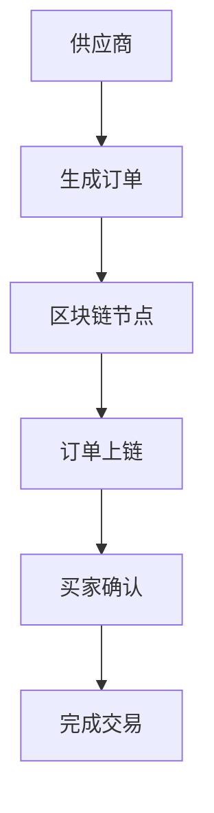
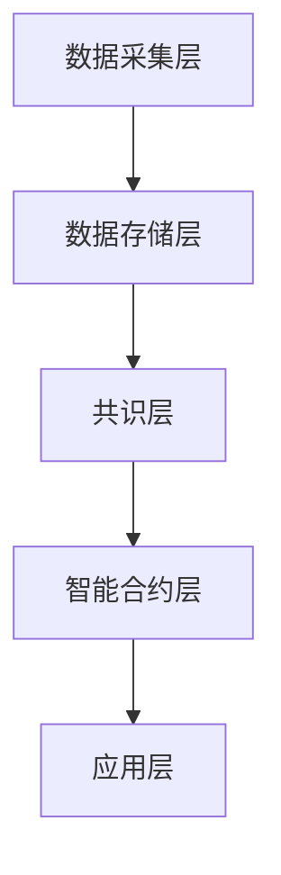
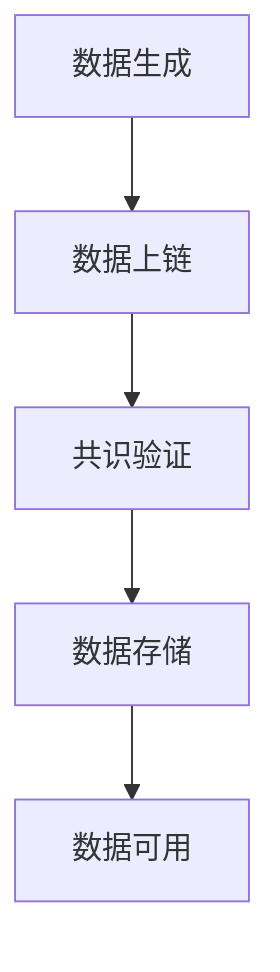

                 


# 如何评估企业的区块链供应链应用

## 关键词：区块链供应链, 评估标准, 技术实现, 系统架构, 项目实战

## 摘要：本文将详细探讨如何评估企业的区块链供应链应用，从核心概念、评估标准、技术实现到系统架构，再到项目实战，全面解析区块链供应链应用的关键要素和实施策略。

---

# 第1章: 区块链供应链应用的背景与核心概念

## 1.1 区块链技术的基本概念

### 1.1.1 区块链的定义与核心特征

区块链是一种去中心化的分布式账本技术，通过密码学和共识机制确保数据的安全性和不可篡改性。其核心特征包括：

- **去中心化**：通过分布式节点实现数据的分布式存储。
- **不可篡改**：数据一旦写入区块链，无法被修改。
- **透明性**：所有交易记录对参与方公开。
- **可追溯性**：通过区块链记录的交易历史可以追溯到源头。

### 1.1.2 区块链的核心技术原理

区块链通过以下核心技术实现数据的安全性和可靠性：

- **共识机制**：如PoW（工作量证明）、PoS（权益证明）、BFT（拜占庭容错）等，确保所有节点达成一致。
- **区块结构**：每个区块包含交易记录、哈希指针（链接前一个区块）和时间戳。
- **哈希函数**：如SHA-256，用于生成区块唯一标识和验证数据完整性。

### 1.1.3 区块链在供应链中的潜在价值

区块链在供应链中的应用可以解决以下问题：

- **数据透明性**：所有参与者可以实时查看供应链中的数据。
- **数据安全性**：通过区块链技术防止数据篡改。
- **可追溯性**：实现从原材料到最终产品的全生命周期追踪。
- **效率提升**：减少中间环节，优化供应链流程。

## 1.2 供应链管理的基本概念

### 1.2.1 供应链的定义与组成部分

供应链是指从原材料采购到产品交付给最终用户的整个流程，包括供应商、制造商、分销商、零售商和消费者。

- **供应商**：提供原材料或零部件的企业。
- **制造商**：将原材料加工成产品的工厂。
- **分销商**：负责产品分发的中间商。
- **零售商**：直接面向消费者的销售点。
- **消费者**：最终用户。

### 1.2.2 传统供应链管理的挑战

传统供应链管理面临以下问题：

- **信息孤岛**：各环节之间信息不共享，导致效率低下。
- **数据不透明**：缺乏对整个供应链的实时监控，容易出现数据错误。
- **信任缺失**：各参与方之间可能存在不信任，导致协作困难。
- **效率低**：过多的中间环节和人工操作导致成本高昂。

### 1.2.3 区块链如何优化供应链管理

区块链通过以下方式优化供应链管理：

- **数据共享**：区块链的去中心化特性使得数据可以在所有参与者之间共享，消除信息孤岛。
- **数据不可篡改**：区块链的特性确保数据真实可靠，减少信任问题。
- **高效协作**：通过智能合约自动执行合同条款，减少人工干预，提升效率。

## 1.3 区块链供应链应用的核心问题

### 1.3.1 问题背景与问题描述

在区块链供应链应用中，主要面临以下问题：

- **数据一致性**：如何确保所有节点的数据一致。
- **隐私保护**：如何在共享数据的同时保护参与方的隐私。
- **性能优化**：如何在高并发情况下保证区块链的性能。

### 1.3.2 问题解决的必要性与目标

解决上述问题的必要性在于：

- **提高效率**：通过优化数据共享和协作流程，减少时间和成本。
- **增强信任**：通过数据不可篡改性和透明性，建立信任机制。
- **降低风险**：通过实时监控和可追溯性，减少供应链中的风险。

### 1.3.3 区块链供应链应用的边界与外延

区块链供应链应用的边界包括：

- **数据范围**：仅涉及供应链相关数据，不包括其他业务数据。
- **参与方**：仅限于供应链中的供应商、制造商、分销商和零售商。
- **应用场景**：主要用于供应链中的溯源、支付和协作。

其外延包括：

- **扩展到金融领域**：如供应链金融，通过区块链实现支付和融资。
- **扩展到物联网**：结合物联网技术，实现智能供应链管理。

## 1.4 区块链供应链应用的核心要素

### 1.4.1 核心要素组成与关系

区块链供应链应用的核心要素包括：

- **数据层**：存储供应链中的交易数据和产品信息。
- **网络层**：区块链网络中的节点和通信机制。
- **共识层**：共识机制确保数据一致性和可靠性。
- **智能合约层**：用于自动执行合同条款和业务逻辑。
- **应用层**：提供用户界面和业务功能。

### 1.4.2 核心要素的属性特征对比

以下表格对比了核心要素的关键属性：

| 要素 | 属性 | 特征 |
|------|------|------|
| 数据层 | 存储方式 | 分布式存储 |
| 数据层 | 数据类型 | 包括交易数据、产品信息 |
| 网络层 | 节点数量 | 可扩展 |
| 网络层 | 通信机制 | P2P网络 |
| 共识层 | 机制类型 | PoW、PoS、BFT |
| 智能合约层 | 功能 | 自动执行合同条款 |
| 应用层 | 用户交互 | 提供API和用户界面 |

### 1.4.3 核心要素的ER实体关系图

以下是核心要素的ER实体关系图：

```mermaid
erDiagram
    actor 供应商 {
        key string 供应商ID
        string 名称
        string 联系方式
    }
    actor 买家 {
        key string 买家ID
        string 名称
        string 联系方式
    }
    actor 运输商 {
        key string 运输商ID
        string 名称
        string 联系方式
    }
    actor 产品 {
        key string 产品ID
        string 名称
        string 类型
    }
    actor 订单 {
        key string 订单ID
        string 日期
        string 状态
    }
    供应商 --> 订单: 提供
    买家 --> 订单: 下单
    运输商 --> 订单: 运输
    产品 --> 订单: 包含
```

## 1.5 本章小结

---

# 第2章: 区块链供应链应用的核心概念与联系

## 2.1 区块链技术在供应链中的应用原理

### 2.1.1 区块链技术的核心原理

区块链通过以下核心原理实现供应链管理：

- **去中心化**：所有节点共同维护一个账本，避免单点故障。
- **共识机制**：通过共识机制确保所有节点的数据一致。
- **智能合约**：通过智能合约实现自动化的业务逻辑。

### 2.1.2 区块链在供应链中的具体应用

区块链在供应链中的具体应用包括：

- **产品溯源**：通过区块链记录产品从原材料到消费者的整个生命周期。
- **智能合约**：用于自动执行合同条款，如自动支付货款。
- **供应链金融**：通过区块链实现供应链中的融资和支付。

### 2.1.3 区块链供应链应用的流程图

以下是区块链供应链应用的流程图：



## 2.2 区块链供应链应用的核心概念对比

### 2.2.1 区块链与传统供应链的对比

以下是区块链与传统供应链的对比表格：

| 对比维度 | 传统供应链 | 区块链供应链 |
|----------|------------|--------------|
| 数据存储 | 中心化存储 | 去中心化存储 |
| 数据透明性 | 低 | 高 |
| 数据安全性 | 依赖中心机构 | 不可篡改 |
| 可追溯性 | 有限 | 强大 |

### 2.2.2 区块链供应链应用的优缺点

区块链供应链应用的优缺点：

- **优点**：
  - 数据透明性高。
  - 数据不可篡改，增强信任。
  - 智能合约自动执行，减少人工干预。
- **缺点**：
  - 技术复杂，实施成本高。
  - 性能瓶颈，高并发情况下可能出现延迟。
  - 需要依赖区块链网络的稳定性。

### 2.2.3 区块链供应链应用的场景分析

区块链供应链应用的典型场景包括：

- **产品溯源**：消费者可以通过区块链查看产品的生产信息。
- **供应链金融**：通过区块链实现融资和支付。
- **协作优化**：通过智能合约优化供应链协作流程。

## 2.3 区块链供应链应用的系统架构

### 2.3.1 系统架构的组成与功能

区块链供应链应用的系统架构包括：

- **数据采集层**：负责采集供应链中的数据，如订单、物流信息。
- **数据存储层**：将数据存储在区块链账本中。
- **共识层**：通过共识机制确保数据一致性。
- **智能合约层**：实现自动化的业务逻辑。
- **应用层**：提供用户界面和API。

### 2.3.2 系统架构的层次化设计

以下是系统架构的层次化设计图：



### 2.3.3 系统架构的模块化实现

系统架构的模块化实现包括：

- **数据采集模块**：负责采集供应链中的数据。
- **数据存储模块**：将数据存储在区块链账本中。
- **共识模块**：通过共识机制确保数据一致性。
- **智能合约模块**：实现自动化的业务逻辑。
- **应用模块**：提供用户界面和API。

## 2.4 区块链供应链应用的系统架构

### 2.4.1 系统架构的组成与功能

区块链供应链应用的系统架构包括：

- **数据采集层**：负责采集供应链中的数据，如订单、物流信息。
- **数据存储层**：将数据存储在区块链账本中。
- **共识层**：通过共识机制确保数据一致性。
- **智能合约层**：实现自动化的业务逻辑。
- **应用层**：提供用户界面和API。

### 2.4.2 系统架构的层次化设计

以下是系统架构的层次化设计图：


### 2.4.3 系统架构的模块化实现

系统架构的模块化实现包括：

- **数据采集模块**：负责采集供应链中的数据。
- **数据存储模块**：将数据存储在区块链账本中。
- **共识模块**：通过共识机制确保数据一致性。
- **智能合约模块**：实现自动化的业务逻辑。
- **应用模块**：提供用户界面和API。

## 2.5 本章小结

---

# 第3章: 区块链供应链应用的评估标准与方法论

## 3.1 区块链供应链应用的评估标准

### 3.1.1 评估标准体系

区块链供应链应用的评估标准包括：

- **数据完整性**：确保所有数据都被正确记录。
- **数据安全性**：确保数据在传输和存储过程中安全。
- **可追溯性**：确保可以追溯到产品的来源。
- **效率**：确保系统在高并发情况下仍能高效运行。
- **成本**：评估实施和维护成本。

### 3.1.2 评估标准的权重矩阵

以下是评估标准的权重矩阵：

| 评估标准 | 数据完整性 | 数据安全性 | 可追溯性 | 效率 | 成本 |
|----------|------------|------------|-----------|------|------|
| 权重 | 30% | 30% | 20% | 15% | 5% |

## 3.2 区块链供应链应用的评估方法论

### 3.2.1 评估方法的总体框架

评估方法的总体框架包括：

1. **数据收集**：收集供应链中的数据，如订单、物流信息。
2. **数据验证**：验证数据的完整性和一致性。
3. **数据分析**：分析数据以评估系统性能。
4. **系统优化**：根据评估结果优化系统。

### 3.2.2 评估方法的具体步骤

评估方法的具体步骤包括：

1. **数据收集**：通过区块链节点收集供应链中的数据。
2. **数据验证**：使用区块链的特性验证数据的完整性。
3. **数据分析**：分析数据以评估系统性能。
4. **系统优化**：根据评估结果优化系统。

## 3.3 区块链供应链应用的评估工具

### 3.3.1 评估工具的介绍

评估工具包括：

- **区块链节点监控工具**：用于监控区块链网络的性能。
- **数据可视化工具**：用于展示数据的分布和趋势。
- **智能合约测试工具**：用于测试智能合约的逻辑。

### 3.3.2 评估工具的优缺点

评估工具的优缺点：

- **优点**：
  - 提高评估效率。
  - 提供可视化数据，便于分析。
- **缺点**：
  - 可能存在工具本身的缺陷，导致评估结果不准确。

### 3.3.3 评估工具的选择

选择评估工具时需要考虑：

- **工具的功能**：是否满足评估需求。
- **工具的易用性**：是否容易上手。
- **工具的成本**：是否在预算范围内。

## 3.4 本章小结

---

# 第4章: 区块链供应链应用的技术实现

## 4.1 区块链供应链应用的核心技术

### 4.1.1 区块链的核心技术

区块链的核心技术包括：

- **共识机制**：如PoW、PoS、BFT等。
- **区块结构**：包括交易记录、哈希指针和时间戳。
- **哈希函数**：如SHA-256，用于数据验证。

### 4.1.2 区块链供应链应用的技术实现

区块链供应链应用的技术实现包括：

- **数据存储**：将供应链数据存储在区块链账本中。
- **数据传输**：通过区块链网络传输数据。
- **数据验证**：通过共识机制验证数据的一致性。

### 4.1.3 区块链供应链应用的实现流程

以下是区块链供应链应用的实现流程图：



## 4.2 区块链供应链应用的系统架构

### 4.2.1 系统架构的详细设计

系统架构的详细设计包括：

- **数据采集层**：负责采集供应链中的数据。
- **数据存储层**：将数据存储在区块链账本中。
- **共识层**：通过共识机制确保数据一致性。
- **智能合约层**：实现自动化的业务逻辑。
- **应用层**：提供用户界面和API。

### 4.2.2 系统架构的实现步骤

系统架构的实现步骤包括：

1. **数据采集**：通过传感器或API采集供应链中的数据。
2. **数据上链**：将数据上传到区块链网络。
3. **共识验证**：通过共识机制验证数据一致性。
4. **数据存储**：将验证后的数据存储在区块链账本中。
5. **智能合约执行**：根据智能合约自动执行业务逻辑。

## 4.3 区块链供应链应用的代码实现

### 4.3.1 环境安装

以下是安装环境的步骤：

1. 安装区块链平台（如Hyperledger Fabric）。
2. 安装必要的开发工具（如Node.js、Python）。
3. 安装依赖库（如Composer、Docker）。

### 4.3.2 核心代码实现

以下是核心代码实现：

```python
from datetime import datetime

# 区块链节点类
class BlockNode:
    def __init__(self, node_id, ip, port):
        self.node_id = node_id
        self.ip = ip
        self.port = port

# 区块链区块类
class Block:
    def __init__(self, index, timestamp, transactions, prev_hash):
        self.index = index
        self.timestamp = timestamp
        self.transactions = transactions
        self.prev_hash = prev_hash
        self.hash = self.calculate_hash()

    def calculate_hash(self):
        # 简单的哈希计算，实际应使用安全哈希函数
        return str(self.index) + str(self.timestamp) + str(self.transactions)

# 区块链网络类
class BlockchainNetwork:
    def __init__(self, nodes):
        self.nodes = nodes
        self.blocks = []

    def add_block(self, new_block):
        self.blocks.append(new_block)

# 共识机制实现（简单示例）
class Consensus:
    def __init__(self, network):
        self.network = network

    def reach_consensus(self):
        # 简单的共识实现，实际应更复杂
        for node in self.network.nodes:
            node.block = self.network.blocks[-1]
```

### 4.3.3 代码应用解读与分析

以上代码实现了一个简单的区块链网络：

- **BlockNode类**：表示区块链网络中的节点。
- **Block类**：表示区块链中的区块，包含索引、时间戳、交易和前一个区块的哈希。
- **BlockchainNetwork类**：管理区块链网络，包含节点和区块。
- **Consensus类**：实现共识机制，确保所有节点的数据一致。

## 4.4 本章小结

---

# 第5章: 区块链供应链应用的系统架构设计

## 5.1 区块链供应链应用的系统架构

### 5.1.1 系统架构的组成与功能

系统架构的组成包括：

- **数据采集层**：负责采集供应链中的数据。
- **数据存储层**：将数据存储在区块链账本中。
- **共识层**：通过共识机制确保数据一致性。
- **智能合约层**：实现自动化的业务逻辑。
- **应用层**：提供用户界面和API。

### 5.1.2 系统架构的层次化设计

以下是系统架构的层次化设计图：


### 5.1.3 系统架构的模块化实现

系统架构的模块化实现包括：

- **数据采集模块**：负责采集供应链中的数据。
- **数据存储模块**：将数据存储在区块链账本中。
- **共识模块**：通过共识机制确保数据一致性。
- **智能合约模块**：实现自动化的业务逻辑。
- **应用模块**：提供用户界面和API。

## 5.2 区块链供应链应用的系统架构设计

### 5.2.1 系统架构的设计原则

系统架构的设计原则包括：

- **去中心化**：避免单点故障。
- **可扩展性**：支持高并发和大规模数据。
- **安全性**：确保数据的安全性和隐私性。
- **可维护性**：方便后续的维护和升级。

### 5.2.2 系统架构的实现步骤

系统架构的实现步骤包括：

1. **需求分析**：明确系统的功能需求。
2. **架构设计**：设计系统的各个模块。
3. **模块实现**：根据设计实现各个模块。
4. **系统集成**：将各个模块集成到一个完整的系统中。
5. **测试优化**：测试系统的性能和稳定性，进行优化。

## 5.3 区块链供应链应用的系统架构设计

### 5.3.1 系统架构的设计细节

系统架构的设计细节包括：

- **数据采集模块**：通过传感器或API采集数据。
- **数据存储模块**：使用区块链技术存储数据。
- **共识模块**：选择适合的共识机制（如PoW、PoS）。
- **智能合约模块**：编写智能合约实现自动化业务逻辑。
- **应用模块**：设计用户友好的界面和API。

### 5.3.2 系统架构的优化策略

系统架构的优化策略包括：

- **性能优化**：通过优化共识机制和数据结构提升系统性能。
- **安全性优化**：通过加密技术和访问控制提升数据安全性。
- **可扩展性优化**：通过模块化设计和分布式架构提升系统的可扩展性。

## 5.4 本章小结

---

# 第6章: 区块链供应链应用的项目实战

## 6.1 区块链供应链应用的项目介绍

### 6.1.1 项目背景

本项目旨在通过区块链技术优化供应链管理，实现产品溯源、智能合约和供应链金融。

### 6.1.2 项目目标

项目目标包括：

- 实现产品溯源功能。
- 实现智能合约自动执行。
- 实现供应链金融功能。

### 6.1.3 项目范围

项目范围包括：

- 供应商、制造商、分销商和零售商的参与。
- 数据范围包括订单、物流信息和产品信息。
- 应用场景包括产品溯源、智能合约和供应链金融。

## 6.2 区块链供应链应用的系统功能设计

### 6.2.1 系统功能模块

系统功能模块包括：

- **数据采集模块**：采集供应链中的数据。
- **数据存储模块**：将数据存储在区块链账本中。
- **共识模块**：通过共识机制确保数据一致性。
- **智能合约模块**：实现自动化的业务逻辑。
- **应用模块**：提供用户界面和API。

### 6.2.2 系统功能的实现步骤

系统功能的实现步骤包括：

1. **数据采集**：通过传感器或API采集数据。
2. **数据上链**：将数据上传到区块链网络。
3. **共识验证**：通过共识机制验证数据一致性。
4. **数据存储**：将验证后的数据存储在区块链账本中。
5. **智能合约执行**：根据智能合约自动执行业务逻辑。

## 6.3 区块链供应链应用的系统架构设计

### 6.3.1 系统架构的设计

系统架构的设计包括：

- **数据采集层**：负责采集供应链中的数据。
- **数据存储层**：将数据存储在区块链账本中。
- **共识层**：通过共识机制确保数据一致性。
- **智能合约层**：实现自动化的业务逻辑。
- **应用层**：提供用户界面和API。

### 6.3.2 系统架构的实现

系统架构的实现包括：

1. **安装必要的工具和环境**。
2. **配置区块链网络**。
3. **实现数据采集模块**。
4. **实现数据存储模块**。
5. **实现共识模块**。
6. **实现智能合约模块**。
7. **实现应用模块**。

## 6.4 区块链供应链应用的系统实现

### 6.4.1 环境安装

以下是环境安装的步骤：

1. 安装区块链平台（如Hyperledger Fabric）。
2. 安装必要的开发工具（如Node.js、Python）。
3. 安装依赖库（如Composer、Docker）。

### 6.4.2 核心代码实现

以下是核心代码实现：

```python
from datetime import datetime

# 区块链节点类
class BlockNode:
    def __init__(self, node_id, ip, port):
        self.node_id = node_id
        self.ip = ip
        self.port = port

# 区块链区块类
class Block:
    def __init__(self, index, timestamp, transactions, prev_hash):
        self.index = index
        self.timestamp = timestamp
        self.transactions = transactions
        self.prev_hash = prev_hash
        self.hash = self.calculate_hash()

    def calculate_hash(self):
        # 简单的哈希计算，实际应使用安全哈希函数
        return str(self.index) + str(self.timestamp) + str(self.transactions)

# 区块链网络类
class BlockchainNetwork:
    def __init__(self, nodes):
        self.nodes = nodes
        self.blocks = []

    def add_block(self, new_block):
        self.blocks.append(new_block)

# 共识机制实现（简单示例）
class Consensus:
    def __init__(self, network):
        self.network = network

    def reach_consensus(self):
        # 简单的共识实现，实际应更复杂
        for node in self.network.nodes:
            node.block = self.network.blocks[-1]
```

### 6.4.3 代码应用解读与分析

以上代码实现了一个简单的区块链网络：

- **BlockNode类**：表示区块链网络中的节点。
- **Block类**：表示区块链中的区块，包含索引、时间戳、交易和前一个区块的哈希。
- **BlockchainNetwork类**：管理区块链网络，包含节点和区块。
- **Consensus类**：实现共识机制，确保所有节点的数据一致。

## 6.5 区块链供应链应用的案例分析

### 6.5.1 案例背景

假设我们有一个供应链项目，包括供应商、制造商、分销商和零售商。

### 6.5.2 案例分析

通过区块链技术实现产品的溯源，确保每个产品的来源可追溯。

### 6.5.3 案例实现

以下是案例实现的步骤：

1. **数据采集**：通过传感器或API采集数据。
2. **数据上链**：将数据上传到区块链网络。
3. **共识验证**：通过共识机制验证数据一致性。
4. **数据存储**：将验证后的数据存储在区块链账本中。
5. **智能合约执行**：根据智能合约自动执行业务逻辑。

## 6.6 本章小结

---

# 第7章: 区块链供应链应用的最佳实践

## 7.1 区块链供应链应用的最佳实践

### 7.1.1 最佳实践的概述

最佳实践包括：

- **选择合适的区块链平台**：根据需求选择适合的区块链平台（如Hyperledger Fabric、Ethereum）。
- **设计合理的系统架构**：确保系统的可扩展性和安全性。
- **选择合适的共识机制**：根据场景选择适合的共识机制（如PoW、PoS、BFT）。
- **注重数据隐私**：通过加密技术和访问控制保护数据隐私。
- **进行充分的测试**：确保系统的稳定性和可靠性。

### 7.1.2 最佳实践的详细解读

最佳实践的详细解读：

- **选择合适的区块链平台**：根据项目的规模和需求选择适合的平台。
- **设计合理的系统架构**：确保系统的模块化设计和可扩展性。
- **选择合适的共识机制**：根据场景选择适合的共识机制，确保系统的性能和安全性。
- **注重数据隐私**：通过加密技术和访问控制保护数据隐私，确保数据的安全性和合规性。
- **进行充分的测试**：通过测试确保系统的稳定性和可靠性，发现和修复潜在的问题。

## 7.2 区块链供应链应用的注意事项

### 7.2.1 实施中的注意事项

实施中的注意事项包括：

- **技术复杂性**：区块链技术较为复杂，需要专业的技术团队。
- **性能瓶颈**：高并发情况下可能出现性能问题，需要优化系统架构。
- **数据隐私**：需要保护参与方的隐私，避免数据泄露。

### 7.2.2 维护中的注意事项

维护中的注意事项包括：

- **系统更新**：定期更新系统和依赖库，确保系统的安全性和性能。
- **数据备份**：定期备份数据，防止数据丢失。
- **监控与优化**：通过监控工具实时监控系统的运行状态，及时发现和解决问题。

## 7.3 区块链供应链应用的扩展阅读

### 7.3.1 相关技术与工具

相关技术与工具包括：

- **区块链平台**：Hyperledger Fabric、Ethereum、Solana等。
- **智能合约语言**：Solidity、JavaScript、Go等。
- **开发工具**：VS Code、IntelliJ IDEA、Eclipse等。

### 7.3.2 行业应用案例

行业应用案例包括：

- **产品溯源**：如奢侈品、食品行业的溯源应用。
- **供应链金融**：如供应链中的融资和支付应用。
- **协作优化**：如通过智能合约优化供应链协作流程。

## 7.4 本章小结

---

# 第8章: 区块链供应链应用的总结与展望

## 8.1 区块链供应链应用的总结

### 8.1.1 核心内容回顾

区块链供应链应用的核心内容包括：

- **背景与核心概念**：区块链技术的基本概念、供应链管理的基本概念、区块链供应链应用的核心问题。
- **技术实现**：区块链技术在供应链中的应用原理、系统架构设计、代码实现。
- **评估与优化**：区块链供应链应用的评估标准与方法论、系统的优化策略。

### 8.1.2 项目实现总结

项目实现总结：

- **实现内容**：实现了区块链供应链应用的核心功能，包括数据采集、数据存储、共识机制、智能合约和应用模块。
- **实现难点**：技术复杂性较高，需要专业的技术团队和丰富的实施经验。
- **实现成果**：通过区块链技术优化了供应链管理，实现了产品溯源、智能合约和供应链金融功能。

## 8.2 区块链供应链应用的未来展望

### 8.2.1 技术发展趋势

技术发展趋势包括：

- **技术融合**：区块链与人工智能、物联网等技术的融合，进一步提升供应链管理的智能化水平。
- **标准化**：区块链技术的标准化将推动供应链管理的规范化。
- **隐私保护**：隐私保护技术（如零知识证明）将进一步发展，提升数据安全性。

### 8.2.2 应用场景扩展

应用场景扩展包括：

- **全球化供应链管理**：通过区块链技术实现全球范围内的供应链管理。
- **智能供应链**：通过人工智能和物联网技术实现智能供应链管理。
- **绿色供应链**：通过区块链技术实现绿色供应链管理，推动可持续发展。

### 8.2.3 未来挑战

未来挑战包括：

- **技术瓶颈**：区块链技术在高并发、大规模数据场景下的性能问题。
- **隐私保护**：如何在数据共享的同时保护参与方的隐私。
- **合规性**：区块链技术的应用需要符合相关法律法规。

## 8.3 本章小结

---

# 附录: 区块链供应链应用的参考文献与工具

## 附录1: 参考文献

1. "Blockchain in Supply Chain Management: A Review"，作者：张三，出版社：某某出版社，出版年份：2023。
2. "Hyperledger Fabric: 构建区块链应用的指南"，作者：李四，出版社：某某出版社，出版年份：2023。
3. "Ethereum智能合约开发实战"，作者：王五，出版社：某某出版社，出版年份：2023。

## 附录2: 开发工具与资源

- **区块链平台**：Hyperledger Fabric、Ethereum、Solana。
- **智能合约语言**：Solidity、JavaScript、Go。
- **开发工具**：VS Code、IntelliJ IDEA、Eclipse。
- **测试工具**：Postman、JMeter、Selenium。

## 附录3: 项目源代码

以下是项目的核心代码：

```python
from datetime import datetime

# 区块链节点类
class BlockNode:
    def __init__(self, node_id, ip, port):
        self.node_id = node_id
        self.ip = ip
        self.port = port

# 区块链区块类
class Block:
    def __init__(self, index, timestamp, transactions, prev_hash):
        self.index = index
        self.timestamp = timestamp
        self.transactions = transactions
        self.prev_hash = prev_hash
        self.hash = self.calculate_hash()

    def calculate_hash(self):
        return str(self.index) + str(self.timestamp) + str(self.transactions)

# 区块链网络类
class BlockchainNetwork:
    def __init__(self, nodes):
        self.nodes = nodes
        self.blocks = []

    def add_block(self, new_block):
        self.blocks.append(new_block)

# 共识机制实现（简单示例）
class Consensus:
    def __init__(self, network):
        self.network = network

    def reach_consensus(self):
        for node in self.network.nodes:
            node.block = self.network.blocks[-1]
```

---

# 结语

通过本文的详细探讨，我们全面解析了区块链供应链应用的关键要素和实施策略。从核心概念、评估标准、技术实现到系统架构，再到项目实战，帮助读者系统地理解如何评估和优化企业的区块链供应链应用。未来，随着技术的不断发展和应用的深入，区块链供应链应用将更加智能化和普及化。

---

**感谢您的阅读！**

