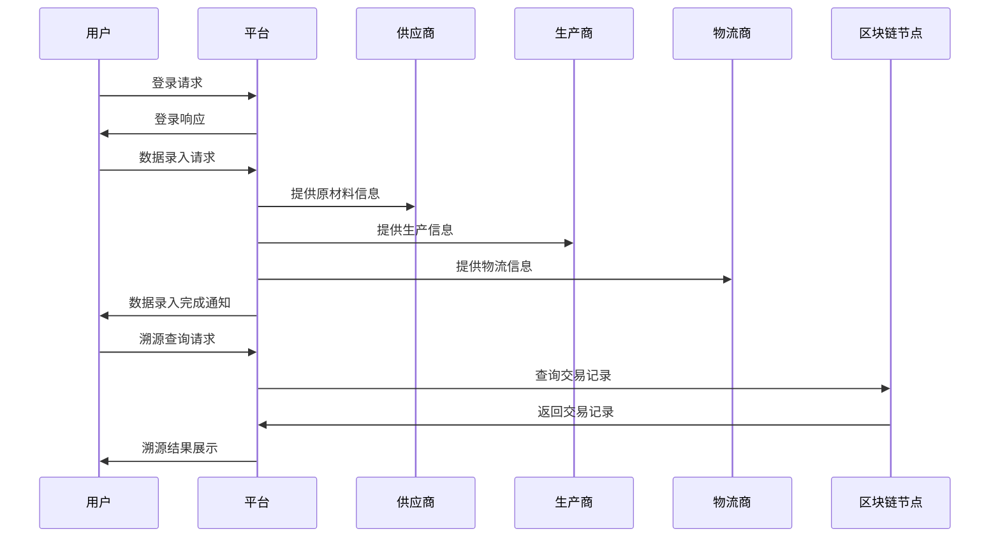

                 


# 如何评估企业的区块链供应链溯源平台

## 关键词：区块链、供应链、溯源、平台评估、技术实现

## 摘要：本文详细探讨了如何评估企业的区块链供应链溯源平台，涵盖平台背景、核心概念、算法原理、系统架构、项目实战、案例分析和未来展望等方面。通过分析区块链技术在供应链管理中的应用，帮助读者理解如何选择和优化区块链供应链溯源平台。

---

## 第三部分: 区块链供应链溯源平台的系统分析与架构设计

# 第4章: 区块链供应链溯源平台的系统分析与架构设计

## 4.1 系统问题场景介绍

在供应链管理中，企业面临数据不透明、信任缺失、信息孤岛等问题，导致溯源效率低下、成本高昂。区块链技术通过去中心化、不可篡改的特点，为供应链溯源提供了新的解决方案。然而，如何构建一个高效、安全、可扩展的区块链供应链溯源平台，是企业在实施过程中面临的关键挑战。

## 4.2 项目介绍

本项目旨在设计并实现一个基于区块链的供应链溯源平台，涵盖从原材料采购到最终产品交付的全生命周期管理。平台将整合区块链技术、智能合约和大数据分析，确保数据的真实性和可追溯性。

## 4.3 系统功能设计

### 4.3.1 领域模型设计
```mermaid
classDiagram
    class 供应链平台 {
        用户认证
        数据录入
        溯源查询
        交易记录
    }
    class 供应商 {
        提供原材料
        记录物流信息
    }
    class 生产商 {
        加工原材料
        记录生产信息
    }
    class 物流商 {
        运输管理
        记录运输信息
    }
    class 消费者 {
        查询产品信息
    }
    供应链平台 <-- [通过API接口]--> 供应商
    供应链平台 <-- [通过API接口]--> 生产商
    供应链平台 <-- [通过API接口]--> 物流商
    供应链平台 <-- [通过API接口]--> 消费者
```

### 4.3.2 系统架构设计


## 4.4 系统接口设计

系统主要接口包括：

1. **用户认证接口**：用于用户登录和权限管理。
2. **数据录入接口**：供应商、生产商和物流商通过该接口录入数据。
3. **溯源查询接口**：消费者通过该接口查询产品信息。
4. **交易记录接口**：记录每一次交易的信息，并上链存证。

## 4.5 系统交互设计



## 4.6 本章小结

通过系统分析与架构设计，我们明确了平台的各个组成部分及其交互关系，为后续的实现和评估奠定了基础。

---

## 第五部分: 区块链供应链溯源平台的项目实战

# 第5章: 区块链供应链溯源平台的项目实战

## 5.1 环境安装与配置

### 5.1.1 安装区块链框架
推荐使用以太坊区块链框架，安装步骤如下：
1. 安装Node.js和npm。
2. 安装以太坊钱包（如MetaMask）。
3. 安装Solidity编译器。

```bash
npm install -g ethereum-cli
npm install -g solc
```

### 5.1.2 安装其他工具
安装Ganache用于本地测试环境：
```bash
npm install -g ganache-cli
```

## 5.2 系统核心实现源代码

### 5.2.1 智能合约实现
以下是一个简单的供应链溯源智能合约示例（Solidity语言）：

```solidity
// SPDX-License-Identifier: MIT
pragma solidity ^0.8.0;

contract SupplyChain {
    // 事件：记录产品上架
    event ProductListed(
        uint256 indexed productId,
        string name,
        uint256 quantity,
        uint256 price
    );

    // 事件：记录产品运输
    event ProductShipped(
        uint256 indexed productId,
        address indexed supplier,
        address indexed transporter
    );

    // 事件：记录产品交付
    event ProductDelivered(
        uint256 indexed productId,
        address indexed retailer,
        address indexed customer
    );

    // 结构体：产品信息
    struct Product {
        string name;
        uint256 quantity;
        uint256 price;
        address supplier;
        address transporter;
        address retailer;
    }

    // 映射：产品ID到产品信息
    mapping(uint256 => Product) products;

    // 函数：上架产品
    function listProduct(uint256 productId, string memory name, uint256 quantity, uint256 price) public {
        Product memory product = Product({
            name: name,
            quantity: quantity,
            price: price,
            supplier: msg.sender,
            transporter: address(0),
            retailer: address(0)
        });
        products[productId] = product;
        emit ProductListed(productId, name, quantity, price);
    }

    // 函数：标记产品运输
    function shipProduct(uint256 productId, address transporter) public {
        Product storage product = products[productId];
        require(product.supplier == msg.sender, "Only supplier can ship product");
        product.transporter = transporter;
        emit ProductShipped(productId, product.supplier, transporter);
    }

    // 函数：标记产品交付
    function deliverProduct(uint256 productId, address retailer) public {
        Product storage product = products[productId];
        require(product.transporter == msg.sender, "Only transporter can deliver product");
        product.retailer = retailer;
        emit ProductDelivered(productId, retailer, msg.sender);
    }
}
```

### 5.2.2 后端实现

以下是一个简单的后端接口实现（基于Node.js和Express）：

```javascript
const express = require('express');
const bodyParser = require('body-parser');
const Web3 = require('web3');
const {ganacheProvider, abi, contractAddress} = require('./config');

// 初始化Express应用
const app = express();
app.use(bodyParser.json());

// 连接ganache测试网络
const web3 = new Web3(ganacheProvider);

// 初始化智能合约实例
const contract = new web3.eth.Contract(abi.abi, contractAddress);

// 定义API接口
app.get('/products', async (req, res) => {
    const products = await contract.methods.getAllProducts().call();
    res.json(products);
});

app.post('/listProduct', async (req, res) => {
    const {productId, name, quantity, price} = req.body;
    try {
        const result = await contract.methods.listProduct(productId, name, quantity, price).send();
        res.json({status: 'success', transactionHash: result.transactionHash});
    } catch (error) {
        res.status(500).json({status: 'error', message: error.message});
    }
});

app.put('/shipProduct', async (req, res) => {
    const {productId, transporter} = req.body;
    try {
        const result = await contract.methods.shipProduct(productId, transporter).send();
        res.json({status: 'success', transactionHash: result.transactionHash});
    } catch (error) {
        res.status(500).json({status: 'error', message: error.message});
    }
});

app.put('/deliverProduct', async (req, res) => {
    const {productId, retailer} = req.body;
    try {
        const result = await contract.methods.deliverProduct(productId, retailer).send();
        res.json({status: 'success', transactionHash: result.transactionHash});
    } catch (error) {
        res.status(500).json({status: 'error', message: error.message});
    }
});

// 监听端口
app.listen(3000, () => {
    console.log('Server is running on http://localhost:3000');
});
```

### 5.2.3 前端实现（简化）

以下是一个简单的前端页面（基于React）：

```javascript
import React, { useState, useEffect } from 'react';
import axios from 'axios';

function SupplyChainTracker() {
    const [products, setProducts] = useState([]);

    useEffect(() => {
        fetch('/products')
            .then(res => res.json())
            .then(data => setProducts(data))
            .catch(error => console.error('Error:', error));
    }, []);

    const listProduct = async (productId, name, quantity, price) => {
        try {
            const response = await axios.post('/listProduct', {
                productId: productId,
                name: name,
                quantity: quantity,
                price: price
            });
            console.log('Product listed:', response.data);
        } catch (error) {
            console.error('Error listing product:', error);
        }
    };

    const shipProduct = async (productId, transporter) => {
        try {
            const response = await axios.put('/shipProduct', {
                productId: productId,
                transporter: transporter
            });
            console.log('Product shipped:', response.data);
        } catch (error) {
            console.error('Error shipping product:', error);
        }
    };

    const deliverProduct = async (productId, retailer) => {
        try {
            const response = await axios.put('/deliverProduct', {
                productId: productId,
                retailer: retailer
            });
            console.log('Product delivered:', response.data);
        } catch (error) {
            console.error('Error delivering product:', error);
        }
    };

    return (
        <div>
            <h1>供应链溯源平台</h1>
            <button onClick={() => listProduct(1, '苹果', 100, 10)}>上架产品</button>
            <button onClick={() => shipProduct(1, '物流公司')}>标记运输</button>
            <button onClick={() => deliverProduct(1, '零售商')}>标记交付</button>
            <h2>产品信息:</h2>
            <ul>
                {products.map((product, index) => (
                    <li key={index}>
                        ID: {product.id}, 名称: {product.name}, 数量: {product.quantity}, 价格: {product.price}
                    </li>
                ))}
            </ul>
        </div>
    );
}

export default SupplyChainTracker;
```

## 5.3 代码实现与解读

### 5.3.1 智能合约解读
- **结构体Product**：记录产品的名称、数量、价格、供应商、承运商和零售商信息。
- **事件ProductListed**：当产品上架时触发，记录产品ID、名称、数量和价格。
- **事件ProductShipped**：当产品运输时触发，记录产品ID、供应商和承运商。
- **事件ProductDelivered**：当产品交付时触发，记录产品ID、零售商和承运商。

### 5.3.2 后端接口解读
- **GET /products**：查询所有产品信息。
- **POST /listProduct**：上架产品，调用智能合约的listProduct函数。
- **PUT /shipProduct**：标记产品运输，调用智能合约的shipProduct函数。
- **PUT /deliverProduct**：标记产品交付，调用智能合约的deliverProduct函数。

### 5.3.3 前端实现解读
- 前端页面提供三个按钮：上架产品、标记运输和标记交付。
- 每次点击按钮时，调用相应的后端API接口，完成相应的操作。
- 页面下方展示所有已上架产品的信息。

## 5.4 实际案例分析

假设我们有一个苹果供应链项目：

1. **供应商**：种植苹果的农户，向加工厂供应原材料。
2. **生产商**：负责加工苹果，生产苹果汁。
3. **物流商**：负责运输苹果汁到零售商。
4. **零售商**：将苹果汁卖给消费者。

通过平台，我们可以实现以下操作：
- 供应商上架苹果原料，记录数量、价格等信息。
- 生产商加工后，标记产品为半成品。
- 物流商运输半成品到零售商，记录运输信息。
- 零售商接收产品，标记为已交付。

消费者可以通过平台查询苹果汁的溯源信息，包括种植、加工、运输等各环节的信息。

## 5.5 本章小结

通过本章的项目实战，我们详细讲解了如何实现一个基于区块链的供应链溯源平台，包括智能合约的编写、后端接口的设计和前端页面的实现。读者可以参考这些代码和设计，快速搭建自己的区块链供应链溯源系统。

---

## 第六部分: 区块链供应链溯源平台的案例分析与优化建议

# 第6章: 区块链供应链溯源平台的案例分析与优化建议

## 6.1 案例分析

### 6.1.1 案例背景
某食品企业希望通过区块链技术实现食品供应链的溯源，确保消费者可以追溯食品的来源、生产过程和质量信息。

### 6.1.2 平台实现
该企业与区块链技术服务商合作，开发了一个基于以太坊的供应链溯源平台，涵盖从原材料采购到最终产品交付的全生命周期管理。

### 6.1.3 系统架构
- **区块链节点**：部署多个节点，确保数据的分布式存储和共识。
- **智能合约**：实现原材料采购、生产加工、物流运输和零售交付的全流程记录。
- **数据分析**：通过大数据分析，生成供应链透明度报告，辅助企业优化供应链管理。

### 6.1.4 实施效果
- **数据透明**：消费者可以通过区块链浏览器查询食品的详细信息。
- **不可篡改**：所有交易记录都上链存证，确保数据的真实性和不可篡改性。
- **效率提升**：通过智能合约自动化处理，减少人工干预，提高供应链效率。

## 6.2 优化建议

### 6.2.1 技术层面的优化
- **共识机制优化**：选择适合的共识机制，如RAFT或PBFT，以提高系统的效率和可扩展性。
- **智能合约优化**：通过代码审查和测试，确保智能合约的安全性，防止漏洞。
- **数据存储优化**：采用分片技术，提高数据存储效率和查询速度。

### 6.2.2 业务层面的优化
- **数据隐私保护**：通过零知识证明等技术，确保敏感数据的隐私性。
- **用户权限管理**：根据角色分配不同的权限，确保数据的安全性和访问控制。
- **多链架构**：针对不同的业务场景，部署不同的区块链网络，提高系统的灵活性和可扩展性。

### 6.2.3 运维层面的优化
- **监控与预警**：部署实时监控系统，及时发现和处理系统异常。
- **备份与恢复**：制定完善的备份和恢复策略，确保数据的安全性和可用性。
- **性能调优**：定期进行性能测试和调优，确保系统的稳定性和高效性。

## 6.3 本章小结

通过案例分析和优化建议，我们总结了区块链供应链溯源平台在实际应用中的经验和教训，为读者提供了宝贵的参考和指导。

---

## 第七部分: 总结与展望

# 第7章: 总结与展望

## 7.1 本章总结

本文详细探讨了如何评估企业的区块链供应链溯源平台，从平台的背景与概念、核心概念与联系、算法原理、系统分析与架构设计、项目实战、案例分析与优化建议等多个方面进行了深入分析。通过实际的代码实现和案例分析，帮助读者理解如何选择和优化区块链供应链溯源平台。

## 7.2 未来展望

随着区块链技术的不断发展和应用，区块链供应链溯源平台将在更多领域得到广泛应用。未来的研究方向包括：
- **隐私保护**：如何在确保数据真实性的前提下，保护数据隐私。
- **跨链技术**：如何实现不同区块链平台之间的互联互通，提高系统的灵活性和可扩展性。
- **智能合约的安全性**：如何进一步提高智能合约的安全性，防止漏洞和攻击。
- **数据分析与可视化**：如何通过大数据分析和可视化技术，进一步提升供应链管理的效率和决策能力。

## 7.3 最佳实践 Tips

- **选择合适的区块链框架**：根据实际需求选择适合的区块链框架，如以太坊、Hyperledger等。
- **确保智能合约的安全性**：通过代码审查和测试，确保智能合约的安全性。
- **数据隐私保护**：采用零知识证明等技术，保护敏感数据的隐私性。
- **实时监控与维护**：部署实时监控系统，及时发现和处理系统异常。

## 7.4 本章小结

通过总结与展望，我们不仅回顾了本文的主要内容，还指出了未来的发展方向和优化空间，为读者提供了全面的指导。

---

## 结束语

区块链供应链溯源平台的建设是一个复杂而系统的过程，需要从技术、业务和运维等多个方面进行综合考虑。通过本文的系统分析和实战案例，相信读者能够更好地理解和应用区块链技术，优化企业的供应链管理流程，实现高效、透明、安全的供应链溯源。

---

## 参考文献

- 以太坊官方文档
- Hyperledger Fabric官方文档
- Solidity语言官方文档
- 相关学术论文和技术报告

---

通过以上详细的内容，读者可以系统地学习和理解如何评估和构建一个高效的区块链供应链溯源平台。

