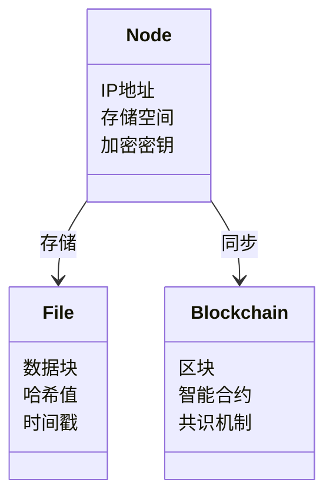

                 

# 如何评估企业的区块链去中心化云存储平台

> 关键词：区块链、去中心化云存储、评估方法、共识机制、智能合约、系统架构

> 摘要：本文将详细介绍如何评估企业的区块链去中心化云存储平台。从背景介绍到核心概念，从算法原理到系统架构，从项目实战到最佳实践，我们将逐步分析如何确保企业在选择和构建区块链去中心化云存储平台时能够做出明智的决策。通过对比分析、系统设计和实际案例，本文将为您提供一套完整的评估方法。

---

# 第1章：区块链与去中心化云存储的背景

## 1.1 区块链技术的起源与发展
### 1.1.1 区块链的定义与核心原理
区块链是一种去中心化的分布式账本技术，通过密码学和共识机制确保数据的安全性和一致性。其核心原理包括区块、链式结构、分布式节点和共识机制。

### 1.1.2 区块链技术的演进历程
从比特币的诞生到以太坊的智能合约，区块链技术经历了从单一的加密货币到多功能的分布式账本的演变。

### 1.1.3 区块链在企业中的应用现状
区块链在供应链管理、金融支付、医疗数据共享等领域展现出巨大的潜力，为企业级应用提供了新的可能性。

## 1.2 去中心化存储的概念与特点
### 1.2.1 去中心化存储的定义
去中心化存储是一种基于分布式网络的存储方式，通过多个节点协作存储数据，避免单点故障。

### 1.2.2 去中心化存储与传统云存储的区别
通过对比分析表格，展示去中心化存储在安全性、数据所有权和抗审查性方面的优势。

| 特性                | 传统云存储                     | 去中心化存储                   |
|---------------------|-------------------------------|-------------------------------|
| 数据所有权          | 云服务提供商                   | 用户                          |
| 数据安全性          | 依赖服务提供商的防护措施       | 分布式节点提供更高的安全性     |
| 可用性              | 单点故障风险                   | 无单点故障，抗审查性更强       |

### 1.2.3 去中心化存储的优势与挑战
优势包括数据安全性和隐私保护，挑战则包括性能优化和成本控制。

## 1.3 区块链去中心化云存储的行业现状
### 1.3.1 当前市场的主要平台
介绍主要的区块链去中心化云存储平台，如IPFS、Filecoin、Arweave等。

### 1.3.2 区块链去中心化云存储的应用场景
分析其在数据备份、版权保护、医疗数据共享等领域的应用。

### 1.3.3 行业面临的痛点与挑战
包括性能瓶颈、成本高、技术复杂性等。

## 1.4 本章小结
通过本章，读者可以了解区块链和去中心化存储的基本概念，以及它们在企业中的应用潜力和面临的挑战。

---

# 第2章：区块链去中心化云存储的核心概念

## 2.1 区块链的核心技术
### 2.1.1 区块链的共识机制
通过对比分析表格，展示不同共识机制的特点。

| 共识机制 | 核心原理                     | 优点                     | 缺点                     |
|----------|------------------------------|--------------------------|--------------------------|
| PoW     | 工作量证明                   | 安全性高                 | 能耗高                   |
| PoS     | 权益证明                     | 能耗低                   | 安全性较弱               |
| DPoS     | 委托权益证明                 | 效率高                   | 中心化风险               |

### 2.1.2 区块链的智能合约
智能合约是区块链上的自动执行程序，用于实现复杂的业务逻辑。

### 2.1.3 区块链的分布式账本
分布式账本确保数据的一致性和不可篡改性，是区块链的核心数据结构。

## 2.2 去中心化云存储的关键技术
### 2.2.1 分布式存储技术
通过一致性哈希算法实现数据的分布式存储。

$$ hash(value) = (value \mod N) $$

### 2.2.2 数据加密与隐私保护
使用加密算法确保数据在传输和存储过程中的安全性。

### 2.2.3 激励机制
通过代币激励机制鼓励节点参与存储和计算任务。

## 2.3 区块链与去中心化云存储的结合
### 2.3.1 区块链在去中心化存储中的作用
通过区块链技术确保数据的完整性和不可篡改性。

### 2.3.2 去中心化存储平台的架构分析
使用mermaid类图展示去中心化存储的系统架构。

### 2.3.3 区块链与去中心化存储的协同关系
通过区块链技术实现数据的可信存储和高效检索。

## 2.4 本章小结
本章详细介绍了区块链和去中心化存储的核心技术，以及它们的协同关系。

---

# 第3章：区块链去中心化云存储的共识机制

## 3.1 共识机制的定义与分类
### 3.1.1 共识机制的定义
共识机制是区块链中确保所有节点达成一致的算法。

### 3.1.2 主流共识机制的分类
包括PoW、PoS、DPoS等。

### 3.1.3 各种共识机制的优缺点对比
通过对比分析表格展示不同共识机制的特点。

| 共识机制 | 核心原理                     | 优点                     | 缺点                     |
|----------|------------------------------|--------------------------|--------------------------|
| PoW     | 工作量证明                   | 安全性高                 | 能耗高                   |
| PoS     | 权益证明                     | 能耗低                   | 安全性较弱               |
| DPoS     | 委托权益证明                 | 效率高                   | 中心化风险               |

## 3.2 比较分析：不同共识机制的适用场景
### 3.2.1 PoW（工作量证明）
适用于安全性要求高但对性能要求不高的场景。

### 3.2.2 PoS（权益证明）
适用于对能耗要求低且对性能要求高的场景。

### 3.2.3 DPoS（委托权益证明）
适用于对效率要求高且对去中心化要求较低的场景。

## 3.3 共识机制对去中心化存储的影响
### 3.3.1 共识机制对存储性能的影响
共识机制的选择直接影响存储的吞吐量和延迟。

### 3.3.2 共识机制对存储成本的影响
不同共识机制的能耗和资源需求不同，影响存储成本。

### 3.3.3 共识机制对存储安全的影响
共识机制的选择直接影响存储数据的安全性和抗攻击性。

## 3.4 本章小结
本章分析了不同共识机制的特点及其对去中心化存储的影响。

---

# 第4章：区块链去中心化云存储的智能合约

## 4.1 智能合约的定义与特点
### 4.1.1 智能合约的定义
智能合约是区块链上的自动执行程序，用于实现复杂的业务逻辑。

### 4.1.2 智能合约的特点
包括自动执行、不可篡改、透明性等。

## 4.2 智能合约在去中心化存储中的应用
### 4.2.1 数据存储的授权与控制
通过智能合约实现数据的访问控制。

### 4.2.2 数据存储的计费与激励
通过智能合约实现自动化的计费和激励机制。

### 4.2.3 数据存储的生命周期管理
通过智能合约实现数据的自动归档和销毁。

## 4.3 智能合约的安全性与风险管理
### 4.3.1 智能合约的安全性
通过代码审计和形式化验证确保智能合约的安全性。

### 4.3.2 智能合约的风险管理
包括漏洞修复、权限管理等。

## 4.4 本章小结
本章详细介绍了智能合约在去中心化存储中的应用及其安全性管理。

---

# 第5章：区块链去中心化云存储的系统架构设计

## 5.1 系统功能设计
### 5.1.1 存储功能
包括文件上传、下载、删除等基本操作。

### 5.1.2 计费功能
通过智能合约实现自动计费和支付。

### 5.1.3 安全功能
包括数据加密、访问控制等。

## 5.2 系统架构设计
### 5.2.1 分层架构
包括数据层、网络层、共识层、应用层。

### 5.2.2 节点架构
包括数据节点、共识节点、智能合约节点。

## 5.3 系统接口设计
### 5.3.1 存储接口
定义文件上传、下载等接口的API。

### 5.3.2 计费接口
定义计费规则和支付接口。

### 5.3.3 安全接口
定义数据加密和访问控制接口。

## 5.4 本章小结
本章详细介绍了区块链去中心化云存储系统的架构设计。

---

# 第6章：区块链去中心化云存储的项目实战

## 6.1 环境安装
### 6.1.1 安装区块链环境
包括安装以太坊节点、配置智能合约环境等。

### 6.1.2 安装去中心化存储环境
包括安装IPFS、配置Filecoin节点等。

## 6.2 核心代码实现
### 6.2.1 智能合约实现
使用Solidity编写智能合约，实现数据存储和计费功能。

### 6.2.2 数据存储实现
使用IPFS实现文件的分布式存储。

## 6.3 案例分析
### 6.3.1 实际案例
分析Filecoin等平台的实现和应用。

### 6.3.2 案例总结
总结实际项目中的经验教训。

## 6.4 本章小结
本章通过实际项目展示了区块链去中心化云存储的实现过程。

---

# 第7章：区块链去中心化云存储的最佳实践

## 7.1 小结
总结全文的核心内容。

## 7.2 注意事项
包括选择合适的共识机制、确保智能合约的安全性等。

## 7.3 未来趋势
包括技术优化、应用场景扩展等。

## 7.4 拓展阅读
推荐相关的技术书籍和论文。

## 7.5 本章小结
本章为读者提供了评估和构建区块链去中心化云存储平台的实用建议和未来展望。

---

通过以上目录，读者可以系统地了解如何评估企业的区块链去中心化云存储平台，从理论到实践，从技术到应用，全面掌握相关知识和技能。

