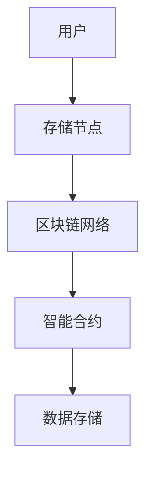
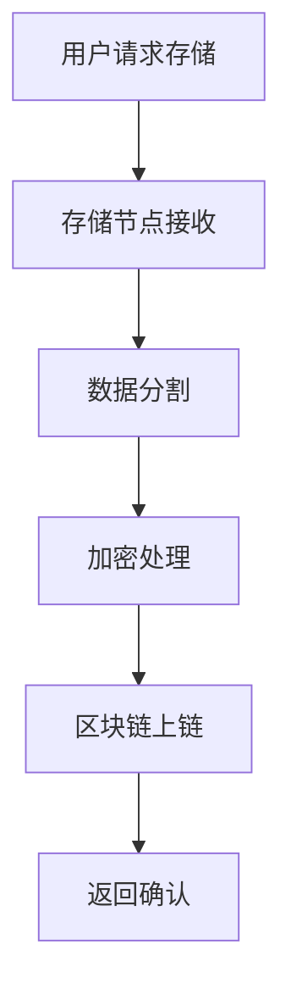
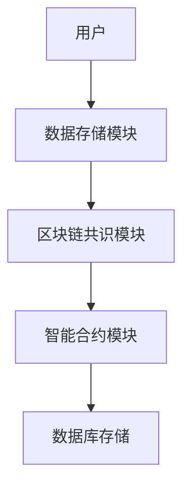
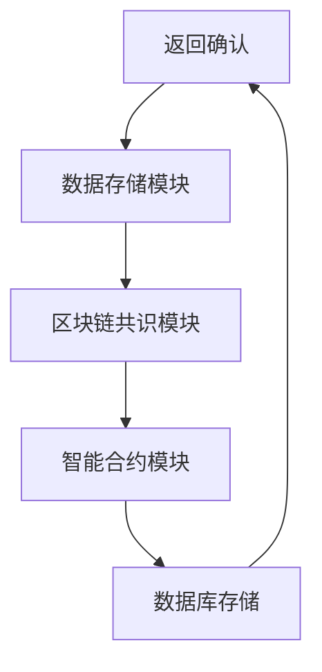

                 


# 如何评估企业的区块链去中心化存储平台

> 关键词：区块链，去中心化存储，企业存储，数据安全，共识机制，智能合约，分布式系统

> 摘要：本文将详细探讨如何评估企业区块链去中心化存储平台，从核心概念、技术原理、评估指标到系统设计与实现，结合实际案例分析，为读者提供全面的评估方法。

---

## 第一部分：区块链去中心化存储平台概述

### 第1章：区块链与去中心化存储概述

#### 1.1 区块链技术基础

- **1.1.1 区块链的基本概念**
  - 区块链是一种去中心化的分布式账本技术，通过链式结构存储数据，每个区块包含交易数据和链路信息。
  - 核心特点包括去中心化、不可篡改、可追溯和透明性。
  - 区块链的类型包括公有链、私有链和联盟链，适用于金融、医疗、物流等多个领域。

- **1.1.2 区块链的核心特点**
  - 去中心化：数据存储和管理不依赖单一中心节点，通过分布式节点实现数据冗余和一致性。
  - 可追溯性：每笔交易都有时间戳和哈希值，便于追踪和审计。
  - 安全性：通过加密算法和共识机制确保数据的完整性和真实性。

- **1.1.3 区块链的分类与应用场景**
  - 公有链：比特币、以太坊等，适用于金融支付、智能合约。
  - 私有链：企业内部使用，如供应链管理、内部结算。
  - 联盟链：特定机构间的协作，如银行间清算、医疗数据共享。

#### 1.2 去中心化存储的定义与特点

- **1.2.1 去中心化存储的定义**
  - 数据不存储在单一中心服务器，而是分散在多个节点上，通过分布式网络实现数据存储和访问。
  - 去中心化存储依赖于点对点网络和分布式账本技术，确保数据的安全性和可用性。

- **1.2.2 去中心化存储的核心特点**
  - 去中心化：数据分布存储，避免单点故障。
  - 分布式网络：通过P2P网络实现数据的上传和下载。
  - 加密性：数据在存储和传输过程中加密，确保数据隐私。

- **1.2.3 去中心化存储与传统存储的区别**
  | 特性 | 去中心化存储 | 传统存储 |
  |------|-------------|----------|
  | 数据控制权 | 用户拥有 | 依赖中心 |
  | 安全性 | 高 | 较低 |
  | 可用性 | 高，节点失效不影响整体 | 依赖中心节点 |
  | 成本 | 分摊至多个节点 | 中心化成本 |

#### 1.3 区块链去中心化存储的背景与意义

- **1.3.1 区块链去中心化存储的背景**
  - 数据量爆炸式增长，传统存储方式面临高成本和安全风险。
  - 中心化存储存在单点故障，数据容易被篡改或丢失。
  - 区块链技术的出现，为数据的安全存储和管理提供了新的解决方案。

- **1.3.2 区块链去中心化存储的意义**
  - 提高数据安全性：通过加密和区块链技术，防止数据被篡改。
  - 降低存储成本：分布式存储利用闲置资源，减少对中心化服务器的依赖。
  - 增强数据透明性：区块链上的数据可追溯，便于审计和监管。

- **1.3.3 区块链去中心化存储的应用场景**
  - **金融领域**：跨境支付、智能合约、证券交易。
  - **医疗领域**：患者数据共享、医疗记录存储。
  - **物流领域**：货物追踪、供应链管理。
  - **法律领域**：电子合同存储、证据保存。

#### 1.4 本章小结

本章介绍了区块链和去中心化存储的基本概念、特点以及应用场景，强调了区块链去中心化存储的重要性和必要性。通过对比传统存储和去中心化存储，读者可以理解为何企业需要评估和采用区块链去中心化存储技术。

---

### 第2章：区块链去中心化存储的核心概念

#### 2.1 区块链去中心化存储的系统架构

- **2.1.1 分布式存储架构**
  - 分布式存储将数据分散存储在多个节点上，每个节点负责存储部分数据。
  - 数据冗余：通过复制机制确保数据在多个节点上备份，防止数据丢失。
  - 负载均衡：分布式架构能够自动分配存储任务，提高系统吞吐量。

- **2.1.2 区块链共识机制**
  - 共识机制是区块链的核心，确保所有节点达成一致。
  - 常见的共识机制包括工作量证明（PoW）、权益证明（PoS）、拜占庭容错（BFT）等。
  - 每种共识机制有不同的优缺点，适用于不同的场景。

- **2.1.3 存储节点的职责与协作**
  - 存储节点负责存储数据块，并通过区块链网络进行数据同步。
  - 节点间通过共识机制达成一致，确保数据的准确性和一致性。

#### 2.2 区块链去中心化存储的关键技术

- **2.2.1 加密技术**
  - 数据加密：使用对称加密或非对称加密对数据进行加密，确保数据在传输和存储过程中的安全性。
  - 数字签名：通过私钥签名，确保数据来源的可信性和完整性。

- **2.2.2 智能合约**
  - 智能合约是运行在区块链上的自动执行程序，用于自动执行预设的业务逻辑。
  - 智能合约可以管理数据的存储、访问权限和交易规则，确保数据的安全性和合规性。

- **2.2.3 分片技术**
  - 分片技术将数据按特定规则分散到不同的节点上，减少每个节点的负载压力。
  - 分片可以提高系统的读写性能，适合大规模数据存储和高并发场景。

#### 2.3 区块链去中心化存储的实体关系图



通过上述关系图可以看出，用户通过存储节点将数据上传到区块链网络，区块链网络通过智能合约实现数据的存储和管理。

#### 2.4 本章小结

本章详细讲解了区块链去中心化存储的核心概念，包括分布式存储架构、共识机制、加密技术、智能合约和分片技术。通过这些技术的结合，区块链去中心化存储平台能够实现高效、安全、可靠的数据存储和管理。

---

### 第3章：区块链去中心化存储的算法原理

#### 3.1 区块链共识算法

- **3.1.1 工作量证明（PoW）**
  - 工作量证明是比特币采用的共识机制，通过计算哈希值来证明工作量。
  - 优点：安全性高，抗女娲攻击能力强；缺点：需要大量计算资源，能耗高。

- **3.1.2 权益证明（PoS）**
  - 权益证明通过持有代币的数量来决定记账权，减少能源消耗。
  - 优点：能耗低，适合大规模应用；缺点：存在“富者愈富”的风险，可能影响公平性。

- **3.1.3 拜占庭容错（BFT）**
  - BFT是一种基于投票的共识机制，适用于网络分区的场景。
  - 优点：响应速度快，适合低延迟场景；缺点：依赖网络的可靠性和节点的诚实性。

#### 3.2 去中心化存储的加密算法

- **3.2.1 哈希函数**
  - 哈希函数将输入数据映射为固定长度的哈希值，常用于数据完整性校验和存储地址计算。
  - 常见的哈希函数包括SHA-256、MD5等。

- **3.2.2 加密签名**
  - 使用私钥对数据进行签名，确保数据来源的可信性和完整性。
  - 公钥用于验证签名，确保数据未被篡改。

- **3.2.3 零知识证明**
  - 零知识证明允许一方证明自己拥有某种信息，而不需要透露信息本身。
  - 在区块链存储中，可以用于隐私保护和数据访问权限管理。

#### 3.3 去中心化存储的算法流程图



流程图展示了用户请求存储数据，经过数据分割、加密、区块链上链和确认返回的完整流程。

#### 3.4 本章小结

本章介绍了区块链去中心化存储中的关键算法，包括共识机制和加密技术。通过这些算法的结合，区块链去中心化存储平台能够实现数据的安全性和高效性。

---

### 第4章：区块链去中心化存储的数学模型与公式

#### 4.1 区块链共识机制的数学模型

- **4.1.1 工作量证明的数学公式**
  $$ \text{哈希计算} = \text{随机数} + \text{前一区块哈希} $$

- **4.1.2 权益证明的数学公式**
  $$ \text{权益权重} = \frac{\text{持有代币数量} \times \text{时间}}{\text{总代币数量}} $$

#### 4.2 去中心化存储的安全性分析

- **4.2.1 加密强度的数学表达**
  $$ \text{安全性} = \text{密钥长度} \times \text{算法复杂度} $$

- **4.2.2 数据完整性校验**
  $$ \text{哈希值} = \text{数据输入} \rightarrow \text{哈希函数} $$

#### 4.3 数据完整性验证的数学模型

- **4.3.1 哈希校验**
  $$ \text{数据完整性} = \text{输入数据} \rightarrow \text{哈希值} $$

#### 4.4 本章小结

本章通过数学模型和公式，详细讲解了区块链去中心化存储中的安全性分析和数据完整性校验。这些模型和公式为评估平台的安全性和可靠性提供了理论依据。

---

### 第5章：区块链去中心化存储的系统架构设计

#### 5.1 系统功能设计

- **5.1.1 数据存储模块**
  - 数据上传：用户将数据上传到存储节点，节点将数据分割并加密。
  - 数据检索：用户通过哈希值或关键字检索数据，节点返回解密后的数据。

- **5.1.2 区块链共识模块**
  - 数据上链：存储节点将数据哈希值写入区块链，通过共识机制达成一致。
  - 数据验证：节点验证数据的完整性和真实性，确保数据一致性。

- **5.1.3 智能合约模块**
  - 访问控制：智能合约管理数据的访问权限，确保只有授权用户可以访问数据。
  - 交易处理：智能合约自动执行交易逻辑，如计费、权限管理等。

#### 5.2 系统架构图



系统架构图展示了用户与数据存储模块的交互，数据存储模块与区块链共识模块的交互，区块链共识模块与智能合约模块的交互，以及智能合约模块与数据库的交互。

#### 5.3 系统接口设计

- **5.3.1 数据存储接口**
  - 接口名称：`putData`
  - 参数：`data`（数据）、`metadata`（元数据）
  - 返回值：`receipt`（收据，包含哈希值和交易ID）

- **5.3.2 数据检索接口**
  - 接口名称：`getData`
  - 参数：`hash`（哈希值）
  - 返回值：`data`（解密后的数据）

- **5.3.3 访问控制接口**
  - 接口名称：`authorize`
  - 参数：`user`（用户）、`data`（数据）
  - 返回值：`access`（访问权限）

#### 5.4 系统交互流程图



系统交互流程图展示了用户请求存储数据，数据存储模块处理数据，区块链共识模块达成一致，智能合约模块管理权限，最终数据存储到数据库并返回确认。

#### 5.5 本章小结

本章详细描述了区块链去中心化存储系统的功能设计、系统架构和接口设计。通过这些设计，系统能够实现高效、安全、可靠的数据存储和管理。

---

## 第二部分：项目实战与评估指标

### 第6章：区块链去中心化存储的项目实战

#### 6.1 环境安装与配置

- **6.1.1 安装Python环境**
  - 安装Python 3.x
  - 安装必要的库：`ethernet`, `web3.py`, `merkle-py`

- **6.1.2 配置区块链网络**
  - 使用本地节点或云服务（如Infura）
  - 配置智能合约地址和私钥

#### 6.2 核心代码实现

- **6.2.1 数据存储模块**
  ```python
  def put_data(data, metadata):
      # 数据分割
      chunks = split_data(data)
      # 数据加密
      encrypted_chunks = [encrypt(chunk) for chunk in chunks]
      # 写入区块链
      blockchain_receipt = blockchain.put_block(encrypted_chunks, metadata)
      return blockchain_receipt
  ```

- **6.2.2 智能合约模块**
  ```solidity
  contract StorageContract {
      mapping(address => bool) public authorizedUsers;
      
      function authorize(address user) external {
          authorizedUsers[user] = true;
      }
      
      function store(bytes32 hash, address user) external {
          require(authorizedUsers[user], "Unauthorized access");
          // 存储逻辑
      }
  }
  ```

#### 6.3 实际案例分析

- **案例：企业文件存储**
  - 某企业使用区块链去中心化存储平台存储敏感文件。
  - 用户上传文件，系统将其分割、加密并写入区块链。
  - 智能合约管理访问权限，确保只有授权用户可以访问数据。

#### 6.4 项目小结

本章通过实际案例，展示了区块链去中心化存储平台的核心实现和应用场景。通过代码实现和案例分析，读者可以更好地理解如何将理论应用于实践。

---

### 第7章：区块链去中心化存储的评估指标与方法

#### 7.1 技术指标

- **7.1.1 数据存储能力**
  - 存储容量：平台支持的最大数据量。
  - 存储效率：数据存储的冗余率和空间利用率。

- **7.1.2 区块链性能**
  - 吞吐量：每秒处理的交易数量。
  - 延迟：数据上链的时间。

- **7.1.3 加密强度**
  - 加密算法的安全性：如AES-256。
  - 私钥管理：密钥生成、存储和传输的安全性。

#### 7.2 安全指标

- **7.2.1 数据完整性**
  - 哈希校验：数据存储前后进行哈希校验，确保数据完整性。
  - 零知识证明：用于隐私保护和数据访问控制。

- **7.2.2 访问控制**
  - 智能合约管理权限：确保只有授权用户可以访问数据。
  - 身份验证：通过数字签名或OAuth进行身份验证。

#### 7.3 可扩展性

- **7.3.1 网络扩展**
  - 新节点加入：平台支持动态添加节点，扩展存储容量。
  - 网络负载均衡：通过分片技术实现负载均衡。

- **7.3.2 性能优化**
  - 数据压缩：通过压缩算法减少数据存储空间。
  - 并行处理：利用多线程或异步处理提高存储效率。

#### 7.4 评估方法

- **7.4.1 性能测试**
  - 使用工具（如JMeter）进行压力测试，评估系统的吞吐量和延迟。
  - 测试数据完整性，确保数据存储和检索的正确性。

- **7.4.2 安全测试**
  - 渗透测试：模拟攻击，测试系统的安全性。
  - 智能合约审计：检查智能合约的逻辑漏洞。

#### 7.5 本章小结

本章详细介绍了区块链去中心化存储平台的评估指标和方法，包括技术指标、安全指标和可扩展性指标。通过这些指标，企业可以全面评估平台的性能和安全性。

---

## 第三部分：最佳实践与总结

### 第8章：区块链去中心化存储的最佳实践

#### 8.1 选择合适的区块链平台

- 根据企业的具体需求选择适合的区块链平台，如Hyperledger Fabric、Ethereum、Solana等。
- 考虑平台的性能、安全性、可扩展性和开发支持。

#### 8.2 数据隐私与合规性

- 实施数据隐私保护措施，如加密存储、访问控制。
- 确保数据存储符合相关法律法规，如GDPR、数据保护法。

#### 8.3 性能优化与维护

- 定期监控系统性能，优化存储和网络配置。
- 处理数据冷热分层，提高存储效率。

#### 8.4 安全增强

- 定期进行安全审计和漏洞扫描，确保系统的安全性。
- 培训相关人员，提高安全意识和应急响应能力。

#### 8.5 拓展阅读

- 关注区块链技术的最新发展，了解新技术和新应用。
- 参加行业会议和技术交流，获取最新的技术动态和实践经验。

### 第9章：总结与展望

#### 9.1 本篇总结

本文详细探讨了如何评估企业区块链去中心化存储平台，从核心概念、技术原理、评估指标到系统设计与实现，结合实际案例分析，为读者提供了全面的评估方法。

#### 9.2 未来展望

随着区块链技术的不断发展，去中心化存储将在更多领域得到应用。未来，随着技术的进步，去中心化存储将更加高效、安全和智能，为企业提供更好的数据管理解决方案。

---

## 附录：常用工具与资源

- **区块链开发工具**
  - Ethereum：以太坊智能合约开发
  - Hyperledger Fabric：企业级区块链框架
  - Solana：高性能区块链平台

- **测试工具**
  - Postman：API测试
  - JMeter：性能测试
  - Metamask：以太坊钱包

- **开发文档**
  - Ethereum官方文档
  - Hyperledger Fabric文档
  - Solidity智能合约开发指南

---

通过本文的详细讲解，读者可以全面了解如何评估企业区块链去中心化存储平台，掌握从技术原理到实际应用的全过程。希望本文能为企业在选择和实施区块链去中心化存储平台提供有价值的参考和指导。

