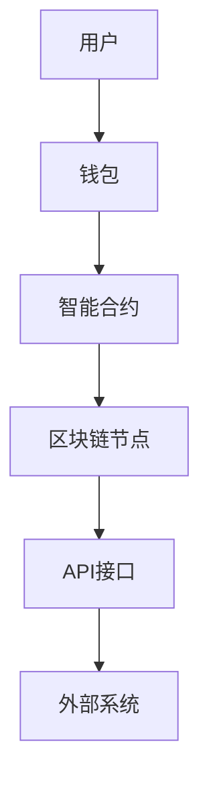

                 


# 如何评估企业的区块链去中心化身份验证平台

> 关键词：区块链、去中心化身份验证、身份管理、安全、性能

> 摘要：本文将详细探讨如何评估企业的区块链去中心化身份验证平台。通过分析区块链技术的基本原理、去中心化身份验证的核心概念、系统架构设计、算法原理及其实现案例，为读者提供全面的评估方法和实践指南。从技术实现到实际应用，本文将一步步引导您了解如何选择和优化适合企业需求的去中心化身份验证平台。

---

## 第一部分：区块链去中心化身份验证平台概述

### 第1章：区块链技术基础

#### 1.1 区块链的基本概念

区块链是一种去中心化的分布式账本技术，通过密码学和共识机制确保数据的安全性和一致性。区块链的核心特点包括去中心化、不可篡改、透明性和可追溯性。

- **去中心化**：数据不依赖于单个中心节点，而是分布在多个节点上，确保数据的冗余性和可靠性。
- **不可篡改**：通过加密算法和共识机制，确保数据一旦写入区块链，无法被修改。
- **透明性**：区块链上的交易对所有参与者可见，增加了数据的透明性。
- **可追溯性**：每笔交易都有明确的记录，可以追溯到源头。

区块链的类型主要包括公有链、联盟链和私有链。公有链（如比特币）面向所有人开放，联盟链（如Hyperledger Fabric）适用于特定机构之间的协作，私有链（如企业内部使用的区块链）则仅限于内部使用。

#### 1.2 去中心化身份验证的基本概念

去中心化身份验证（Decentralized Identity Verification）是一种基于区块链的技术，允许用户自主控制自己的身份信息，而无需依赖中心化机构。用户可以通过加密签名的方式证明自己的身份，而无需透露实际的身份信息。

- **自主主权身份（Self-Sovereign Identity, SSI）**：用户完全控制自己的身份信息，无需依赖第三方机构。
- **分布式标识符（Decentralized Identifier, DID）**：用户拥有唯一的分布式标识符，可以在多个系统中使用。
- **零知识证明（Zero-Knowledge Proof）**：用户可以通过零知识证明验证身份信息，而不必透露实际信息。

#### 1.3 区块链去中心化身份验证平台的背景与意义

传统的身份验证方式依赖于中心化机构（如社交平台、银行等），用户的数据和身份信息往往掌握在这些机构手中。这种方式存在数据泄露、身份盗用等安全隐患。而区块链的去中心化特性为身份验证提供了新的解决方案：

- **数据安全性**：区块链的不可篡改性确保身份信息的安全。
- **隐私保护**：通过零知识证明，用户可以在不泄露真实信息的情况下完成身份验证。
- **互操作性**：去中心化身份验证平台支持跨机构、跨系统的身份验证，提高了互操作性。

---

### 第2章：区块链去中心化身份验证的核心概念

#### 2.1 区块链去中心化身份验证的定义与特点

区块链去中心化身份验证平台通过区块链技术实现了去中心化的身份管理。其核心特点包括：

- **去中心化**：身份信息不依赖于中心机构，用户自主管理。
- **安全性**：通过区块链技术和加密算法，确保身份信息的安全性。
- **隐私性**：支持零知识证明，保护用户隐私。
- **可扩展性**：支持大规模用户和复杂业务场景。

#### 2.2 区块链去中心化身份验证的边界与外延

区块链去中心化身份验证平台的边界包括：

- **身份注册**：用户在区块链上注册自己的身份信息。
- **身份认证**：通过区块链上的智能合约完成身份验证。
- **权限管理**：基于身份信息进行权限控制。

外延则包括：

- **跨机构身份验证**：支持不同机构之间的身份互认。
- **数据共享**：用户可以在不同系统中共享部分身份信息，而无需透露全部信息。

#### 2.3 区块链去中心化身份验证的概念结构与核心要素

区块链去中心化身份验证的概念结构包括以下几个核心要素：

- **分布式账本**：记录用户的身份信息和交易记录。
- **智能合约**：用于自动执行身份验证和权限管理。
- **加密算法**：保护数据安全和隐私。
- **共识机制**：确保数据的一致性和不可篡改性。

---

## 第二部分：核心概念与联系

### 第3章：区块链去中心化身份验证的核心原理

#### 3.1 区块链技术的核心原理

区块链通过分布式账本和共识机制确保数据的安全性和一致性。常见的共识机制包括工作量证明（PoW）和权益证明（PoS）。

- **工作量证明（PoW）**：比特币采用的共识机制，通过矿工计算哈希值来验证交易。
- **权益证明（PoS）**：以太坊2.0采用的共识机制，通过质押代币来获得验证权。

#### 3.2 去中心化身份验证的核心原理

去中心化身份验证通过区块链技术和零知识证明实现用户身份的自主验证。

- **零知识证明**：用户可以通过零知识证明向验证方证明自己拥有某个特定的身份，而不必透露实际的身份信息。
- **智能合约**：用于自动化执行身份验证逻辑，确保验证过程的公正性和透明性。

#### 3.3 区块链去中心化身份验证的核心算法

区块链去中心化身份验证涉及多种算法，包括哈希函数、数字签名和零知识证明。

- **哈希函数**：用于生成唯一的数据摘要，确保数据的完整性。
- **数字签名**：用于验证数据的来源和真实性。
- **零知识证明**：用于在不泄露实际信息的情况下验证身份。

---

### 第4章：区块链去中心化身份验证的系统架构设计

#### 4.1 系统架构概述

区块链去中心化身份验证平台的系统架构包括以下几个主要部分：

- **用户端**：用户通过钱包或其他客户端进行身份注册和验证。
- **区块链节点**：分布式节点负责存储和验证交易数据。
- **智能合约**：部署在区块链上的智能合约用于自动化执行身份验证逻辑。
- **API接口**：提供给外部系统调用的接口，用于集成身份验证功能。

#### 4.2 系统功能设计

- **身份注册**：用户在区块链上注册自己的身份信息，并生成分布式标识符（DID）。
- **身份认证**：用户通过智能合约进行身份验证，验证方通过零知识证明确认用户身份。
- **权限管理**：基于身份信息进行权限控制，确保用户只能访问其权限范围内的资源。
- **身份撤销**：用户可以撤销自己的身份信息，终止其在区块链上的有效性。

#### 4.3 系统架构图

以下是区块链去中心化身份验证平台的系统架构图：



---

### 第5章：区块链去中心化身份验证的算法实现

#### 5.1 哈希函数的实现

哈希函数用于生成唯一的数据摘要，确保数据的完整性。常用的哈希函数包括MD5、SHA-256等。

- **MD5**：一种常用的哈希函数，输出128位哈希值。
- **SHA-256**：输出256位哈希值，安全性更高。

#### 5.2 数字签名的实现

数字签名用于验证数据的来源和真实性。数字签名的过程如下：

1. 用户生成一对公私钥。
2. 用户用私钥对数据进行签名，生成签名值。
3. 验证方通过公钥验证签名值，确认数据的来源和完整性。

数学模型如下：

$$ \text{签名} = \text{私钥} \times \text{数据} $$
$$ \text{验证} = \text{公钥} \times \text{签名} $$

#### 5.3 零知识证明的实现

零知识证明用于在不泄露实际信息的情况下验证身份。零知识证明的过程如下：

1. 用户生成零知识证明，证明自己拥有特定的身份信息。
2. 验证方验证零知识证明的有效性，确认用户身份。

数学模型如下：

$$ \text{证明} = \text{零知识参数} \times \text{身份信息} $$
$$ \text{验证} = \text{参数} \times \text{证明} $$

---

## 第三部分：项目实战与最佳实践

### 第6章：环境安装与配置

#### 6.1 环境要求

- 操作系统：建议使用Linux或MacOS。
- 区块链平台：可以选择Hyperledger Fabric、Ethereum等。
- 开发工具：建议使用VS Code、Postman等。

#### 6.2 安装步骤

1. 安装Node.js和npm。
2. 安装区块链平台的依赖库。
3. 启动区块链节点和智能合约。

---

### 第7章：核心代码实现

#### 7.1 智能合约实现

以下是以Solidity语言实现的身份验证智能合约示例：

```solidity
// SPDX-License-Identifier: MIT
pragma solidity ^0.8.0;

contract IdentityVerification {
    mapping(address => string) private userIDs;
    
    function register(address user, string memory id) public {
        userIDs[user] = id;
    }
    
    function authenticate(address user, string memory id) public view returns (bool) {
        return userIDs[user] == id;
    }
}
```

#### 7.2 身份验证流程

1. 用户调用`register`方法注册身份信息。
2. 用户调用`authenticate`方法进行身份验证。
3. 后台通过智能合约验证用户身份。

---

### 第8章：案例分析与解读

#### 8.1 实际案例

以下是一个企业使用区块链去中心化身份验证平台的案例：

- **企业需求**：某企业需要实现员工身份验证和权限管理。
- **解决方案**：使用Hyperledger Fabric搭建区块链平台，开发智能合约实现身份验证和权限管理。
- **实现步骤**：
  1. 注册员工身份信息。
  2. 通过智能合约进行身份验证。
  3. 基于身份信息分配权限。

#### 8.2 案例分析

- **优势**：
  - 数据安全性高。
  - 身份验证过程透明可追溯。
  - 支持大规模用户和复杂场景。
- **挑战**：
  - 技术复杂性较高。
  - 需要较高的开发和维护成本。

---

## 第四部分：总结与展望

### 第9章：总结与最佳实践

#### 9.1 总结

区块链去中心化身份验证平台通过区块链技术和智能合约实现了安全、透明的身份验证。其核心优势包括数据安全性、隐私保护和互操作性。

#### 9.2 最佳实践

- **技术选型**：根据企业需求选择适合的区块链平台。
- **安全性**：确保身份信息的安全性和隐私性。
- **性能优化**：通过分片等技术优化平台性能。

---

### 第10章：注意事项与拓展阅读

#### 10.1 注意事项

- **合规性**：确保平台符合相关法律法规。
- **用户隐私**：严格保护用户隐私，避免数据泄露。
- **技术风险**：评估技术实现中的潜在风险。

#### 10.2 拓展阅读

- 《区块链技术与应用》
- 《去中心化身份验证：原理与实践》
- 《智能合约开发指南》

---

通过以上内容，您可以全面了解如何评估企业的区块链去中心化身份验证平台，并掌握其实现方法和最佳实践。

