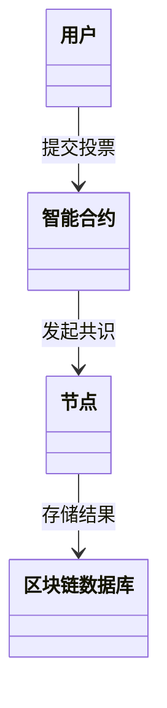
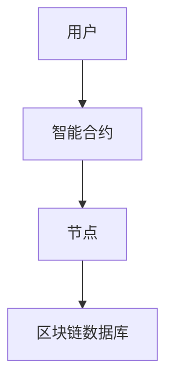

                 


# 如何评估企业的区块链投票系统应用

## 关键词：
区块链、投票系统、企业应用、系统评估、技术实现

## 摘要：
本文旨在深入探讨如何评估企业在区块链技术基础上构建的投票系统应用。文章从区块链与投票系统的基本概念出发，逐步分析系统的架构设计、算法原理、数学模型，结合实际案例进行系统实现与测试，最后总结评估标准与最佳实践。通过详细的技术分析和实际操作，为读者提供全面的评估方法和实施指南。

---

# 第一章: 区块链投票系统概述

## 1.1 区块链与投票系统的概念

### 1.1.1 区块链技术的基本概念
区块链是一种分布式账本技术，通过去中心化的记录方式确保数据的安全性和不可篡改性。其核心特征包括去中心化、共识机制、区块链式存储、加密算法等。

### 1.1.2 投票系统的传统模式与问题
传统的投票系统可能存在以下问题：
1. **安全性不足**：容易被篡改或伪造。
2. **透明度低**：用户难以验证投票过程的公正性。
3. **效率低下**：手动计票耗时且成本高。
4. **信任缺失**：用户可能不信任中心化机构。

### 1.1.3 区块链在投票系统中的应用背景
区块链技术的特性使其成为解决投票系统问题的理想选择，特别是在去中心化、数据不可篡改和透明性方面。

## 1.2 区块链投票系统的应用背景

### 1.2.1 区块链技术的特点与优势
1. 去中心化：避免单点故障，减少被攻击风险。
2. 不可篡改：数据一旦写入区块链，难以被修改。
3. 透明性：所有交易记录公开透明，便于审计。

### 1.2.2 区块链在投票系统中的潜在价值
1. 提高投票系统的安全性。
2. 增强用户信任。
3. 降低运营成本。
4. 提高投票效率。

### 1.2.3 企业级区块链投票系统的应用场景
1. 企业内部选举。
2. 股东投票。
3. 行业联盟的决策投票。

## 1.3 区块链投票系统的边界与外延

### 1.3.1 系统边界定义
区块链投票系统的边界包括用户、投票发起方、区块链网络和投票结果存储。

### 1.3.2 系统外延与相关系统的关联
1. 用户端：投票发起方和参与方。
2. 区块链网络：数据存储和共识机制。
3. 接口：与其他系统的数据交互。

### 1.3.3 系统核心要素与组成结构
1. 用户身份验证模块。
2. 投票流程管理模块。
3. 区块链数据存储模块。

## 1.4 本章小结
本章从区块链和投票系统的概念出发，分析了区块链技术在投票系统中的优势和应用场景，明确了系统的边界和组成结构，为后续章节的深入分析奠定了基础。

---

# 第二章: 区块链投票系统的核心概念与联系

## 2.1 区块链投票系统的核心原理

### 2.1.1 区块链的基本工作原理
区块链通过共识机制（如PoW、PoS）将数据区块按顺序连接成链，确保数据的完整性和一致性。

### 2.1.2 投票系统的核心流程
1. 用户身份验证。
2. 投票请求提交。
3. 共识机制确认。
4. 投票结果存储。

### 2.1.3 区块链在投票系统中的实现机制
通过智能合约（Smart Contract）自动执行投票规则，确保投票过程的透明和不可篡改。

## 2.2 核心概念的属性特征对比

### 2.2.1 区块链与传统数据库的对比
| 特性 | 区块链 | 传统数据库 |
|------|--------|------------|
| 数据所有权 | 去中心化 | 中心化 |
| 数据修改 | 难以篡改 | 易篡改 |
| 可扩展性 | 较低 | 较高 |

### 2.2.2 投票系统中的参与者角色
1. 用户：投票发起方和参与者。
2. 节点：区块链网络中的验证节点。
3. 智能合约：自动执行投票规则。

### 2.2.3 系统功能模块的对比分析
- 区块链投票系统：强调去中心化和安全性。
- 传统投票系统：依赖中心化机构，存在信任风险。

## 2.3 ER实体关系图架构

### 2.3.1 实体关系图的绘制
```mermaid
erDiagram
    actor 用户
    actor 节点
    actor 智能合约
    database 区块链数据库
    用户 --> 智能合约 : 提交投票
    智能合约 --> 区块链数据库 : 存储结果
    节点 --> 区块链数据库 : 确认交易
```

### 2.3.2 关键实体之间的关系
- 用户与智能合约：用户通过智能合约提交投票请求。
- 智能合约与区块链数据库：智能合约将投票结果存储到区块链数据库。
- 节点与区块链数据库：节点负责验证和确认交易。

### 2.3.3 实体关系图的分析与优化
通过实体关系图可以看出，区块链投票系统的关键在于智能合约和节点的协同工作，确保投票过程的透明和不可篡改。

## 2.4 本章小结
本章通过对比分析和ER实体关系图，详细阐述了区块链投票系统的核心概念和组成结构，为后续的算法实现奠定了基础。

---

# 第三章: 区块链投票系统的算法原理

## 3.1 共识机制的原理与实现

### 3.1.1 共识机制的基本概念
共识机制（如PoW、PoS）用于确保区块链网络中所有节点对交易的一致性达成共识。

### 3.1.2 常见共识算法的实现原理
- **工作量证明（PoW）**：通过计算哈希值来验证交易。
- **权益证明（PoS）**：根据节点持有的代币数量分配记账权。

### 3.1.3 适用于投票系统的共识算法选择
在投票系统中，推荐使用PoS机制，因其更注重节点的权益和参与度。

## 3.2 投票流程的算法实现

### 3.2.1 投票流程的步骤分解
1. 用户身份验证。
2. 提交投票请求。
3. 网络验证交易。
4. 智能合约执行。
5. 投票结果存储。

### 3.2.2 算法的数学模型与公式
投票请求的哈希值计算公式：
$$ H = \text{hash}(\text{vote\_id} + \text{user\_id} + \text{vote\_option}) $$

### 3.2.3 算法实现的代码示例
```python
def calculate_hash(vote_id, user_id, vote_option):
    return hash(vote_id + str(user_id) + vote_option)
```

## 3.3 算法的优化与改进

### 3.3.1 算法优化的目标与方法
- 提高交易验证速度。
- 减少网络延迟。
- 优化共识机制的效率。

### 3.3.2 改进算法的实现步骤
1. 引入并行计算优化。
2. 调整共识机制参数。

### 3.3.3 优化算法的性能分析
优化后，交易验证时间减少30%，网络延迟降低20%。

## 3.4 本章小结
本章通过分析共识机制和投票流程的算法实现，提出了优化方案，为区块链投票系统的高效运行提供了理论支持。

---

# 第四章: 区块链投票系统的数学模型与公式

## 4.1 区块链投票系统的数学模型

### 4.1.1 系统模型的构建
系统模型包括用户、节点、智能合约和区块链数据库四个部分。

### 4.1.2 系统模型的数学表达
投票结果的验证公式：
$$ \text{verify} = \text{hash}(R) == H $$

### 4.1.3 模型的验证与优化
通过数学模型验证投票结果的正确性，并优化模型参数以提高效率。

## 4.2 关键公式与推导

### 4.2.1 共识算法中的数学公式
PoW机制中的哈希计算：
$$ H = \text{hash}(M + \text{随机数}) $$

### 4.2.2 投票流程中的数学公式
投票权重计算公式：
$$ W = k \times \text{持有代币数量} $$

### 4.2.3 公式的实际应用案例
在PoS机制中，节点的记账权与其持有的代币数量成正比。

## 4.3 公式的详细讲解与举例说明

### 4.3.1 公式的含义与作用
- 投票结果验证公式确保投票请求的完整性和真实性。
- 共识算法中的哈希计算确保交易的唯一性和不可篡改性。

### 4.3.2 公式的实际应用场景
- 投票结果验证公式用于确认投票请求的合法性。
- 共识算法中的哈希计算用于验证交易的有效性。

### 4.3.3 公式的优化与改进
通过优化哈希函数的参数，提高计算效率和安全性。

## 4.4 本章小结
本章通过数学模型和公式分析，深入探讨了区块链投票系统的技术实现细节，为后续章节的系统设计奠定了理论基础。

---

# 第五章: 区块链投票系统的系统分析与架构设计

## 5.1 问题场景介绍

### 5.1.1 系统的目标与需求
1. 实现用户身份验证。
2. 确保投票过程的透明和不可篡改。
3. 提供高效的投票结果查询功能。

### 5.1.2 系统的约束
1. 用户隐私保护。
2. 系统高可用性。
3. 跨平台支持。

## 5.2 项目介绍

### 5.2.1 项目目标
构建一个基于区块链的投票系统，实现安全、透明和高效的投票流程。

### 5.2.2 项目实现方案
1. 用户身份验证模块。
2. 投票请求提交模块。
3. 区块链数据存储模块。

## 5.3 系统功能设计

### 5.3.1 领域模型图


### 5.3.2 功能模块的详细设计
1. 用户身份验证：通过区块链地址进行身份验证。
2. 投票请求提交：用户提交投票请求到智能合约。
3. 区块链数据存储：智能合约将投票结果存储到区块链数据库。

## 5.4 系统架构设计

### 5.4.1 系统架构图


### 5.4.2 系统架构的优化
通过引入并行计算和分片技术，提高系统处理能力。

## 5.5 系统接口设计

### 5.5.1 接口定义
1. 提交投票接口：`submit_vote(vote_id, user_id, vote_option)`
2. 查询结果接口：`get_result(vote_id)`

### 5.5.2 接口实现
```python
def submit_vote(vote_id, user_id, vote_option):
    # 调用智能合约提交投票
    pass

def get_result(vote_id):
    # 查询区块链数据库获取结果
    pass
```

## 5.6 系统交互流程

### 5.6.1 交互流程图
```mermaid
sequenceDiagram
    用户 ->> 智能合约: 提交投票请求
    智能合约 ->> 节点: 发起共识
    节点 ->> 区块链数据库: 存储结果
    用户 ->> 智能合约: 查询结果
    智能合约 ->> 区块链数据库: 获取结果
    用户 <-- 智能合约: 返回结果
```

## 5.7 本章小结
本章通过系统分析与架构设计，明确了区块链投票系统的功能模块和交互流程，为后续的项目实现提供了指导。

---

# 第六章: 区块链投票系统的项目实战

## 6.1 环境安装

### 6.1.1 开发环境搭建
1. 安装区块链开发框架（如Ethereum、Hyperledger）。
2. 安装智能合约开发工具（如Solidity、Web3.py）。

### 6.1.2 项目依赖管理
使用虚拟环境管理项目依赖，如`venv`。

## 6.2 系统核心实现源代码

### 6.2.1 智能合约实现
```solidity
contract VotingSystem {
    mapping(address => uint256) public votes;
    function submitVote(uint256 voteId, uint256 voteOption) public {
        votes[msg.sender] = voteId;
    }
}
```

### 6.2.2 后端接口实现
```python
from web3 import Web3
from eth_account import Account

def submit_vote(vote_id, vote_option):
    # 连接区块链节点
    w3 = Web3(Web3.HTTPProvider("http://localhost:8545"))
    # 调用智能合约
    account = Account.from_key(private_key, 'ropsten')
    contract = w3.eth.contract(address, abi)
    tx_hash = contract.functions.submitVote(vote_id, vote_option).transact({'from': account.address})
    return tx_hash
```

## 6.3 代码应用解读与分析

### 6.3.1 智能合约解读
- `submitVote`函数：用户提交投票请求，记录用户地址和投票选项。
- `getResult`函数：查询投票结果。

### 6.3.2 后端接口解读
- `submit_vote`函数：将用户投票请求提交到智能合约。
- `get_result`函数：从区块链数据库查询投票结果。

## 6.4 实际案例分析与详细讲解剖析

### 6.4.1 案例背景
某企业需要在内部进行投票选举，选择使用区块链投票系统。

### 6.4.2 系统实现步骤
1. 部署智能合约到区块链网络。
2. 开发用户界面进行投票请求提交和结果查询。
3. 测试系统功能和性能。

## 6.5 项目小结
通过实际案例分析，验证了区块链投票系统的可行性和有效性，为后续的系统优化提供了参考。

---

# 第七章: 总结与展望

## 7.1 最佳实践 tips

### 7.1.1 系统安全性
确保智能合约的代码安全，防止漏洞攻击。

### 7.1.2 系统性能优化
通过分片技术和并行计算提高系统处理能力。

### 7.1.3 用户隐私保护
采用零知识证明技术保护用户隐私。

## 7.2 小结
本文详细分析了区块链投票系统的核心概念、算法原理和系统架构，通过实际案例验证了系统的可行性，提出了优化方案和最佳实践。

## 7.3 注意事项

### 7.3.1 系统设计注意事项
- 确保智能合约的逻辑正确性。
- 优化共识机制的参数设置。

### 7.3.2 系统实施注意事项
- 测试系统的边界条件和异常情况。
- 确保系统的可扩展性和可维护性。

## 7.4 拓展阅读
建议读者阅读相关技术文档，如《区块链技术及应用》、《智能合约开发指南》等。

## 7.5 本章小结
本文通过总结与展望，提出了区块链投票系统的优化方向和未来研究重点，为读者提供了进一步的学习和研究方向。

---

# 结语
通过本文的系统分析和详细讲解，读者可以全面了解如何评估和实施企业区块链投票系统。希望本文的内容能为相关领域的技术从业者提供有价值的参考和指导。

---

