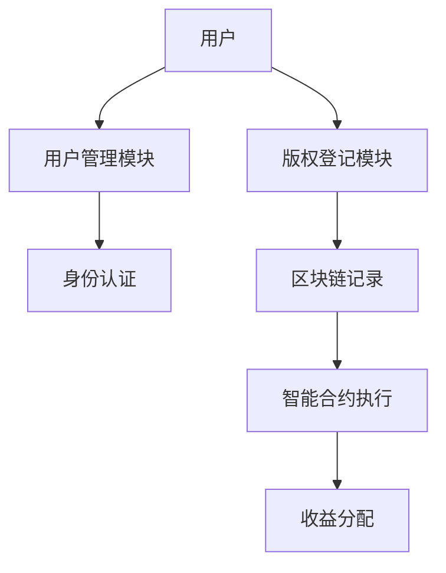
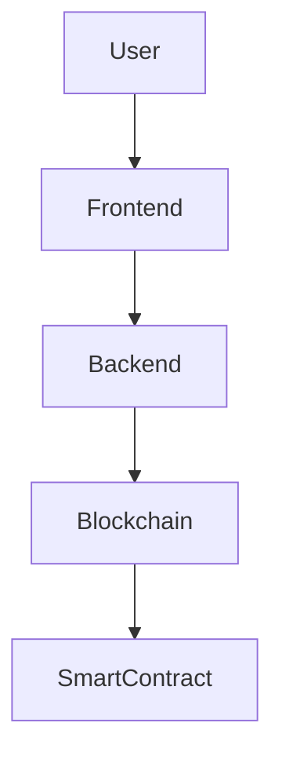

                 


# 如何评估企业的区块链数字版权交易平台

> 关键词：区块链，数字版权，智能合约，版权交易，去中心化

> 摘要：本文将详细探讨如何评估企业的区块链数字版权交易平台。从背景介绍到技术实现，从系统架构到项目实战，逐步分析如何选择和构建一个高效、安全、可靠的区块链数字版权交易平台。本文将涵盖区块链技术的核心概念、数字版权交易的流程、智能合约的实现、系统架构设计以及实际案例分析。

---

## 第一部分: 区块链数字版权交易平台的背景与概念

### 第1章: 数字版权交易的现状与挑战

#### 1.1 数字版权交易的背景

数字版权交易是信息时代的重要产物，涉及音乐、视频、文学、软件等多种形式的数字内容。随着互联网的快速发展，数字内容的创作和分发变得更加便捷，但也带来了盗版、侵权等问题。传统中心化的版权管理方式存在效率低、成本高、信任缺失等问题，难以应对数字时代的挑战。

**问题背景：**
- 盗版内容泛滥，创作者权益难以保障。
- 中心化平台的信任问题，用户对平台的依赖可能导致数据丢失或滥用。
- 版权分发的复杂性，难以实现多级分发和收益分配。

**问题解决：**
- 区块链技术的去中心化特性可以解决信任问题。
- 智能合约可以自动执行版权交易和收益分配，降低管理成本。

**边界与外延：**
- 边界：仅关注数字版权交易，不涉及物理作品的版权管理。
- 外延：可能延伸至知识产权保护、数字资产交易等领域。

#### 1.2 区块链技术的核心优势

区块链技术以其去中心化、不可篡改、透明可信的特点，为数字版权交易提供了革命性的解决方案。

**核心概念：**
- **去中心化**：通过分布式账本，避免单点故障和数据篡改。
- **不可篡改**：区块链上的数据一旦记录，无法被修改。
- **透明可信**：所有交易记录公开透明，便于追溯和审计。

**特点对比：**

| 特性      | 传统中心化平台 | 区块链去中心化平台 |
|-----------|----------------|---------------------|
| 信任机制  | 中心化机构背书 | 去中心化共识机制    |
| 成本      | 高（管理与信任成本） | 较低（自动化管理） |
| 效率      | 低（繁琐的中间环节） | 高（自动化流程）  |

#### 1.3 区块链数字版权交易的核心要素

**核心要素：**
1. **数字内容的唯一标识**：通过哈希值或其他唯一标识符确保内容的唯一性。
2. **版权确权**：通过区块链记录内容的创作时间和归属。
3. **智能合约**：自动执行交易、分发和收益分配。
4. **用户身份认证**：确保交易双方的身份真实性。

---

### 第2章: 区块链与数字版权的关系

#### 2.1 区块链技术在数字版权中的应用

区块链通过去中心化和智能合约技术，为数字版权交易提供了以下核心功能：

1. **版权确权**：通过区块链记录内容的创作时间和归属，提供不可篡改的证明。
2. **版权分发**：通过智能合约实现多级分发，确保创作者、分发平台、用户的权益分配透明。
3. **版权交易**：支持点对点交易，降低中间环节的成本和信任问题。

#### 2.2 智能合约在数字版权交易中的作用

智能合约是区块链技术的重要组成部分，能够自动执行预设的规则，确保交易的透明和可信。

**智能合约的特点：**
1. **自动化**：无需人工干预，自动执行交易。
2. **不可篡改**：合约代码一旦部署，无法被修改。
3. **透明性**：所有合约执行记录公开透明，便于审计和追溯。

**智能合约的应用场景：**
1. **版权登记**：自动记录内容的创作时间和归属。
2. **交易执行**：自动完成版权购买、使用权分发等操作。
3. **收益分配**：根据智能合约的规则，自动分配收益。

#### 2.3 区块链数字版权交易的流程

**流程概述：**
1. **用户注册与身份认证**：用户通过区块链进行身份认证。
2. **版权登记与确权**：内容创作者将作品哈希值记录在区块链上。
3. **版权交易**：买家通过智能合约购买版权。
4. **版权分发与收益分配**：智能合约自动执行收益分配。

---

### 第3章: 区块链技术的底层实现

#### 3.1 区块链的共识机制

**共识机制**是区块链的核心技术，确保所有节点达成一致。

**常见共识机制：**
1. **工作量证明（PoW）**：比特币采用的机制，通过计算哈希值来验证区块。
2. **权益证明（PoS）**：通过持有代币的数量来决定记账权。
3. ** delegated 权益证明（Dpos）**：通过选举节点来决定记账权。

**共识机制对数字版权交易的影响：**
- **安全性**：确保数据不可篡改。
- **效率**：影响交易的确认速度。

#### 3.2 区块链的加密算法

**加密算法**是区块链安全的基础，确保数据的完整性和隐私性。

**常见加密算法：**
1. **RSA**：非对称加密算法，用于数字签名。
2. **ECDSA**：椭圆曲线数字签名算法，比特币中使用的签名算法。

**加密算法在数字版权中的应用：**
- **数字签名**：确保内容创作者的身份真实性。
- **数据加密**：保护用户隐私。

#### 3.3 数字签名与哈希函数

**数字签名**：通过私钥签名和公钥验证，确保数据的完整性和真实性。

**哈希函数**：将任意长度的数据映射为固定长度的哈希值，用于数据完整性验证。

---

### 第4章: 智能合约的实现

#### 4.1 智能合约的定义与实现

**智能合约**是区块链上的可执行代码，用于自动执行预设的规则。

**智能合约的实现步骤：**
1. **编写代码**：使用Solidity等智能合约编程语言。
2. **编译部署**：将合约部署到区块链上。
3. **调用执行**：通过交易调用合约函数。

**智能合约的数学模型：**
- **状态机模型**：合约的状态和行为由输入和区块链的执行环境决定。
- **条件判断**：根据区块链的交易信息，执行相应的操作。

#### 4.2 智能合约在数字版权中的应用

**智能合约的核心功能：**
1. **版权登记**：记录内容的创作时间和归属。
2. **交易执行**：自动完成版权的购买和使用权分发。
3. **收益分配**：根据合约规则自动分配收益。

---

### 第5章: 区块链数字版权交易平台的系统架构

#### 5.1 系统功能设计

**系统功能模块：**
1. **用户管理**：用户注册、身份认证。
2. **版权登记**：内容创作者提交作品进行确权。
3. **版权交易**：用户购买版权。
4. **收益管理**：智能合约自动分配收益。

**系统功能设计图：**



#### 5.2 系统架构设计

**系统架构：**
1. **前端**：用户界面，支持用户注册、版权登记、交易等功能。
2. **后端**：处理用户的请求，与区块链进行交互。
3. **区块链节点**：分布式账本，存储版权信息和交易记录。
4. **智能合约**：自动执行版权相关的业务逻辑。

**系统架构图：**



---

### 第6章: 区块链数字版权交易平台的项目实战

#### 6.1 项目背景与目标

**项目背景：**
- 音乐版权交易平台的搭建，解决音乐创作者的权益保护和收益分配问题。

**项目目标：**
- 实现音乐版权的登记、交易和收益分配。
- 通过区块链技术确保交易的透明和可信。

#### 6.2 项目实现步骤

**环境配置：**
1. 安装以太坊节点（如Geth）。
2. 安装Solidity编译器。
3. 配置智能合约开发环境（如Remix）。

**核心代码实现：**

```solidity
// 版权登记智能合约
contract Copyright {
    struct Content {
        address owner;
        uint256 timestamp;
        string hash;
    }

    function registerContent(string memory hash) public {
        Content memory content = Content(msg.sender, block.timestamp, hash);
        // 存储内容信息
        // ...
    }

    function transferContent(address from, address to) public {
        // 转让版权
        // ...
    }
}
```

**代码解读：**
- **registerContent**：记录内容的哈希值、所有者和时间戳。
- **transferContent**：实现内容的转让功能。

---

### 第7章: 区块链数字版权交易平台的评估与优化

#### 7.1 评估指标

**评估指标：**
1. **性能指标**：交易确认时间、系统吞吐量。
2. **安全性指标**：抗攻击能力、数据完整性。
3. **用户体验指标**：操作便捷性、界面友好度。

**评估工具：**
1. 区块链性能测试工具（如JMeter）。
2. 智能合约审计工具。

#### 7.2 优化建议

**优化方向：**
1. **提升交易效率**：优化共识机制，减少确认时间。
2. **增强安全性**：加强智能合约的审计，防止漏洞。
3. **改善用户体验**：优化前端设计，降低操作门槛。

---

### 第8章: 总结与展望

#### 8.1 总结

本文详细探讨了如何评估企业的区块链数字版权交易平台，从技术实现到系统架构，从项目实战到优化建议，为读者提供了全面的指导。

**核心总结：**
1. 区块链技术为数字版权交易提供了去中心化、不可篡改的解决方案。
2. 智能合约是实现自动交易和收益分配的关键技术。
3. 系统架构设计和项目实施是确保平台高效、安全运行的核心。

#### 8.2 展望

随着区块链技术的不断发展，数字版权交易平台将更加智能化、自动化。未来，可能会出现更多创新的商业模式，如去中心化的版权分发平台、智能化的收益分配机制等。

---

通过本文的详细讲解，读者可以全面了解如何评估和构建一个高效、安全的区块链数字版权交易平台，为企业的数字化转型提供有力支持。

