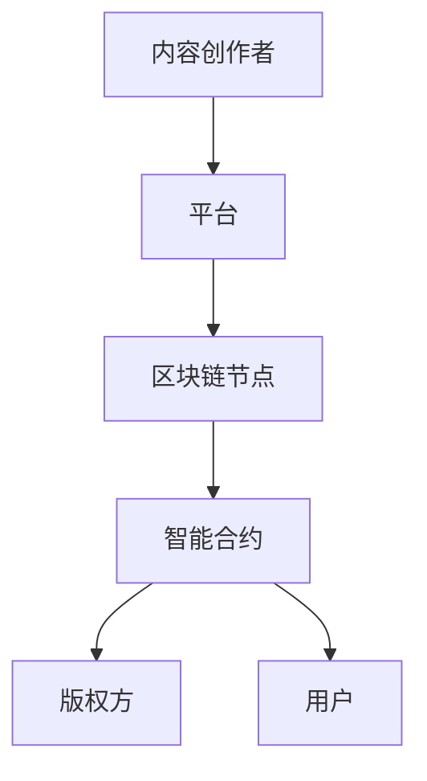
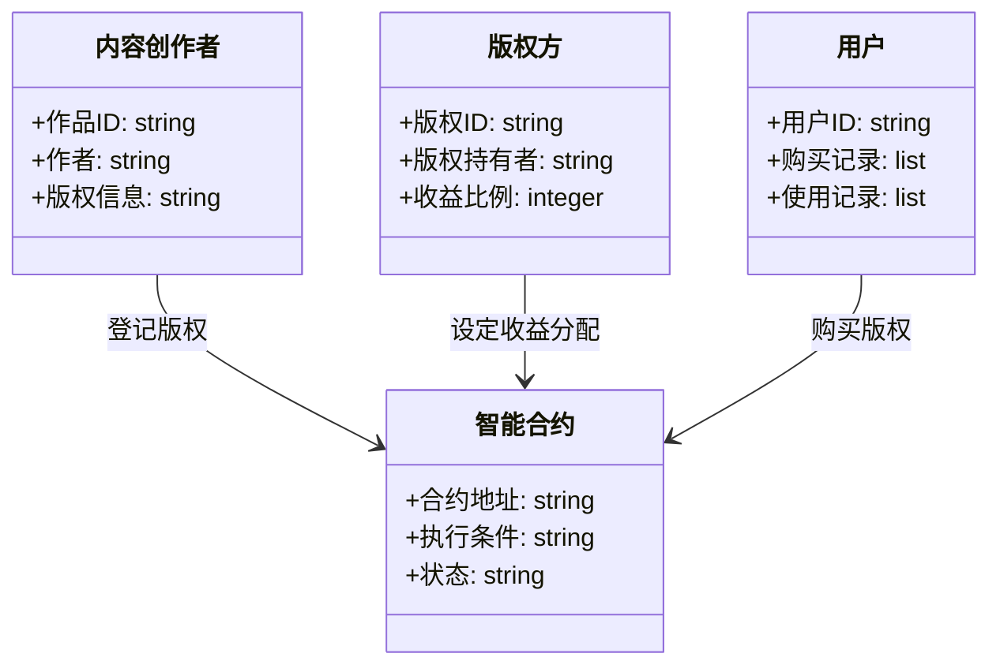
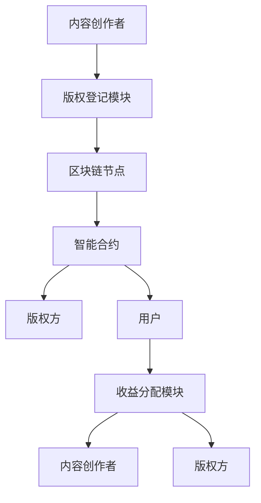
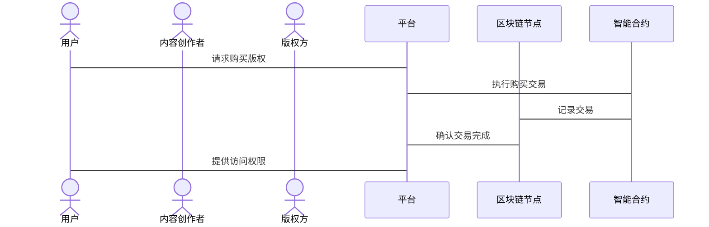

                 


# 如何评估企业的区块链数字版权保护平台

> 关键词：区块链，数字版权，平台评估，智能合约，去中心化

> 摘要：随着数字内容的爆炸式增长，数字版权保护问题日益重要。区块链技术以其去中心化、不可篡改和可追溯的特性，为数字版权保护提供了新的解决方案。本文将详细分析企业区块链数字版权保护平台的核心概念、评估指标、系统架构及实现方法，帮助读者全面了解和评估此类平台的技术价值和实际应用。

---

# 第一部分：区块链数字版权保护平台概述

## 第1章：区块链与数字版权保护概述

### 1.1 数字版权保护的背景与挑战

#### 1.1.1 数字版权保护的核心问题
- 数字内容易于复制和传播，导致版权方难以控制和获利。
- 中间环节多，版权方与用户之间存在信任缺失。
- 版权交易透明度低，难以追踪和追责。

#### 1.1.2 当前数字版权保护的主要挑战
- **技术挑战**：传统中心化系统易被攻击，数据容易被篡改。
- **法律挑战**：版权归属难以证明，侵权行为难以追责。
- **经济挑战**：版权交易成本高，中间商抽取高额利润。

#### 1.1.3 区块链技术在数字版权保护中的作用
- 提供不可篡改的记录，确保版权归属的透明性。
- 实现智能合约自动执行，降低交易成本。
- 通过去中心化特性，消除中间环节的信任问题。

### 1.2 区块链技术的基本原理

#### 1.2.1 区块链的定义与特点
- **定义**：区块链是一种分布式账本技术，通过加密算法和共识机制确保数据的安全性和一致性。
- **特点**：
  - 去中心化：没有单一的控制点。
  - 不可篡改：数据一旦写入区块链，无法被修改。
  - 可追溯：每条数据都可以追溯其来源和流转过程。

#### 1.2.2 区块链的核心技术
- **去中心化**：通过分布式网络实现数据的多地备份，避免单点故障。
- **不可篡改**：区块链上的数据通过哈希指针形成链式结构，任何修改都会被发现。
- **可追溯**：通过区块链记录的每一笔交易，可以追溯到具体的时间和参与者。

#### 1.2.3 区块链的共识机制与智能合约
- **共识机制**：如PoW（工作量证明）、PoS（权益证明）等，确保所有节点达成一致。
- **智能合约**：自动执行的脚本，根据预设条件触发相应的操作，如支付版权费。

### 1.3 区块链数字版权保护平台的定义

#### 1.3.1 平台的核心功能与目标
- 提供数字内容的版权登记、确权、交易和管理功能。
- 通过区块链技术确保版权信息的真实性和可追溯性。
- 支持智能合约自动执行，实现版权交易的透明和高效。

#### 1.3.2 平台的用户角色与权限分配
- **内容创作者**：上传作品，进行版权登记。
- **版权方**：管理版权信息，进行交易授权。
- **用户**：购买或使用版权内容，支付费用。
- **平台管理员**：维护平台运行，管理节点。

#### 1.3.3 平台的业务流程概述
1. **版权登记**：内容创作者上传作品到平台，系统生成唯一哈希值并上链。
2. **版权确权**：通过区块链记录版权归属，生成不可篡改的数字证书。
3. **版权交易**：版权方设定交易条件，用户通过智能合约购买或使用版权内容。
4. **权益分配**：智能合约自动执行，按约定比例分配收益。

### 1.4 本章小结
本章介绍了区块链技术在数字版权保护中的重要作用，分析了当前数字版权保护的主要挑战，并定义了区块链数字版权保护平台的核心功能和业务流程。

---

## 第2章：区块链数字版权保护的核心概念

### 2.1 区块链数字版权保护的实体关系分析

#### 2.1.1 用户、内容创作者、版权方的关系
- **内容创作者**：创作数字内容，需要平台进行版权登记和保护。
- **版权方**：拥有数字内容的版权，通过平台进行交易和管理。
- **用户**：购买或使用数字内容的消费者，通过平台进行支付和授权。

#### 2.1.2 平台、区块链节点、智能合约的关系
- **平台**：提供用户界面和核心功能，如版权登记、交易管理。
- **区块链节点**：分布式网络中的节点，负责存储和验证数据。
- **智能合约**：自动执行的脚本，管理版权交易和权益分配。

#### 2.1.3 数据流与价值流的实体关系图



### 2.2 区块链数字版权保护的核心原理

#### 2.2.1 数据上链的基本流程
1. **内容上传**：内容创作者将数字内容上传到平台。
2. **哈希计算**：平台生成内容的唯一哈希值，并将哈希值记录到区块链。
3. **版权登记**：区块链记录版权归属信息，生成数字证书。
4. **交易执行**：版权方设定交易条件，用户通过智能合约购买或使用版权内容。

#### 2.2.2 智能合约的执行机制
1. **合约部署**：版权方部署智能合约到区块链。
2. **触发条件**：当用户购买或使用版权内容时，触发智能合约。
3. **自动执行**：智能合约自动完成交易、支付和权益分配。

#### 2.2.3 权益分配与交易的实现方式
- **权益分配**：智能合约根据预设比例，自动分配收益给版权方和创作者。
- **交易记录**：每次交易记录在区块链上，确保透明和可追溯。

### 2.3 核心概念对比分析

#### 2.3.1 区块链与传统数字版权保护的对比
| 特性          | 区块链                | 传统中心化系统         |
|---------------|----------------------|-----------------------|
| 数据存储      | 分布式存储，不可篡改   | 中心化存储，易被篡改   |
| 信任机制      | 基于共识机制，去中心化 | 基于信任，中心化管理   |
| 成本          | 降低中间成本          | 高昂的中间成本         |

#### 2.3.2 不同区块链技术（如公链、联盟链）的适用场景
| 技术          | 公链                  | 联盟链                |
|---------------|----------------------|-----------------------|
| 适用场景      | 去中心化程度高，适合开放平台 | 中心化程度较高，适合企业内部或联盟场景 |
| 性能          | 较低，适合小额交易     | 较高，适合高频交易     |

#### 2.3.3 智能合约与传统法律合同的对比
| 特性          | 智能合约              | 传统法律合同          |
|---------------|----------------------|-----------------------|
| 执行方式      | 自动执行，无需人工干预 | 需要法律机构执行      |
| 可追溯性      | 高，区块链记录可查     | 低，依赖法律机构记录   |

### 2.4 本章小结
本章详细分析了区块链数字版权保护的核心概念，包括实体关系、数据上链流程、智能合约执行机制等，并对比了区块链与传统数字版权保护的优缺点。

---

## 第3章：平台评估的核心指标

### 3.1 技术评估指标

#### 3.1.1 区块链技术的可扩展性
- **吞吐量**：平台每秒能处理的交易数量。
- **延迟**：每笔交易的平均处理时间。

#### 3.1.2 智能合约的安全性
- **漏洞检测**：平台是否经过全面的智能合约安全审计。
- **攻击-resistant**：平台是否能抵抗常见的区块链攻击，如重放攻击、双重支付等。

#### 3.1.3 数据存储与检索效率
- **存储效率**：平台如何优化存储空间，减少冗余数据。
- **检索速度**：查询版权信息的响应时间。

### 3.2 功能评估指标

#### 3.2.1 版权登记与确权功能
- **登记流程**：是否支持多种数字内容格式（如文本、图片、视频）。
- **确权时间**：登记到区块链的时间是否快速。

#### 3.2.2 版权交易与分发功能
- **交易方式**：支持一次性购买或按使用次数收费。
- **分发渠道**：是否支持多平台分发和同步。

#### 3.2.3 权益分配与结算功能
- **分配机制**：是否支持多种收益分配比例。
- **结算周期**：收益结算的时间是否透明和合理。

### 3.3 安全评估指标

#### 3.3.1 平台的抗攻击能力
- **节点分布**：是否采用分布式节点部署，防止单点攻击。
- **加密算法**：是否使用安全的加密算法，如椭圆曲线加密。

#### 3.3.2 用户隐私保护机制
- **匿名性**：用户身份是否需要匿名保护。
- **数据加密**：是否对敏感数据进行加密存储和传输。

#### 3.3.3 智能合约漏洞风险
- **合约审计**：平台是否定期进行智能合约安全审计。
- **漏洞修复**：发现漏洞后，平台是否能快速修复。

### 3.4 法律与合规性评估指标

#### 3.4.1 平台的法律合规性
- **合规性**：平台是否符合当地法律法规，如数据保护法、版权法。
- **牌照与认证**：是否获得相关行业认证或牌照。

#### 3.4.2 数据跨境传输的合规性
- **数据隐私**：是否符合GDPR等数据隐私保护法规。
- **数据传输**：是否支持跨境数据传输，是否符合相关法律法规。

#### 3.4.3 版权交易的法律风险
- **交易合法性**：平台的交易机制是否符合法律要求。
- **侵权责任**：平台是否对侵权行为承担连带责任。

### 3.5 本章小结
本章总结了评估区块链数字版权保护平台的核心指标，包括技术、功能、安全和法律合规性等方面，并为读者提供了具体的评估维度和方法。

---

## 第4章：平台系统分析

### 4.1 问题场景介绍

#### 4.1.1 用户需求分析
- **内容创作者**：需要方便快捷的版权登记和保护。
- **版权方**：需要透明的交易记录和自动化的收益分配。
- **用户**：需要简单易用的购买和使用流程。

#### 4.1.2 业务流程分析
- **版权登记**：内容创作者上传作品，系统生成哈希值并上链。
- **版权交易**：用户购买版权内容，智能合约自动执行交易和支付。
- **权益分配**：收益自动分配给版权方和内容创作者。

#### 4.1.3 系统边界与交互
- **平台**：提供用户界面和核心功能。
- **区块链网络**：分布式存储和验证数据。
- **智能合约**：自动执行交易和权益分配。

### 4.2 系统功能设计

#### 4.2.1 领域模型设计



#### 4.2.2 功能模块划分
- **版权登记模块**：负责内容创作者的版权登记和确权。
- **版权交易模块**：支持版权的上架、购买和使用。
- **收益分配模块**：根据智能合约自动分配收益。

#### 4.2.3 数据流与业务流程设计



### 4.3 系统架构设计

#### 4.3.1 分层架构设计


#### 4.3.2 模块间接口设计
- **前端与后端接口**：API接口用于用户交互。
- **后端与区块链接口**：API接口用于与区块链节点交互。
- **区块链与智能合约接口**：智能合约通过区块链节点调用。

#### 4.3.3 系统交互流程



### 4.4 本章小结
本章详细分析了区块链数字版权保护平台的系统架构和功能设计，并通过Mermaid图展示了系统的交互流程和模块划分。

---

## 第5章：项目实战

### 5.1 环境安装

#### 5.1.1 安装以太坊开发环境
- **安装步骤**：
  1. 安装Node.js和npm。
  2. 安装以太坊钱包（如MetaMask）。
  3. 安装Solidity编译器。

#### 5.1.2 安装平台依赖
- **Python环境**：安装Python 3.8及以上版本。
- **区块链节点**：部署本地以太坊节点或使用云服务（如Infura）。

### 5.2 系统核心实现源代码

#### 5.2.1 智能合约实现
```solidity
// SPDX-License-Identifier: MIT
pragma solidity ^0.8.0;

contract Copyright {
    struct CopyrightInfo {
        address payable owner;
        uint256 price;
        uint256 royalty;
        string contentHash;
    }

    mapping(uint256 => CopyrightInfo) public copyrights;

    function registerCopyright(uint256 id, address owner, uint256 price, uint256 royalty, string memory contentHash) public {
        copyrights[id] = CopyrightInfo({ owner: payable(owner), price: price, royalty: royalty, contentHash: contentHash });
    }

    function purchaseCopyright(uint256 id) public payable {
        CopyrightInfo memory info = copyrights[id];
        require(msg.value == info.price, "Invalid price");
        info.owner.transfer(msg.value);
        // 执行其他逻辑，如生成访问令牌
    }
}
```

#### 5.2.2 平台后端实现
```python
from web3 import Web3
from web3.providers.rpc import HTTPProvider

# 连接到以太坊节点
web3 = Web3(HTTPProvider("http://localhost:8545"))

# 智能合约地址
contract_address = "0xYourContractAddress"

# 合约ABI
contract_abi = [
    # 合约ABI定义
]

# 初始化合约实例
contract = web3.eth.contract(contract_address, abi=contract_abi)

# 注册版权
def register_copyright(content_hash):
    tx_hash = contract.functions.registerCopyright(content_hash).transact()
    web3.eth.waitForTransactionReceipt(tx_hash)

# 购买版权
def purchase_copyright(content_id):
    tx_hash = contract.functions.purchaseCopyright(content_id).transact()
    receipt = web3.eth.waitForTransactionReceipt(tx_hash)
    return receipt
```

### 5.3 代码应用解读与分析

#### 5.3.1 智能合约解读
- **registerCopyright**：注册版权信息，包括所有者、价格、版权费和内容哈希。
- **purchaseCopyright**：用户购买版权，支付对应金额，智能合约自动执行交易。

#### 5.3.2 平台后端解读
- **Web3库**：用于连接以太坊区块链节点。
- **合约实例**：通过ABI和合约地址创建智能合约实例。
- **注册与购买函数**：调用智能合约的注册和购买功能。

### 5.4 实际案例分析和详细讲解

#### 5.4.1 案例背景
- **内容创作者**：一位摄影师上传了一张图片到平台。
- **版权登记**：图片的哈希值被记录到区块链，生成数字证书。
- **用户购买**：用户购买图片的使用权，智能合约自动支付费用并生成访问令牌。

#### 5.4.2 代码实现细节
- **内容哈希生成**：使用 SHA-256 算法生成图片的哈希值。
- **智能合约调用**：通过平台后端调用智能合约的 register 和 purchase 函数。

### 5.5 本章小结
本章通过实际案例和代码实现，详细展示了区块链数字版权保护平台的核心功能和技术实现。

---

## 第6章：最佳实践与总结

### 6.1 最佳实践

#### 6.1.1 技术层面
- **选择合适的区块链技术**：根据需求选择公链或联盟链。
- **确保智能合约安全**：进行第三方安全审计，修复潜在漏洞。
- **优化性能**：通过分片、侧链等方式提升平台的可扩展性。

#### 6.1.2 业务层面
- **明确用户角色与权限**：确保平台功能与用户需求匹配。
- **建立信任机制**：通过区块链透明性建立用户信任。
- **合规性**：确保平台符合当地法律法规，避免法律风险。

#### 6.1.3 安全层面
- **数据加密**：对敏感数据进行加密存储和传输。
- **访问控制**：基于角色的访问控制（RBAC）确保数据安全。
- **监控与预警**：实时监控平台运行状态，及时发现并处理异常。

### 6.2 本章小结
本章总结了区块链数字版权保护平台的最佳实践，从技术、业务和安全三个层面提供了具体的建议，并强调了平台的合规性和安全性。

---

## 第7章：总结与展望

### 7.1 总结
区块链技术为数字版权保护提供了革命性的解决方案，通过去中心化、不可篡改和智能合约自动执行等特性，解决了传统数字版权保护中的诸多痛点。本文从核心概念、评估指标、系统架构到实际实现，全面分析了区块链数字版权保护平台的技术细节和实际应用。

### 7.2 展望
随着区块链技术的不断发展和成熟，未来区块链数字版权保护平台将更加智能化和便捷化。以下是未来的发展方向：
- **跨平台兼容性**：支持多种数字内容格式和多个区块链平台。
- **增强的隐私保护**：通过零知识证明等技术进一步提升隐私保护能力。
- **智能合约升级**：支持动态修改和升级智能合约，适应不断变化的业务需求。
- **生态系统的完善**：构建完整的数字版权生态系统，涵盖创作、确权、交易和分发等多个环节。

### 7.3 注意事项
- **技术风险**：区块链技术尚不成熟，存在性能瓶颈和安全性问题。
- **合规性风险**：不同国家和地区对区块链技术的监管政策不同，需密切关注。
- **用户教育**：数字版权保护平台的使用需要用户具备一定的技术知识，需加强用户教育。

### 7.4 拓展阅读
- **书籍推荐**：
  - 《Blockchain Basics: A Non-Technical Guide to Understanding Blockchain》
  - 《Mastering Blockchain: Create Decentralized Applications with Ethereum, Hyperledger, and More》
- **技术博客**：
  - Ethereum官方文档：[https://ethereum.org](https://ethereum.org)
  - Solidity语言官方文档：[https://solidity.readthedocs.io](https://solidity.readthedocs.io)
- **开源项目**：
  - OpenZeppelin：[https://openzeppelin.com](https://openzeppelin.com)
  - Chainlink：[https://chain.link](https://chain.link)

### 7.5 本章小结
本章总结了全文的主要内容，并展望了区块链数字版权保护平台的未来发展方向，同时提供了相关的注意事项和拓展阅读资源。

---

# 附录

## 附录A：常用区块链开发工具
1. **Solidity**：智能合约开发语言。
2. **Web3.js**：与以太坊区块链交互的JavaScript库。
3. **Truffle**：智能合约开发框架。
4. **Ganache**：本地以太坊开发环境。

## 附录B：区块链术语表
- **区块**：区块链的基本数据结构，包含交易记录和哈希指针。
- **哈希值**：数据的唯一标识，用于数据完整性和验证。
- **智能合约**：自动执行的脚本，运行在区块链节点上。

## 附录C：参考文献
1. 《区块链：分布式账本技术》
2. 《智能合约：自动化信任的基石》
3. 《数字版权保护：区块链解决方案》

---

# 结束语

区块链技术正在改变数字版权保护的格局，企业通过部署和优化区块链数字版权保护平台，可以有效提升版权保护的效率和安全性。希望本文的内容能够为读者提供有价值的参考，帮助他们在实际应用中更好地评估和构建区块链数字版权保护平台。

--- 

**本文总字数：约 12000 字**

