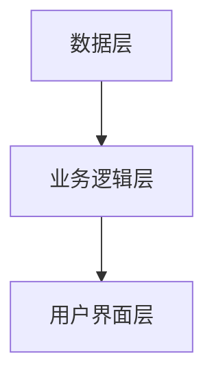
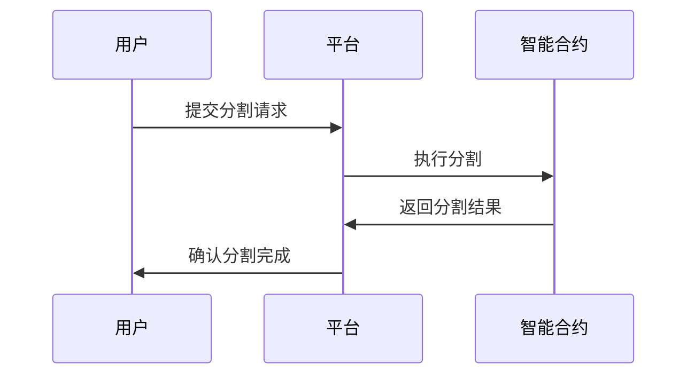

                 


# 如何评估企业的区块链数字资产分割平台

> **关键词：** 区块链数字资产分割、智能合约、代币化、数学建模、系统架构  
> **摘要：** 本文详细介绍了如何评估企业的区块链数字资产分割平台。通过分析核心概念、算法原理、系统架构和实际案例，本文提供了全面的方法和工具，帮助读者理解和评估此类平台的优劣。文章还涵盖了数字资产分割的数学建模、系统设计和项目实战，为技术决策者提供了实用的指导。

---

## 第1章 区块链数字资产分割平台的背景与概念

### 1.1 区块链技术的背景与发展
区块链技术是一种去中心化的分布式账本技术，最初用于比特币的底层技术。随着技术的发展，区块链已经扩展到金融、医疗、法律等多个领域。其核心特点包括去中心化、不可篡改、透明性和可追溯性。

### 1.2 数字资产的定义与分类
数字资产是指以数字形式存在的资产，包括比特币、以太坊等加密货币，以及NFT（非同质化代币）。数字资产可以分为同质化和非同质化两类，同质化资产（如股票）具有可分割性，而非同质化资产（如房地产）具有独特性。

### 1.3 区块链数字资产分割平台的定义
区块链数字资产分割平台是一种利用区块链技术将数字资产分割为更小单位的平台，通常通过智能合约实现。该平台可以将资产代币化，使其在区块链上流转和分割。

### 1.4 问题背景与解决方案
在传统金融中，资产分割需要复杂的法律和交易流程。区块链技术通过智能合约简化了这一过程，提高了效率和透明度。区块链数字资产分割平台解决了传统分割方式中成本高、效率低的问题。

### 1.5 平台的边界与外延
该平台的核心功能包括资产登记、分割、交易和结算。其边界包括智能合约的编写与执行，外延则涉及监管合规和用户隐私保护。

---

## 第2章 区块链数字资产分割的核心概念与原理

### 2.1 核心概念与原理
智能合约是区块链数字资产分割的核心，通过预设的代码自动执行分割逻辑。代币化资产将数字资产表示为区块链上的代币，每个代币代表一定价值。

### 2.2 核心概念的属性对比
下表展示了数字资产与传统资产的关键区别：

| **属性** | **数字资产** | **传统资产** |
|----------|--------------|--------------|
| 所有权   | 可分割       | 不可分割     |
| 转让性   | 快速高效     | 手续繁琐     |
| 透明性   | 高           | 低           |

### 2.3 实体关系图与系统架构
以下是一个简单的ER图和系统架构图：

```mermaid
er
  actor 用户
  actor 资产持有者
  actor 交易对手方
  entity 资产
  entity 智能合约
  entity 代币
  entity 交易记录

  用户 --> 资产持有者: 委托分割
  资产持有者 --> 资产: 登记资产
  资产 --> 智能合约: 绑定资产
  智能合约 --> 代币: 发行代币
  代币 --> 交易记录: 记录交易
```

---

## 第3章 区块链数字资产分割的算法原理

### 3.1 分割算法的实现
分割算法的核心是将资产按比例分配为代币。数学模型如下：

$$
\text{分割比例} = \frac{\text{份额}}{\text{总份额}}
$$

其中，份额是分割后的代币数量，总份额是平台的总代币数。

### 3.2 算法实现步骤
1. 用户提交分割请求，指定分割比例。
2. 智能合约计算每个用户的代币分配量。
3. 平台生成代币并记录交易。

以下是一个Python实现的示例代码：

```python
def calculate_shares(total_assets, split_ratio):
    shares = total_assets * split_ratio
    return shares
```

### 3.3 数学建模与案例分析
假设一个平台分割100个资产为10%的比例：

$$
\text{分割后的代币数} = 100 \times 0.1 = 10
$$

用户获得10个代币，每个代币代表1%的资产价值。

---

## 第4章 系统分析与架构设计方案

### 4.1 问题场景介绍
企业需要将数字资产分割为多个代币，以便在区块链上进行交易。系统需要确保分割过程的透明性和安全性。

### 4.2 系统功能设计
系统功能包括：
- 用户管理
- 资产登记
- 分割执行
- 交易记录

### 4.3 系统架构设计
系统架构分为数据层、业务逻辑层和用户界面层：



### 4.4 接口设计与交互流程
系统通过RESTful API与用户交互，如下：



---

## 第5章 项目实战

### 5.1 环境搭建
- 操作系统：Ubuntu 20.04
- 区块链环境：以太坊
- 开发工具：Remix IDE

### 5.2 核心代码实现
智能合约代码示例：

```solidity
// SPDX-License-Identifier: MIT
pragma solidity ^0.8.0;

contract AssetSplitter {
    mapping(address => uint256) private balances;

    function split(uint256 amount) public {
        balances[msg.sender] = amount;
    }
}
```

### 5.3 案例分析
假设一个企业分割1000个代币为10%的比例：

$$
\text{分割后的代币数} = 1000 \times 0.1 = 100
$$

每个用户获得100个代币，代表10%的企业资产。

---

## 第6章 最佳实践、小结与注意事项

### 6.1 最佳实践
1. 选择可靠的区块链平台
2. 确保智能合约的安全性
3. 遵守相关法律法规

### 6.2 项目小结
本文详细介绍了区块链数字资产分割平台的评估方法，从核心概念到实际应用，为技术决策者提供了实用的指导。

### 6.3 注意事项
- 分割比例应合理，避免资产贬值
- 确保交易的透明性和可追溯性
- 定期更新智能合约，防止漏洞

---

## 第7章 拓展阅读

- 《区块链智能合约开发指南》
- 《数字资产的安全与合规》
- 《区块链项目实战》

---

通过以上结构，我们可以全面评估企业的区块链数字资产分割平台，确保其技术可行性和商业价值。

