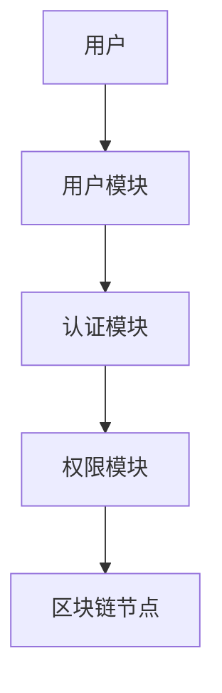

                 


# 如何评估企业的区块链数字身份认证应用

**关键词：区块链、数字身份认证、去中心化、企业应用、安全性**

**摘要：**  
随着区块链技术的快速发展，数字身份认证在企业中的应用变得越来越重要。本文将从区块链的基本概念出发，详细分析数字身份认证的核心原理、应用场景，并通过实际案例探讨如何评估企业区块链数字身份认证应用的可行性和安全性。文章内容涵盖了区块链技术基础、数字身份认证的体系结构、共识机制、加密算法、系统架构设计以及实际项目实现，旨在为企业技术决策者和开发人员提供全面的评估方法和实践指南。

---

# 第1章: 区块链与数字身份认证概述

## 1.1 区块链技术基础

### 1.1.1 区块链的基本概念
区块链是一种去中心化的分布式账本技术，通过密码学和共识机制确保数据的安全性和不可篡改性。区块链的核心要素包括区块、链、节点、共识机制和智能合约。

### 1.1.2 区块链的核心特点
- **去中心化**：数据不由单一机构控制，而是分布在网络中的多个节点。
- **不可篡改**：通过密码学和共识机制，确保数据一旦写入区块链不可被修改。
- **透明性**：所有交易记录公开透明，但用户身份可以保持匿名。
- **去信任化**：通过技术手段减少对中间机构的信任依赖。

### 1.1.3 区块链的分类与应用场景
区块链主要分为公链、私链和联盟链，分别适用于不同的场景。例如，公链（如比特币）用于金融交易，私链用于企业内部数据管理，联盟链（如Hyperledger）用于跨机构合作。

---

## 1.2 数字身份认证的定义与特点

### 1.2.1 数字身份认证的定义
数字身份认证是指通过数字技术验证用户身份的过程，通常涉及身份标识符和加密算法。数字身份认证可以基于密码、生物特征或数字证书。

### 1.2.2 数字身份认证的核心要素
- **身份标识符**：唯一标识用户的字符串，如用户名、邮箱或数字证书。
- **加密算法**：用于签名和验证，如RSA和椭圆曲线加密。
- **认证协议**：如OAuth 2.0和SAML，用于跨系统身份验证。

### 1.2.3 数字身份认证的分类与对比
数字身份认证可以分为基于密码的认证、基于证书的认证和基于生物特征的认证。以下是不同认证方式的对比：

| 认证方式       | 优点               | 缺点               |
|----------------|--------------------|--------------------|
| 基于密码       | 实现简单           | 易被暴力破解       |
| 基于证书       | 安全性高           | 需要证书颁发机构   |
| 基于生物特征   | 误识别率低         | 成本高，设备依赖   |

---

## 1.3 区块链在数字身份认证中的作用

### 1.3.1 区块链技术如何提升数字身份安全性
区块链通过去中心化存储和加密算法，确保数字身份数据的安全性。例如，用户的敏感信息（如身份证号）可以加密存储在区块链中，只有授权方才能解密。

### 1.3.2 区块链如何实现身份认证的去中心化
区块链的去中心化特性使得身份认证不再依赖于单一机构，用户可以在不同的系统中使用同一身份标识符，而无需重复注册。

### 1.3.3 区块链在数字身份认证中的优势与挑战
- **优势**：提高安全性、降低数据泄露风险、实现跨系统身份共享。
- **挑战**：技术复杂性高、合规性问题、用户隐私保护。

---

## 1.4 本章小结
本章介绍了区块链技术和数字身份认证的基本概念，并分析了区块链在数字身份认证中的作用及其优势与挑战。下一章将深入探讨企业区块链数字身份认证的背景与需求。

---

# 第2章: 企业区块链数字身份认证应用的背景与需求

## 2.1 企业身份认证的传统模式与痛点

### 2.1.1 传统身份认证模式的局限性
传统身份认证模式通常依赖于中心化机构，存在以下问题：
- **数据孤岛**：不同系统之间的身份信息无法共享。
- **安全风险**：中心化机构容易成为攻击目标。
- **效率低下**：用户需要在不同系统中重复注册和登录。

### 2.1.2 传统身份认证中的安全问题
- **数据泄露**：中心化数据库容易被黑客攻击。
- **钓鱼攻击**：通过伪装网站窃取用户密码。

### 2.1.3 传统身份认证的成本与效率问题
- **高成本**：需要维护多个身份系统。
- **低效率**：用户需要多次登录和验证。

---

## 2.2 区块链技术如何解决企业身份认证的问题

### 2.2.1 区块链技术在身份认证中的应用优势
- **去中心化存储**：用户身份信息分散存储在多个节点，降低数据泄露风险。
- **不可篡改性**：区块链记录的交易历史不可修改，确保身份信息的真实性。
- **跨系统互操作性**：通过区块链实现不同系统之间的身份共享。

### 2.2.2 区块链如何实现身份认证的去中心化信任
区块链通过智能合约和共识机制，实现去中心化的信任验证。例如，用户可以在多个系统中使用同一身份标识符，而无需依赖中心机构。

### 2.2.3 区块链在企业身份认证中的具体应用场景
- **单点登录（SSO）**：用户只需登录一次，即可访问多个系统。
- **权限管理**：通过智能合约动态调整用户的访问权限。
- **跨机构身份共享**：例如，供应链中的供应商和客户可以共享身份信息。

---

## 2.3 企业区块链数字身份认证的市场需求

### 2.3.1 数字化转型对企业身份认证的需求
随着企业数字化转型的推进，身份认证需求从内部管理扩展到外部合作伙伴和客户。

### 2.3.2 企业区块链数字身份认证的市场现状
- **技术成熟度**：区块链技术逐渐成熟，应用场景增多。
- **行业应用**：金融、医疗、供应链等领域开始采用区块链身份认证。

### 2.3.3 企业区块链数字身份认证的未来发展趋势
- **标准化**：行业标准逐步完善。
- **智能化**：结合人工智能实现动态权限管理。
- **合规性**：符合数据保护法规（如GDPR）。

---

## 2.4 本章小结
本章分析了企业区块链数字身份认证的背景与需求，并探讨了区块链技术如何解决传统身份认证的痛点。下一章将深入探讨区块链数字身份认证的核心概念与原理。

---

# 第3章: 区块链数字身份认证的核心概念与原理

## 3.1 区块链的核心技术

### 3.1.1 分布式账本
区块链的分布式账本存储所有交易记录，每个节点都有一份完整的账本副本。

### 3.1.2 共识机制
共识机制（如PoW、PoS）用于确保所有节点达成一致，防止恶意节点篡改数据。

### 3.1.3 智能合约
智能合约是区块链上的自动化程序，用于执行预定义的规则，例如自动分配权限。

---

## 3.2 数字身份认证的核心技术

### 3.2.1 数字证书
数字证书由证书颁发机构签发，包含公钥和用户信息，用于身份验证。

### 3.2.2 数字签名
数字签名通过私钥加密数据，用于验证数据完整性和签名真实性。

### 3.2.3 身份标识符
身份标识符是唯一标识用户身份的字符串，可以是用户名、邮箱或数字证书。

---

## 3.3 区块链与数字身份认证的结合原理

### 3.3.1 区块链如何支持数字身份的去中心化存储
用户身份信息加密后存储在区块链上，每个节点都有一份副本，确保数据不可篡改。

### 3.3.2 区块链如何实现身份认证的去中心化信任
通过智能合约和共识机制，区块链实现去中心化的信任验证，用户可以在多个系统中使用同一身份标识符。

### 3.3.3 区块链在数字身份认证中的具体流程
1. 用户生成身份标识符和公钥。
2. 用户通过私钥签名请求。
3. 区块链节点验证签名和交易合法性。
4. 智能合约执行权限分配。

---

## 3.4 本章小结
本章详细介绍了区块链和数字身份认证的核心技术，并分析了它们如何结合实现去中心化的身份认证。下一章将探讨如何评估企业区块链数字身份认证应用的可行性与安全性。

---

# 第4章: 区块链数字身份认证系统的架构与设计

## 4.1 系统分析与需求分析

### 4.1.1 项目背景与目标
假设某企业希望实现基于区块链的数字身份认证系统，目标是实现去中心化身份管理，支持跨系统单点登录。

### 4.1.2 功能需求
- 用户注册与登录
- 身份验证与权限管理
- 跨系统身份共享

---

## 4.2 系统架构设计

### 4.2.1 系统模块划分
- 用户模块：负责用户身份注册和管理。
- 认证模块：处理身份验证请求。
- 权限模块：管理用户的访问权限。

### 4.2.2 系统架构图


### 4.2.3 接口设计
- 用户模块接口：`POST /register` 和 `POST /login`
- 认证模块接口：`POST /verify` 和 `POST /authorize`

---

## 4.3 本章小结
本章详细分析了区块链数字身份认证系统的架构设计，并通过实际案例展示了系统模块划分和接口设计。下一章将探讨如何评估企业区块链数字身份认证应用的可行性与安全性。

---

# 第5章: 企业区块链数字身份认证应用的评估方法

## 5.1 评估维度与指标

### 5.1.1 技术可行性
- 区块链技术的成熟度
- 系统性能（如交易速度和节点扩展性）

### 5.1.2 安全性
- 数据加密强度
- 共识机制的安全性

### 5.1.3 可扩展性
- 区块链网络的扩展能力
- 系统的可维护性

---

## 5.2 评估流程与工具

### 5.2.1 评估流程
1. 明确评估目标与范围。
2. 收集相关技术指标。
3. 选择合适的评估工具。
4. 执行评估并记录结果。
5. 提出改进建议。

### 5.2.2 评估工具
- 区块链性能测试工具（如JMeter）
- 数据安全性评估工具（如OWASP ZAP）

---

## 5.3 案例分析与实践

### 5.3.1 案例背景
某企业希望评估其区块链数字身份认证系统的安全性。

### 5.3.2 评估过程
1. 数据加密算法：RSA-2048 vs. 椭圆曲线加密。
2. 共识机制：PoW vs. PoS。
3. 系统性能测试：交易吞吐量和延迟。

### 5.3.3 结果分析
- RSA-2048加密算法安全性高，但计算开销大。
- PoW机制安全性高，但能耗高。
- 系统性能在高并发情况下表现不佳。

---

## 5.4 本章小结
本章通过案例分析探讨了企业区块链数字身份认证应用的评估方法，并提出了改进建议。下一章将总结评估结果并提出最佳实践。

---

# 第6章: 企业区块链数字身份认证应用的最佳实践

## 6.1 评估结果总结

### 6.1.1 技术可行性总结
- 区块链技术已较为成熟，但系统性能仍需优化。
- 智能合约的安全性需要重点关注。

### 6.1.2 安全性总结
- 数据加密算法选择应根据具体需求。
- 共识机制的选择需权衡安全性与效率。

---

## 6.2 实践中的注意事项

### 6.2.1 合规性问题
- 确保符合数据保护法规（如GDPR）。
- 注意跨境数据传输的合规性。

### 6.2.2 用户隐私保护
- 最小化存储用户敏感信息。
- 提供用户数据访问和删除权限。

---

## 6.3 未来发展趋势

### 6.3.1 技术融合
- 区块链与人工智能的结合。
- 区块链与物联网的结合。

### 6.3.2 行业应用拓展
- 金融行业的身份认证。
- 医疗行业的患者数据共享。

---

## 6.4 本章小结
本章总结了企业区块链数字身份认证应用的评估结果，并提出了最佳实践建议。未来，区块链技术将在更多行业发挥重要作用。

---

# 附录: 区块链数字身份认证相关技术细节

## 附录A: 数学公式与加密算法

### A.1 哈希函数
哈希函数用于将任意长度的数据映射为固定长度的摘要：
$$ H(message) = hash $$

### A.2 数字签名
数字签名过程如下：
1. 用户用私钥对消息签名：$signature = sign(private\_key, message)$
2. 验证签名：$verify(public\_key, signature, message)$

---

## 附录B: 区块链相关工具与框架

### B.1 公共区块链平台
- Bitcoin、Ethereum、Solana

### B.2 私有区块链框架
- Hyperledger Fabric
- EOS

---

## 附录C: 项目实战代码示例

### C.1 Python区块链实现
```python
import hashlib

def compute_hash(block):
    return hashlib.sha256(str(block).encode()).hexdigest()
```

### C.2 智能合约示例
```solidity
contract IdentityAuth {
    mapping(address => string) userIDs;

    function register(address user, string id) {
        userIDs[user] = id;
    }

    function authenticate(address user, string id) returns (bool) {
        return userIDs[user] == id;
    }
}
```

---

# 结语

通过本文的详细分析，读者可以全面了解如何评估企业区块链数字身份认证应用。从技术原理到实际案例，从系统架构到最佳实践，本文为企业的技术决策者和开发人员提供了全面的指导。未来，随着区块链技术的不断发展，数字身份认证将在更多领域发挥重要作用。

--- 

**全文完**

