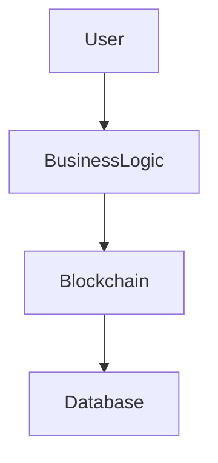
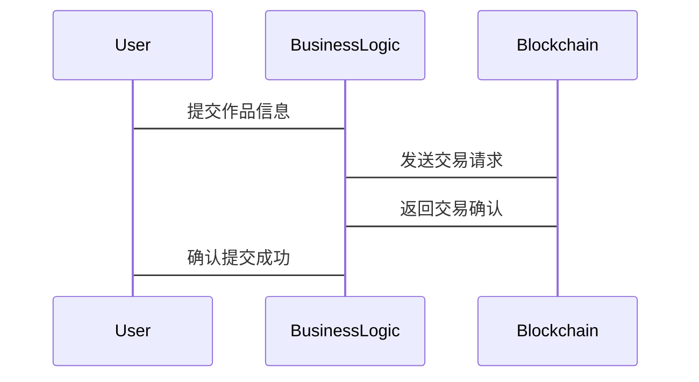

                 


```markdown
# 如何评估企业的区块链版权保护平台

> 关键词：区块链技术、版权保护、智能合约、分布式系统、去中心化

> 摘要：区块链技术为版权保护提供了革命性的解决方案，通过去中心化、不可篡改和透明性等特性，能够有效解决传统版权保护中的痛点。本文将详细探讨如何评估企业中的区块链版权保护平台，涵盖平台的核心概念、算法原理、系统架构设计、项目实战以及最佳实践等方面，帮助读者全面理解并有效评估此类平台。

---

## 第一部分: 区块链版权保护平台的背景与核心概念

### 第1章: 区块链版权保护平台的背景与核心概念

#### 1.1 区块链技术的背景与现状

##### 1.1.1 区块链技术的起源与发展
- 区块链技术起源于比特币的白皮书，最初用于去中心化的数字货币交易。
- 随着技术发展，区块链逐渐扩展到金融、医疗、版权保护等多个领域。
- 当前，区块链技术正朝着高性能、可扩展性和隐私保护的方向演进。

##### 1.1.2 区块链技术的核心特点与优势
| 特性 | 描述 |
|------|------|
| 去中心化 | 无需依赖中心机构，数据分布存储在多个节点 |
| 不可篡改性 | 数据一旦写入区块链，无法被修改 |
| 透明性 | 全网可见，每个交易记录可追溯 |
| 安全性 | 加密算法和共识机制保障数据安全 |

##### 1.1.3 区块链技术在版权保护中的应用潜力
- 解决传统版权保护中盗版、侵权难以追踪的问题。
- 提供作品的唯一性和不可篡改性，保障创作者权益。

#### 1.2 版权保护的痛点与挑战

##### 1.2.1 传统版权保护的局限性
- 中心化机构的依赖导致信任问题。
- 作品的版权归属难以快速验证。
- 版权交易流程繁琐，效率低下。

##### 1.2.2 数字化时代版权保护的新问题
- 数字内容易于复制和传播，增加了盗版风险。
- 版权归属和使用权的界限模糊。

##### 1.2.3 区块链技术如何解决版权保护的核心问题
- 通过区块链的去中心化特性，实现作品的唯一性和不可篡改性。
- 利用智能合约自动执行版权交易和分发，提高效率和透明度。

#### 1.3 区块链版权保护平台的核心概念

##### 1.3.1 区块链版权保护平台的定义
- 区块链版权保护平台是一种基于区块链技术构建的系统，用于作品的登记、确权、交易和保护。

##### 1.3.2 平台的核心功能与服务
- 用户身份认证与权限管理
- 作品登记与版权确权
- 版权交易与分发
- 版权监测与侵权预警

##### 1.3.3 平台的边界与外延
- 平台仅处理版权相关数据，不涉及作品的实际内容存储。
- 可与法律机构、司法系统等外部系统集成，提供法律支持。

---

### 第2章: 区块链版权保护平台的核心要素与系统架构

#### 2.1 核心要素分析

##### 2.1.1 区块链网络的构建
- 区块链网络的选择：公有链、私有链、联盟链。
- 节点分布与网络拓扑设计。

##### 2.1.2 智能合约的实现
- 智能合约的编写与部署。
- 合约的功能：版权登记、授权、交易等。

##### 2.1.3 用户身份认证与权限管理
- 用户身份认证机制：基于钱包地址或第三方身份验证。
- 权限管理：确保用户只能访问其拥有的数据。

##### 2.1.4 版权登记与确权流程
- 作品的哈希值存储：将作品的哈希值写入区块链，确保作品的唯一性和不可篡改性。
- 登记流程：用户提交作品信息，系统生成哈希值并记录在区块链上。

##### 2.1.5 版权交易与分发机制
- 智能合约自动执行交易：当作品被授权使用时，智能合约自动分配收益。
- 分发流程：通过智能合约实现作品的分发和使用权限的授予。

#### 2.2 系统架构设计

##### 2.2.1 分层架构设计
- 用户层：提供用户交互界面。
- 业务逻辑层：处理用户的请求，调用智能合约。
- 数据存储层：存储区块链数据和用户数据。

##### 2.2.2 节点分布与网络拓扑
- 节点分布：主链节点和侧链节点的结合。
- 网络拓扑：星型拓扑、网状拓扑等。

##### 2.2.3 数据存储与检索机制
- 数据存储：区块链节点存储交易数据，数据库存储用户信息。
- 数据检索：通过索引快速检索作品的哈希值和交易记录。

##### 2.2.4 接口设计与交互流程
- API接口设计：RESTful API。
- 交互流程：用户提交作品，系统生成哈希值并记录在区块链上，用户获得唯一标识。

---

### 第3章: 区块链版权保护平台的评估指标与方法

#### 3.1 评估指标体系

##### 3.1.1 平台的安全性评估
- 网络安全性：防止DDoS攻击、节点被篡改等。
- 智能合约的安全性：避免合约漏洞导致的损失。

##### 3.1.2 平台的性能评估
- 交易处理速度：每秒处理交易数（TPS）。
- 响应时间：用户的请求响应时间。

##### 3.1.3 平台的可扩展性评估
- 网络扩展性：支持更多的节点和用户。
- 数据存储扩展性：支持更大的数据量。

##### 3.1.4 平台的用户体验评估
- 界面友好性：用户操作是否简便。
- 交易便捷性：用户是否能快速完成版权登记和交易。

##### 3.1.5 平台的合规性评估
- 是否符合相关法律法规。
- 是否通过第三方认证和审计。

#### 3.2 评估方法与流程

##### 3.2.1 评估前的准备工作
- 明确评估目标和范围。
- 收集相关文档和数据。

##### 3.2.2 平台功能测试与验证
- 功能测试：验证平台是否满足核心功能需求。
- 安全测试：发现并修复安全漏洞。

##### 3.2.3 平台性能测试与优化
- 压力测试：测试平台在高并发情况下的表现。
- 性能优化：通过优化共识机制和数据结构提升性能。

##### 3.2.4 平台安全性测试与漏洞修复
- 漏洞扫描：发现系统漏洞。
- 漏洞修复：修复发现的漏洞，提升系统安全性。

##### 3.2.5 评估结果分析与改进建议
- 分析评估结果，找出存在的问题。
- 提出改进建议，优化平台性能和安全性。

---

### 第4章: 区块链版权保护平台的算法原理与实现

#### 4.1 区块链核心算法解析

##### 4.1.1 共识算法（如PoW、PoS、Dpos）
- 工作量证明（PoW）：通过计算找到哈希值来验证区块。
- 权益证明（PoS）：根据持币数量或时间分配记账权。
- 股票证明（Dpos）：通过选举方式分配记账权。

##### 4.1.2 加密算法（如椭圆曲线加密）
- 椭圆曲线加密：用于生成公私钥对，确保数据的安全性。

##### 4.1.3 智能合约执行机制
- 合约编译：将Solidity代码编译为字节码。
- 合约部署：将字节码部署到区块链上。
- 合约调用：通过交易调用智能合约的方法。

##### 4.1.4 数据存储与分布式一致性算法
- 分布式一致性：确保所有节点的数据一致。
- 数据存储：将数据分散存储在多个节点上，保证数据的高可用性。

#### 4.2 智能合约开发与实现

##### 4.2.1 智能合约的编写规范
- 合约逻辑：确保合约功能正确实现。
- 安全性：防止合约漏洞，确保合约的安全性。

##### 4.2.2 智能合约的实现
- 使用Solidity编写智能合约：实现版权登记、授权、交易等核心功能。
- 合约部署：将智能合约部署到区块链上。
- 合约测试：通过测试用例验证合约功能。

##### 4.2.3 智能合约的优化
- 优化合约逻辑：提升合约执行效率。
- 优化合约安全性：防止合约漏洞。

#### 4.3 数学模型与公式

##### 4.3.1 智能合约的执行流程
1. 用户提交交易请求。
2. 区块链节点接收交易请求。
3. 智能合约执行交易逻辑。
4. 交易结果写入区块链。

##### 4.3.2 共识算法的数学模型
- PoW：找到满足条件的哈希值，概率为 $1/(2^{k})$，其中 $k$ 是目标哈希值的前导零数量。

---

### 第5章: 区块链版权保护平台的系统分析与架构设计

#### 5.1 系统分析

##### 5.1.1 问题场景介绍
- 版权归属不清：作品的版权归属难以验证。
- 侵权监测困难：难以快速发现和处理侵权行为。

##### 5.1.2 项目介绍
- 项目目标：构建一个高效、安全的区块链版权保护平台。
- 项目范围：包括作品登记、确权、交易和保护。

#### 5.2 系统功能设计

##### 5.2.1 领域模型设计
- 用户管理：用户注册、登录、权限管理。
- 作品管理：作品登记、版权信息管理。
- 交易管理：版权交易、收益分配。

##### 5.2.2 系统架构设计
- 分层架构：用户层、业务逻辑层、数据存储层。
- 节点分布：主链节点和侧链节点结合。

#### 5.3 系统架构设计

##### 5.3.1 系统架构图


##### 5.3.2 系统接口设计
- 用户接口：RESTful API。
- 区块链接口：与区块链节点交互的API。

#### 5.4 系统交互流程图

##### 5.4.1 用户提交作品的交互流程


---

### 第6章: 区块链版权保护平台的项目实战

#### 6.1 环境搭建

##### 6.1.1 开发环境搭建
- 安装以太坊钱包：Geth或Remix。
- 安装Solidity编译器：Solidity 0.8.0以上版本。

##### 6.1.2 区块链网络选择
- 私有链：适合内部测试。
- 公有链：适合实际部署。

#### 6.2 核心代码实现

##### 6.2.1 智能合约的部署与测试
- 编写Solidity智能合约：实现版权登记和交易功能。
- 部署智能合约到区块链：使用以太坊钱包或 Remix。
- 测试智能合约：通过交易测试合约功能。

##### 6.2.2 平台功能的实现
- 用户管理功能：用户注册、登录、权限管理。
- 作品管理功能：作品登记、版权信息查询。
- 交易管理功能：版权交易、收益分配。

#### 6.3 案例分析与详细讲解

##### 6.3.1 案例分析
- 某企业使用区块链版权保护平台实现作品登记和交易。
- 平台帮助创作者快速确权，降低侵权风险。

##### 6.3.2 详细讲解
- 平台的运行流程：用户提交作品，系统生成哈希值并记录在区块链上。
- 平台的交易流程：用户授权使用作品，智能合约自动分配收益。

#### 6.4 项目小结

##### 6.4.1 项目总结
- 项目目标实现：构建一个高效、安全的区块链版权保护平台。
- 项目成果：成功实现作品登记、确权、交易功能。

##### 6.4.2 经验总结
- 智能合约的安全性至关重要，需进行全面测试。
- 平台的性能优化需要结合实际需求。

---

### 第7章: 区块链版权保护平台的最佳实践

#### 7.1 最佳实践 tips

##### 7.1.1 平台安全性
- 定期进行安全审计，确保系统安全。
- 防止智能合约漏洞，确保合约的安全性。

##### 7.1.2 平台性能优化
- 优化共识机制，提升交易处理速度。
- 优化数据存储结构，提升数据检索效率。

#### 7.2 小结
- 通过区块链技术，能够有效解决传统版权保护中的痛点。
- 平台的安全性、性能和用户体验是评估平台的重要指标。

#### 7.3 注意事项
- 在实际应用中，需结合具体需求进行平台优化。
- 平台的合规性需符合相关法律法规。

#### 7.4 拓展阅读
- 推荐阅读《区块链开发指南》、《智能合约安全指南》等书籍。
- 关注行业动态，了解最新的区块链技术进展。

---

## 第二部分: 总结与展望

### 第8章: 总结与展望

#### 8.1 总结
- 区块链技术为版权保护提供了革命性的解决方案。
- 通过区块链版权保护平台，能够有效解决传统版权保护中的痛点。

#### 8.2 展望
- 随着技术的发展，区块链版权保护平台将更加智能化、高效化。
- 平台将与更多领域结合，推动数字化时代的版权保护。

---

## 参考文献

1. 区块链技术入门与实战
2. 智能合约开发指南
3. 版权保护的法律与技术结合

---

通过本文的详细讲解，读者可以全面理解如何评估企业的区块链版权保护平台，掌握平台的核心概念、算法原理、系统架构设计和项目实战等内容。希望本文能为相关领域的从业者提供有价值的参考和指导。
```

