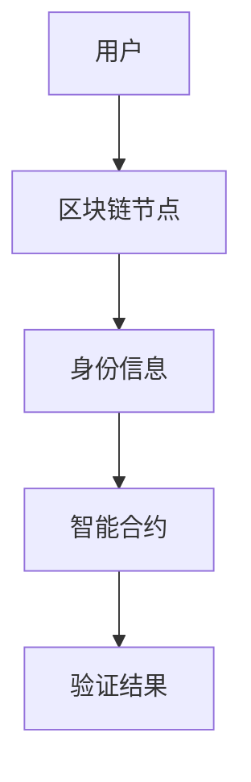
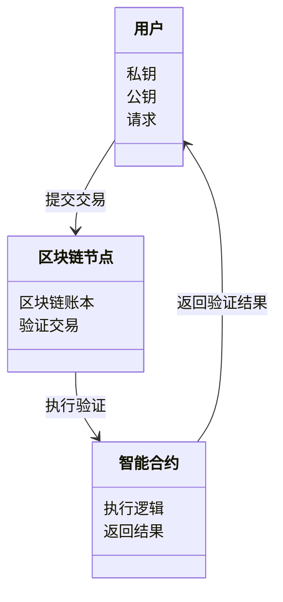
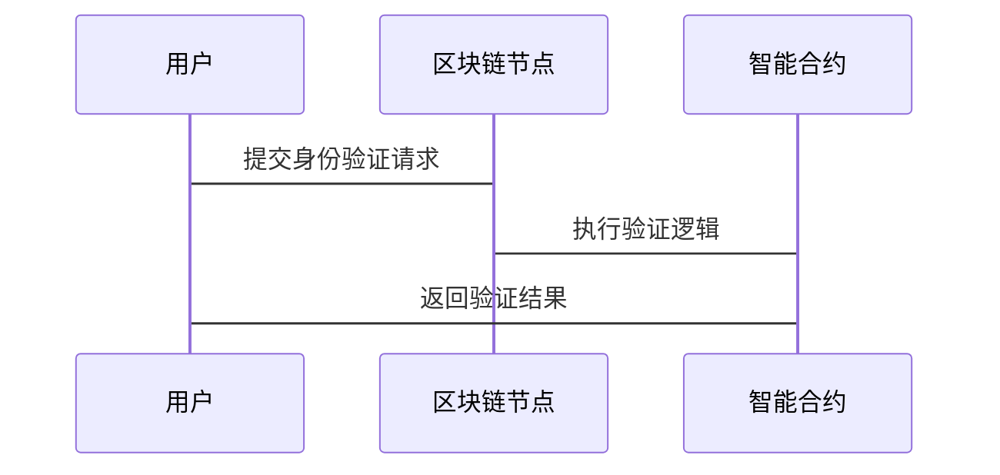

                 


# 如何评估企业的区块链身份验证应用

**关键词**：区块链、身份验证、企业应用、系统评估、技术实现

**摘要**：  
区块链技术的快速发展为企业身份验证应用提供了新的可能性。本文将从区块链的基本概念、身份验证的核心原理出发，深入分析区块链身份验证系统的实现机制、系统架构以及实际应用场景。通过具体案例分析，详细讲解如何评估和选择适合企业需求的区块链身份验证方案，帮助企业更好地应对数字化转型中的身份管理挑战。

---

# 第1章 区块链与身份验证概述

## 1.1 区块链技术的基本概念

### 1.1.1 区块链的定义与核心特点

区块链是一种去中心化的分布式账本技术，通过密码学和共识算法确保数据的安全性和不可篡改性。其核心特点包括：

- **去中心化**：没有单一的控制机构，数据由多个节点共同维护。
- **不可篡改**：通过哈希函数和链式结构，确保数据一旦记录就无法被修改。
- **透明性**：所有交易记录公开透明，但可以通过加密技术保护隐私。
- **去信任化**：通过算法确保各方的信任无需依赖中心机构。

### 1.1.2 区块链的典型应用场景

区块链技术广泛应用于金融、医疗、供应链管理等领域。在身份验证领域，区块链可以用于：

- 数字身份管理
- 联合身份验证
- 零知识证明实现隐私保护

### 1.1.3 区块链在企业身份验证中的潜力

区块链技术能够解决传统身份验证中的痛点，如数据孤岛、隐私泄露和信任问题。通过区块链的去中心化和加密特性，企业可以实现更安全、更高效的数字身份管理。

---

## 1.2 身份验证的基本原理

### 1.2.1 身份验证的定义与分类

身份验证是指通过验证用户身份的真实性来确认其访问权限的过程。常见的身份验证方式包括：

- **知识验证**：基于用户知道的信息，如密码。
- **拥有物验证**：基于用户拥有的物品，如安全令牌。
- **生物特征验证**：基于用户的生理特征，如指纹、面部识别。

### 1.2.2 常见的身份验证方法

传统身份验证方法包括：

- 用户名和密码
- 一次性密码（OTP）
- 多因素认证（MFA）

### 1.2.3 区块链与传统身份验证的区别

区块链身份验证与传统方法的主要区别在于：

- **安全性**：区块链通过去中心化和加密技术提高安全性。
- **隐私性**：区块链支持零知识证明等技术，保护用户隐私。
- **可扩展性**：区块链可以实现跨机构的联合身份验证。

---

## 1.3 区块链身份验证的背景与需求

### 1.3.1 企业身份验证的痛点

传统身份验证方法存在以下问题：

- **数据孤岛**：不同系统之间的身份信息无法共享。
- **隐私泄露**：用户数据可能在传输过程中被窃取。
- **信任依赖**：中心化机构可能成为攻击目标。

### 1.3.2 区块链技术如何解决这些问题

区块链技术通过以下方式解决传统身份验证的痛点：

- **去中心化存储**：避免单点故障和数据泄露。
- **加密签名**：确保数据完整性和真实性。
- **联合验证**：支持跨机构的身份认证。

### 1.3.3 区块链身份验证的市场需求

随着数字化转型的推进，企业对高效、安全的身份验证需求日益增长。区块链技术为企业提供了新的解决方案，尤其是在金融、医疗和供应链管理等领域。

---

# 第2章 区块链身份验证的核心概念与联系

## 2.1 区块链的核心原理

### 2.1.1 区块链的数据结构

区块链由多个区块组成，每个区块包含以下数据：

- **交易记录**：记录用户操作。
- **区块头**：包含哈希值、时间戳和 Merkel 根等信息。
- **链式结构**：通过哈希指针连接前后区块。

### 2.1.2 共识算法的原理

共识算法是区块链的核心机制，常用的算法包括：

- **工作量证明（PoW）**：通过计算哈希值来验证区块。
- **权益证明（PoS）**：基于持币者的权益分配记账权。
- **拜占庭容错（BFT）**：通过投票机制达成共识。

### 2.1.3 智能合约的执行机制

智能合约是区块链上的自动执行程序，用于实现特定的业务逻辑。它们通过区块链的虚拟机（如 Ethereum 的 EVM）进行编译和执行。

---

## 2.2 身份验证在区块链中的实现方式

### 2.2.1 基于区块链的数字身份

数字身份存储在区块链上，通过公钥和私钥对进行身份验证。用户可以通过私钥签名交易，系统通过公钥验证签名。

### 2.2.2 基于零知识证明的身份验证

零知识证明（ZKP）是一种密码学技术，允许一方证明自己拥有某些信息，而无需泄露信息本身。在身份验证中，用户可以通过零知识证明验证身份，而不必透露真实信息。

### 2.2.3 联合身份验证的实现

联合身份验证允许用户在不同系统间共享身份信息。区块链可以通过跨链技术实现多个区块链之间的身份验证。

---

## 2.3 区块链身份验证的核心要素对比

### 2.3.1 核心概念属性对比表

| 特性         | 传统身份验证 | 区块链身份验证 |
|--------------|--------------|----------------|
| 数据存储     | 中心化       | 去中心化       |
| 安全性       | 依赖中心机构 | 基于密码学     |
| 隐私性       | 易泄露       | 支持零知识证明 |
| 可扩展性     | 有限         | 跨机构支持     |

### 2.3.2 ER实体关系图（Mermaid流程图）



---

# 第3章 区块链身份验证的算法原理

## 3.1 区块链身份验证的算法框架

### 3.1.1 区块链身份验证的基本流程

1. 用户发起身份验证请求。
2. 区块链节点验证用户身份。
3. 智能合约执行验证逻辑。
4. 返回验证结果。

### 3.1.2 身份验证的数学模型

身份验证的数学模型可以用以下公式表示：

$$ \text{验证结果} = f(\text{用户输入}, \text{公钥}) $$

其中，$f$ 是验证算法，$\text{用户输入}$ 是用户的请求，$\text{公钥}$ 是用户的公钥。

### 3.1.3 算法的复杂度分析

区块链身份验证的复杂度主要取决于共识算法和智能合约的执行效率。常见的复杂度分析包括：

- 时间复杂度：$O(n)$，其中 $n$ 是区块验证的次数。
- 空间复杂度：$O(m)$，其中 $m$ 是存储的交易数量。

---

## 3.2 基于哈希函数的身份验证

### 3.2.1 哈希函数的定义与特点

哈希函数将输入数据映射为固定长度的输出值，具有以下特点：

- **唯一性**：不同的输入得到不同的输出。
- **快速计算**：哈希值可以在较短的时间内计算出来。
- **抗碰撞**：难以找到两个不同的输入具有相同的哈希值。

### 3.2.2 哈希函数在身份验证中的应用

在区块链身份验证中，哈希函数用于验证数据的完整性和一致性。例如，用户通过私钥签名交易，系统通过公钥验证签名。

### 3.2.3 示例代码实现

以下是一个基于哈希函数的身份验证示例代码：

```python
import hashlib

def compute_hash(data):
    return hashlib.sha256(data.encode()).hexdigest()

# 用户输入
user_input = "example"
# 计算哈希值
hash_value = compute_hash(user_input)
print(hash_value)
```

---

## 3.3 基于零知识证明的算法实现

### 3.3.1 零知识证明的数学原理

零知识证明通过以下步骤实现：

1. **承诺**：用户向验证方发送一个随机值。
2. **挑战**：验证方生成一个挑战。
3. **证明**：用户通过挑战生成一个响应，证明自己拥有秘密值。

### 3.3.2 zk-SNARKs算法的实现步骤

zk-SNARKs是一种零知识证明算法，其实现步骤包括：

1. **生成参数**：通过参数生成过程创建公共参数。
2. **生成证明**：用户生成零知识证明。
3. **验证证明**：验证方验证证明的有效性。

### 3.3.3 算法的优缺点分析

- **优点**：保护用户隐私，实现无泄露的身份验证。
- **缺点**：计算复杂度较高，可能影响性能。

---

## 3.4 本章小结

区块链身份验证的算法实现依赖于哈希函数和零知识证明等技术。通过合理的算法选择和优化，可以实现高效、安全的身份验证。

---

# 第4章 区块链身份验证系统的分析与设计

## 4.1 系统分析与需求定义

### 4.1.1 问题场景描述

企业在身份验证中面临以下问题：

- 数据孤岛：不同系统无法共享身份信息。
- 隐私泄露：用户数据可能被窃取。
- 信任依赖：中心化机构容易成为攻击目标。

### 4.1.2 项目目标与范围

项目目标包括：

- 实现去中心化的身份验证系统。
- 支持零知识证明，保护用户隐私。
- 提供高效的跨机构身份验证。

### 4.1.3 用户角色与权限分配

用户角色包括：

- 用户：发起身份验证请求。
- 区块链节点：验证交易并维护区块链。
- 管理员：管理智能合约和系统配置。

---

## 4.2 系统功能设计

### 4.2.1 领域模型（Mermaid 类图）



### 4.2.2 系统架构设计（Mermaid 架构图）


### 4.2.3 系统接口设计

系统接口包括：

- 用户发起身份验证请求接口。
- 区块链节点验证交易接口。
- 智能合约执行验证逻辑接口。

### 4.2.4 系统交互流程（Mermaid 序列图）



---

## 4.3 本章小结

通过系统分析与设计，我们可以清晰地了解区块链身份验证系统的结构和交互流程。合理的架构设计能够提高系统的安全性和可扩展性。

---

# 第5章 区块链身份验证的项目实战

## 5.1 项目环境安装

### 5.1.1 安装区块链框架

选择一个适合的区块链框架，例如 Ethereum 或 Fabric。

### 5.1.2 安装相关工具

安装必要的开发工具，如 Ganache（用于 Ethereum 开发）或 Composer（用于 Fabric 开发）。

### 5.1.3 安装依赖库

安装所需的依赖库，例如 Web3.py（用于 Ethereum 开发）。

---

## 5.2 系统核心实现

### 5.2.1 智能合约实现

以下是一个简单的身份验证智能合约示例：

```solidity
// SPDX-License-Identifier: MIT
pragma solidity ^0.8.0;

contract IdentityVerification {
    mapping(address => bool) public verifiedUsers;

    function verify(address user) public {
        verifiedUsers[user] = true;
    }
}
```

### 5.2.2 后端接口实现

以下是一个后端接口实现示例：

```python
from flask import Flask, request
import web3

app = Flask(__name__)
web3 = web3.Web3(web3.HTTPProvider("http://localhost:8545"))

@app.route('/verify', methods=['POST'])
def verify():
    user = request.form['user']
    contract_address = '0x...'
    contract = web3.eth.contract(address=contract_address, abi=...)
    tx_hash = contract.functions.verify(user).transact()
    return f"Verification transaction hash: {tx_hash}"
```

---

## 5.3 代码应用解读与分析

### 5.3.1 智能合约解读

智能合约通过区块链节点进行验证和执行。合约中的 `verify` 函数用于标记用户为已验证。

### 5.3.2 后端接口解读

后端接口通过 Flask 框架接收用户请求，调用智能合约进行身份验证，并返回结果。

---

## 5.4 实际案例分析

### 5.4.1 案例背景

假设我们为一家金融企业开发区块链身份验证系统。

### 5.4.2 案例分析

通过区块链技术实现客户的身份验证，客户可以在多个分支机构之间共享身份信息，而无需重复验证。

---

## 5.5 项目小结

通过项目实战，我们可以深入了解区块链身份验证系统的实现细节。实际案例分析有助于我们更好地理解技术在企业中的应用。

---

# 第6章 最佳实践、小结与展望

## 6.1 最佳实践 tips

- 选择适合的区块链框架，确保系统的可扩展性和性能。
- 合理设计智能合约，避免逻辑漏洞。
- 定期进行安全审计，确保系统的安全性。

## 6.2 小结

本文从区块链和身份验证的基本概念出发，详细分析了区块链身份验证系统的实现机制和系统架构。通过实际案例分析，帮助读者更好地理解技术的应用。

## 6.3 展望

随着区块链技术的不断发展，企业身份验证应用将更加智能化和高效。未来，我们可以期待更多基于区块链的身份验证解决方案。

---

# 附录

## 附录 A 区块链相关工具与资源

- Ethereum：[https://ethereum.org/](https://ethereum.org/)
- Fabric：[https://hyperledger-fabric.readthedocs.io/en/latest/](https://hyperledger-fabric.readthedocs.io/en/latest/)

## 附录 B 术语表

- 区块链：一种去中心化的分布式账本技术。
- 智能合约：区块链上的自动执行程序。
- 零知识证明：一种密码学技术，允许一方证明自己拥有某些信息，而无需透露信息本身。

---

# 结束语

通过本文的详细讲解，读者可以全面了解如何评估和实施区块链身份验证应用。希望本文能够为企业在数字化转型中的身份管理提供有价值的参考。

