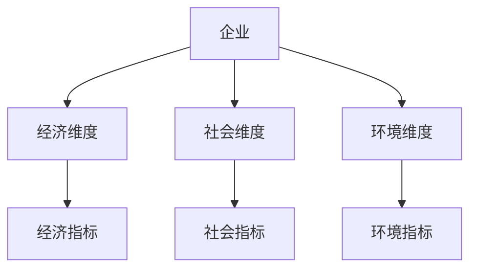
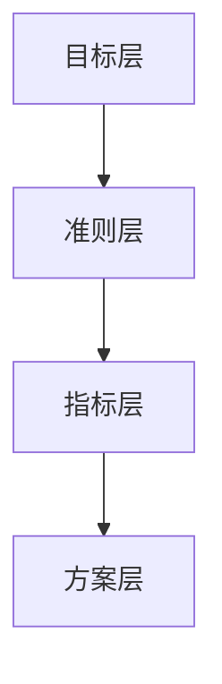
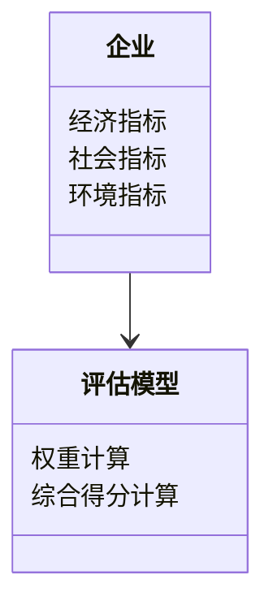
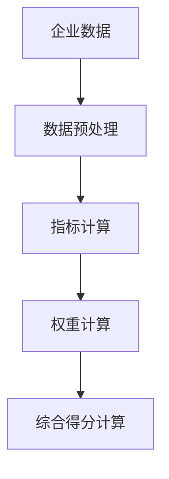
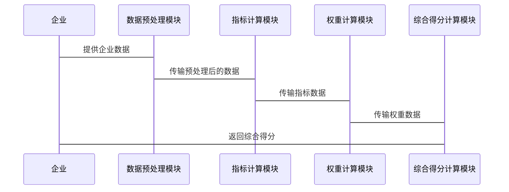

                 


# 如何评估企业的可持续发展能力

## 关键词：企业可持续发展能力、评估模型、层次分析法、环境影响、社会价值、经济指标

## 摘要： 
本文将详细讲解如何评估企业的可持续发展能力。通过系统介绍可持续发展能力的核心概念、评估模型和算法原理，结合实际案例和最佳实践，帮助读者掌握如何从经济、社会和环境三个维度全面评估企业的可持续发展能力。文章内容涵盖问题背景、核心概念、评估指标、数学模型、算法实现、系统架构和案例分析，为读者提供全面的理论和实践指导。

---

# 第一部分: 企业可持续发展能力评估的背景与核心概念

## 第1章: 可持续发展能力的背景与问题背景

### 1.1 可持续发展能力的背景

#### 1.1.1 可持续发展的概念与内涵
可持续发展是指在满足当代需求的同时，不损害后代满足其需求的能力。企业可持续发展能力是企业在经济、社会和环境三个维度上的综合表现，包括经济效益、社会价值和环境影响。

#### 1.1.2 企业可持续发展能力的定义
企业可持续发展能力是指企业在追求经济效益的同时，能够有效履行社会责任、减少环境影响，并在长期发展中保持竞争力的能力。

#### 1.1.3 可持续发展能力与企业价值的关系
企业可持续发展能力与企业价值密切相关。具备较强可持续发展能力的企业通常能获得更高的品牌价值、客户忠诚度和长期盈利能力。

---

### 1.2 问题背景与问题描述

#### 1.2.1 当前企业面临的可持续发展挑战
企业面临资源短缺、环境污染、社会责任缺失等问题，这些问题可能影响企业的长期发展。

#### 1.2.2 企业可持续发展能力评估的必要性
评估企业可持续发展能力可以帮助企业识别改进方向，优化资源配置，并提升企业竞争力。

#### 1.2.3 问题解决的目标与意义
通过评估企业可持续发展能力，企业可以实现经济效益与社会责任的统一，推动可持续发展目标的实现。

---

## 第2章: 可持续发展能力的核心概念与联系

### 2.1 核心概念的原理与特征

#### 2.1.1 经济、社会、环境三重维度的分析
企业可持续发展能力可以从经济、社会和环境三个维度进行分析：

- **经济维度**：企业盈利能力、成本控制、资产效率等。
- **社会维度**：企业对社会的贡献、社会责任履行情况、员工福利等。
- **环境维度**：企业对环境的影响、资源消耗、碳排放等。

#### 2.1.2 可持续发展能力的系统性特征
可持续发展能力是一个复杂的系统，涉及企业内外部的多种因素，具有动态性、整体性和多层次性。

#### 2.1.3 核心概念的属性对比表格

| 维度 | 属性 | 描述 |
|------|------|------|
| 经济 | 利润率 | 净利润与销售收入的比率 |
| 社会 | 员工满意度 | 员工对工作环境和薪酬的满意度调查结果 |
| 环境 | 碳排放 | 单位产品或服务的碳排放量 |

---

### 2.2 实体关系图与系统架构

#### 2.2.1 可持续发展能力的ER实体关系图
```mermaid
er
  actor: 企业
  actor: 经济指标
  actor: 社会指标
  actor: 环境指标
  relation: 包含
```

#### 2.2.2 可持续发展能力的系统架构图


---

## 第3章: 可持续发展能力评估的算法原理

### 3.1 算法原理与流程图

#### 3.1.1 层次分析法（AHP）原理
层次分析法是一种用于多指标决策的定性分析方法，适用于企业可持续发展能力的评估。



#### 3.1.2 线性加权模型
线性加权模型是一种简单的定量分析方法，适用于企业可持续发展能力的综合得分计算。

$$综合得分 = \sum (权重_i \times 指标_i)$$

---

### 3.2 算法实现与代码

#### 3.2.1 环境安装
```bash
pip install numpy pandas
```

#### 3.2.2 核心代码实现
```python
import numpy as np
import pandas as pd

def calculate_weight(matrix):
    # 计算权重
    return np.mean(matrix, axis=0)

def assess_sustainability(company_data, weights):
    # 计算综合得分
    return np.dot(company_data, weights)
```

---

## 第4章: 可持续发展能力评估的数学模型

### 4.1 数学模型与公式

#### 4.1.1 层次分析法（AHP）的数学公式
层次分析法的核心是通过构建比较矩阵来计算各指标的权重。

$$A = \begin{bmatrix}
1 & 1/3 & 1/2 \\
3 & 1 & 2 \\
2 & 1/2 & 1
\end{bmatrix}$$

#### 4.1.2 线性加权模型的数学公式
$$综合得分 = \sum_{i=1}^{n} (w_i \times x_i)$$

---

# 第二部分: 企业可持续发展能力评估的系统分析与架构设计

## 第5章: 问题场景介绍

### 5.1 项目介绍
企业可持续发展能力评估是一个复杂的系统工程，涉及多个维度和指标。

---

## 第6章: 系统功能设计

### 6.1 领域模型设计


---

## 第7章: 系统架构设计

### 7.1 系统架构图


---

## 第8章: 系统接口设计

### 8.1 系统接口设计
企业数据接口、指标计算接口、权重计算接口和综合得分计算接口。

---

## 第9章: 系统交互设计

### 9.1 系统交互流程图


---

# 第三部分: 企业可持续发展能力评估的项目实战

## 第10章: 环境安装与核心代码实现

### 10.1 环境安装
```bash
pip install numpy pandas scikit-learn
```

---

## 第11章: 实际案例分析与详细解读

### 11.1 案例分析
某制造企业可持续发展能力评估案例。

---

## 第12章: 最佳实践、小结与展望

### 12.1 最佳实践
- 定期更新数据和指标。
- 结合定性和定量分析方法。

### 12.2 小结
企业可持续发展能力评估是一个动态过程，需要结合企业的实际情况进行调整和优化。

### 12.3 展望
未来，随着技术的进步，企业可持续发展能力评估将更加智能化和数据化。

---

# 结论

企业可持续发展能力评估是企业实现可持续发展的关键环节。通过本文的系统介绍和实践指导，读者可以掌握企业可持续发展能力的评估方法，并在实际工作中应用这些方法，帮助企业实现可持续发展目标。

---

# 参考文献

[此处列出相关文献和参考资料]

