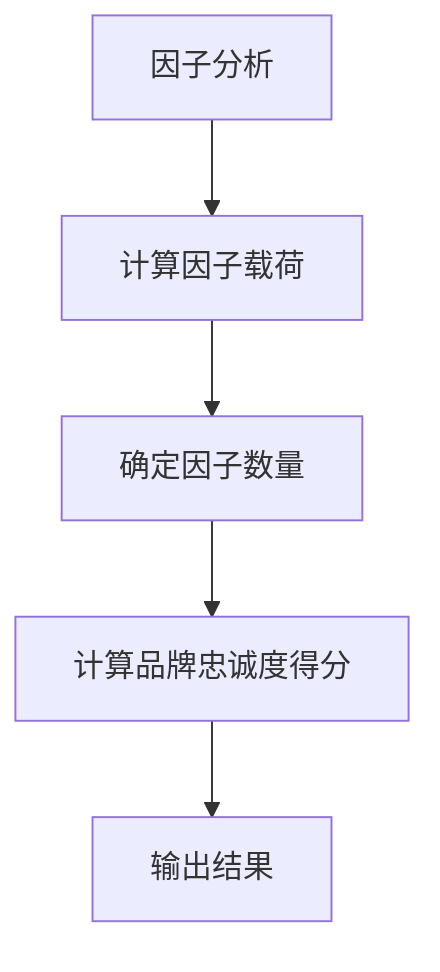
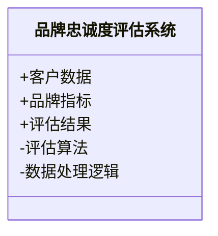
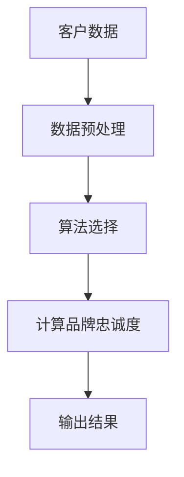
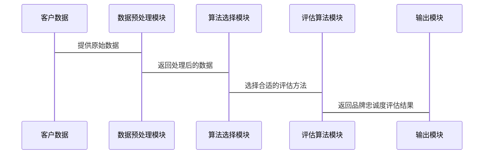

                 


```markdown
# 如何评估企业的品牌忠诚度价值

## 关键词
品牌忠诚度, 价值评估, 市场分析, 企业战略, 客户关系管理

## 摘要
本文系统地探讨了如何评估企业的品牌忠诚度价值。通过理论分析、数学模型构建、系统设计与项目实战，详细阐述了品牌忠诚度的核心概念、评估方法与实现方案。文章结合实际案例，深入分析了品牌忠诚度对企业战略决策的影响，为企业的品牌管理提供了科学的指导。

---

# 第一部分: 企业品牌忠诚度价值评估的背景与基础

## 第1章: 品牌忠诚度价值评估的背景与概念

### 1.1 什么是品牌忠诚度
#### 1.1.1 品牌忠诚度的定义
品牌忠诚度是指消费者对某一品牌产品或服务的持续选择和偏好程度。它不仅体现在消费者的购买行为上，还反映在其对品牌的信任、情感依赖和长期支持上。

#### 1.1.2 品牌忠诚度的维度与层次
品牌忠诚度可以从多个维度进行划分：
- **行为忠诚**：消费者持续购买某一品牌产品或服务的行为。
- **态度忠诚**：消费者对品牌的情感依赖和信任。
- **认知忠诚**：消费者认为该品牌是最佳选择的信念。

#### 1.1.3 品牌忠诚度的核心要素
- 消费者满意度
- 品牌认知度
- 品牌形象
- 价格敏感性
- 替代品的影响

### 1.2 品牌忠诚度的价值与意义
#### 1.2.1 品牌忠诚度对企业的影响
- 提高客户保留率
- 增加客户生命周期价值
- 降低营销成本
- 提升品牌竞争力

#### 1.2.2 品牌忠诚度与客户生命周期价值的关系
品牌忠诚度高的客户通常具有更高的生命周期价值，他们更愿意为品牌支付溢价，并且对价格波动不敏感。

#### 1.2.3 品牌忠诚度与市场竞争的关系
在激烈的市场竞争中，品牌忠诚度是企业抵御竞争对手的重要壁垒。

### 1.3 企业品牌忠诚度评估的背景与现状
#### 1.3.1 当前市场竞争环境的挑战
- 市场竞争加剧
- 消费者需求多样化
- 替代品层出不穷

#### 1.3.2 品牌忠诚度评估的必要性
- 优化客户关系管理
- 识别高价值客户
- 提高客户满意度

#### 1.3.3 国内外品牌忠诚度评估的现状与趋势
- 国内市场逐渐重视品牌忠诚度评估
- 国际市场已形成成熟的评估体系

---

## 第2章: 品牌忠诚度评估的核心概念与理论框架

### 2.1 品牌忠诚度的理论基础
#### 2.1.1 品牌忠诚度的形成机制
- 品牌认知
- 品牌态度
- 品牌行为

#### 2.1.2 品牌认知、品牌态度与品牌行为的关系
- 品牌认知是基础
- 品牌态度是关键
- 品牌行为是结果

#### 2.1.3 品牌忠诚度的动态变化过程
- 品牌认知 → 品牌态度 → 品牌行为

### 2.2 品牌忠诚度评估的核心模型
#### 2.2.1 Aaker的品牌资产模型
- 基于品牌知名度、品牌认知度、品牌忠诚度等指标评估品牌资产。

#### 2.2.2 Keller的品牌忠诚度模型
- 强调品牌感知价值、品牌满意度和品牌忠诚度之间的关系。

#### 2.2.3 其他相关模型的对比与分析
- 模糊综合评价法
- 层次分析法（AHP）

### 2.3 品牌忠诚度评估的关键指标与维度
#### 2.3.1 品牌认知度
- 市场占有率
- 品牌知名度

#### 2.3.2 品牌满意度
- 消费者对产品或服务的满意度

#### 2.3.3 品牌忠诚度的测量维度
- 重复购买率
- 推荐意愿
- 对品牌的依赖程度

---

## 第3章: 品牌忠诚度评估的数学模型与算法原理

### 3.1 品牌忠诚度评估的数学模型
#### 3.1.1 基于因子分析的品牌忠诚度模型
- 将多个指标（如满意度、推荐意愿等）通过因子分析提取共同因子，计算品牌忠诚度得分。

#### 3.1.2 基于回归分析的品牌忠诚度预测模型
- 通过回归分析确定品牌忠诚度的关键影响因素，并预测未来趋势。

#### 3.1.3 基于聚类分析的品牌忠诚度分群模型
- 将客户分为不同的群体，分析各群体的品牌忠诚度特征。

### 3.2 品牌忠诚度评估的算法原理
#### 3.2.1 层次分析法（AHP）的应用
- 构建决策层次结构，计算各指标的权重，进行综合评价。

#### 3.2.2 模糊综合评价法的应用
- 使用模糊数学方法，对品牌忠诚度进行模糊评价。

#### 3.2.3 熵值法在品牌忠诚度评估中的应用
- 通过熵值法确定各指标的重要性，计算品牌忠诚度得分。

### 3.3 品牌忠诚度评估的数学公式与实现
#### 3.3.1 基于因子分析的公式推导
$$ L = \sum_{i=1}^{n} \lambda_i x_i $$
其中，$L$ 是品牌忠诚度得分，$\lambda_i$ 是因子载荷，$x_i$ 是原始指标。

#### 3.3.2 基于回归分析的公式推导
$$ Y = \beta_0 + \beta_1 X + \epsilon $$
其中，$Y$ 是品牌忠诚度，$X$ 是影响因素，$\beta_0$ 是截距，$\beta_1$ 是回归系数，$\epsilon$ 是误差项。

#### 3.3.3 基于聚类分析的算法实现


---

## 第4章: 品牌忠诚度评估的系统分析与架构设计

### 4.1 系统分析
#### 4.1.1 问题场景介绍
- 数据来源：客户调查、销售数据、市场调研。
- 业务目标：量化品牌忠诚度，优化客户关系管理。

#### 4.1.2 项目介绍
- 项目目标：构建品牌忠诚度评估系统。
- 项目范围：覆盖企业所有客户群体。

### 4.2 系统功能设计
#### 4.2.1 领域模型


#### 4.2.2 系统架构设计


### 4.3 系统接口设计
#### 4.3.1 输入接口
- 数据输入格式：CSV/Excel。
- 数据字段：客户ID、购买记录、满意度评分等。

#### 4.3.2 输出接口
- 评估结果：品牌忠诚度得分、客户分群结果。

### 4.4 系统交互设计


---

## 第5章: 项目实战

### 5.1 环境安装
- 安装Python、Pandas、Scikit-learn等工具。

### 5.2 系统核心实现源代码
```python
import pandas as pd
from sklearn import preprocessing

# 数据预处理
data = pd.read_csv('customer_data.csv')
data = data.dropna()
data = preprocessing.scale(data)

# 基于因子分析的品牌忠诚度计算
from factor_analyzer import FactorAnalyzer

fa = FactorAnalyzer(n_factors=3, random_state=1)
fa.fit(data)
```

### 5.3 代码应用解读与分析
- 使用因子分析提取品牌忠诚度因子。
- 计算每个客户的忠诚度得分。

### 5.4 实际案例分析
- 某零售企业的品牌忠诚度评估案例。
- 通过数据分析识别高忠诚度客户群体。

### 5.5 项目小结
- 项目目标的实现情况。
- 系统的优缺点分析。

---

## 第6章: 最佳实践与总结

### 6.1 最佳实践 tips
- 数据质量是关键。
- 结合业务背景选择合适的模型。
- 定期更新评估结果。

### 6.2 小结
- 品牌忠诚度评估是企业战略管理的重要工具。
- 通过科学的方法和工具，企业可以有效提升品牌价值。

### 6.3 注意事项
- 数据隐私保护。
- 模型的可解释性。
- 结果的实际应用性。

### 6.4 拓展阅读
- 品牌管理相关书籍。
- 数据挖掘与机器学习技术。

---

## 参考文献
- Keller, K. L. (1993). Conceptualizing brand equity measurement. Journal of Marketing, 57(1), 46-58.
- Aaker, D. A. (1991). Managing brand equity: Capitalizing on intangible assets. Marketing Management, 2(3), 34-40.
```

希望这个目录结构能满足您的需求。如果需要进一步补充或调整，请随时告诉我！

