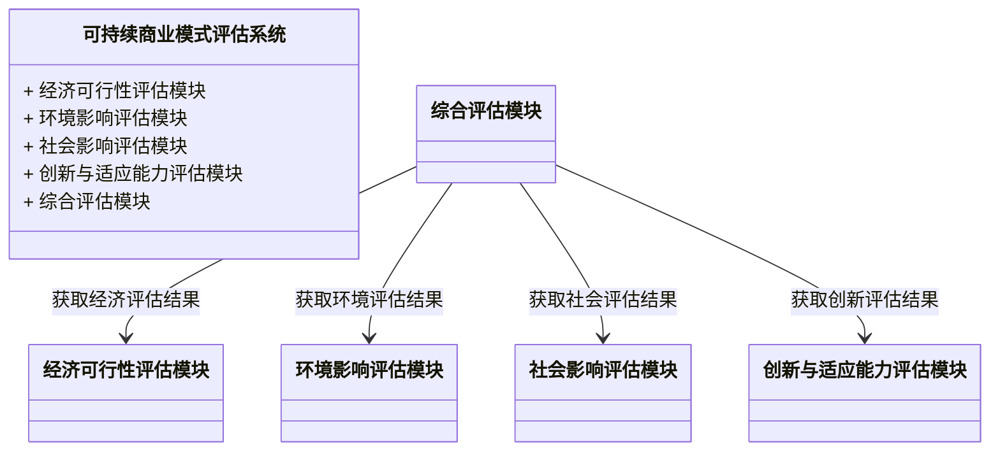

                 


# 如何评估企业的商业模式可持续性

## 关键词：企业商业模式，可持续性评估，经济可行性，环境影响，社会影响，创新与适应能力

## 摘要：  
企业商业模式的可持续性评估是企业在当今复杂多变的商业环境中确保长期成功的关键。本文从核心概念、评估方法、系统分析和实际案例等多维度，深入探讨如何科学地评估企业商业模式的可持续性。通过分析经济、环境、社会和创新四个维度，结合实际案例和系统架构设计，为企业提供切实可行的评估框架和实践指南。

---

## 第一部分: 可持续商业模式评估的背景与核心概念

### 第1章: 可持续商业模式的基本概念

#### 1.1 可持续商业模式的定义与特征
##### 1.1.1 可持续商业模式的定义
可持续商业模式是指企业在追求经济效益的同时，兼顾环境和社会价值的商业运作模式。它强调在满足客户需求、创造经济价值的同时，减少对环境的负面影响，并促进社会福祉。

##### 1.1.2 可持续商业模式的核心特征
- **经济可行性**：确保商业模式能够产生稳定的经济回报。
- **环境友好性**：减少资源消耗和环境污染。
- **社会价值**：提升社会福祉，满足客户需求。
- **创新与适应性**：能够根据市场变化快速调整。

##### 1.1.3 可持续商业模式与传统商业模式的区别
| **维度**       | **传统商业模式**                     | **可持续商业模式**                   |
|----------------|------------------------------------|------------------------------------|
| 价值创造       | 仅关注经济利益                     | 综合考虑经济、环境和社会价值       |
| 资源利用       | 追求短期利益最大化                 | 追求长期资源高效利用               |
| 利益相关者     | 仅关注股东利益                     | 关注股东、客户、员工、环境和社会利益 |
| 创新与适应性   | 有限的创新                        | 强调持续创新和灵活性               |

#### 1.2 企业商业模式可持续性评估的背景与意义
##### 1.2.1 当前企业面临的可持续性挑战
- 环境问题日益严重，如气候变化、资源枯竭。
- 社会问题，如不平等、员工权益保护不足。
- 企业声誉风险，如社会责任缺失导致的信任危机。

##### 1.2.2 可持续商业模式对企业发展的战略意义
- 提升企业竞争力，吸引注重可持续性的客户和投资者。
- 降低经营风险，适应政策和市场变化。
- 建立长期稳定的合作伙伴关系。

##### 1.2.3 企业利益相关者对可持续性的期望
- **客户**：期望企业提供环保、社会责任强的产品和服务。
- **投资者**：关注企业的长期价值和可持续发展能力。
- **员工**：希望企业尊重员工权益，提供良好的工作环境。
- **政府**：要求企业遵守环保法规，推动社会进步。

#### 1.3 可持续商业模式的边界与外延
##### 1.3.1 可持续商业模式的边界
- 企业的业务范围和资源限制。
- 利益相关者的期望和需求。
- 社会和环境的承受能力。

##### 1.3.2 可持续商业模式的外延
- 从核心业务扩展到社会责任。
- 从本地市场扩展到全球化视角。
- 从单一维度扩展到多维度综合评估。

##### 1.3.3 可持续商业模式与企业战略的关系
可持续商业模式是企业战略的重要组成部分，它不仅影响企业的短期目标，还决定了企业的长期发展方向。

#### 1.4 可持续商业模式的核心要素
##### 1.4.1 价值主张
- 提供的产品或服务必须满足客户需求，同时具有可持续性。
- 例如，提供环保产品或绿色服务。

##### 1.4.2 客户关系
- 建立长期、信任的客户关系。
- 通过透明的沟通和优质服务增强客户忠诚度。

##### 1.4.3 资源分配与利益平衡
- 合理分配资源，确保经济、环境和社会利益的平衡。
- 例如，减少能源消耗、优化供应链。

##### 1.4.4 可持续性目标与绩效指标
- 设定明确的可持续性目标，如减少碳排放、提高员工满意度。
- 使用KPI（关键绩效指标）进行定期评估。

---

## 第二部分: 可持续商业模式评估的核心概念与联系

### 第2章: 可持续商业模式的核心概念与联系

#### 2.1 可持续商业模式的核心原理
##### 2.1.1 经济可行性
- 企业的商业模式必须能够产生稳定的经济回报。
- 例如，通过成本控制和技术创新提高盈利能力。

##### 2.1.2 环境影响
- 评估商业模式对环境的影响，减少资源消耗和污染。
- 例如，采用循环经济模式，减少废弃物产生。

##### 2.1.3 社会影响
- 评估商业模式对社会的积极影响，如创造就业、促进公平。
- 例如，支持社区发展和员工福利。

##### 2.1.4 创新与适应能力
- 企业的商业模式必须具备灵活性，能够适应市场变化。
- 例如，通过数字化转型提高效率。

#### 2.2 可持续商业模式的属性特征对比
| **属性**       | **传统商业模式**                     | **可持续商业模式**                   |
|----------------|------------------------------------|------------------------------------|
| 经济目标       | 追求利润最大化                     | 追求利润与社会价值平衡             |
| 资源利用       | 高资源消耗                         | 高效利用资源，减少浪费             |
| 社会责任       | 无或有限的社会责任                 | 强调社会责任，关注社会福祉           |
| 创新能力       | 创新能力有限                       | 强调持续创新，适应变化             |

#### 2.3 可持续商业模式的ER实体关系图
```mermaid
erDiagram
  actor 顾客
  actor 投资者
  actor 员工
  actor 政府
  actor 社会
  actor 竞争对手
  entity 企业
  entity 产品
  entity 服务
  entity 资源
  entity 利润
  entity 环境影响
  entity 社会影响

  顾客 --> 企业 : 购买产品或服务
  投资者 --> 企业 : 投资
  员工 --> 企业 : 提供劳动力
  政府 --> 企业 : 制定政策
  社会 --> 企业 : 提供支持
  竞争对手 --> 企业 : 市场竞争
  企业 --> 产品 : 提供产品
  企业 --> 服务 : 提供服务
  企业 --> 资源 : 使用资源
  企业 --> 利润 : 产生利润
  企业 --> 环境影响 : 产生环境影响
  企业 --> 社会影响 : 产生社会影响
```

---

## 第三部分: 可持续商业模式评估的系统分析与架构设计

### 第3章: 可持续商业模式评估的系统分析与架构设计

#### 3.1 系统分析
##### 3.1.1 问题场景介绍
- 企业需要评估其商业模式的可持续性。
- 通过系统分析，明确各组成部分的相互关系。

##### 3.1.2 项目介绍
- 项目目标：评估企业商业模式的可持续性。
- 项目范围：经济、环境、社会和创新四个维度。

##### 3.1.3 系统功能设计


##### 3.1.4 系统架构设计


---

## 第四部分: 可持续商业模式评估的项目实战

### 第4章: 可持续商业模式评估的项目实战

#### 4.1 环境影响评估
##### 4.1.1 环境影响评估的步骤
1. 确定企业资源消耗情况。
2. 评估企业对环境的影响，如碳排放、废弃物产生。
3. 制定减少环境影响的措施。

##### 4.1.2 环境影响评估的实际案例
- 某制造企业通过优化生产流程，减少能源消耗，降低碳排放。

#### 4.2 社会影响评估
##### 4.2.1 社会影响评估的步骤
1. 确定企业对社会的影响，如就业机会、员工福利。
2. 评估企业的社会责任履行情况。
3. 制定提升社会影响的具体措施。

##### 4.2.2 社会影响评估的实际案例
- 某科技公司通过支持员工培训，提升员工技能，促进社会公平。

#### 4.3 创新与适应能力评估
##### 4.3.1 创新与适应能力评估的步骤
1. 评估企业的创新能力，如研发投入、新产品开发。
2. 评估企业的适应能力，如市场变化应对能力。
3. 制定增强创新与适应能力的策略。

##### 4.3.2 创新与适应能力评估的实际案例
- 某互联网公司通过数字化转型，提高效率，适应市场变化。

---

## 第五部分: 可持续商业模式评估的最佳实践与小结

### 第5章: 最佳实践与小结

#### 5.1 最佳实践
##### 5.1.1 工具与方法的选择
- 使用平衡积分卡（BSC）进行综合评估。
- 采用生命周期评估（LCA）分析环境影响。

##### 5.1.2 持续改进的策略
- 定期评估商业模式的可持续性。
- 根据评估结果调整策略。

#### 5.2 小结
- 可持续商业模式评估是企业在复杂环境中确保长期成功的关键。
- 通过系统分析和实际案例分析，企业可以制定切实可行的可持续发展战略。
- 持续改进和创新是确保商业模式可持续性的关键。

---

## 附录: 可持续商业模式评估工具与资源

- **工具推荐**：平衡积分卡（BSC）、生命周期评估（LCA）。
- **资源推荐**：联合国全球契约（UNGC）、可持续发展报告指南（GRI）。

---

## 结语
评估企业的商业模式可持续性是一个复杂但至关重要的任务。通过系统分析、实际案例和持续改进，企业可以制定出切实可行的可持续发展战略，实现长期成功。

