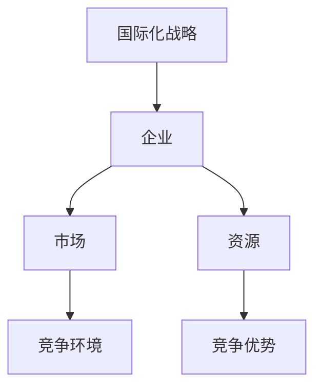
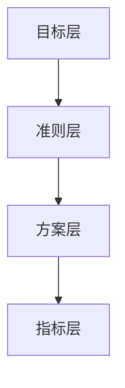
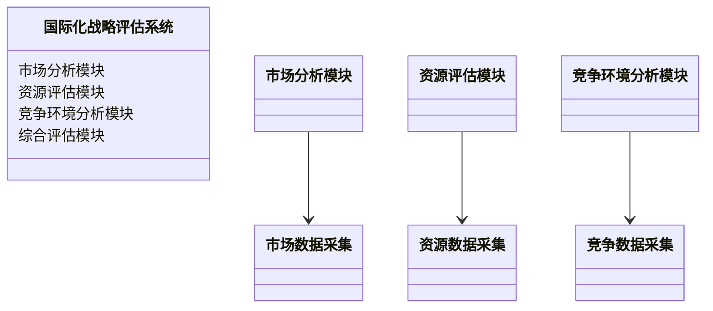
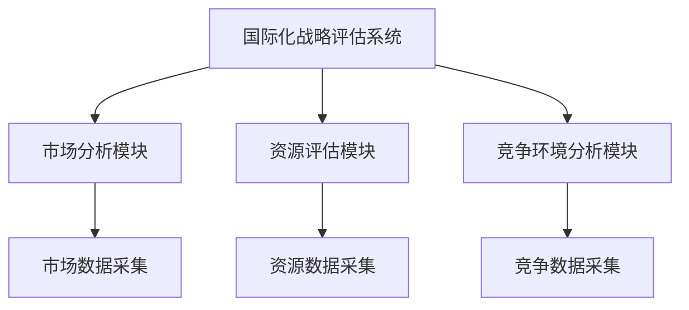

                 


# 如何评估企业的国际化战略

## 关键词：企业战略、国际化、战略评估、层次分析法、系统架构、项目实战

## 摘要：  
本文详细探讨了如何评估企业的国际化战略，从背景分析、核心概念到算法原理、系统架构、项目实战等多方面进行深入分析。文章首先介绍了企业国际化战略的背景和重要性，随后详细阐述了评估的核心概念与联系，接着从算法原理和数学模型的角度分析了评估方法，最后通过系统架构设计和项目实战展示了如何具体实施评估。文章内容丰富，逻辑清晰，旨在为企业提供实用的评估框架和方法。

---

# 第1章: 企业国际化战略评估的背景与问题背景

## 1.1 企业国际化战略的定义与目标

### 1.1.1 国际化战略的定义  
国际化战略是指企业将业务扩展到国际市场，通过在全球范围内配置资源、开拓市场、建立合作伙伴关系等方式，实现企业在全球范围内的竞争优势。国际化战略的核心在于利用全球资源和市场机会，提升企业的竞争力和市场份额。

### 1.1.2 企业国际化战略的核心目标  
- **市场扩展**：通过开拓海外市场，增加销售规模和市场份额。  
- **资源优化**：在全球范围内优化资源配置，降低成本。  
- **品牌建设**：通过国际化提升品牌形象和知名度。  
- **风险分散**：通过多元化市场降低单一市场风险。  

### 1.1.3 企业国际化战略对企业发展的意义  
国际化战略不仅是企业发展的高级阶段，更是企业在全球化竞争中生存和发展的必然选择。通过国际化战略，企业可以更好地适应全球经济变化，提升核心竞争力。

---

## 1.2 企业国际化战略的实施背景

### 1.2.1 全球化经济趋势的推动  
随着全球经济一体化的加深，企业需要在全球范围内寻找市场机会和竞争优势。国际化战略成为企业在全球化背景下发展的必然选择。

### 1.2.2 企业竞争优势的国际化需求  
在现代竞争中，仅依靠本地市场难以满足企业发展的需求。企业需要通过国际化战略获取全球资源、技术和市场，以保持竞争优势。

### 1.2.3 数字化时代对企业国际化的影响  
数字化技术的快速发展使得企业可以更高效地进行跨国协作、信息共享和市场拓展。数字化工具为企业国际化提供了新的可能性和效率提升。

---

## 1.3 企业国际化战略的实施现状与问题

### 1.3.1 当前企业国际化战略的主要模式  
- **出口模式**：通过出口产品或服务进入国际市场。  
- **直接投资模式**：通过海外投资建立分支机构或生产基地。  
- **合作与并购模式**：通过合作伙伴关系或并购快速进入新市场。  

### 1.3.2 实施过程中面临的主要问题  
- **文化差异**：不同国家的文化差异可能影响企业管理和沟通效率。  
- **法律与政策风险**：不同国家的法律法规和政策差异可能带来合规风险。  
- **市场竞争**：国际化过程中可能面临激烈的市场竞争压力。  

### 1.3.3 问题对企业发展的潜在影响  
- **市场进入困难**：文化差异和法律障碍可能导致市场进入失败。  
- **成本增加**：国际化过程中可能面临高昂的投资成本和运营成本。  
- **品牌建设受阻**：文化差异可能导致品牌定位和推广效果不佳。  

---

## 1.4 本章小结  
本章从背景和问题背景的角度分析了企业国际化战略的重要性及其实施过程中的挑战。通过对企业国际化战略的定义、目标、实施背景以及当前面临的问题进行详细阐述，为后续的评估工作奠定了基础。

---

# 第2章: 企业国际化战略评估的核心概念与联系

## 2.1 核心概念的定义与属性

### 2.1.1 国际化战略的定义与特征  
- **定义**：国际化战略是企业在全球范围内进行资源配置和市场拓展的战略。  
- **特征**：国际化战略具有全球化、多元化和灵活性的特点。  

### 2.1.2 企业战略管理的定义与特征  
- **定义**：企业战略管理是指企业在实现长期目标的过程中，通过制定和实施战略来实现资源优化配置和竞争优势提升的过程。  
- **特征**：战略管理具有系统性、前瞻性和动态性特点。  

### 2.1.3 国际化战略与企业核心竞争力的关系  
国际化战略通过在全球范围内优化资源配置和市场拓展，直接提升企业核心竞争力。国际化战略的成功实施依赖于企业核心竞争力的强弱，而核心竞争力的提升又反过来促进国际化战略的实施。

---

## 2.2 核心概念的对比分析

### 2.2.1 国际化战略与本地化战略的对比  
| **维度**       | **国际化战略**                | **本地化战略**                |
|-----------------|-------------------------------|------------------------------|
| 目标            | 全球市场拓展                  | 单一市场深耕                  |
| 资源配置        | 全球范围配置                  | 局部市场配置                  |
| 战略重点        | 全球资源整合与市场拓展        | 本地市场需求与文化适应        |

### 2.2.2 国际化战略与多元化战略的对比  
| **维度**       | **国际化战略**                | **多元化战略**                |
|-----------------|-------------------------------|------------------------------|
| 目标            | 拓展国际市场                  | 拓展多元化产品或市场          |
| 实施方式        | 海外市场拓展                  | 产品线扩展或市场多元化        |
| 风险            | 市场风险、法律风险            | 产品风险、市场需求风险        |

### 2.2.3 国际化战略与全球化战略的对比  
| **维度**       | **国际化战略**                | **全球化战略**                |
|-----------------|-------------------------------|------------------------------|
| 目标            | 拓展国际市场                  | 实现全球一体化                 |
| 实施方式        | 分市场、分阶段实施            | 全球统一化实施                 |
| 风险            | 市场差异风险                  | 统一化带来的协调风险          |

---

## 2.3 核心概念的ER实体关系图



---

## 2.4 本章小结  
本章通过定义和对比分析，明确了国际化战略的核心概念及其与其他战略的区别与联系。通过ER实体关系图展示了国际化战略与企业资源、市场环境之间的关系，为后续的评估工作奠定了概念基础。

---

# 第3章: 企业国际化战略评估的算法原理与数学模型

## 3.1 算法原理

### 3.1.1 基于层次分析法（AHP）的评估模型  
层次分析法（AHP）是一种用于多准则决策分析的方法，适用于企业国际化战略评估中多个因素的综合评估。其基本步骤如下：  
1. **目标层**：国际化战略评估的最终目标。  
2. **准则层**：评估国际化战略的关键指标，如市场潜力、资源能力、竞争环境等。  
3. **方案层**：具体的评估方案或备选方案。  
4. **指标层**：具体的评估指标，如市场份额、成本、品牌影响力等。  



---

## 3.2 数学模型与公式

### 3.2.1 层次分析法的权重计算公式  
层次分析法中，权重计算公式如下：  
$$ A = \lambda_{max} \cdot A + (n-1)(\lambda_{max}-1)/n $$  

其中，$\lambda_{max}$ 是最大特征值，$n$ 是准则层的个数。

### 3.2.2 指标权重计算公式  
指标权重计算公式如下：  
$$ w_i = \frac{e_i}{\sum_{j=1}^{n} e_j} $$  

其中，$e_i$ 是第$i$个指标的得分，$n$ 是指标的总数。

---

## 3.3 算法实现与代码示例

### 3.3.1 算法实现步骤  
1. **构建层次分析模型**：明确目标层、准则层、方案层和指标层。  
2. **构造判断矩阵**：根据专家意见或数据分析，构造准则层和指标层的判断矩阵。  
3. **计算权重**：使用层次分析法计算各层的权重。  
4. **综合评估**：根据权重和实际数据，计算各方案的综合得分。  

### 3.3.2 Python代码实现  

```python
import numpy as np

def calculate_weights(matrix):
    # 计算判断矩阵的特征值和特征向量
    eigenvalues, eigenvectors = np.linalg.eig(matrix)
    max_eigenvalue = eigenvalues.max()
    max_index = np.where(eigenvalues == max_eigenvalue)[0][0]
    weight = eigenvectors[:, max_index] / eigenvectors[:, max_index].sum()
    return weight

# 示例判断矩阵
matrix = np.array([
    [1, 3, 2],
    [1/3, 1, 2/3],
    [1/2, 3/2, 1]
])

weights = calculate_weights(matrix)
print("权重向量为：", weights)
```

---

## 3.4 本章小结  
本章通过层次分析法（AHP）的算法原理和数学模型，详细阐述了企业国际化战略评估的方法。通过Python代码示例，展示了如何利用层次分析法进行实际计算，为后续的评估工作提供了技术支持。

---

# 第4章: 企业国际化战略评估的系统架构与设计

## 4.1 系统需求分析

### 4.1.1 问题场景介绍  
企业国际化战略评估系统需要解决的问题包括：如何量化评估国际化战略的实施效果，如何分析市场、资源、竞争环境等多方面因素，以及如何为决策者提供数据支持。

### 4.1.2 系统目标与范围  
- **目标**：构建一个能够量化评估企业国际化战略的系统。  
- **范围**：涵盖市场分析、资源评估、竞争环境分析等功能。  

---

## 4.2 系统功能设计

### 4.2.1 领域模型设计  


### 4.2.2 系统架构设计  


---

## 4.3 系统接口设计

### 4.3.1 输入接口  
- **市场数据输入**：包括市场规模、增长率等数据。  
- **资源数据输入**：包括企业资源、合作伙伴资源等数据。  

### 4.3.2 输出接口  
- **评估报告输出**：包括综合评估得分、各模块评估结果等。  
- **数据可视化输出**：包括图表、图形等可视化结果。  

---

## 4.4 本章小结  
本章通过系统架构设计，展示了如何构建一个能够支持企业国际化战略评估的系统。从功能设计到系统架构，详细描述了实现步骤和设计思路，为后续的项目实施提供了指导。

---

# 第5章: 企业国际化战略评估的项目实战

## 5.1 环境安装与配置

### 5.1.1 系统环境要求  
- **操作系统**：Windows 10 或更高版本，或 Linux 系统。  
- **开发工具**：Python 3.8 或更高版本，Jupyter Notebook，Git。  
- **依赖库**：numpy、pandas、matplotlib。  

### 5.1.2 安装依赖库  
```bash
pip install numpy pandas matplotlib
```

---

## 5.2 核心代码实现

### 5.2.1 数据采集与预处理  
```python
import pandas as pd

# 数据采集
market_data = pd.read_csv('market.csv')
resource_data = pd.read_csv('resource.csv')
competition_data = pd.read_csv('competition.csv')

# 数据预处理
market_data = market_data.dropna()
resource_data = resource_data.dropna()
competition_data = competition_data.dropna()
```

### 5.2.2 评估模型实现  
```python
import numpy as np
import pandas as pd
import matplotlib.pyplot as plt

def calculate_weights(matrix):
    eigenvalues, eigenvectors = np.linalg.eig(matrix)
    max_eigenvalue = eigenvalues.max()
    max_index = np.where(eigenvalues == max_eigenvalue)[0][0]
    weight = eigenvectors[:, max_index] / eigenvectors[:, max_index].sum()
    return weight

# 示例判断矩阵
market_matrix = np.array([
    [1, 3, 2],
    [1/3, 1, 2/3],
    [1/2, 3/2, 1]
])

weights = calculate_weights(market_matrix)
print("市场评估权重为：", weights)
```

---

## 5.3 案例分析与结果解读

### 5.3.1 案例背景  
某企业计划进入国际市场，需要评估其国际化战略的可行性。  

### 5.3.2 数据分析与评估  
```python
# 综合评估得分计算
total_score = market_data['score'].mean() + resource_data['score'].mean() + competition_data['score'].mean()
print("综合评估得分为：", total_score)
```

### 5.3.3 可视化展示  
```python
plt.figure(figsize=(10, 6))
plt.bar(['市场', '资源', '竞争'], [market_score, resource_score, competition_score])
plt.title('国际化战略评估结果')
plt.show()
```

---

## 5.4 本章小结  
本章通过项目实战，展示了如何利用系统架构和算法模型进行企业国际化战略评估。通过具体案例分析和结果解读，验证了评估方法的有效性，为企业提供了一套可操作的评估方案。

---

# 第6章: 总结与展望

## 6.1 总结

### 6.1.1 核心内容回顾  
- **背景分析**：企业国际化战略的重要性与挑战。  
- **核心概念**：国际化战略的定义、特征及其与其他战略的对比。  
- **算法原理**：层次分析法（AHP）的应用与实现。  
- **系统架构**：评估系统的功能设计与实现方案。  
- **项目实战**：实际案例的分析与结果解读。  

### 6.1.2 实施效果与意义  
通过本文的分析，企业可以更好地理解国际化战略的评估方法，并利用系统化的工具和模型进行实际操作。

---

## 6.2 未来展望

### 6.2.1 技术发展与优化方向  
- **智能化评估**：利用人工智能技术提高评估的准确性和效率。  
- **实时监控**：建立实时监控系统，动态评估国际化战略的实施效果。  

### 6.2.2 应用场景与拓展  
- **跨国企业**：通过本文的方法，跨国企业可以更好地优化其全球战略。  
- **新兴市场**：新兴市场的企业可以通过本文的模型快速评估国际化战略的可行性。  

---

## 6.3 本章小结  
本章总结了全文的核心内容，并展望了未来的技术发展和应用方向。通过本文的分析，企业可以更好地制定和实施国际化战略，提升其在全球市场中的竞争力。

---

# 结语  

企业国际化战略的评估是一个复杂而重要的过程，需要结合企业实际和全球市场环境进行综合分析。本文通过背景分析、核心概念、算法原理、系统架构和项目实战等多方面的深入探讨，为企业的国际化战略评估提供了系统的解决方案和实践指导。希望本文能够为企业的国际化战略评估提供有价值的参考和启发。

---

# 参考文献  
（此处列出相关的书籍、论文、技术文档等参考资料）  

---

# 感谢  
感谢读者的耐心阅读，如果本文对您有所帮助，请分享给更多的朋友。如果需要进一步探讨或合作，请随时联系！  

---

