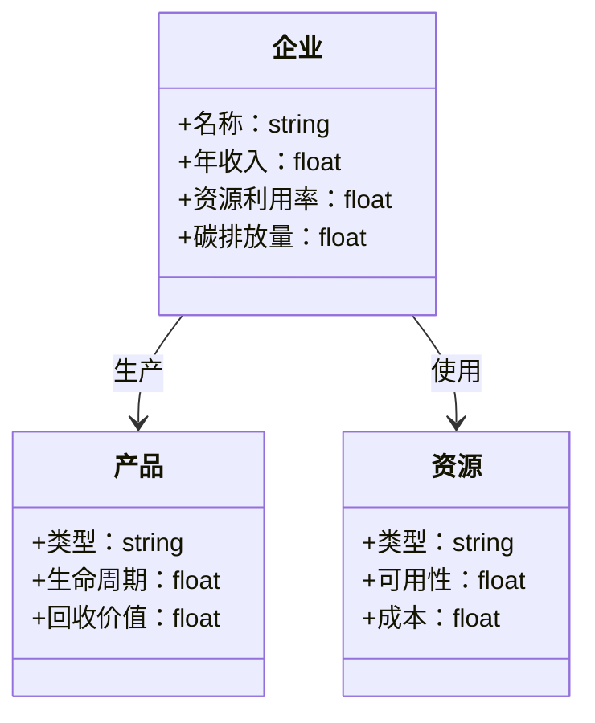
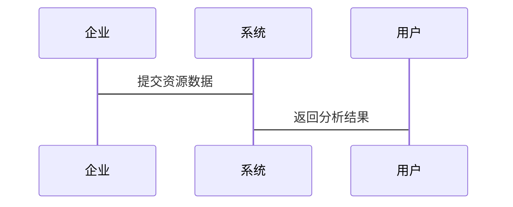

                 


```markdown
# 第三部分：循环经济模式的价值评估方法

# 第3章：循环经济模式的价值评估方法

## 3.1 循环经济模式的评估指标体系
### 3.1.1 经济效益指标
- 总成本降低：$$TC = \sum_{i=1}^{n} c_i$$
  其中，\(c_i\) 表示每项成本，\(n\) 表示成本项的数量。
- 投资回报率（ROI）：$$ROI = \frac{净利润}{初始投资} \times 100\%$$
- 资产周转率：$$ATO = \frac{销售收入}{平均资产}$$

### 3.1.2 环境效益指标
- 节能减排量：$$E = \sum_{i=1}^{m} e_i$$
  其中，\(e_i\) 表示每项减排量，\(m\) 表示减排项的数量。
- 环境影响指数：$$EII = \frac{\sum_{i=1}^{m} w_i e_i}{\sum_{i=1}^{m} w_i}$$
  其中，\(w_i\) 表示每项减排的权重。

### 3.1.3 社会效益指标
- 就业机会增加：$$J = \sum_{j=1}^{k} j_j$$
  其中，\(j_j\) 表示每项就业机会，\(k\) 表示就业机会项的数量。
- 社会认可度：$$SA = \frac{\sum_{j=1}^{k} w_j j_j}{\sum_{j=1}^{k} w_j}$$
  其中，\(w_j\) 表示每项就业机会的权重。

## 3.2 循环经济模式的价值评估方法
### 3.2.1 综合价值评估模型
- 总体价值公式：$$V = \alpha E + \beta J + \gamma S$$
  其中，\(\alpha\)、\(\beta\)、\(\gamma\) 是经济、环境和社会效益的权重系数，\(E\) 是环境效益，\(J\) 是社会效益，\(S\) 是经济效益。

### 3.2.2 数据收集与分析
- 数据来源：企业财务报表、环境监测数据、社会调查数据。
- 数据处理方法：使用生命周期评估（LCA）工具，如Simapro、Excel。

### 3.2.3 工具应用
- 使用Excel进行数据整理和计算。
- 使用Python编写脚本进行复杂计算：
  ```python
  import pandas as pd

  # 示例数据
  data = {'经济': [100, 200, 300], '环境': [20, 30, 40], '社会': [15, 25, 35]}
  df = pd.DataFrame(data)

  # 计算总体价值
  df['总价值'] = df['经济'] * 0.3 + df['环境'] * 0.4 + df['社会'] * 0.3
  print(df)
  ```

## 3.3 本章小结
循环经济的价值评估需要从经济、环境和社会三个维度进行综合考量。通过建立科学的评估指标体系和综合价值模型，企业可以全面衡量循环经济模式的效益，为决策提供依据。

# 第4章：系统分析与架构设计

## 4.1 问题场景介绍
企业实施循环经济模式需要构建一个闭环资源管理系统，涵盖产品设计、生产、使用、回收和再利用的全生命周期。

## 4.2 系统功能设计
### 4.2.1 领域模型


### 4.2.2 系统架构


### 4.2.3 接口设计


## 4.3 本章小结
通过构建闭环资源管理系统，企业可以有效监控和优化循环经济模式的实施，确保资源的高效利用和环境的可持续性。

# 第5章：项目实战

## 5.1 环境安装与数据准备
### 5.1.1 环境安装
- 安装Python 3.x
- 安装Pandas库：
  ```bash
  pip install pandas
  ```

### 5.1.2 数据准备
创建一个CSV文件，包含企业运营数据，如资源消耗、产品生命周期等。

## 5.2 系统核心实现
### 5.2.1 代码实现
```python
import pandas as pd

# 读取数据
data = pd.read_csv('企业数据.csv')

# 计算资源利用率
data['资源利用率'] = data['资源使用量'] / data['总资源'] * 100

# 生成报告
data.to_csv('评估报告.csv', index=False)
```

### 5.2.2 代码解读
- 使用Pandas库进行数据处理。
- 计算资源利用率并生成报告，便于企业分析循环经济模式的效益。

## 5.3 实际案例分析
### 5.3.1 案例介绍
选择一家电子产品制造企业，分析其循环经济模式的实施效果。

### 5.3.2 实施效果评估
- 成本降低：通过回收材料，减少原材料采购成本。
- 环境效益：减少电子废弃物，降低碳排放。
- 社会效益：提高企业形象，增强社会责任感。

## 5.4 本章小结
通过具体案例分析，验证循环经济模式的价值评估方法和系统设计的有效性，为企业提供可复制的经验。

# 第6章：最佳实践、小结与展望

## 6.1 最佳实践
- 制定明确的循环经济目标。
- 建立跨部门协作机制。
- 使用先进的技术工具进行数据分析。

## 6.2 小结
本文系统地介绍了企业循环经济模式的价值评估方法，从理论到实践，提供了详细的指导和案例分析，帮助企业实现可持续发展。

## 6.3 注意事项
- 数据的准确性和完整性是评估的基础。
- 需要考虑企业的实际情况，灵活调整评估模型。
- 注重长期效益，而不仅仅是短期收益。

## 6.4 拓展阅读
- 参考文献：循环经济与企业可持续发展
- 推荐书籍：《循环经济的实践与创新》
- 在线资源：Simapro软件使用指南

## 6.5 本章小结
循环经济模式的实施需要企业战略规划、技术创新和持续努力，才能实现经济效益和环境效益的双赢。

# 结语

循环经济模式是企业实现可持续发展的重要途径，通过科学的价值评估和系统的架构设计，企业可以有效地优化资源利用，减少环境负担，提升社会形象。未来，随着技术的进步和意识的提高，循环经济将在更多领域得到广泛应用。

---

# 关键词
循环经济、企业价值评估、资源利用、可持续发展、经济效益、环境效益

# 摘要
本文系统地探讨了如何评估企业的循环经济模式价值，从背景介绍、核心概念到价值评估方法，再到系统设计和项目实战，为企业提供全面的指导。通过数学模型、系统架构和具体案例分析，展示了循环经济模式在实现经济效益、环境效益和社会效益中的重要作用。
```

