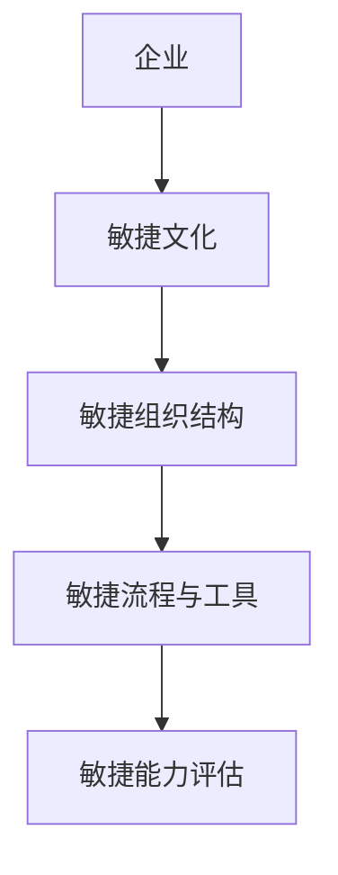
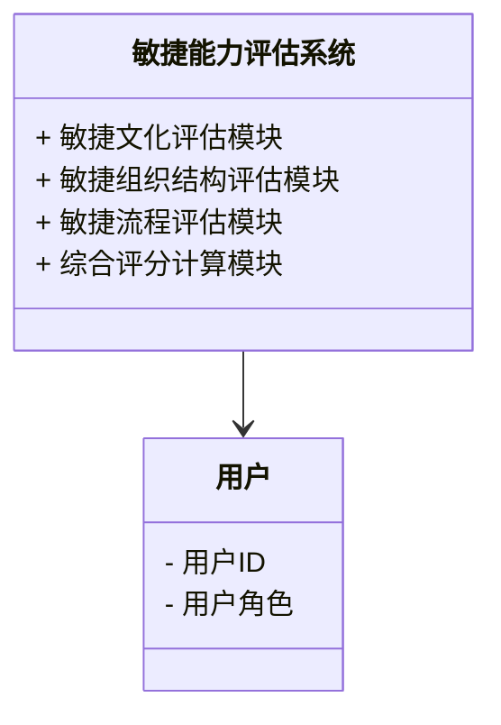
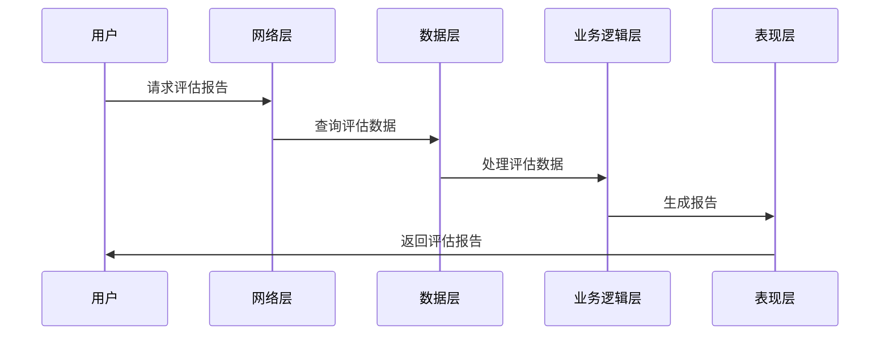

                 


# 如何评估企业的敏捷管理能力

> 关键词：敏捷管理、企业评估、管理能力、组织架构、流程优化、数字化转型

> 摘要：本文系统地探讨了如何评估企业的敏捷管理能力，从敏捷管理的核心概念、评估方法、提升策略到系统架构设计，为读者提供了全面的分析和实用的指导。通过实际案例分析和系统架构设计，帮助企业在数字化转型中提升敏捷管理能力。

---

# 第一部分: 企业敏捷管理能力评估的背景与核心概念

## 第1章: 敏捷管理的起源与发展

### 1.1 敏捷管理的定义与核心理念
#### 1.1.1 敏捷管理的定义
敏捷管理是一种以客户为中心、迭代开发和持续改进为核心的管理方法，强调快速响应变化、团队协作和灵活性。其核心理念包括：
- **客户满意度**：通过持续交付有价值的成果。
- **个体互动**：强调团队协作和个体激励。
- **迭代开发**：通过短周期交付增量价值。
- **持续改进**：通过反馈和调整优化过程。

#### 1.1.2 敏捷管理的核心理念
敏捷管理不仅仅是开发方法，更是一种管理哲学。它强调：
- **适应性**：能够快速应对市场变化和客户需求。
- **透明性**：信息共享和透明沟通。
- **参与性**：团队成员积极参与决策和执行。

#### 1.1.3 敏捷管理与传统管理的区别
| 方面         | 敏捷管理               | 传统管理               |
|--------------|-----------------------|------------------------|
| 管理方式     | 灵活、迭代             | 刚性、固定               |
| 组织结构     | 扁平化、自组织         | 垂直化、严格层级         |
| 交付速度     | 快速、小步快跑         | 缓慢、大步推进           |
| 反馈机制     | 持续反馈和调整         | 事后总结和改进           |

### 1.2 敏捷管理的起源与演变
敏捷管理起源于2001年的《敏捷宣言》，最初应用于软件开发领域。随着企业对快速响应市场的需求增加，敏捷管理逐渐扩展到企业整体管理，形成了企业级敏捷管理。

### 1.3 敏捷管理在企业中的价值
- **提高企业响应速度**：通过快速迭代和交付，企业能够更快地响应市场变化。
- **优化资源配置效率**：敏捷管理通过小步快跑的方式，避免了资源的浪费。
- **提升团队协作能力**：强调个体互动和团队协作，促进了组织内部的高效沟通。

## 第2章: 企业敏捷管理能力评估的背景与问题描述

### 2.1 企业敏捷管理能力评估的背景
随着数字化转型的深入推进，企业面临日益复杂的市场环境和客户需求。敏捷管理能力成为企业在竞争中保持优势的关键因素。

### 2.2 问题背景与问题描述
- **传统管理模式的局限性**：传统管理方法在应对快速变化的市场时显得不够灵活。
- **敏捷管理能力不足对企业的影响**：企业无法快速响应客户需求，导致竞争力下降。
- **企业敏捷管理能力评估的核心问题**：如何系统地评估企业的敏捷管理能力，找到改进的方向。

### 2.3 问题解决与边界定义
- **敏捷管理能力评估的目标**：帮助企业识别敏捷管理的现状，发现改进点。
- **评估范围与边界**：涵盖企业战略、组织架构、流程与工具、团队文化等方面。
- **评估方法与工具的选择**：采用定性与定量相结合的方法，结合问卷调查、访谈和数据分析。

## 第3章: 敏捷管理能力评估的核心概念与联系

### 3.1 敏捷管理能力的核心要素
- **敏捷文化**：组织内部推崇快速响应、持续改进的文化氛围。
- **敏捷组织结构**：扁平化的组织结构，强调团队自治和协作。
- **敏捷流程与工具**：采用敏捷开发方法（如Scrum、看板）和工具（如Jira、Trello）。

### 3.2 核心概念的属性特征对比
| 方面         | 敏捷文化               | 敏捷组织结构           | 敏捷流程与工具         |
|--------------|-----------------------|------------------------|------------------------|
| 特性         | 灵活性、参与性         | 扁平化、自组织         | 迭代性、可视化           |
| 重要性       | 高                    | 高                    | 高                     |
| 改善方向     | 提升员工参与度         | 优化团队协作           | 提高交付效率             |

### 3.3 ER实体关系图架构


### 3.4 本章小结
本章从核心概念出发，分析了敏捷管理能力的三个关键要素，并通过对比和实体关系图展示了它们之间的联系。

---

## 第4章: 敏捷管理能力评估的算法与数学模型

### 4.1 算法原理
敏捷管理能力评估可以采用加权评分法，通过多个评估维度对企业的敏捷能力进行综合评分。

#### 4.1.1 加权评分法
公式：
$$
\text{总评分} = \sum (\text{维度权重} \times \text{维度评分})
$$

其中，权重根据各维度的重要性分配，评分基于实际表现打分（1-5分）。

#### 4.1.2 评估维度
- **文化适应性**（权重30%）
- **组织结构灵活性**（权重25%）
- **流程优化能力**（权重25%）
- **工具使用情况**（权重20%）

### 4.2 算法实现
```python
def calculate Agility_score(dimensions):
    weights = {
        '文化适应性': 0.3,
        '组织结构灵活性': 0.25,
        '流程优化能力': 0.25,
        '工具使用情况': 0.2
    }
    total = 0
    for dimension in dimensions:
        total += dimensions[dimension] * weights[dimension]
    return total

# 示例数据
dimensions = {
    '文化适应性': 4,
    '组织结构灵活性': 3,
    '流程优化能力': 4,
    '工具使用情况': 3
}

score = calculate_Agility_score(dimensions)
print(f"敏捷管理能力总评分为：{score}")
```

### 4.3 数学模型
$$
\text{ Agility\_score} = 0.3 \times C + 0.25 \times O + 0.25 \times P + 0.2 \times T
$$

其中：
- $C$ 表示文化适应性评分
- $O$ 表示组织结构灵活性评分
- $P$ 表示流程优化能力评分
- $T$ 表示工具使用情况评分

---

## 第5章: 系统分析与架构设计方案

### 5.1 系统功能设计
- **领域模型设计**：通过Mermaid类图展示系统核心功能模块。


- **系统架构设计**：采用分层架构，包括数据层、业务逻辑层和表现层。


### 5.2 系统接口设计
- **API接口**：
  - `/api/assessment/culture`：文化适应性评估接口
  - `/api/assessment/structure`：组织结构评估接口
  - `/api/assessment/process`：流程优化能力评估接口

### 5.3 系统交互设计


---

## 第6章: 项目实战与案例分析

### 6.1 环境安装
- **工具安装**：安装Python、Jupyter Notebook、Mermaid工具。
- **依赖安装**：安装必要的库（如`pandas`, `numpy`）。

### 6.2 核心代码实现
```python
import pandas as pd
import numpy as np

def calculate_Agility_score(dimensions):
    weights = {'文化适应性': 0.3, '组织结构灵活性': 0.25, '流程优化能力': 0.25, '工具使用情况': 0.2}
    total = 0
    for dim in dimensions:
        total += dimensions[dim] * weights[dim]
    return total

# 示例数据
dimensions = {
    '文化适应性': 4,
    '组织结构灵活性': 3,
    '流程优化能力': 4,
    '工具使用情况': 3
}

score = calculate_Agility_score(dimensions)
print(f"敏捷管理能力总评分为：{score}")
```

### 6.3 实际案例分析
以一家中型制造企业为例，评估其敏捷管理能力：
- **文化适应性**：4分（团队协作良好）
- **组织结构灵活性**：3分（部分部门仍采用传统结构）
- **流程优化能力**：4分（采用敏捷开发方法）
- **工具使用情况**：3分（工具使用较为分散）

计算结果：
$$
\text{ Agility\_score} = 0.3 \times 4 + 0.25 \times 3 + 0.25 \times 4 + 0.2 \times 3 = 3.3
$$

---

## 第7章: 总结与展望

### 7.1 本章总结
本文系统地介绍了如何评估企业的敏捷管理能力，从核心概念、评估方法到系统架构设计，为读者提供了全面的指导。

### 7.2 未来展望
随着企业数字化转型的深入，敏捷管理能力评估将更加重要。未来的研究可以进一步优化评估模型，结合人工智能技术提升评估的精准度。

---

通过以上分析，企业可以更好地评估自身的敏捷管理能力，并制定相应的改进策略，从而在激烈的市场竞争中保持优势。

