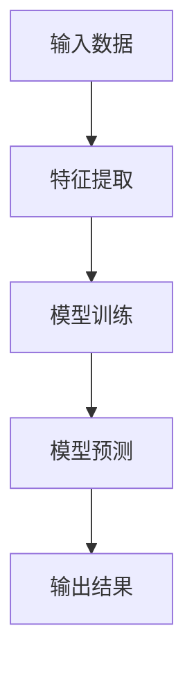
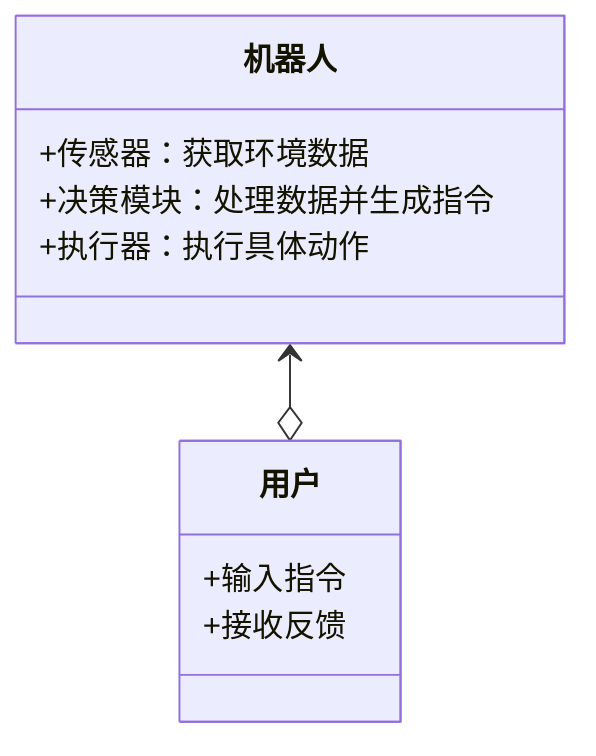
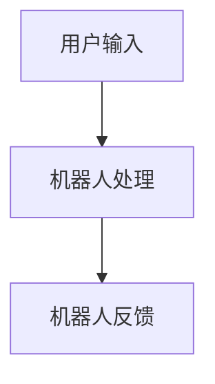

                 


# 如何评估企业的智能机器人技术

## 关键词：智能机器人，技术评估，企业应用，算法原理，系统架构，项目实战，最佳实践

## 摘要：评估企业的智能机器人技术涉及多个关键维度，包括技术选型、系统架构、算法原理、项目实施等。本文从背景介绍、核心概念、算法原理、系统分析、项目实战到最佳实践，系统性地探讨如何全面评估企业的智能机器人技术。通过详细的理论分析和实际案例，帮助读者掌握评估的关键点和技术要点。

---

# 第一部分: 智能机器人技术评估背景与核心概念

## 第1章: 智能机器人技术评估的背景与意义

### 1.1 什么是智能机器人技术
#### 1.1.1 智能机器人的定义与分类
智能机器人是一种结合了人工智能（AI）和机器人技术的高科技产品，能够通过传感器、执行器和算法实现自主决策和操作。根据功能和应用场景，智能机器人可以分为工业机器人、服务机器人、医疗机器人和家庭机器人等类别。

#### 1.1.2 智能机器人技术的核心要素
智能机器人技术的核心要素包括：
- **感知能力**：通过传感器获取环境信息。
- **决策能力**：利用AI算法进行分析和决策。
- **执行能力**：通过执行器完成具体动作。
- **通信能力**：与外部系统或人员进行数据交互。

#### 1.1.3 智能机器人技术的应用场景
智能机器人技术广泛应用于多个领域：
- **制造业**：自动化生产、质量检测。
- **服务业**：客服机器人、物流配送。
- **医疗领域**：手术机器人、康复辅助。
- **家庭领域**：智能家居控制、个人助手。

### 1.2 企业为何需要评估智能机器人技术
#### 1.2.1 企业智能化转型的必然性
随着人工智能和机器人技术的快速发展，企业需要通过智能化转型来提高效率、降低成本和增强竞争力。

#### 1.2.2 智能机器人技术对企业效率的提升
智能机器人可以通过自动化处理重复性任务、优化流程，显著提高企业效率。

#### 1.2.3 智能机器人技术在行业中的发展趋势
智能机器人技术正在向更智能化、网络化和协同化的方向发展，成为企业创新的重要驱动力。

## 第2章: 智能机器人技术的核心概念与联系

### 2.1 智能机器人技术的核心概念
#### 2.1.1 人工智能与机器人技术的结合
人工智能为机器人提供了智能决策能力，而机器人则为人工智能提供了实际应用场景。

#### 2.1.2 智能机器人技术的系统架构
智能机器人系统的架构通常包括感知层、决策层和执行层。

#### 2.1.3 智能机器人技术的算法基础
智能机器人技术依赖于机器学习、深度学习和自然语言处理等算法。

### 2.2 核心概念的属性特征对比
以下是传统机器人与智能机器人在技术上的对比：

| **特性**       | **传统机器人**               | **智能机器人**                |
|----------------|------------------------------|-------------------------------|
| **感知能力**   | 无或有限                    | 强，支持多种传感器             |
| **决策能力**   | 基于预设程序                | 基于AI算法，动态调整           |
| **灵活性**     | 较低                       | 较高，适应复杂环境             |
| **应用场景**   | 单一、重复性任务            | 多样化、复杂性任务             |

### 2.3 ER实体关系图架构
以下是智能机器人技术的ER实体关系图：

```mermaid
er
  actor: 企业
  robot: 智能机器人
  technology: 技术
  relation: 企业采用智能机器人技术
  actor --> robot: 使用
  robot --> technology: 依赖
```

---

# 第二部分: 智能机器人技术的算法原理

## 第3章: 智能机器人技术的算法原理

### 3.1 算法原理概述
#### 3.1.1 机器学习算法在智能机器人中的应用
机器学习算法用于智能机器人的行为预测和优化。

#### 3.1.2 深度学习算法在智能机器人中的应用
深度学习算法用于智能机器人的图像识别和语音识别。

#### 3.1.3 自然语言处理在智能机器人中的应用
自然语言处理用于智能机器人的对话理解和生成。

### 3.2 算法原理的数学模型
#### 3.2.1 机器学习模型的数学表达
$$ y = f(x) $$

#### 3.2.2 深度学习模型的数学表达
$$ y = \sigma(wx + b) $$

#### 3.2.3 自然语言处理模型的数学表达
$$ P(y|x) = \prod_{i=1}^{n} P(y_i|x, y_{i-1}) $$

### 3.3 算法原理的流程图
以下是智能机器人技术的算法流程图：



---

# 第三部分: 智能机器人技术的系统分析与架构设计

## 第4章: 系统分析与架构设计方案

### 4.1 问题场景介绍
智能机器人技术需要在复杂环境中完成多种任务，因此需要高效的系统架构设计。

### 4.2 系统功能设计
以下是智能机器人系统的功能设计：



### 4.3 系统架构设计
以下是智能机器人技术的系统架构图：


### 4.4 系统接口设计
以下是智能机器人系统的接口设计：

```mermaid
sequenceDiagram
    participant 用户
    participant 机器人
    用户 -> 机器人：发送指令
    机器人 -> 用户：返回反馈
```

---

# 第四部分: 项目实战

## 第5章: 项目实战

### 5.1 环境安装
安装Python和必要的库：

```bash
pip install numpy
pip install tensorflow
```

### 5.2 系统核心实现源代码
以下是智能机器人技术的核心实现代码：

```python
import numpy as np
import tensorflow as tf

# 定义模型
model = tf.keras.Sequential([
    tf.keras.layers.Dense(64, activation='relu'),
    tf.keras.layers.Dense(10, activation='softmax')
])

# 编译模型
model.compile(optimizer='adam', loss='sparse_categorical_crossentropy', metrics=['accuracy'])

# 训练模型
model.fit(x_train, y_train, epochs=10, batch_size=32)
```

### 5.3 代码应用解读与分析
该代码实现了一个简单的神经网络模型，用于智能机器人的分类任务。

### 5.4 实际案例分析
以下是一个智能机器人技术的实际案例分析：



### 5.5 项目小结
通过实际项目的实施，我们可以更好地理解智能机器人技术的实现过程。

---

# 第五部分: 最佳实践

## 第6章: 最佳实践

### 6.1 技术选型
选择适合企业需求的智能机器人技术。

### 6.2 系统设计
确保系统架构的可扩展性和可维护性。

### 6.3 安全性
确保智能机器人系统的安全性。

### 6.4 维护与优化
定期维护和优化系统，以适应新的需求。

---

# 结语

评估企业的智能机器人技术需要从多个维度进行综合分析。通过本文的系统性探讨，读者可以全面了解智能机器人技术的核心概念、算法原理和系统架构，从而更好地进行技术评估和项目实施。

