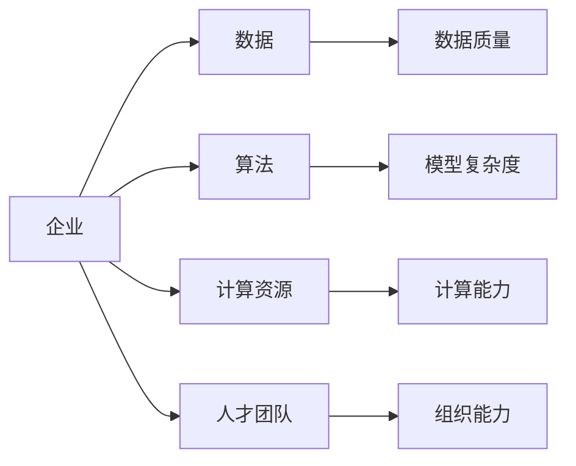

                 


# 如何评估企业的机器学习能力

> 关键词：机器学习能力，企业评估，算法选择，数据质量，模型复杂度

> 摘要：评估企业的机器学习能力是企业在数字化转型中提升竞争力的关键。本文从背景、核心概念、算法原理、系统架构和项目实战五个方面，详细讲解如何系统性地评估企业机器学习能力，涵盖数据质量、算法选择、计算资源和团队能力等方面，结合实际案例和代码实现，为企业提供全面的解决方案。

---

## 第一部分：背景介绍

### 第1章：机器学习能力评估的背景与意义

#### 1.1 机器学习的定义与核心概念
- 1.1.1 机器学习的基本定义
  机器学习是一种人工智能技术，通过数据训练模型，使其能够从经验中学习并做出预测或决策。
- 1.1.2 机器学习的核心概念与特点
  - 数据驱动：依赖大量数据进行训练。
  - 模型训练：通过算法优化模型参数。
  - 可解释性：模型的决策过程需要可解释。
- 1.1.3 机器学习在企业中的应用价值
  - 提高效率：自动化处理数据，优化业务流程。
  - 支持决策：通过预测分析辅助管理层决策。
  - 创新业务：基于机器学习开发新产品或服务。

#### 1.2 企业机器学习能力评估的必要性
- 1.2.1 数字化转型对企业的影响
  数字化转型要求企业利用新技术提升竞争力，机器学习是关键的技术之一。
- 1.2.2 机器学习对企业竞争力的作用
  通过机器学习，企业能够快速分析数据，洞察市场趋势，优化资源配置。
- 1.2.3 评估机器学习能力的现实需求
  - 识别现有能力的短板。
  - 制定提升计划，优化资源配置。

---

## 第二部分：核心概念与联系

### 第2章：机器学习能力的核心要素

#### 2.1 机器学习能力的构成要素
- 2.1.1 数据质量与数据量
  - 数据质量：数据的准确性和完整性。
  - 数据量：数据量越大，模型越容易泛化。
- 2.1.2 算法选择与模型复杂度
  - 算法选择：根据业务需求选择合适的算法。
  - 模型复杂度：模型的复杂度影响其泛化能力。
- 2.1.3 计算能力与资源分配
  - 计算能力：硬件资源是否足够支持模型训练。
  - 资源分配：合理分配计算资源，提高效率。
- 2.1.4 人才团队与组织结构
  - 人才团队：具备机器学习专业知识的团队。
  - 组织结构：支持机器学习项目的企业文化。

#### 2.2 核心概念的属性特征对比
- 数据与模型的对比分析
  - 数据：输入，影响模型的训练结果。
  - 模型：输出，决定预测的准确性。
- 算法与计算能力的对比
  - 算法：影响模型的复杂度。
  - 计算能力：影响模型的训练速度。
- 人才与组织结构的对比
  - 人才：决定模型的创新性。
  - 组织结构：决定项目的执行效率。

#### 2.3 实体关系图（ER图）


---

## 第三部分：算法原理讲解

### 第3章：常用机器学习算法及其评估指标

#### 3.1 监督学习算法
- 3.1.1 线性回归
  - 算法原理：通过最小二乘法找到最佳拟合直线。
  - 适用场景：预测连续型变量。
  - 示例：预测房价。
- 3.1.2 支持向量机（SVM）
  - 算法原理：通过寻找最优超平面，将数据分为两类。
  - 适用场景：分类问题。
  - 示例：垃圾邮件分类。

#### 3.2 无监督学习算法
- 3.2.1 K-means聚类
  - 算法原理：将数据分为K个簇，使得簇内点之间的距离最小。
  - 适用场景：客户分群。
  - 示例：客户行为分析。
- 3.2.2 主成分分析（PCA）
  - 算法原理：降维技术，保留数据的主要特征。
  - 适用场景：数据分析和可视化。
  - 示例：股票数据分析。

#### 3.3 评估指标的数学模型
- 准确率（Accuracy）
  $$ \text{Accuracy} = \frac{\text{正确预测数}}{\text{总样本数}} $$
- 召回率（Recall）
  $$ \text{Recall} = \frac{\text{正确预测的正例数}}{\text{实际正例数}} $$
- F1分数
  $$ F1 = 2 \times \frac{\text{Precision} \times \text{Recall}}{\text{Precision} + \text{Recall}} $$

---

## 第四部分：系统分析与架构设计方案

### 第4章：企业机器学习能力评估的系统架构

#### 4.1 问题场景介绍
- 企业机器学习能力评估的目标是通过系统化的方法，识别企业的机器学习能力现状，找出短板，制定提升计划。
- 评估系统的功能需求包括数据采集、算法选择、模型评估和结果分析。

#### 4.2 系统功能设计
- 数据采集模块：从企业系统中采集相关数据。
- 算法选择模块：根据数据和业务需求选择合适的算法。
- 模型评估模块：对模型进行训练和评估，输出评估结果。
- 结果分析模块：结合企业实际需求，分析评估结果，提出改进建议。

#### 4.3 系统架构设计


---

## 第五部分：项目实战

### 第5章：企业机器学习能力评估的项目实战

#### 5.1 项目介绍
- 某电商平台希望通过机器学习提升用户推荐系统的准确性。

#### 5.2 系统核心实现源代码
```python
import pandas as pd
from sklearn.model_selection import train_test_split
from sklearn.metrics import accuracy_score

# 数据预处理
data = pd.read_csv('user_data.csv')
X = data.drop('label', axis=1)
y = data['label']

# 划分训练集和测试集
X_train, X_test, y_train, y_test = train_test_split(X, y, test_size=0.2)

# 选择算法并训练模型
from sklearn.ensemble import RandomForestClassifier
model = RandomForestClassifier()
model.fit(X_train, y_train)

# 模型评估
y_pred = model.predict(X_test)
print('Accuracy:', accuracy_score(y_test, y_pred))
```

#### 5.3 代码应用解读与分析
- 数据预处理：加载数据并进行特征选择。
- 算法选择：使用随机森林算法进行分类。
- 模型训练：在训练集上训练模型。
- 模型评估：在测试集上评估模型性能。

#### 5.4 实际案例分析
- 数据预处理阶段，发现数据存在缺失值，需进行填充处理。
- 模型训练阶段，通过网格搜索优化模型参数，提高准确率。

---

## 第六部分：总结与展望

### 第6章：总结与展望

#### 6.1 本文总结
- 本文从背景、核心概念、算法原理、系统架构和项目实战五个方面，详细讲解了如何评估企业的机器学习能力。
- 通过实际案例和代码实现，展示了理论与实践的结合。

#### 6.2 未来展望
- 未来，随着人工智能技术的发展，企业机器学习能力的评估将更加复杂和多样化。
- 建议企业持续关注技术动态，优化自身能力，以应对市场的变化。

---

## 第七部分：注意事项

### 第7章：注意事项

- 数据隐私：在数据采集和处理过程中，需注意数据隐私保护。
- 模型解释性：在实际应用中，模型的解释性非常重要。
- 持续优化：机器学习是一个持续优化的过程，需定期更新模型。

---

## 第八部分：拓展阅读

### 第8章：拓展阅读

- 建议阅读《机器学习实战》、《深入理解机器学习》等相关书籍，深入了解机器学习的核心原理和技术细节。

---

通过以上结构，我们可以系统性地评估企业的机器学习能力，从理论到实践，为企业提供全面的解决方案。

