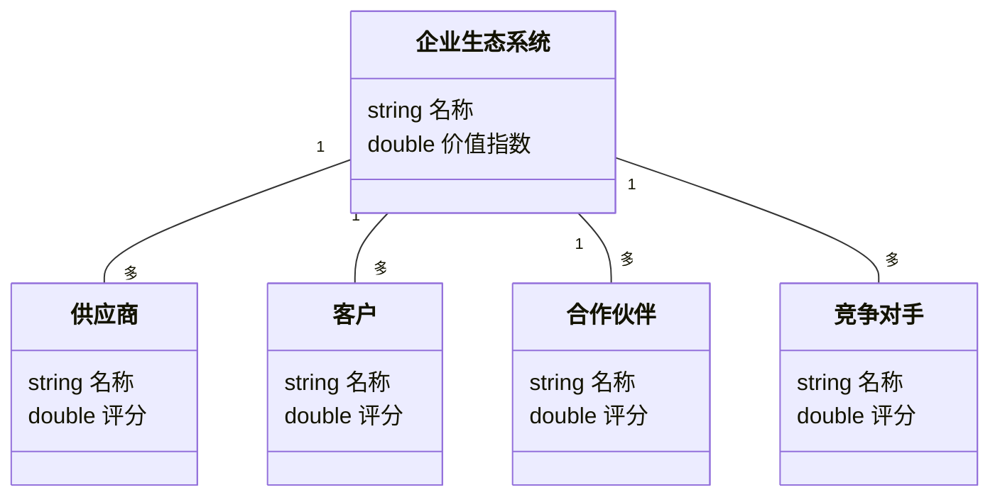
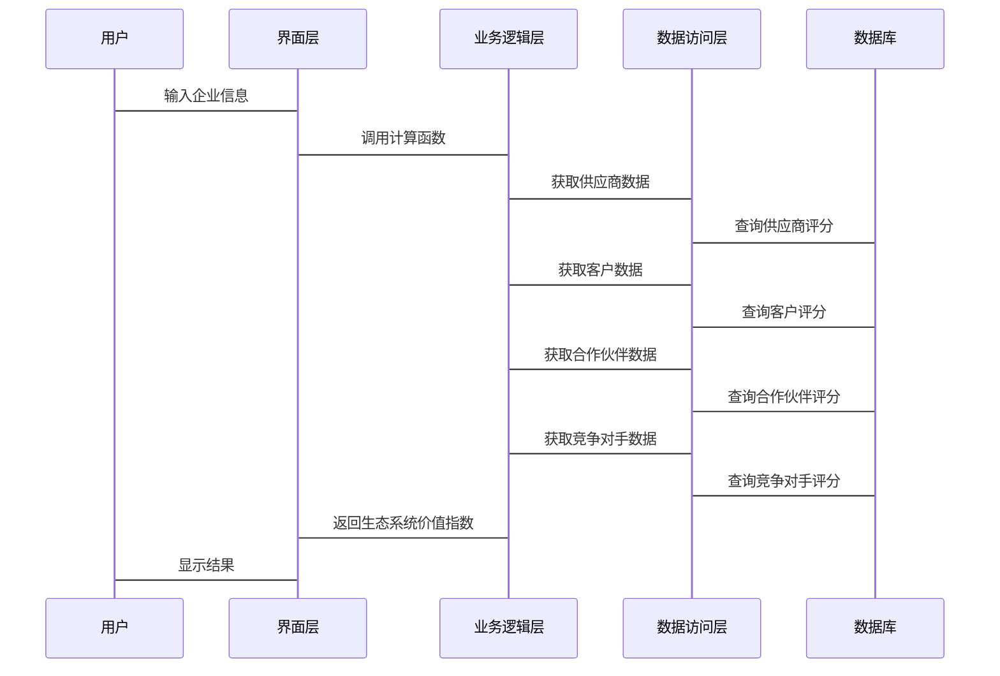

                 


# 如何评估企业的生态系统价值

## 关键词：企业生态系统价值、系统动力学模型、VSM模型、系统架构设计、企业价值评估

## 摘要：企业生态系统价值评估是现代企业管理和战略规划中的重要组成部分。随着商业环境的复杂化，仅仅关注单点价值已不足以衡量企业的整体竞争力。本文通过系统动力学模型和VSM模型，详细探讨了企业生态系统价值的评估方法，并结合实际案例和系统架构设计，为企业提供了一套完整的评估体系。文章内容涵盖了背景分析、核心概念、算法原理、系统设计和项目实战，帮助读者全面理解和应用企业生态系统价值评估。

---

## 第一部分：企业生态系统价值评估的背景与核心概念

### 第1章：企业生态系统价值评估的背景与意义

#### 1.1 企业生态系统价值评估的背景

##### 1.1.1 当前商业环境的变化

在数字化和全球化的推动下，现代企业的生存环境变得越来越复杂。企业不再仅仅依赖于内部资源和能力，而是通过构建生态系统，整合外部资源和合作伙伴，形成协同效应，以应对市场变化和技术革新。生态系统思维已经成为企业战略的核心。

##### 1.1.2 企业生态系统的重要性

企业生态系统是指由企业与其供应商、客户、合作伙伴、竞争对手以及利益相关者组成的复杂网络。生态系统中的各个实体通过价值交换和协同合作，共同为企业创造和传递价值。生态系统能够增强企业的适应能力和创新能力，使企业在竞争中占据优势。

##### 1.1.3 传统企业价值评估的局限性

传统的企业价值评估方法主要关注企业的财务指标，如净利润、资产和负债等，但这些方法无法全面反映企业在生态系统中的整体价值。生态系统价值涉及企业与外部网络的互动，包括战略合作伙伴、客户忠诚度、品牌影响力等，这些因素在传统评估中被忽视。

#### 1.2 企业生态系统价值评估的意义

##### 1.2.1 从单点价值到系统价值的转变

生态系统价值评估不仅仅是对企业的财务状况进行评估，而是从系统的角度，考虑企业与其生态系统中其他实体的互动关系。这种转变能够更全面地反映企业的核心竞争力和未来发展潜力。

##### 1.2.2 生态系统价值对企业竞争力的影响

企业在生态系统中的价值不仅仅体现在财务指标上，还包括企业对合作伙伴的影响力、客户满意度、品牌影响力以及创新能力和资源获取能力。这些因素共同决定了企业在市场中的竞争力。

##### 1.2.3 企业生态系统价值评估的现实需求

随着市场竞争的加剧，企业需要更全面地了解自身的生态系统价值，以便制定更有效的战略决策。生态系统价值评估能够帮助企业识别潜在的风险和机会，优化资源配置，提升整体竞争力。

---

### 第2章：企业生态系统价值的核心概念与联系

#### 2.1 企业生态系统的核心要素

##### 2.1.1 企业内部要素

企业内部要素包括企业的核心业务、组织结构、管理能力、技术创新能力和文化价值观等。这些要素是企业生态系统的基础，决定了企业在生态系统中的地位和影响力。

##### 2.1.2 企业外部要素

企业外部要素包括供应商、客户、合作伙伴、竞争对手、政府机构、行业协会和非政府组织等。这些要素与企业内部要素相互作用，共同构成了企业的生态系统。

##### 2.1.3 核心要素之间的关系

企业生态系统的核心要素之间存在复杂的相互作用关系。例如，供应商的稳定性影响企业的生产效率，客户的满意度影响企业的市场占有率，合作伙伴的合作深度影响企业的创新能力和资源获取能力。

#### 2.2 企业生态系统价值的属性特征对比

以下是企业生态系统价值与传统企业价值的属性特征对比表格：

| **属性**       | **企业价值**                 | **生态系统价值**             |
|----------------|------------------------------|-----------------------------|
| **评估维度**   | 财务指标（如利润、资产）       | 综合指标（如协同效应、影响力） |
| **时间范围**   | 短期                         | 长期                         |
| **评估主体**   | 企业自身                     | 企业及其生态系统             |
| **评估方法**   | 财务分析、DCF模型             | 系统动力学模型、VSM模型     |

#### 2.3 企业生态系统价值的ER实体关系图

以下是企业生态系统价值的ER实体关系图：

```mermaid
erDiagram
    actor 顾客 {
        string 名称
        string 职位
    }
    actor 供应商 {
        string 名称
        string 产品
    }
    actor 合作伙伴 {
        string 名称
        string 合同
    }
    actor 竞争对手 {
        string 名称
        string 产品
    }
    actor 政府机构 {
        string 名称
        string 政策
    }
    企业 实体 {
        string 名称
        string 核心业务
    }
    实体 顾客 "1" -- "多" 实体 产品
    实体 供应商 "1" -- "多" 实体 产品
    实体 合作伙伴 "1" -- "多" 实体 产品
    实体 竞争对手 "1" -- "多" 实体 产品
    实体 政府机构 "1" -- "多" 实体 产品
```

---

## 第二部分：企业生态系统价值评估的算法原理

### 第3章：企业生态系统价值评估的算法原理

#### 3.1 系统动力学模型

##### 3.1.1 系统动力学模型的定义

系统动力学模型是一种用于分析复杂系统动态行为的数学模型。它通过构建系统的反馈环和时间延迟，模拟系统的动态变化过程。

##### 3.1.2 系统动力学模型在企业生态系统中的应用

系统动力学模型可以用于分析企业生态系统中各实体之间的相互作用关系。例如，可以通过系统动力学模型模拟企业与供应商之间的合作关系对企业生态系统价值的影响。

##### 3.1.3 系统动力学模型的优缺点

优点：能够模拟系统的动态变化，提供长期预测。  
缺点：模型复杂，需要大量的数据支持。

#### 3.2 基于VSM模型的企业生态系统价值评估

##### 3.2.1 VSM模型的定义

VSM模型（Value System Model）是一种用于评估企业生态系统价值的数学模型。它通过量化企业生态系统中的各个要素，计算出企业的整体生态系统价值。

##### 3.2.2 VSM模型在企业生态系统中的应用

VSM模型可以用于评估企业生态系统中各要素的权重和评分，从而计算出企业的生态系统价值指数。

##### 3.2.3 VSM模型的数学公式

$$ V = \sum_{i=1}^{n} w_i x_i $$

其中，$w_i$ 是第i个因素的权重，$x_i$ 是第i个因素的评分。

#### 3.3 算法实现的Python代码示例

##### 3.3.1 环境安装

需要安装Python和相关的数据处理库，如NumPy和Pandas。

##### 3.3.2 核心算法实现

```python
import numpy as np
import pandas as pd

def calculate_ecosystem_value(factors, weights):
    return np.dot(factors, weights)

# 示例数据
factors = np.array([5, 4, 3, 2, 1])
weights = np.array([0.3, 0.25, 0.2, 0.15, 0.1])

result = calculate_ecosystem_value(factors, weights)
print(f"企业生态系统价值指数为：{result}")
```

##### 3.3.3 代码功能解读

上述代码定义了一个计算企业生态系统价值指数的函数，输入为因素数组和权重数组，输出为企业的生态系统价值指数。通过调整因素和权重，可以实现对不同企业生态系统价值的评估。

---

## 第三部分：企业生态系统价值评估的系统分析与架构设计

### 第4章：企业生态系统价值评估的系统分析与架构设计

#### 4.1 问题场景介绍

##### 4.1.1 企业生态系统价值评估的典型问题

在企业生态系统价值评估中，常见的问题包括数据获取困难、评估指标不统一、模型复杂度高等。

##### 4.1.2 问题场景的分析与建模

通过对典型问题的分析，我们可以构建一个基于VSM模型的企业生态系统价值评估系统。

#### 4.2 系统功能设计

##### 4.2.1 领域模型的Mermaid类图

以下是领域模型的Mermaid类图：



##### 4.2.2 系统架构设计的Mermaid架构图

以下是系统架构设计的Mermaid架构图：


##### 4.2.3 系统接口设计

系统接口设计包括数据输入接口、模型计算接口和结果展示接口。

##### 4.2.4 系统交互的Mermaid序列图

以下是系统交互的Mermaid序列图：



---

## 第四部分：企业生态系统价值评估的项目实战

### 第5章：企业生态系统价值评估的项目实战

#### 5.1 项目介绍

##### 5.1.1 项目背景

本项目旨在通过构建基于VSM模型的企业生态系统价值评估系统，帮助企业识别和量化生态系统中的关键要素，从而制定更有效的战略决策。

##### 5.1.2 项目目标

项目的最终目标是实现一个能够评估企业生态系统价值的系统，并提供可视化结果。

#### 5.2 系统核心实现

##### 5.2.1 环境安装

需要安装Python、NumPy、Pandas、Matplotlib和Flask框架。

##### 5.2.2 核心算法实现

以下是核心算法实现的Python代码：

```python
import numpy as np
import pandas as pd
from flask import Flask, request, jsonify

app = Flask(__name__)

def calculate_ecosystem_value(factors, weights):
    return np.dot(factors, weights)

@app.route('/api/evaluate', methods=['POST'])
def evaluate():
    data = request.json
    factors = np.array(data['factors'])
    weights = np.array(data['weights'])
    result = calculate_ecosystem_value(factors, weights)
    return jsonify({'result': result})

if __name__ == '__main__':
    app.run(debug=True)
```

##### 5.2.3 代码功能解读

上述代码定义了一个Flask Web服务，提供了一个RESTful API接口，用于接收企业生态系统价值评估的输入数据，并返回计算结果。

#### 5.3 项目实战分析

##### 5.3.1 实际案例分析

以某智能家电企业为例，评估其生态系统价值。

##### 5.3.2 项目小结

通过实际案例分析，我们可以看到基于VSM模型的企业生态系统价值评估系统能够有效地帮助企业识别和量化生态系统中的关键要素，为企业的战略决策提供有力支持。

---

## 第五部分：企业生态系统价值评估的最佳实践

### 第6章：企业生态系统价值评估的最佳实践

#### 6.1 最佳实践 tips

- 确保数据的准确性和完整性。
- 定期更新模型和评估指标。
- 与企业战略目标相结合。

#### 6.2 小结

企业生态系统价值评估是一项复杂但重要的任务。通过系统动力学模型和VSM模型，我们可以更全面地评估企业的生态系统价值，并为企业制定更有效的战略决策提供支持。

#### 6.3 注意事项

- 数据隐私和安全问题需要高度重视。
- 模型的复杂度需要与企业的实际情况相匹配。
- 需要定期对模型进行验证和优化。

#### 6.4 拓展阅读

- 《企业生态系统管理》
- 《系统动力学在企业管理中的应用》
- 《VSM模型的理论与实践》

---

以上是《如何评估企业的生态系统价值》的完整目录和内容框架。通过系统化的分析和实际案例的探讨，本文为企业提供了全面的生态系统价值评估方法和实践指导，帮助企业更好地应对复杂的商业环境挑战。

