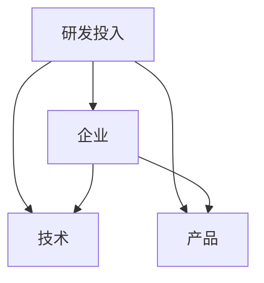
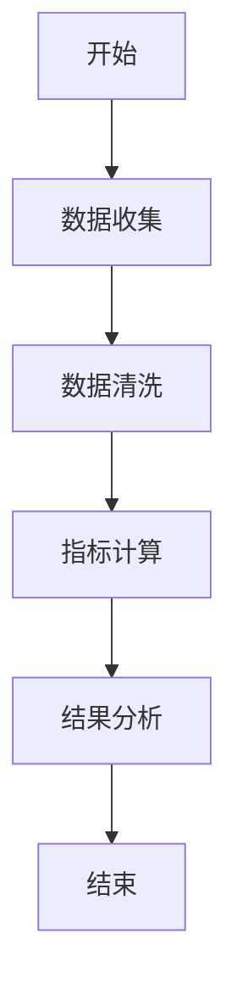
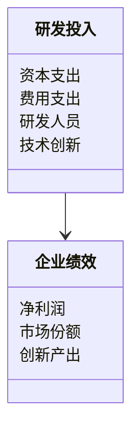
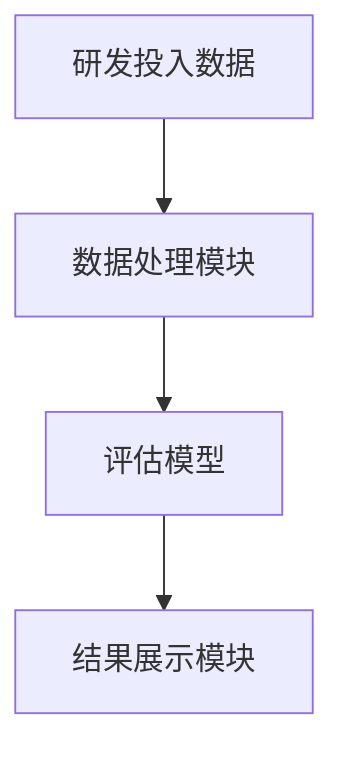

                 


# 如何评估企业的研发投入价值

## 关键词：企业研发投入，价值评估，技术创新，财务分析，战略规划，竞争力分析

## 摘要：本文将深入探讨如何评估企业的研发投入价值，从背景、核心概念、评估模型、系统架构到项目实战，全面解析企业研发投入的价值评估方法。通过理论分析与实际案例相结合，帮助读者掌握如何科学地评估企业研发投入的价值，从而优化企业创新管理和战略决策。

---

# 第一部分: 企业研发投入价值评估背景与概述

## 第1章: 企业研发投入价值评估的背景与重要性

### 1.1 企业研发投入的基本概念

#### 1.1.1 什么是企业研发投入
企业研发投入是指企业在研发活动中的资金、人力资源和时间的投入，包括基础研究、应用研究和试验发展等不同阶段的投入。

#### 1.1.2 研发投入的分类与特点
研发投入可以分为资本性支出和费用性支出。资本性支出用于长期资产的形成，费用性支出用于当期的研发活动。其特点是周期长、风险高、回报不确定。

#### 1.1.3 研发投入在企业中的地位与作用
研发投入是企业技术创新的核心驱动力，是提升企业核心竞争力的关键因素。

### 1.2 研发投入价值评估的重要性

#### 1.2.1 企业战略决策的需求
研发投入的价值评估能够帮助企业在资源分配和战略规划中做出更明智的决策。

#### 1.2.2 投资者与利益相关者的关注点
投资者关注研发投入的回报率和未来的盈利能力，利益相关者关注企业的创新能力和市场竞争力。

#### 1.2.3 行业竞争与技术发展的驱动
在技术快速发展的行业中，研发投入的价值直接关系到企业的市场地位和生存能力。

### 1.3 研发投入价值评估的挑战与难点

#### 1.3.1 评估指标的多样性与复杂性
研发投入涉及多个维度，包括财务指标和非财务指标，需要综合考虑。

#### 1.3.2 研发投入周期长与不确定性
研发投入往往需要数年时间才能见效，且存在技术和市场不确定性的风险。

#### 1.3.3 数据获取与处理的难度
企业内部数据的保密性、外部数据的可获得性以及数据处理的复杂性都增加了评估的难度。

---

## 第2章: 企业研发投入价值评估的核心概念

### 2.1 研发投入的财务与非财务维度

#### 2.1.1 财务维度：资本支出与研发投入占比
资本支出是指企业在设备、设施和无形资产上的投入，研发投入占比是指研发投入占企业总收入的比例。

#### 2.1.2 非财务维度：创新产出与技术领先性
创新产出包括专利数量、新产品数量，技术领先性是指企业在技术领域的领先地位。

### 2.2 研发投入与企业绩效的关系

#### 2.2.1 研发投入对企业盈利能力的影响
高研发投入通常意味着更高的创新能力，从而提升企业的盈利能力。

#### 2.2.2 研发投入与企业成长性之间的关联
持续的研发投入能够增强企业的市场竞争力，促进企业的持续成长。

#### 2.2.3 研发投入与企业风险的平衡
高研发投入意味着高风险，但合理的风险控制能够提升研发投入的回报。

### 2.3 研发投入的周期性与阶段特征

#### 2.3.1 研发投入的早期阶段特征
早期阶段研发投入主要用于技术研发和产品原型开发，风险较高，回报不确定。

#### 2.3.2 研发投入的中期阶段特征
中期阶段研发投入主要用于产品优化和市场扩展，风险逐渐降低，回报开始显现。

#### 2.3.3 研发投入的后期阶段特征
后期阶段研发投入主要用于产品升级和技术创新，风险较低，回报稳定。

### 2.4 核心概念属性对比表

| 属性         | 资本性研发投入 | 费用性研发投入 |
|--------------|----------------|----------------|
| 目标         | 长期资产形成   | 当期费用支出   |
| 风险         | 高             | 中高           |
| 周期         | 长             | 中长           |
| 回报         | 稳定           | 不确定         |

### 2.5 ER实体关系图



---

## 第3章: 企业研发投入价值评估的算法原理

### 3.1 研发投入价值评估的数学模型

#### 3.1.1 基于财务指标的评估模型
$$ ROI = \frac{\text{净利润}}{\text{研发投入}} $$

#### 3.1.2 基于技术创新的评估模型
$$ TI = \frac{\text{创新产出}}{\text{研发投入}} $$

### 3.2 研发投入价值评估的流程图



---

## 第4章: 企业研发投入价值评估的系统分析与架构设计

### 4.1 问题场景介绍

#### 4.1.1 项目背景
某高科技公司希望评估其研发投入的价值，优化资源配置。

### 4.1.2 项目介绍
通过构建一个评估模型，帮助企业分析研发投入与企业绩效之间的关系。

### 4.2 系统功能设计

#### 4.2.1 领域模型


### 4.3 系统架构设计

#### 4.3.1 系统架构图


---

## 第5章: 企业研发投入价值评估的项目实战

### 5.1 环境安装

#### 5.1.1 安装Python环境
使用Anaconda安装Python 3.8及以上版本。

### 5.2 系统核心实现源代码

```python
import pandas as pd

def calculate ROI(net_profit, R&D_expense):
    return net_profit / R&D_expense

data = pd.read_csv('研发投入.csv')
data['ROI'] = calculate ROI(data['净利润'], data['R&D支出'])
print(data)
```

### 5.3 实际案例分析

#### 5.3.1 案例背景
某科技公司过去三年的研发投入和净利润数据。

#### 5.3.2 数据分析
使用Python代码计算ROI，评估研发投入的价值。

---

## 第6章: 企业研发投入价值评估的最佳实践

### 6.1 小结
企业研发投入的价值评估是优化创新管理和战略决策的关键。

### 6.2 注意事项
数据的准确性和完整性是评估的基础，同时需要结合企业的实际情况。

### 6.3 拓展阅读
建议阅读相关书籍和文献，深入理解研发投入的价值评估方法。

---

## 第7章: 总结与展望

### 7.1 本文总结
本文系统地探讨了如何评估企业的研发投入价值，提供了理论分析和实际案例。

### 7.2 未来展望
未来可以进一步研究动态评估模型和多维度评估方法，以适应快速变化的技术环境。

---

通过以上步骤，我们可以全面评估企业的研发投入价值，优化企业的创新管理和战略决策。

