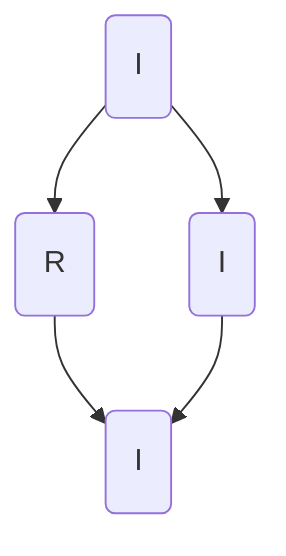
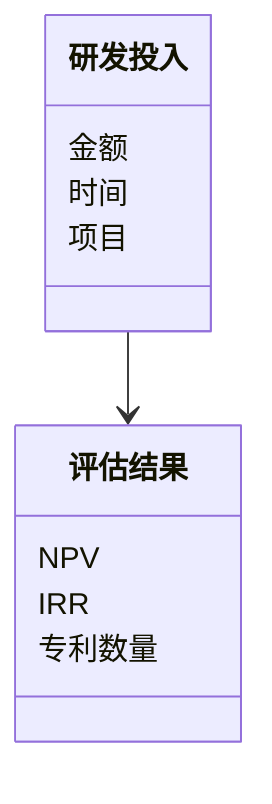

                 


# 如何评估企业的研发投入效率

> 关键词：企业研发投入效率、评估模型、算法原理、系统分析、项目实战、最佳实践

> 摘要：本文将详细探讨如何评估企业的研发投入效率，从背景介绍、核心概念、数学模型、系统分析到实际案例，逐步分析如何通过科学的方法和工具，提高企业的研发效率和投资回报率。

---

# 第一部分: 企业研发投入效率评估的背景与核心概念

## 第1章: 企业研发投入效率评估的背景与意义

### 1.1 什么是企业研发投入效率
#### 1.1.1 研发投入的基本概念
研发投入是指企业在研发活动中所投入的资源，包括人力、物力和财力等。这些资源主要用于新产品开发、技术改进和创新活动。

#### 1.1.2 研发投入效率的定义
研发投入效率是指企业在一定时间内将研发投入转化为实际产出的能力，通常以单位研发投入产生的收益或成果来衡量。

#### 1.1.3 研发投入效率的重要性
在当今竞争激烈的市场环境中，研发投入效率是企业保持竞争优势的关键因素。高效的研发投入能够缩短产品开发周期、降低研发成本，并提高创新成果的市场价值。

### 1.2 企业研发投入效率评估的背景
#### 1.2.1 当前企业研发投入的现状
随着技术的快速发展，企业研发投入的规模和复杂性不断增加。然而，如何衡量研发投入的效率成为企业面临的重要挑战。

#### 1.2.2 研发投入效率评估的必要性
通过评估研发投入效率，企业可以优化资源配置、降低浪费，并确保研发活动与企业战略目标一致。

#### 1.2.3 研发投入效率评估的边界与外延
研发投入效率评估不仅关注财务指标，还包括专利产出、市场反馈和团队绩效等多维度的评估。

## 第2章: 研发投入效率评估的核心概念与联系

### 2.1 核心概念原理
#### 2.1.1 研发投入与企业绩效的关系
研发投入与企业绩效之间存在正相关关系，但需要通过科学的评估方法来量化这种关系。

#### 2.1.2 研发投入效率的衡量维度
- **财务维度**：如研发投入占总收入的比例、净现值（NPV）等。
- **技术维度**：如专利数量、技术领先性等。
- **时间维度**：如研发周期、项目完成率等。

### 2.2 核心概念对比分析
#### 2.2.1 研发投入与运营成本的对比
研发投入是企业未来增长的投资，而运营成本是维持日常运作的支出。

#### 2.2.2 研发投入与市场回报的对比
高研发投入不一定带来高市场回报，关键在于研发效率和成果的商业化能力。

#### 2.2.3 研发投入与企业生命周期的关系
在企业生命周期的不同阶段，研发投入的效率和重点会有所不同。

### 2.3 实体关系图（ER图）


---

# 第二部分: 研发投入效率评估的数学模型与算法原理

## 第3章: 研发投入效率评估的数学模型

### 3.1 基于财务指标的评估模型
#### 3.1.1 净现值法（NPV）
$$ NPV = \sum_{t=0}^{n} \frac{C_t}{(1+r)^t} $$

#### 3.1.2 内部收益率法（IRR）
$$ IRR = r \text{ 使得 } \sum_{t=0}^{n} \frac{C_t}{(1+r)^t} = 0 $$

### 3.2 基于专利产出的评估模型
#### 3.2.1 专利数量与研发投入的关系
$$ \text{专利数量} = f(\text{研发投入}) $$

#### 3.2.2 专利质量评估指标
- 专利的创新性
- 专利的市场应用潜力

### 3.3 综合评估模型
#### 3.3.1 加权平均模型
$$ E = \sum_{i=1}^{n} w_i x_i $$

#### 3.3.2 数据包络分析（DEA）


---

## 第4章: 算法原理与实现

### 4.1 算法原理
#### 4.1.1 数据预处理
- 数据清洗
- 数据标准化

#### 4.1.2 模型训练
- 参数估计
- 模型优化

#### 4.1.3 模型验证
- 交叉验证
- 模型调优

### 4.2 算法实现
```python
import numpy as np
from sklearn.metrics import accuracy_score

# 示例代码：计算净现值
def calculate_npv(cash_flows, discount_rate):
    npv = 0
    for t, cash_flow in enumerate(cash_flows):
        npv += cash_flow / (1 + discount_rate) ** t
    return npv

# 示例代码：计算内部收益率
def calculate_irr(cash_flows):
    return np.irr(cash_flows)

# 示例代码：评估模型准确率
def evaluate_model(y_true, y_pred):
    return accuracy_score(y_true, y_pred)
```

---

# 第三部分: 系统分析与架构设计方案

## 第5章: 系统分析与架构设计方案

### 5.1 问题场景介绍
- 研发项目管理
- 研发资源分配
- 研发成果评估

### 5.2 系统功能设计
#### 5.2.1 领域模型


#### 5.2.2 系统架构设计


---

# 第四部分: 项目实战

## 第6章: 项目实战

### 6.1 环境安装
- 安装必要的Python库：numpy、pandas、scikit-learn
- 安装mermaid图表工具

### 6.2 系统核心实现源代码
```python
import numpy as np
from sklearn.metrics import accuracy_score

def calculate_npv(cash_flows, discount_rate):
    npv = 0
    for t, cash_flow in enumerate(cash_flows):
        npv += cash_flow / (1 + discount_rate) ** t
    return npv

def calculate_irr(cash_flows):
    return np.irr(cash_flows)

def evaluate_model(y_true, y_pred):
    return accuracy_score(y_true, y_pred)
```

### 6.3 代码应用解读与分析
- 净现值计算用于评估项目的盈利能力。
- 内部收益率用于比较不同项目的投资回报。

### 6.4 实际案例分析
- 案例背景
- 数据准备
- 模型训练
- 结果分析

### 6.5 项目小结
- 项目目标的实现情况
- 经验总结
- 改进建议

---

# 第五部分: 最佳实践、小结与展望

## 第7章: 最佳实践

### 7.1 小结
- 核心概念回顾
- 评估模型总结
- 系统设计经验

### 7.2 注意事项
- 数据质量的重要性
- 模型选择的合理性
- 结果解读的客观性

### 7.3 拓展阅读
- 推荐相关书籍和论文
- 提供进一步学习的方向

---

# 附录

## 附录A: 术语表
- NPV：净现值
- IRR：内部收益率
- DEA：数据包络分析

## 附录B: 参考文献
- 文献1：XXX
- 文献2：XXX
- 文献3：XXX

---

# 结束语

通过本文的详细分析和系统讲解，读者可以全面了解如何评估企业的研发投入效率，并能够实际应用这些方法和工具来优化企业的研发管理。

