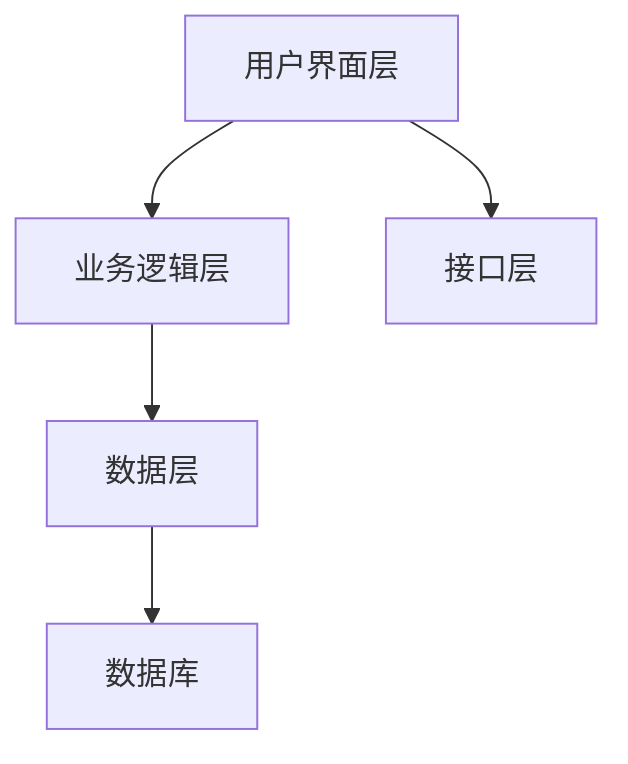
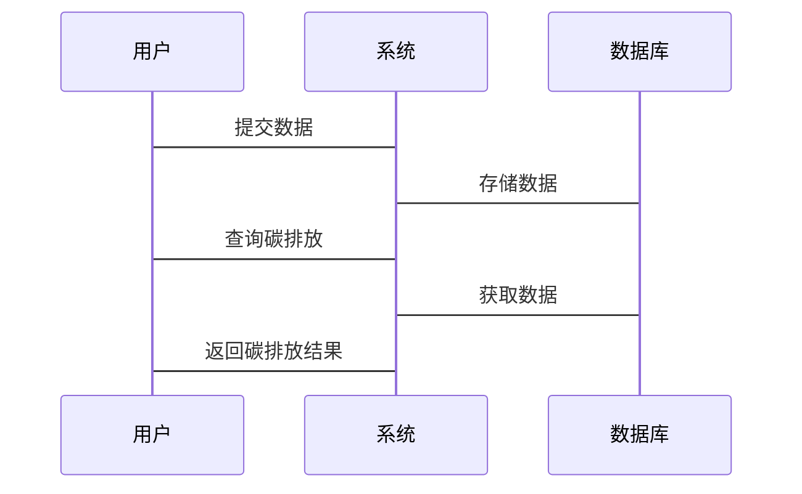

                 


# 如何评估企业的碳中和战略

## 关键词：碳中和，战略评估，企业，碳足迹，可持续发展，碳平衡

## 摘要：  
本文详细探讨了如何系统性地评估企业的碳中和战略。首先，从碳中和的定义、重要性及全球趋势入手，分析了碳中和战略的核心要素。接着，提出了基于碳足迹分析和碳平衡模型的评估方法论，结合实际案例，详细阐述了碳中和战略的实施路径。最后，通过系统架构设计和项目实战，展示了如何将理论应用于实际。本文旨在为企业提供一套科学、可操作的碳中和战略评估框架，助力企业在实现碳中和目标的同时，提升竞争力和可持续发展能力。

---

## 第1章: 碳中和的定义与重要性

### 1.1 碳中和的定义与内涵

碳中和是指在一定时期内，通过减少温室气体排放、增加碳汇等方式，使二氧化碳的净排放量为零。碳中和的核心内涵包括：  
1. **减排优先**：通过技术创新和管理优化，减少直接和间接的碳排放。  
2. **碳汇补偿**：利用植树造林、碳捕获等手段，抵消剩余的碳排放。  
3. **可持续性**：碳中和不仅是环境目标，更是企业长期发展的战略选择。  

碳中和与可持续发展的关系密不可分。企业实现碳中和不仅有助于应对气候变化，还能提升品牌形象、降低成本，并在竞争中占据优势。

### 1.2 碳中和战略对企业的影响

#### 1.2.1 碳中和对企业社会责任的要求  
企业作为社会的重要组成部分，承担着减少碳排放的社会责任。碳中和战略的实施，不仅是对企业自身的要求，也是对社会和环境负责的表现。

#### 1.2.2 碳中和对企业竞争力的影响  
碳中和战略直接影响企业的运营成本、供应链效率和市场准入。例如，通过减少能源消耗，企业可以降低运营成本；通过采用绿色技术，企业可以提升产品竞争力。

#### 1.2.3 碳中和与企业长期发展的关系  
碳中和是企业可持续发展的核心要素。通过实现碳中和，企业可以规避政策风险，增强品牌价值，同时为未来的绿色经济发展奠定基础。

### 1.3 全球碳中和趋势与企业应对

#### 1.3.1 全球碳中和目标的背景  
全球气候变化问题日益严峻，各国政府纷纷制定碳中和目标。例如，欧盟计划在2050年实现碳中和，中国也在2020年提出“碳达峰”和“碳中和”的双碳目标。

#### 1.3.2 各国碳中和政策对企业的影响  
碳中和政策的实施将对企业产生深远影响。例如，碳边境调节机制可能增加企业的出口成本，而政府的绿色补贴则可以降低企业的转型成本。

#### 1.3.3 企业应对碳中和的策略  
企业需要制定长期的碳中和战略，包括技术转型、管理优化和供应链合作。同时，企业还需要加强内部培训，提升员工的碳中和意识。

---

## 第2章: 企业碳中和战略的核心要素

### 2.1 碳排放的来源与分类

碳排放主要来源于企业的生产过程、供应链和日常运营。以下是碳排放的主要来源：  
1. **生产过程**：包括能源消耗（如电力、燃气）和原材料使用。  
2. **供应链**：包括原材料采购、物流运输等环节的碳排放。  
3. **日常运营**：包括员工通勤、办公能耗等。  

碳排放的分类与界定需要遵循统一的标准，例如ISO 14067标准。碳排放的生命周期分析可以帮助企业全面识别碳排放的来源。

### 2.2 碳中和目标的设定与分解

#### 2.2.1 碳中和目标的设定原则  
碳中和目标应基于企业的实际情况，包括行业特点、发展阶段和资源禀赋。目标的设定需要考虑可实现性、经济性和创新性。

#### 2.2.2 碳中和目标的分解与实施路径  
企业需要将碳中和目标分解为具体的行动计划，例如：  
1. **短期目标**：减少20%的碳排放。  
2. **中期目标**：实现碳达峰。  
3. **长期目标**：实现碳中和。  

### 2.3 碳中和战略的关键成功因素

#### 2.3.1 管理层的承诺与责任  
碳中和战略的实施需要得到管理层的高度重视和持续支持。管理层应明确责任分工，确保战略的顺利推进。

#### 2.3.2 全员参与与文化建设  
碳中和战略的实施需要全体员工的共同努力。企业应通过培训、激励等方式，提升员工的环保意识和参与度。

#### 2.3.3 技术创新与资源整合  
技术创新是实现碳中和的核心驱动力。企业需要加大对绿色技术的投入，同时积极寻求外部合作，资源整合。

---

## 第3章: 企业碳中和战略的评估框架

### 3.1 碳中和战略评估的总体框架

碳中和战略评估需要从目标设定、减排措施、碳汇补偿等多个方面进行综合考量。以下是评估框架的主要模块：  
1. **目标设定**：明确碳中和目标的范围和时间表。  
2. **减排措施**：分析企业采取的减排措施及其效果。  
3. **碳汇补偿**：评估碳汇的可行性和效果。  
4. **持续改进**：根据评估结果，优化碳中和战略。

### 3.2 碳中和战略评估的关键指标

#### 3.2.1 碳排放量的计算与测量  
碳排放量的计算需要基于企业的实际运营数据，包括能源消耗、原材料使用等。以下是碳排放的计算公式：  
$$ \text{碳排放量} = \sum (\text{能源消耗量} \times \text{碳排放因子}) $$  

#### 3.2.2 碳减排的绩效指标  
碳减排的绩效指标包括单位产品碳排放强度、碳排放总量变化等。  
$$ \text{碳排放强度} = \frac{\text{碳排放总量}}{\text{产品数量}} $$  

#### 3.2.3 碳中和目标的达成度评估  
碳中和目标的达成度可以通过对比实际排放量与目标排放量进行评估。  
$$ \text{达成度} = \frac{\text{目标排放量} - \text{实际排放量}}{\text{目标排放量}} \times 100\% $$  

### 3.3 碳中和战略评估的方法与工具

#### 3.3.1 碳足迹分析方法  
碳足迹分析方法通过对企业全生命周期的碳排放进行量化，帮助企业识别减排的关键环节。以下是碳足迹分析的流程：  
1. **确定范围**：明确分析的范围和边界。  
2. **数据收集**：收集企业的能源消耗、原材料使用等数据。  
3. **计算碳排放**：根据碳排放因子，计算各环节的碳排放量。  
4. **结果分析**：识别碳排放的主要来源，制定减排措施。  

#### 3.3.2 碳平衡分析工具  
碳平衡分析工具通过对企业碳排放的平衡情况进行分析，帮助企业制定碳中和方案。以下是碳平衡分析的步骤：  
1. **计算碳排放总量**：基于企业的实际运营数据，计算总的碳排放量。  
2. **确定碳汇能力**：评估企业自身的碳汇能力，如植树造林、碳捕获等。  
3. **制定碳中和方案**：根据碳排放总量和碳汇能力，制定碳中和的具体方案。  

#### 3.3.3 数据分析与建模技术  
数据分析与建模技术通过对企业碳排放数据进行建模，预测碳排放的变化趋势，并制定相应的优化策略。以下是常用的建模方法：  
1. **线性回归模型**：用于预测碳排放的变化趋势。  
2. **情景分析模型**：用于分析不同情景下的碳排放影响。  
3. **决策树模型**：用于识别碳排放的主要影响因素。  

---

## 第4章: 企业碳中和战略的实施路径

### 4.1 碳中和战略的实施步骤

#### 4.1.1 目标设定与分解  
企业需要将碳中和目标分解为具体的行动计划，例如：  
1. **短期目标**：减少20%的碳排放。  
2. **中期目标**：实现碳达峰。  
3. **长期目标**：实现碳中和。  

#### 4.1.2 碳减排措施的制定  
碳减排措施包括技术创新、管理优化和供应链合作。以下是具体的措施：  
1. **技术创新**：研发绿色技术，降低能源消耗。  
2. **管理优化**：优化生产流程，提高能源利用效率。  
3. **供应链合作**：与供应商合作，推动供应链的绿色转型。  

#### 4.1.3 碳中和目标的实现路径  
碳中和目标的实现需要多方面的努力，包括：  
1. **技术转型**：采用清洁能源和绿色技术。  
2. **管理变革**：建立碳中和管理体系。  
3. **文化重塑**：提升员工的环保意识。  

### 4.2 碳中和战略的实施策略

#### 4.2.1 技术创新与应用  
技术创新是实现碳中和的核心驱动力。企业需要加大对绿色技术的投入，例如：  
1. **清洁能源技术**：如太阳能、风能等可再生能源技术。  
2. **碳捕获技术**：如碳捕获与封存（CCS）技术。  

#### 4.2.2 管理体系优化  
碳中和战略的实施需要建立完善的管理体系。企业应制定碳中和管理手册，明确各环节的管理要求。  

#### 4.2.3 供应链协同与合作  
供应链是企业碳排放的重要来源。企业需要与供应商合作，推动供应链的绿色转型。例如，推动供应商采用绿色包装、绿色物流等措施。

### 4.3 碳中和战略的监控与调整

#### 4.3.1 碳排放的实时监控  
企业需要建立碳排放实时监控系统，及时掌握各环节的碳排放数据。  
- **监控工具**：如碳排放监测平台。  
- **监控指标**：如实时碳排放量、碳排放强度等。  

#### 4.3.2 评估结果的反馈与改进  
企业需要定期评估碳中和战略的实施效果，并根据评估结果进行改进。例如，每季度进行一次碳排放评估，分析减排效果，并调整下一步的行动计划。  

#### 4.3.3 策略的动态调整与优化  
碳中和战略的实施需要动态调整。企业应根据内外部环境的变化，及时优化战略。例如，根据政策变化调整减排目标，根据技术进步调整减排措施。

---

## 第5章: 企业碳中和战略的系统分析与架构设计

### 5.1 问题场景介绍

#### 5.1.1 企业碳排放的主要来源  
企业的碳排放主要来源于能源消耗、原材料使用和供应链活动。例如，制造企业可能主要通过电力消耗产生碳排放。

#### 5.1.2 碳中和目标的实现难点  
碳中和目标的实现难点包括：  
1. **技术瓶颈**：部分行业缺乏有效的减排技术。  
2. **成本问题**：碳中和转型可能需要较大的投资。  
3. **数据不足**：部分企业缺乏完整的碳排放数据。  

#### 5.1.3 系统分析的必要性  
系统分析可以帮助企业全面识别碳排放的来源，制定科学的减排措施。通过系统分析，企业可以实现碳排放的精准管理和优化。

### 5.2 系统功能设计

#### 5.2.1 系统功能模块  
碳中和管理系统主要包括以下功能模块：  
1. **数据采集模块**：采集企业的能源消耗、原材料使用等数据。  
2. **碳排放计算模块**：根据碳排放因子，计算各环节的碳排放量。  
3. **减排措施模块**：制定并实施减排措施。  
4. **碳汇模块**：管理碳汇资源，实现碳中和。  
5. **监控与评估模块**：实时监控碳排放，评估减排效果。  

#### 5.2.2 系统功能流程  
以下是碳中和管理系统的功能流程：  
1. **数据采集**：采集企业的能源消耗、原材料使用等数据。  
2. **碳排放计算**：根据碳排放因子，计算各环节的碳排放量。  
3. **减排措施制定**：基于碳排放计算结果，制定减排措施。  
4. **碳汇管理**：根据碳排放总量，制定碳汇补偿方案。  
5. **监控与评估**：实时监控碳排放，评估减排效果，并动态调整战略。

### 5.3 系统架构设计

#### 5.3.1 系统架构概述  
碳中和管理系统采用分层架构设计，主要包括数据层、业务逻辑层和用户界面层。  

#### 5.3.2 系统架构图  
以下是系统的架构图：



#### 5.3.3 系统接口设计  
系统接口设计包括：  
1. **数据采集接口**：用于采集企业的能源消耗、原材料使用等数据。  
2. **碳排放计算接口**：用于计算各环节的碳排放量。  
3. **减排措施接口**：用于制定并实施减排措施。  
4. **碳汇接口**：用于管理碳汇资源。  

#### 5.3.4 系统交互流程  
以下是系统的交互流程：



---

## 第6章: 企业碳中和战略的项目实战

### 6.1 项目背景

#### 6.1.1 项目介绍  
某制造企业计划在2030年实现碳中和，希望通过系统化的方法评估其碳中和战略的实施效果。

#### 6.1.2 项目目标  
1. 计算企业的碳排放总量。  
2. 分析碳排放的主要来源。  
3. 制定碳中和的具体措施。  

### 6.2 项目核心实现

#### 6.2.1 环境安装  
1. **安装Python**：用于数据处理和建模。  
2. **安装数据分析库**：如Pandas、NumPy、Matplotlib等。  
3. **安装碳排放因子数据库**：如国际能源署（IEA）提供的数据。  

#### 6.2.2 核心代码实现  
以下是计算碳排放的Python代码示例：

```python
import pandas as pd
import numpy as np

# 读取能源消耗数据
energy_consumption = pd.read_csv('energy_consumption.csv')

# 读取碳排放因子
carbon_factor = pd.read_csv('carbon_factor.csv')

# 计算碳排放量
carbon_emission = energy_consumption['energy'] * carbon_factor['factor']

# 输出结果
print("碳排放总量：", carbon_emission.sum())
```

#### 6.2.3 代码应用解读与分析  
1. **数据采集**：读取企业的能源消耗数据和碳排放因子数据。  
2. **计算碳排放量**：根据能源消耗和碳排放因子，计算各环节的碳排放量。  
3. **结果分析**：输出碳排放总量，并分析碳排放的主要来源。  

### 6.3 项目小结

#### 6.3.1 实施效果  
通过项目实施，企业成功计算了碳排放总量，并识别了碳排放的主要来源。

#### 6.3.2 经验总结  
1. 数据的准确性和完整性是碳中和评估的关键。  
2. 碳中和战略的实施需要企业内部的广泛参与。  
3. 碳中和目标的实现需要技术创新和管理优化的结合。

---

## 第7章: 企业碳中和战略的最佳实践与未来展望

### 7.1 碳中和战略的最佳实践

#### 7.1.1 数据驱动的碳中和管理  
企业应充分利用数据，建立碳排放实时监控系统，实现精准管理。

#### 7.1.2 技术创新与合作  
企业需要加大绿色技术的研发投入，并与供应商、政府等多方合作，共同推动碳中和目标的实现。

#### 7.1.3 员工参与与文化重塑  
碳中和战略的实施需要全体员工的共同努力，企业应通过培训、激励等方式，提升员工的环保意识。

### 7.2 未来展望

#### 7.2.1 碳中和技术的突破  
未来，碳捕获、可再生能源等技术将取得突破，为企业实现碳中和提供更多的选择。

#### 7.2.2 碳中和管理的数字化  
随着数字化技术的发展，碳中和管理将更加智能化、精准化。

#### 7.2.3 全球碳中和目标的协同  
企业需要积极参与全球碳中和行动，与其他企业、政府、非政府组织等协同合作，共同应对气候变化。

---

## 总结

企业碳中和战略的评估是一个系统性工程，需要从目标设定、减排措施、碳汇补偿等多个方面进行综合考量。通过系统分析和实践应用，企业可以制定科学的碳中和战略，实现可持续发展。未来，随着技术的进步和全球合作的加强，企业的碳中和战略将更加高效和精准。

