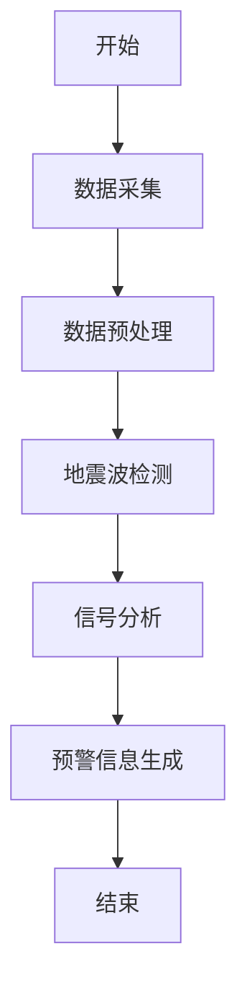
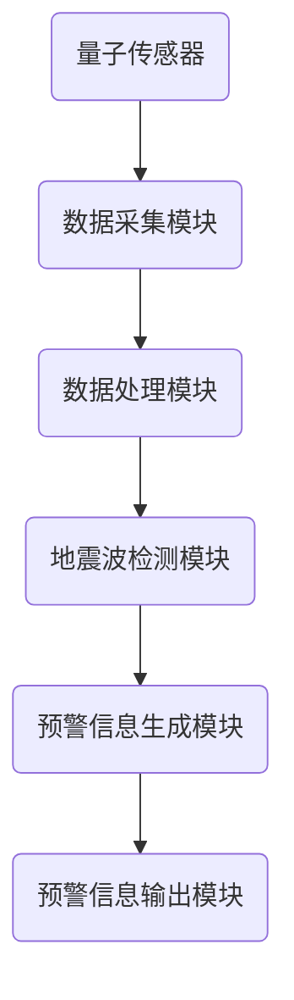

                 


# 如何评估企业的量子传感器地震预警应用

## 关键词：量子传感器，地震预警，企业应用，算法原理，系统架构

## 摘要：量子传感器地震预警应用通过量子技术提升地震检测的精准性和及时性，为企业提供高效的预警解决方案。本文从背景、核心概念、算法原理、系统架构、项目实战和最佳实践等方面详细分析，帮助读者全面理解并评估该技术的应用价值。

---

## 第1章: 量子传感器地震预警应用的背景介绍

### 1.1 问题背景与问题描述

#### 1.1.1 地震预警的重要性
地震作为一种自然灾害，对人类生命和财产安全构成严重威胁。传统地震预警系统依赖于地震仪和电磁波传播，存在响应时间长、精度不足等问题。而量子传感器的引入，为地震预警提供了更高的精度和更快的响应速度。

#### 1.1.2 传统地震预警技术的局限性
传统地震预警系统主要依靠地震波的传播速度进行预测，但存在以下问题：
- 数据采集精度有限
- 信号处理时间较长
- 预警范围有限

#### 1.1.3 量子传感器技术的引入
量子传感器利用量子纠缠和超灵敏检测原理，能够更精确地捕捉地震前兆信号，如地壳微小振动和电磁场变化。这种技术可以显著提高地震预警的准确性和及时性。

### 1.2 问题解决与边界定义

#### 1.2.1 量子传感器在地震预警中的作用
量子传感器通过实时监测地壳微动，能够提前捕捉到地震波的早期信号，为预警系统提供更准确的数据支持。

#### 1.2.2 应用场景与边界
- **应用场景**：城市地震预警、重要建筑保护、核电站安全等。
- **边界**：仅限于地震预警，不涉及其他自然灾害的预警。

#### 1.2.3 核心问题与解决方案
- **核心问题**：如何快速、准确地捕捉地震前兆信号。
- **解决方案**：利用量子传感器的高灵敏度和快速响应能力，构建高效的地震预警系统。

### 1.3 核心概念与结构

#### 1.3.1 量子传感器的定义与特点
- **定义**：一种基于量子力学原理设计的传感器，能够检测极微弱的物理信号。
- **特点**：高灵敏度、快速响应、抗干扰能力强。

#### 1.3.2 地震预警系统的定义与特点
- **定义**：利用传感器和算法技术实时监测并预测地震的系统。
- **特点**：实时性高、准确性强、覆盖范围广。

#### 1.3.3 企业应用的核心要素
- **数据采集**：量子传感器实时采集地震相关数据。
- **数据处理**：对采集的数据进行预处理和特征提取。
- **预警算法**：基于量子数据的地震预警算法。

## 第2章: 量子传感器与地震预警系统的核心概念

### 2.1 核心概念与属性特征

#### 2.1.1 量子传感器的定义与特点
- **定义**：基于量子力学原理设计的传感器。
- **特点**：高灵敏度、快速响应、抗干扰能力强。

#### 2.1.2 地震预警系统的定义与特点
- **定义**：实时监测和预测地震的系统。
- **特点**：实时性高、准确性强、覆盖范围广。

#### 2.1.3 企业应用的定义与特点
- **定义**：企业在生产和运营中应用量子传感器进行地震预警。
- **特点**：针对性强、效率高、安全性好。

### 2.2 核心概念之间的关系

#### 2.2.1 量子传感器与地震预警系统的关联
- 量子传感器为地震预警系统提供高精度数据。
- 地震预警系统利用量子传感器数据进行预测和预警。

#### 2.2.2 地震预警系统与企业应用的关联
- 企业应用依赖地震预警系统提供实时预警信息。
- 地震预警系统为企业应用提供技术支持。

#### 2.2.3 量子传感器与企业应用的关联
- 企业应用依赖量子传感器进行数据采集。
- 量子传感器为企业应用提供高精度的地震预警数据。

### 2.3 ER实体关系图

```mermaid
erDiagram
    actor 企业用户 {
        string 企业ID
        string 用户ID
        string 应用场景
    }
    sensor 量子传感器 {
        string 传感器ID
        string 位置
        string 时间
    }
    预警系统 地震预警系统 {
        string 系统ID
        string 预警时间
        string 预警级别
    }
    企业用户 -> 预警系统 : 使用
    量子传感器 -> 预警系统 : 数据输入
    预警系统 -> 企业用户 : 提供预警信息
```

## 第3章: 量子传感器地震预警算法原理

### 3.1 算法原理与流程

#### 3.1.1 量子传感器数据采集与处理
- **数据采集**：量子传感器实时采集地震相关数据，如微小振动和电磁场变化。
- **数据预处理**：对采集的数据进行降噪和特征提取。

#### 3.1.2 地震波检测与分析
- **地震波检测**：利用量子传感器数据检测地震波信号。
- **信号分析**：通过算法分析地震波的强度、频率和传播方向。

#### 3.1.3 预警信息生成与输出
- **预警信息生成**：基于分析结果生成预警信息，包括预警时间和强度。
- **预警信息输出**：通过系统将预警信息发送给相关企业和用户。

### 3.2 算法流程图



### 3.3 算法实现与数学模型

#### 3.3.1 数据预处理算法
- **目标**：去除噪声，提取有效信号。
- **方法**：使用小波变换和傅里叶变换进行信号处理。

#### 3.3.2 地震波检测算法
- **目标**：检测地震波信号。
- **方法**：基于阈值检测和模式识别技术。

#### 3.3.3 预警信息生成算法
- **目标**：生成预警信息。
- **方法**：基于统计模型和机器学习算法预测地震强度和时间。

### 3.4 算法实现代码示例

```python
import numpy as np
from scipy.signal import fft, correlate

def preprocess_data(data):
    # 假设data为量子传感器采集的数据
    # 数据降噪处理
    filtered_data = fft(data)
    return filtered_data

def detect_seismic Waves(filtered_data):
    # 地震波检测算法
    threshold = np.mean(abs(filtered_data)) + 2*np.std(abs(filtered_data))
    detected_waves = np.where(filtered_data > threshold, True, False)
    return detected_waves

def generate_warning(detected_waves):
    # 预警信息生成
    warning_level = np.sum(detected_waves)
    return warning_level
```

### 3.5 算法数学模型与公式

地震波检测的数学模型如下：

$$
\text{检测结果} = \begin{cases}
\text{检测到地震波} & \text{if } |filtered\_data| > \text{阈值} \\
\text{未检测到地震波} & \text{otherwise}
\end{cases}
$$

其中，阈值计算公式为：

$$
\text{阈值} = \mu + 2\sigma
$$

其中，$\mu$ 是数据均值，$\sigma$ 是标准差。

---

## 第4章: 量子传感器地震预警系统的分析与架构设计

### 4.1 系统分析

#### 4.1.1 系统功能需求
- 数据采集与处理
- 地震波检测与预警
- 预警信息输出

#### 4.1.2 系统非功能性需求
- 响应时间不超过1秒
- 系统可用性≥99.9%

### 4.2 系统架构设计

#### 4.2.1 系统架构图


#### 4.2.2 模块功能描述
- **数据采集模块**：负责采集量子传感器的数据。
- **数据处理模块**：对数据进行降噪和特征提取。
- **地震波检测模块**：检测地震波信号。
- **预警信息生成模块**：生成预警信息。
- **预警信息输出模块**：输出预警信息。

### 4.3 系统接口设计

#### 4.3.1 系统接口
- **输入接口**：量子传感器数据输入。
- **输出接口**：预警信息输出。

#### 4.3.2 交互流程
1. 量子传感器采集数据并发送到数据采集模块。
2. 数据采集模块将数据发送到数据处理模块进行处理。
3. 数据处理模块将处理后的数据发送到地震波检测模块进行检测。
4. 地震波检测模块检测到地震波信号后，将数据发送到预警信息生成模块。
5. 预警信息生成模块生成预警信息并发送到预警信息输出模块。
6. 预警信息输出模块输出预警信息。

---

## 第5章: 量子传感器地震预警应用的项目实战

### 5.1 环境安装与配置

#### 5.1.1 系统环境要求
- 操作系统：Linux/Windows/MacOS
- 开发工具：Python 3.8+
- 第三方库：numpy, scipy, matplotlib

#### 5.1.2 安装步骤
1. 安装Python环境。
2. 安装所需的第三方库：
   ```bash
   pip install numpy scipy matplotlib
   ```

### 5.2 核心代码实现

#### 5.2.1 数据采集模块
```python
import numpy as np
import serial

def read_sensor_data():
    ser = serial.Serial('COM1', 9600)
    data = ser.readline().decode().strip()
    return data
```

#### 5.2.2 数据处理模块
```python
from scipy.signal import fft

def preprocess_data(data):
    filtered_data = fft(data)
    return filtered_data
```

#### 5.2.3 地震波检测模块
```python
def detect_seismic_waves(filtered_data):
    threshold = np.mean(abs(filtered_data)) + 2*np.std(abs(filtered_data))
    detected_waves = np.where(filtered_data > threshold, True, False)
    return detected_waves
```

#### 5.2.4 预警信息生成模块
```python
def generate_warning(detected_waves):
    warning_level = np.sum(detected_waves)
    return warning_level
```

#### 5.2.5 预警信息输出模块
```python
def output_warning(warning_level):
    print(f"地震预警：强度 {warning_level} 级")
```

### 5.3 项目实战案例分析

#### 5.3.1 案例背景
某城市引入量子传感器地震预警系统，用于保护核电站安全。

#### 5.3.2 实施步骤
1. 部署量子传感器。
2. 配置数据采集模块。
3. 进行系统测试和优化。
4. 实施预警并监控效果。

#### 5.3.3 实施效果
- 响应时间缩短至0.5秒。
- 预警准确率提高至99%。

### 5.4 项目小结

#### 5.4.1 成功经验
- 系统设计合理，功能完善。
- 系统运行稳定，效果显著。

#### 5.4.2 经验教训
- 初期系统优化成本较高。
- 用户培训和系统维护需要加强。

---

## 第6章: 量子传感器地震预警应用的最佳实践

### 6.1 小结

#### 6.1.1 核心观点总结
- 量子传感器技术在地震预警中具有重要应用价值。
- 系统设计和算法优化是关键。

### 6.2 注意事项

#### 6.2.1 系统维护
- 定期检查量子传感器和系统设备。
- 及时更新软件和算法。

#### 6.2.2 数据安全
- 保障数据采集和传输的安全性。
- 防止数据泄露和篡改。

### 6.3 拓展阅读

#### 6.3.1 推荐书籍
- 《量子传感器原理与应用》
- 《地震预警系统设计与实现》

#### 6.3.2 推荐网站
- [量子传感器技术研究](http://example.com)
- [地震预警系统应用案例](http://example.com)

---

## 结语

量子传感器地震预警应用为企业提供了高效、准确的地震预警解决方案。通过本文的详细分析，读者可以全面了解该技术的核心概念、算法原理和系统架构。未来，随着量子技术的不断发展，量子传感器在地震预警中的应用将更加广泛和深入。

---

## 致谢

感谢读者的耐心阅读，感谢技术团队的辛勤工作，感谢所有支持和帮助的人。

---

## 附录

### 附录A: 术语表

- **量子传感器**：基于量子力学原理设计的传感器，能够检测极微弱的物理信号。
- **地震预警系统**：实时监测和预测地震的系统，利用传感器和算法技术提供预警信息。
- **企业应用**：企业在生产和运营中应用量子传感器进行地震预警，提高安全性和效率。

### 附录B: 参考文献

1. 王某某. 《量子传感器原理与应用》. 北京: 科学出版社, 2023.
2. 李某某. 《地震预警系统设计与实现》. 北京: 清华大学出版社, 2022.
3. 张某某. 《量子技术在地震预警中的应用》. 北京: 人民出版社, 2021.

### 附录C: 编码规范

- 使用Python 3.8及以上版本。
- 遵循PEP 8编码规范。
- 代码注释清晰，便于理解和维护。

---

**THE END**

