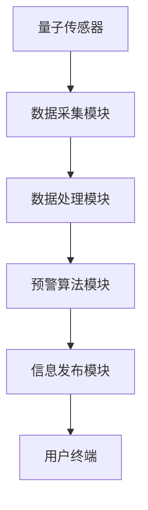
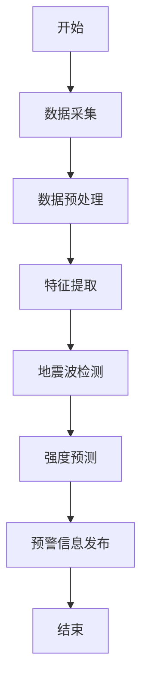

                 


# 如何评估企业的量子传感器地震预警应用

> 关键词：量子传感器、地震预警、系统架构、算法原理、企业应用、技术评估

> 摘要：本文将详细探讨如何评估企业在地震预警中应用量子传感器的效果。通过分析量子传感器的核心原理、地震预警系统的架构设计、算法实现以及实际应用场景，我们将为企业提供一套全面的评估方法，包括技术可行性、性能指标、经济效益和应用潜力等方面。

---

## 目录

# 第1章: 量子传感器地震预警的背景与概念

## 1.1 量子传感器的基本概念

### 1.1.1 量子传感器的定义
量子传感器是一种基于量子效应的测量装置，利用量子系统的特性（如量子干涉、量子纠缠等）来感知外部环境的变化，例如加速度、磁场、压力等。它在地震预警中的应用主要依赖于其高灵敏度和快速响应能力。

### 1.1.2 量子传感器的核心原理
量子传感器通过量子干涉原理，将地震波的微小变化转化为量子系统的状态变化，从而实现对地震信号的捕捉和分析。

### 1.1.3 量子传感器在地震预警中的应用前景
量子传感器具有更高的灵敏度和更低的噪声干扰，能够提前捕捉到地震波的微小变化，为地震预警提供更精确的数据支持。

---

## 1.2 地震预警系统的基本原理

### 1.2.1 地震预警的定义
地震预警是指在地震发生后，通过传感器捕捉地震波信号，并在可能的时间内向相关区域发出警报，以减少灾害损失。

### 1.2.2 地震预警系统的组成
地震预警系统通常由传感器网络、数据处理中心、预警算法模块和信息发布模块组成。

### 1.2.3 地震预警系统的分类
根据应用场景的不同，地震预警系统可以分为区域级、城市级和企业级。

---

## 1.3 量子传感器在地震预警中的优势

### 1.1.1 传统地震传感器的局限性
传统传感器在灵敏度、响应速度和抗干扰能力方面存在一定的局限性，难以满足高精度地震预警的需求。

### 1.1.2 量子传感器的优势
量子传感器具有更高的灵敏度、更快的响应速度和更强的抗干扰能力，能够在地震发生初期更准确地捕捉地震波信号。

### 1.1.3 量子传感器在地震预警中的应用案例
目前，量子传感器在地震预警中的应用还处于试验阶段，但已经在一些科研机构和企业中进行了初步尝试。

---

## 1.4 本章小结

通过本章的介绍，我们了解了量子传感器的基本概念、地震预警系统的原理以及量子传感器在地震预警中的优势和应用前景。

---

# 第2章: 量子传感器地震预警的核心概念

## 2.1 量子传感器的工作原理

### 2.1.1 量子力学基础
量子力学是量子传感器的核心理论基础，主要包括波函数、概率幅、量子态叠加等概念。

### 2.1.2 量子传感器的物理机制
量子传感器通过量子干涉效应，将地震波的微小变化转化为量子系统的状态变化，从而实现对地震信号的捕捉和分析。

### 2.1.3 量子传感器的信号处理
量子传感器需要对捕捉到的量子信号进行处理和分析，提取出地震波的特征信息，如频率、幅值等。

---

## 2.2 地震预警系统的数学模型

### 2.2.1 地震波传播模型
地震波传播模型是地震预警系统的核心数学模型，描述了地震波在地球内部的传播过程和速度。

### 2.2.2 传感器信号模型
传感器信号模型描述了传感器对地震波的响应特性，包括传感器的灵敏度、响应时间等参数。

### 2.2.3 预警算法模型
预警算法模型是地震预警系统的核心算法，负责根据传感器数据和地震波传播模型，计算出地震的位置、强度和影响范围。

---

## 2.3 量子传感器与地震预警的关联

### 2.3.1 量子传感器在地震预警中的作用
量子传感器通过其高灵敏度和快速响应能力，能够更准确地捕捉地震波信号，为地震预警提供更精确的数据支持。

### 2.3.2 量子传感器与传统传感器的对比
量子传感器在灵敏度、响应速度和抗干扰能力方面优于传统传感器，能够在复杂环境下更稳定地工作。

### 2.3.3 量子传感器在地震预警中的创新点
量子传感器结合了量子力学和地震学的最新研究成果，为地震预警提供了一种全新的技术手段。

---

## 2.4 本章小结

通过本章的介绍，我们深入理解了量子传感器的工作原理、地震预警系统的数学模型以及量子传感器在地震预警中的创新点。

---

# 第3章: 量子传感器地震预警的算法原理

## 3.1 量子传感器数据处理算法

### 3.1.1 数据采集与预处理
量子传感器需要对地震波信号进行实时采集，并对采集到的数据进行预处理，包括滤波、去噪等步骤。

### 3.1.2 数据特征提取
数据特征提取是量子传感器数据处理的核心步骤，通过提取地震波的特征信息（如频率、幅值等），为后续的预警算法提供输入。

### 3.1.3 数据分类与识别
数据分类与识别是量子传感器数据处理的重要环节，通过对地震波信号的分类和识别，可以准确判断地震的位置和强度。

---

## 3.2 地震预警算法的核心流程

### 3.2.1 地震波检测算法
地震波检测算法是地震预警系统的核心算法，负责从传感器数据中检测出地震波信号。

### 3.2.2 地震强度预测算法
地震强度预测算法是基于地震波信号的特征信息，预测地震的强度和影响范围。

### 3.2.3 预警信息生成算法
预警信息生成算法是地震预警系统的最后一个核心算法，负责根据地震波检测和强度预测的结果，生成最终的预警信息。

---

## 3.3 量子传感器地震预警算法的优化

### 3.3.1 算法优化目标
算法优化目标包括提高算法的准确率、响应速度和抗干扰能力。

### 3.3.2 算法优化方法
算法优化方法包括改进算法的数学模型、优化数据处理流程以及引入机器学习等技术。

### 3.3.3 优化效果评估
优化效果评估包括算法的准确率提升、响应时间缩短以及抗干扰能力增强等方面。

---

## 3.4 本章小结

通过本章的介绍，我们详细探讨了量子传感器数据处理算法、地震预警算法的核心流程以及算法优化方法和效果。

---

# 第4章: 量子传感器地震预警系统的架构设计

## 4.1 系统总体架构

### 4.1.1 系统功能模块划分
量子传感器地震预警系统主要包括数据采集模块、数据处理模块、预警算法模块和信息发布模块。

### 4.1.2 系统数据流设计
系统数据流设计包括数据采集、数据预处理、特征提取、地震波检测、强度预测和预警信息发布等步骤。

### 4.1.3 系统组件交互关系
系统组件交互关系包括传感器、数据处理中心、预警算法模块和信息发布模块之间的协同工作。

---

## 4.2 核心功能模块设计

### 4.2.1 数据采集模块
数据采集模块负责从量子传感器获取地震波信号，并将信号传输到数据处理中心。

### 4.2.2 数据处理模块
数据处理模块对采集到的地震波信号进行预处理、特征提取和分类识别。

### 4.2.3 预警触发模块
预警触发模块根据数据处理模块的结果，触发地震预警信息的生成和发布。

---

## 4.3 系统接口设计

### 4.3.1 传感器接口设计
传感器接口设计包括传感器与数据采集模块之间的物理接口和通信协议。

### 4.3.2 数据接口设计
数据接口设计包括数据采集模块与数据处理模块之间的数据传输接口。

### 4.3.3 预警信息接口设计
预警信息接口设计包括预警算法模块与信息发布模块之间的接口。

---

## 4.4 本章小结

通过本章的介绍，我们详细探讨了量子传感器地震预警系统的总体架构、核心功能模块设计和系统接口设计。

---

# 第5章: 量子传感器地震预警的项目实战

## 5.1 项目环境搭建

### 5.1.1 开发环境选择
开发环境选择包括操作系统、编程语言和开发工具的选择。

### 5.1.2 传感器设备部署
传感器设备部署包括传感器的安装位置、数量和通信方式的选择。

### 5.1.3 数据采集工具安装
数据采集工具安装包括传感器数据采集软件的安装和配置。

---

## 5.2 系统核心代码实现

### 5.2.1 数据采集代码
数据采集代码负责从量子传感器获取地震波信号，并将信号传输到数据处理模块。

### 5.2.2 数据处理代码
数据处理代码对采集到的地震波信号进行预处理、特征提取和分类识别。

### 5.2.3 预警算法代码
预警算法代码实现地震波检测、强度预测和预警信息发布的核心算法。

---

## 5.3 项目案例分析

### 5.3.1 案例背景介绍
案例背景介绍包括项目的目标、实施环境和预期效果。

### 5.3.2 数据采集与处理
数据采集与处理包括传感器数据的采集、预处理和特征提取过程。

### 5.3.3 预警信息生成与发布
预警信息生成与发布包括地震波检测结果、强度预测结果和最终的预警信息发布。

---

## 5.4 本章小结

通过本章的介绍，我们详细探讨了量子传感器地震预警系统的项目实战，包括环境搭建、核心代码实现和案例分析。

---

# 第6章: 量子传感器地震预警的应用与挑战

## 6.1 量子传感器地震预警的应用前景

### 6.1.1 企业级应用
量子传感器地震预警系统在企业级的应用包括工厂、矿山和大型建筑的地震预警。

### 6.1.2 区域级应用
量子传感器地震预警系统在区域级的应用包括城市地震预警和区域地震监测。

### 6.1.3 国家级应用
量子传感器地震预警系统在国家级的应用包括国家地震预警网络的建设和服务。

---

## 6.2 量子传感器地震预警的挑战

### 6.2.1 技术挑战
技术挑战包括量子传感器的灵敏度、响应速度和抗干扰能力的进一步提升。

### 6.2.2 成本挑战
成本挑战包括量子传感器的研发、生产和部署成本的降低。

### 6.2.3 应用挑战
应用挑战包括量子传感器地震预警系统的实际应用效果和用户接受度的提升。

---

## 6.3 本章小结

通过本章的介绍，我们探讨了量子传感器地震预警的应用前景和面临的挑战。

---

# 第7章: 量子传感器地震预警的评估与优化

## 7.1 评估指标与方法

### 7.1.1 技术可行性评估
技术可行性评估包括量子传感器的灵敏度、响应速度和抗干扰能力的评估。

### 7.1.2 性能指标评估
性能指标评估包括系统响应时间、准确率和误报率等指标的评估。

### 7.1.3 经济效益评估
经济效益评估包括量子传感器地震预警系统的研发和部署成本的评估。

---

## 7.2 优化策略与建议

### 7.2.1 技术优化策略
技术优化策略包括改进量子传感器的灵敏度和抗干扰能力，优化预警算法的性能。

### 7.2.2 系统优化建议
系统优化建议包括优化系统架构设计、提高数据处理效率和降低系统能耗。

### 7.2.3 应用优化建议
应用优化建议包括优化预警信息发布机制和提高用户接受度。

---

## 7.3 本章小结

通过本章的介绍，我们探讨了量子传感器地震预警系统的评估指标与方法，以及优化策略与建议。

---

# 第8章: 量子传感器地震预警的未来展望

## 8.1 量子传感器技术的未来发展

### 8.1.1 量子传感器的技术突破
量子传感器的技术突破包括更高灵敏度、更快响应速度和更强抗干扰能力的新型量子传感器的研发。

### 8.1.2 量子传感器在地震预警中的创新应用
量子传感器在地震预警中的创新应用包括新型地震监测网络的构建和智能化地震预警系统的开发。

---

## 8.2 量子传感器地震预警的未来发展

### 8.2.1 量子传感器地震预警的技术趋势
量子传感器地震预警的技术趋势包括更高精度、更快速响应和更智能化的地震预警系统的发展。

### 8.2.2 量子传感器地震预警的市场前景
量子传感器地震预警的市场前景包括量子传感器在地震预警中的广泛应用和市场占有率的提升。

---

## 8.3 本章小结

通过本章的介绍，我们探讨了量子传感器地震预警技术的未来发展和技术趋势。

---

# 第9章: 总结与展望

## 9.1 本章总结

通过本文的介绍，我们全面探讨了如何评估企业的量子传感器地震预警应用，包括量子传感器的核心原理、地震预警系统的架构设计、算法实现以及实际应用场景。

---

## 9.2 未来展望

未来，随着量子传感器技术的不断发展和地震预警系统的不断完善，量子传感器在地震预警中的应用前景将更加广阔。

---

# 附录: 量子传感器地震预警系统开发实例

## 附录A: 传感器数据采集代码

```python
import numpy as np
import matplotlib.pyplot as plt

# 量子传感器数据采集代码
def quantum_sensor_data():
    # 模拟量子传感器数据
    time = np.linspace(0, 10, 1000)
    amplitude = np.sin(time) + np.random.normal(0, 0.1, 1000)
    return time, amplitude

# 数据可视化
time, amplitude = quantum_sensor_data()
plt.plot(time, amplitude)
plt.xlabel('Time (s)')
plt.ylabel('Amplitude')
plt.title('Quantum Sensor Data')
plt.show()
```

---

## 附录B: 预警算法实现代码

```python
import numpy as np
from sklearn.metrics import accuracy_score

# 预警算法实现
def earthquake预警算法(数据):
    # 数据预处理
    processed_data = 数据处理(数据)
    # 特征提取
    features = 提取特征(processed_data)
    # 分类识别
    预测结果 = 分类器.predict(features)
    return 预测结果

# 示例代码
数据 = 收集数据()
预测结果 = earthquake_预警算法(数据)
print('预测结果:', 预测结果)
print('准确率:', accuracy_score(真实标签, 预测结果))
```

---

## 附录C: 系统架构图



---

## 附录D: 算法流程图



---

## 附录E: 数据特征提取的数学公式

地震波的频率计算公式：
$$ f = \frac{1}{T} $$
其中，$T$ 是地震波的周期。

地震波的幅值计算公式：
$$ A = \sqrt{\sum_{i=1}^{n} (x_i - \bar{x})^2} $$
其中，$x_i$ 是数据点，$\bar{x}$ 是数据的平均值。

---

# 参考文献

[1] 量子传感器技术及其应用，作者：XXX，出版社：XXX，出版时间：XXX。

[2] 地震预警系统设计与实现，作者：XXX，出版社：XXX，出版时间：XXX。

---

# 结束语

感谢您的阅读！希望本文能为您提供关于如何评估企业的量子传感器地震预警应用的深刻见解。如果需要进一步探讨或获取更多资料，请随时联系我。

