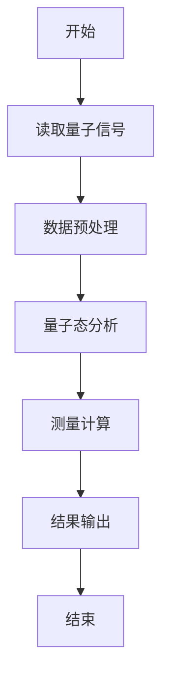
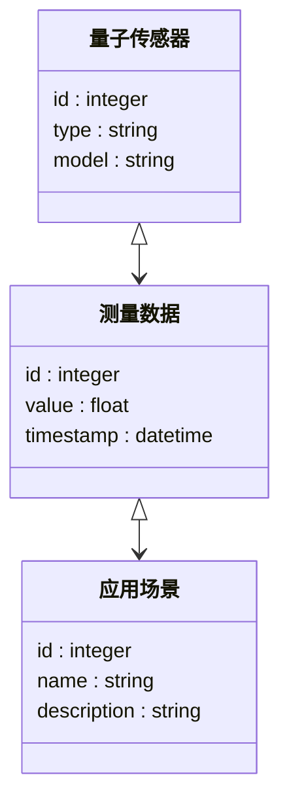
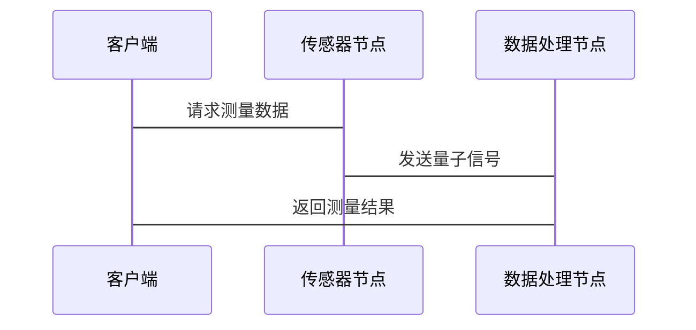

                 


# 如何评估企业的量子传感器大地测量应用

## 关键词：
量子传感器、大地测量、企业应用、传感器技术、算法原理、系统架构、项目实战

## 摘要：
量子传感器技术近年来在大地测量领域展现出巨大潜力，通过量子传感器的应用，企业能够实现更高精度和更高效的测量解决方案。本文详细分析量子传感器在大地测量中的核心原理、系统架构、应用场景及评估方法，为企业在量子传感器技术的选型和应用提供指导。

---

## 目录大纲

---

### 第一章：量子传感器与大地测量的背景介绍

#### 1.1 问题背景
- 1.1.1 传统大地测量技术的局限性
- 1.1.2 量子传感器技术的出现及其优势
- 1.1.3 企业应用量子传感器的必要性与驱动力

#### 1.2 问题描述
- 1.2.1 大地测量在企业中的应用场景
- 1.2.2 量子传感器在大地测量中的独特作用
- 1.2.3 当前企业在量子传感器应用中的挑战

#### 1.3 问题解决
- 1.3.1 量子传感器如何提升大地测量的精度
- 1.3.2 量子传感器在复杂环境中的应用优势
- 1.3.3 企业如何实现量子传感器的高效应用

#### 1.4 边界与外延
- 1.4.1 量子传感器在大地测量中的适用范围
- 1.4.2 与传统传感器的对比分析
- 1.4.3 量子传感器技术的未来发展与扩展

#### 1.5 核心概念与组成
- 1.5.1 量子传感器的基本构成
- 1.5.2 大地测量的核心要素
- 1.5.3 量子传感器与大地测量的结合机制

---

### 第二章：量子传感器与大地测量的核心概念

#### 2.1 核心原理
- 2.1.1 量子传感器的基本原理
- 2.1.2 量子效应在传感器中的应用
- 2.1.3 量子传感器的灵敏度与精度

#### 2.2 核心特点对比
- 2.2.1 与传统传感器的性能对比
- 2.2.2 量子传感器的稳定性与可靠性
- 2.2.3 量子传感器的可扩展性与适应性

#### 2.3 ER实体关系图
```mermaid
erDiagram
    SENSORS[量子传感器] {
        id : integer
        type : string
        model : string
        manufacturer : string
    }
    MEASUREMENTS[测量数据] {
        id : integer
        sensor_id : integer
        value : float
        timestamp : datetime
    }
    APPLICATIONS[应用场景] {
        id : integer
        name : string
        description : string
        sensor_id : integer
    }
    SENSORS -->> MEASUREMENTS
    MEASUREMENTS -->> APPLICATIONS
```

---

### 第三章：量子传感器与大地测量的算法原理

#### 3.1 量子传感器算法流程


#### 3.2 Python核心代码实现
```python
import numpy as np

def quantum_sensor_algorithm(quantum_signal):
    # 数据预处理
    processed_data = np.fft.fft(quantum_signal)
    # 量子态分析
    state_analysis = processed_data[np.argsort(np.abs(processed_data))]
    # 测量计算
    measurement_result = np.mean(state_analysis)
    return measurement_result

# 示例数据
quantum_signal = np.random.randn(100)
result = quantum_sensor_algorithm(quantum_signal)
print("测量结果:", result)
```

#### 3.3 数学模型与公式
- 量子信号处理公式：
  $$ y = \int_{0}^{T} x(t) dt $$
- 测量精度提升公式：
  $$ \sigma = \frac{1}{\sqrt{n}} \times \text{标准差} $$

---

### 第四章：量子传感器与大地测量的系统分析与架构设计

#### 4.1 项目场景介绍
- 企业使用量子传感器进行高精度测量的需求
- 当前系统存在的问题与改进方向

#### 4.2 系统功能设计


#### 4.3 系统架构设计


#### 4.4 接口设计与交互


---

### 第五章：量子传感器与大地测量的项目实战

#### 5.1 环境安装与配置
- 安装量子传感器硬件
- 配置数据采集软件
- 安装数据分析工具

#### 5.2 核心功能实现
```python
import numpy as np
from quantum_sensor import QuantumSensor

def main():
    sensor = QuantumSensor()
    data = sensor.collect_data(100)
    result = sensor.process_data(data)
    print("测量结果:", result)

if __name__ == "__main__":
    main()
```

#### 5.3 实际案例分析
- 某企业应用量子传感器提升测量精度的案例
- 数据分析与结果解读
- 成功经验总结

---

### 第六章：量子传感器与大地测量的总结与展望

#### 6.1 最佳实践
- 传感器选型建议
- 系统维护与优化
- 数据安全与隐私保护

#### 6.2 小结
- 量子传感器在大地测量中的核心作用
- 企业在应用中的关键考虑因素
- 技术发展的未来趋势

#### 6.3 注意事项
- 系统兼容性问题
- 数据处理的准确性
- 技术更新与培训

#### 6.4 拓展阅读
- 量子传感器技术的最新研究进展
- 相关学术论文推荐
- 行业应用案例分享

---

通过以上章节的详细讲解，我们能够全面了解量子传感器在企业大地测量中的应用，从理论基础到实际操作，为企业在技术评估和应用决策提供系统化的指导。

