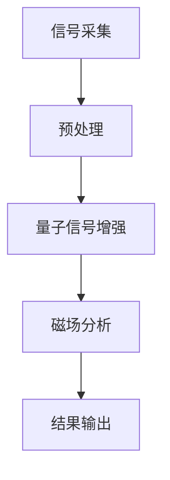
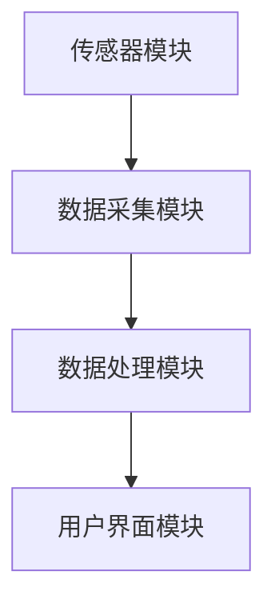
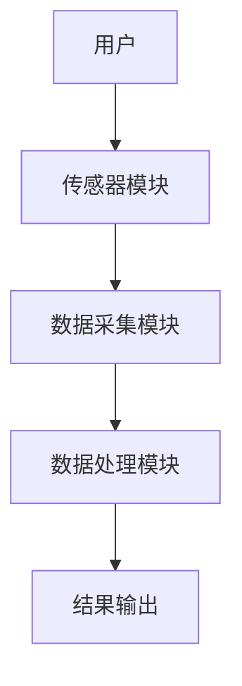

                 


```markdown
# 如何评估企业的量子传感器磁场探测应用

> 关键词：量子传感器，磁场探测，企业应用，系统架构，算法原理

> 摘要：本文将详细探讨如何评估企业在量子传感器磁场探测技术上的应用。通过分析量子传感器的基本原理、系统架构设计、算法实现以及实际应用案例，为读者提供全面的技术评估方法。

---

## 第1章: 量子传感器磁场探测应用背景

### 1.1 量子传感器的基本概念

#### 1.1.1 量子传感器的定义
量子传感器是一种基于量子效应的新型传感器，利用量子系统的特性（如量子叠加和量子纠缠）来实现更高精度的测量。与传统传感器相比，量子传感器在灵敏度、分辨率和稳定性方面具有显著优势。

#### 1.1.2 磁场探测的基本原理
磁场探测是量子传感器的一个重要应用领域。量子传感器通过测量量子系统在磁场中的变化，从而实现对磁场的高精度探测。这种技术在导航、地球物理勘探、医疗设备等领域具有广泛应用潜力。

#### 1.1.3 量子传感器的优势与局限性
量子传感器的优势在于其高灵敏度和高分辨率，能够在复杂环境中实现精确测量。然而，其技术复杂性和成本较高，且在实际应用中可能面临环境干扰和稳定性问题。

### 1.2 企业应用背景

#### 1.2.1 磁场探测在企业中的应用场景
在企业中，磁场探测技术广泛应用于设备状态监测、地质勘探、导航系统等领域。例如，在制造业中，磁场探测可以用于检测设备的异常振动或故障；在能源行业，可以用于勘探地下资源。

#### 1.2.2 量子传感器在企业中的潜在价值
量子传感器的高精度和灵敏度能够帮助企业实现更精确的测量，提高生产效率和产品质量。同时，其在复杂环境中的应用潜力也为企业的技术创新提供了新的方向。

#### 1.2.3 企业采用量子传感器的挑战
企业在采用量子传感器时可能面临技术门槛高、成本高、技术稳定性等问题。此外，量子传感器的开发和应用需要跨学科的知识储备，这对企业的技术团队提出了更高的要求。

## 第2章: 量子传感器磁场探测的核心概念

### 2.1 量子传感器的原理

#### 2.1.1 量子力学基础
量子力学是量子传感器的核心理论基础。量子系统中的粒子（如电子、光子）具有波粒二象性、叠加态和纠缠态等特性，这些特性为量子传感器的设计提供了理论依据。

#### 2.1.2 磁场探测的量子效应
在磁场探测中，量子传感器利用量子系统的自旋或磁矩与外磁场的相互作用来实现测量。通过检测量子系统状态的变化，可以精确测量外部磁场的强度和方向。

#### 2.1.3 传感器的量子增强技术
量子增强技术通过引入量子效应（如量子干涉）来提高传感器的灵敏度和分辨率。例如，利用量子纠缠效应可以实现更高精度的磁场测量。

### 2.2 磁场探测的关键指标

#### 2.2.1 灵敏度与分辨率
灵敏度是传感器对磁场变化的最小 detectable 变化的度量，而分辨率则是传感器能够区分的最小磁场差值。高灵敏度和高分辨率是量子传感器的重要特点。

#### 2.2.2 稳定性与一致性
传感器在长期使用中的稳定性是其可靠性的关键指标。量子传感器的稳定性受到环境因素（如温度、磁场干扰）的影响，需要通过技术手段进行优化。

#### 2.2.3 响应时间与带宽
响应时间是指传感器从输入信号变化到输出信号稳定所需的时间，带宽是传感器能够处理的信号频率范围。量子传感器在高频率和快速变化的磁场环境中具有优势。

### 2.3 量子传感器与传统传感器的对比

#### 2.3.1 工作原理对比
传统传感器基于经典物理学原理，而量子传感器则利用量子效应。例如，传统磁场传感器（如磁阻传感器）基于磁场对材料的磁阻效应，而量子传感器则基于量子系统与磁场的相互作用。

#### 2.3.2 性能指标对比
在灵敏度、分辨率和稳定性等方面，量子传感器通常优于传统传感器，尤其是在高精度和复杂环境中表现更为突出。

#### 2.3.3 应用场景对比
传统传感器适用于一般的磁场探测任务，而量子传感器在高精度、复杂环境和新兴领域（如量子计算辅助的磁场探测）更具优势。

## 第3章: 量子传感器磁场探测的数学模型与算法原理

### 3.1 磁场探测的数学模型

#### 3.1.1 磁场强度的数学表达
磁场强度的数学表达通常采用向量形式，表示为：
$$ \mathbf{B} = B_x \mathbf{i} + B_y \mathbf{j} + B_z \mathbf{k} $$
其中，$B_x$、$B_y$、$B_z$ 分别是磁场在 x、y、z 方向的分量。

#### 3.1.2 磁场传感器的信号模型
量子传感器的信号模型可以表示为：
$$ S = f(\mathbf{B}) + n $$
其中，$f$ 是传感器的响应函数，$\mathbf{B}$ 是外部磁场，$n$ 是噪声。

#### 3.1.3 量子传感器的信号处理
量子传感器的信号处理通常包括量子态的初始化、量子变换和测量三个步骤。例如，利用量子叠加态的特性进行磁场测量的数学模型可以表示为：
$$ | \psi \rangle = \sum_{i} \alpha_i |i\rangle $$
其中，$|i\rangle$ 表示传感器的量子状态，$\alpha_i$ 是对应的振幅。

### 3.2 算法原理

#### 3.2.1 磁场信号的采集与预处理
磁场信号的采集通常通过量子传感器的量子变换实现。预处理步骤包括去除噪声、归一化等。例如，预处理后的信号可以表示为：
$$ S_{\text{preprocessed}} = \frac{S - \mu}{\sigma} $$
其中，$\mu$ 是信号均值，$\sigma$ 是信号标准差。

#### 3.2.2 基于量子效应的信号增强算法
量子信号增强算法通过利用量子系统的特性（如量子纠缠）来提高信号质量。例如，基于量子干涉的信号增强算法可以表示为：
$$ S_{\text{enhanced}} = \text{QuantumInterference}(S_{\text{preprocessed}}) $$

#### 3.2.3 磁场数据的分析与解译
磁场数据分析通常采用机器学习算法，如支持向量机（SVM）或神经网络。例如，利用SVM进行磁场分类的算法可以表示为：
$$ y = \text{SVM}(S_{\text{enhanced}}) $$
其中，$y$ 是分类结果。

### 3.3 算法实现

#### 3.3.1 算法流程图（mermaid）


#### 3.3.2 Python代码实现
```python
def preprocess(signal):
    # 去除噪声
    filtered_signal = signal - np.mean(signal)
    # 归一化
    normalized_signal = filtered_signal / np.std(filtered_signal)
    return normalized_signal

def quantum_interference(signal):
    # 量子干涉算法
    import qiskit
    # 初始化量子电路
    circuit = qiskit.QuantumCircuit(1, 1)
    # 应用量子干涉门
    circuit.h(0)
    circuit.measure(0, 0)
    # 模拟量子计算
    simulator = qiskit.Aer.get_backend('statevector_simulator')
    result = qiskit.execute(circuit, simulator).result()
    # 获取结果
    outcome = result.get_counts(circuit)
    return outcome

def analyze(signal):
    # 机器学习分类
    model = SVC()
    model.fit(normalized_train_signal, labels)
    predictions = model.predict(signal)
    return predictions
```

## 第4章: 量子传感器磁场探测的系统架构设计

### 4.1 系统组成与功能模块

#### 4.1.1 传感器模块
传感器模块负责采集磁场信号，通常包括量子传感器芯片和相关电路。

#### 4.1.2 数据采集模块
数据采集模块负责将传感器输出的信号进行采样和数字化，通常包括模数转换器（ADC）和数据采集卡。

#### 4.1.3 数据处理模块
数据处理模块负责对采集的信号进行预处理、量子信号增强和磁场分析，通常包括FPGA或GPU加速卡。

#### 4.1.4 用户界面模块
用户界面模块负责显示测量结果和系统控制，通常包括触摸屏或PC界面。

### 4.2 系统架构设计

#### 4.2.1 分层架构设计
系统的分层架构包括数据采集层、数据处理层和应用层。每一层负责不同的功能模块，确保系统的模块化和可扩展性。

#### 4.2.2 模块间的交互关系（mermaid）


### 4.3 系统接口设计

#### 4.3.1 传感器接口
传感器接口通常采用I2C或SPI接口，与数据采集模块进行通信。

#### 4.3.2 数据接口
数据接口负责与数据处理模块进行通信，通常采用PCIe或以太网接口。

#### 4.3.3 用户接口
用户接口通常采用USB或HDMI接口，与PC或触摸屏进行通信。

### 4.4 系统交互流程（mermaid）



## 第5章: 量子传感器磁场探测的项目实战

### 5.1 环境安装

#### 5.1.1 硬件环境
需要安装量子传感器芯片、数据采集卡和相关电路。

#### 5.1.2 软件环境
需要安装Python编程环境、量子计算库（如Qiskit）和机器学习库（如Scikit-learn）。

### 5.2 核心代码实现

#### 5.2.1 信号预处理
```python
import numpy as np

def preprocess(signal):
    # 去除噪声
    filtered_signal = signal - np.mean(signal)
    # 归一化
    normalized_signal = filtered_signal / np.std(filtered_signal)
    return normalized_signal
```

#### 5.2.2 量子信号增强
```python
from qiskit import QuantumCircuit, Aer, execute

def quantum_interference(signal):
    # 初始化量子电路
    circuit = QuantumCircuit(1, 1)
    # 应用量子干涉门
    circuit.h(0)
    circuit.measure(0, 0)
    # 模拟量子计算
    simulator = Aer.get_backend('statevector_simulator')
    result = execute(circuit, simulator).result()
    # 获取结果
    outcome = result.get_counts(circuit)
    return outcome
```

#### 5.2.3 磁场分析与分类
```python
from sklearn.svm import SVC

def analyze(signal):
    # 机器学习分类
    model = SVC()
    model.fit(normalized_train_signal, labels)
    predictions = model.predict(signal)
    return predictions
```

### 5.3 实际案例分析

#### 5.3.1 案例背景
某企业需要在复杂环境中进行高精度磁场探测，采用量子传感器技术实现。

#### 5.3.2 数据采集与预处理
通过对实际环境中的磁场信号进行采集和预处理，去除噪声并归一化。

#### 5.3.3 量子信号增强
利用量子干涉算法对预处理后的信号进行增强，提高信号质量。

#### 5.3.4 磁场分析与分类
通过机器学习算法对增强后的信号进行分类，识别不同磁场区域。

### 5.4 项目小结
通过实际案例分析，验证了量子传感器在磁场探测中的应用潜力和实际效果。同时，也揭示了当前技术中存在的问题和改进方向。

## 第6章: 量子传感器磁场探测的最佳实践与注意事项

### 6.1 最佳实践 tips

#### 6.1.1 技术选型
根据具体应用需求选择合适的量子传感器技术，考虑灵敏度、成本和环境适应性。

#### 6.1.2 系统优化
通过优化传感器布局、算法参数调整和系统架构设计，提高系统的整体性能。

#### 6.1.3 团队协作
量子传感器的应用需要跨学科团队的协作，包括量子物理、电子工程和计算机科学等领域的专家。

### 6.2 小结

### 6.3 注意事项

#### 6.3.1 技术风险
量子传感器技术尚处于发展阶段，存在技术不稳定和环境适应性差等问题。

#### 6.3.2 成本控制
量子传感器的开发和应用成本较高，需要企业在预算和投资之间进行平衡。

#### 6.3.3 法律法规
关注相关法律法规，确保量子传感器的合规性，特别是在数据隐私和安全方面。

### 6.4 拓展阅读

#### 6.4.1 量子传感器的最新研究进展
阅读学术论文和行业报告，了解量子传感器的最新研究成果和技术发展趋势。

#### 6.4.2 量子计算在磁场探测中的应用
深入学习量子计算在磁场探测中的应用，探索更高效的算法和系统设计。

#### 6.4.3 企业案例研究
研究成功应用量子传感器的企业案例，学习其实践经验和技术路线。

## 结语
量子传感器磁场探测技术为企业提供了新的技术手段，但其应用需要克服技术和成本等多方面的挑战。通过本文的详细分析，读者可以更好地理解如何评估和应用量子传感器技术，为企业的技术创新和竞争力提升提供有力支持。
```

