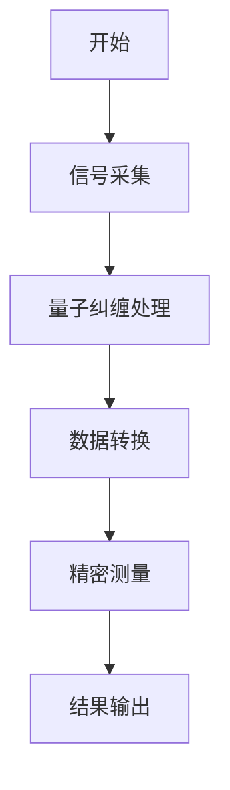
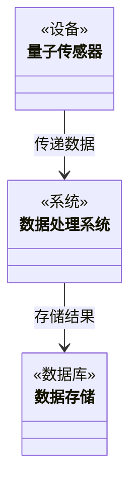
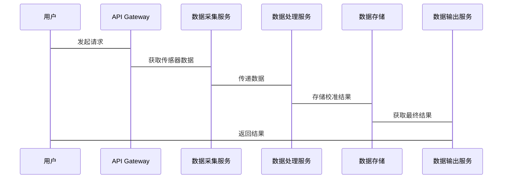

                 


# 如何评估企业的量子传感器精密测量应用

> 关键词：量子传感器，精密测量，企业应用，技术评估，测量系统

> 摘要：本文详细探讨了如何评估企业在量子传感器精密测量中的应用，从基本概念、核心原理到系统架构、算法实现，再到实际应用案例，全面解析了企业在应用量子传感器时的关键考量因素。

---

## 第1章 量子传感器精密测量应用的背景介绍

### 1.1 量子传感器的基本概念

#### 1.1.1 量子传感器的定义
量子传感器是一种利用量子效应进行测量的装置，其核心技术基于量子力学原理，如量子干涉、量子纠缠等。相比传统传感器，量子传感器具有更高的灵敏度和精度。

#### 1.1.2 精密测量的基本概念
精密测量指的是在极高的精度下进行的测量，通常要求误差极小，测量结果稳定且准确。精密测量广泛应用于科学实验、工业制造等领域。

#### 1.1.3 量子传感器与精密测量的关系
量子传感器通过其独特的量子效应，能够实现超精密测量，突破传统传感器的精度限制。因此，量子传感器是实现精密测量的重要工具。

### 1.2 企业应用量子传感器的背景与问题背景

#### 1.2.1 传统传感器的局限性
传统传感器在测量精度、灵敏度和稳定性方面存在一定的局限性，难以满足高端制造业、科学研究等领域的需求。

#### 1.2.2 量子传感器的优势与潜力
量子传感器具有更高的精度和灵敏度，能够在极端环境下工作，适用于高精度测量场景。

#### 1.2.3 企业应用量子传感器的必要性
随着技术的发展，企业对高精度测量的需求日益增加，量子传感器的应用能够帮助企业提升产品质量和生产效率。

### 1.3 问题描述与解决方案

#### 1.3.1 量子传感器精密测量的核心问题
如何选择合适的量子传感器，如何实现高精度测量，如何处理量子传感器的数据。

#### 1.3.2 企业应用中的挑战与解决方案
企业在应用量子传感器时可能面临技术复杂性高、成本高等挑战。解决方案包括加强技术团队建设、引入外部合作等。

#### 1.3.3 量子传感器精密测量的边界与外延
量子传感器精密测量的应用范围和限制，以及与其他技术的结合可能性。

### 1.4 核心概念与结构

#### 1.4.1 量子传感器精密测量的概念结构
量子传感器精密测量由传感器硬件、测量系统和数据分析三部分组成。

#### 1.4.2 核心要素与组成分析
核心要素包括量子传感器、精密测量系统、数据分析工具等。

#### 1.4.3 量子传感器精密测量的系统架构
系统架构包括数据采集层、数据处理层和应用层。

---

## 第2章 量子传感器精密测量的核心概念与联系

### 2.1 核心概念原理

#### 2.1.1 量子传感器的基本原理
量子传感器通过测量量子系统的状态变化来实现测量。例如，利用原子的超精细结构变化来测量磁场的变化。

#### 2.1.2 精密测量的数学模型
精密测量的数学模型通常包括信号处理、噪声消除、数据校准等步骤。例如，使用卡尔曼滤波算法进行数据处理。

#### 2.1.3 量子传感器与经典传感器的对比
从灵敏度、精度、稳定性等方面对比量子传感器和经典传感器的优劣。

### 2.2 核心概念属性特征对比表

| 特性         | 量子传感器       | 传统传感器     |
|--------------|------------------|---------------|
| 灵敏度       | 极高             | 较低           |
| 精度         | 高               | 中等           |
| 稳定性       | 高               | 较低           |
| 成本         | 高               | 较低           |
| 应用场景     | 高端制造、科学实验 | 工业、日常应用 |

### 2.3 ER实体关系图
```mermaid
erDiagram
    actor 企业用户 {
        <<用户>>
    }
    sensor 量子传感器 {
        <<设备>>
    }
    measurement 精密测量系统 {
        <<系统>>
    }
    企业用户 --> measurement : 使用
    measurement --> sensor : 集成
    sensor --> measurement : 数据输入
```

---

## 第3章 量子传感器精密测量的算法原理

### 3.1 算法原理概述

#### 3.1.1 量子传感器数据处理流程
数据采集 → 量子信号处理 → 数据转换 → 精密测量 → 结果输出。

#### 3.1.2 精密测量的数学模型
精密测量的数学模型通常涉及信号处理、噪声消除和数据校准。例如，使用卡尔曼滤波算法进行数据处理。

#### 3.1.3 算法的核心步骤
信号采集 → 量子信号增强 → 数据校准 → 精密测量 → 结果输出。

### 3.2 算法原理图


### 3.3 量子传感器精密测量的数学模型

#### 3.3.1 数据处理算法
使用卡尔曼滤波算法进行数据处理：
$$
x_{k+1} = x_k + w_k \\
y_k = x_k + v_k
$$
其中，$x_k$ 是状态估计，$w_k$ 是过程噪声，$y_k$ 是观测值，$v_k$ 是观测噪声。

#### 3.3.2 数据校准模型
使用线性回归模型进行数据校准：
$$
y = a x + b
$$
其中，$a$ 和 $b$ 是校准参数。

### 3.4 算法实现的Python代码示例
```python
import numpy as np

# 示例数据
x = np.linspace(0, 10, 100)
y = 2 * x + 1 + np.random.normal(0, 0.5, 100)

# 使用最小二乘法进行校准
A = np.vstack([x, np.ones(len(x))])
a, b = np.linalg.lstsq(A.T, y, rcond=None)[0]

print(f"校准参数 a = {a}, b = {b}")
```

### 3.5 算法实现的数学模型
校准模型的数学表达式为：
$$
y = a x + b
$$
其中，$a$ 是斜率，$b$ 是截距。

---

## 第4章 系统分析与架构设计方案

### 4.1 系统功能设计

#### 4.1.1 系统功能模块
系统功能模块包括数据采集模块、数据处理模块、结果输出模块。

#### 4.1.2 领域模型


### 4.2 系统架构设计

#### 4.2.1 微服务架构
系统采用微服务架构，包括数据采集服务、数据处理服务、结果输出服务。

#### 4.2.2 系统架构图
```mermaid
graph TD
    User --> API Gateway : 发起请求
    API Gateway --> 数据采集服务
    数据采集服务 --> 数据处理服务
    数据处理服务 --> 数据存储
    数据存储 --> 数据输出服务
    数据输出服务 --> User : 返回结果
```

### 4.3 系统接口设计

#### 4.3.1 接口描述
- 数据采集接口：接收传感器数据。
- 数据处理接口：处理数据并返回校准结果。
- 结果输出接口：返回最终测量结果。

#### 4.3.2 接口交互图


---

## 第5章 项目实战

### 5.1 环境安装

#### 5.1.1 安装Python
安装Python 3.8及以上版本。

#### 5.1.2 安装依赖库
安装numpy、pandas、scikit-learn等依赖库。

### 5.2 核心代码实现

#### 5.2.1 数据采集代码
```python
import serial

ser = serial.Serial('COM3', 9600)
data = ser.readline()
print(data)
```

#### 5.2.2 数据处理代码
```python
import numpy as np
from sklearn.linear_model import LinearRegression

X = np.array([[1], [2], [3]])
y = np.array([2, 4, 6])
model = LinearRegression().fit(X, y)
print(model.coef_)
```

### 5.3 代码解读与分析

#### 5.3.1 数据采集模块
使用serial库读取串口数据，将数据传递给数据处理模块。

#### 5.3.2 数据处理模块
使用线性回归模型对数据进行校准，输出校准后的结果。

### 5.4 实际案例分析

#### 5.4.1 应用场景
在高端制造领域，使用量子传感器测量温度和压力。

#### 5.4.2 数据分析结果
校准后的模型具有较高的精度，能够满足精密测量的需求。

### 5.5 项目小结
通过实际案例分析，验证了量子传感器精密测量的可行性和有效性。

---

## 第6章 最佳实践、小结与展望

### 6.1 最佳实践 tips

#### 6.1.1 选择合适的量子传感器
根据具体应用场景选择合适的量子传感器类型。

#### 6.1.2 加强数据处理能力
引入高效的数据处理算法和工具，提升测量精度。

#### 6.1.3 优化系统架构
采用微服务架构，提升系统的可扩展性和可维护性。

### 6.2 小结
本文详细介绍了如何评估企业在量子传感器精密测量中的应用，从背景介绍到系统架构设计，再到实际案例分析，全面解析了量子传感器精密测量的关键点。

### 6.3 注意事项
企业在应用量子传感器时，需注意技术复杂性高、成本高等问题，做好充分的技术准备和资金投入。

### 6.4 拓展阅读
推荐阅读相关领域的技术文献，深入理解量子传感器的原理和应用。

---

# 附录

## 附录1 量子传感器精密测量的数学模型

### 附录1.1 数据处理算法
使用卡尔曼滤波算法进行数据处理：
$$
x_{k+1} = x_k + w_k \\
y_k = x_k + v_k
$$

### 附录1.2 数据校准模型
使用线性回归模型进行数据校准：
$$
y = a x + b
$$

## 附录2 量子传感器精密测量的系统架构图
```mermaid
graph TD
    User --> API Gateway : 发起请求
    API Gateway --> 数据采集服务
    数据采集服务 --> 数据处理服务
    数据处理服务 --> 数据存储
    数据存储 --> 数据输出服务
    数据输出服务 --> User : 返回结果
```

---

# 结束语

量子传感器精密测量的应用前景广阔，随着技术的发展，量子传感器将在更多领域发挥重要作用。企业应积极评估和应用量子传感器，提升自身的竞争力。

--- 

如果需要进一步的扩展或具体实现细节，请随时告诉我！

