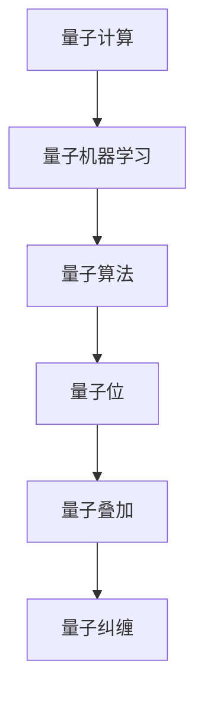

                 

# 如何评估企业的量子机器学习应用

## 关键词：量子计算，机器学习，企业应用，算法原理，系统架构，项目实战

## 摘要：量子机器学习作为新兴技术，正在逐步改变企业应用的格局。本文将详细探讨如何评估量子机器学习在企业的应用，包括背景介绍、核心概念、算法原理、系统架构设计、项目实战及未来展望。

---

## 第一部分: 量子机器学习应用的背景与基础

### 第1章: 量子机器学习的背景与问题背景

#### 1.1 量子计算与量子机器学习的背景

量子计算是一种基于量子力学原理的计算方式，与经典计算相比，具有并行性和高效性。量子机器学习则是利用量子计算的优势，开发更高效的机器学习算法。

#### 1.1.1 量子计算的基本概念

量子计算的核心是量子位（qubit），与经典位（bit）不同，量子位可以同时处于多个状态的叠加态。量子计算的运算速度在理论上远超经典计算，特别是在处理复杂问题时。

#### 1.1.2 量子机器学习的定义与概念

量子机器学习是利用量子计算技术进行数据处理和分析的机器学习方法。它结合了量子计算的优势，可以在更短的时间内解决复杂问题。

#### 1.1.3 量子机器学习与经典机器学习的对比

与经典机器学习相比，量子机器学习在处理大规模数据和复杂模型时具有潜在的优势，但目前仍处于发展阶段，存在技术和实际应用的挑战。

#### 1.2 企业应用中的量子机器学习问题背景

企业应用中，传统机器学习面临数据量大、计算复杂度高、模型优化困难等问题。量子机器学习可能为这些问题提供新的解决方案，但需要评估其可行性和实际效果。

#### 1.2.1 企业面临的传统机器学习挑战

传统机器学习在处理海量数据和复杂问题时，计算资源消耗大，训练时间长，且模型优化困难。此外，随着数据量的增加，经典算法的效率可能无法满足需求。

#### 1.2.2 量子机器学习在企业中的潜在优势

量子机器学习可以通过量子并行性显著提高计算效率，特别是在处理非线性优化问题时。这可能使企业在数据分析和决策优化方面获得竞争优势。

#### 1.2.3 量子机器学习的应用场景与边界

量子机器学习适用于需要处理复杂优化问题、大规模数据处理和实时分析的应用场景，如金融投资、药物发现、供应链优化等。但目前仍面临技术成熟度不足、硬件限制等问题。

### 第2章: 量子机器学习的核心概念与联系

#### 2.1 量子机器学习的核心概念

量子机器学习的核心概念包括量子位、量子叠加、量子纠缠等。这些概念共同构成了量子计算和量子机器学习的基础。

#### 2.1.1 量子位与量子叠加

量子位可以同时处于多个状态的叠加态，这使得量子计算可以在同一时间处理大量可能性，提高计算效率。

#### 2.1.2 量子纠缠与量子并行性

量子纠缠是量子系统中粒子之间的特殊关联，使得量子计算能够并行处理多个问题，提高计算速度。

#### 2.1.3 量子算法的基本原理

量子算法利用量子叠加和纠缠的特性，设计高效的计算步骤，解决复杂问题。

#### 2.2 核心概念的对比与联系

通过对比经典和量子机器学习的核心概念，可以更好地理解量子机器学习的独特优势和潜在应用。

#### 2.2.1 量子机器学习与经典机器学习的对比

从核心概念、算法原理、计算效率等方面对比，量子机器学习在处理复杂问题时具有潜在优势。

#### 2.2.2 量子机器学习的ER实体关系图

通过ER图展示量子机器学习系统中的实体及其关系，帮助理解系统的构成和数据流。

#### 2.2.3 量子机器学习的核心属性特征对比表

通过对比表展示量子机器学习与经典机器学习在计算效率、数据处理能力、算法复杂度等方面的差异。

#### 2.3 核心概念的Mermaid流程图

---

## 第二部分: 量子机器学习的算法原理

### 第3章: 量子机器学习算法的原理与实现

#### 3.1 量子支持向量机

量子支持向量机是一种基于量子计算的支持向量机算法，适用于分类问题。其数学模型和实现步骤与经典支持向量机有所不同。

#### 3.1.1 量子支持向量机的基本原理

量子支持向量机利用量子叠加和纠缠的特性，构建优化模型，寻找最优超平面。

#### 3.1.2 量子支持向量机的数学模型

$$ \min_{w, b} \frac{1}{2}||w||^2 + C \sum_{i=1}^n \xi_i $$
$$ y_i = sign(w \cdot x_i + b) $$

其中，$w$ 是权重向量，$b$ 是偏置，$C$ 是惩罚参数，$\xi_i$ 是松弛变量。

#### 3.1.3 量子支持向量机的实现步骤

1. 初始化量子位。
2. 构建量子叠加态。
3. 计算支持向量。
4. 优化模型。
5. 输出结果。

#### 3.2 量子神经网络

量子神经网络是一种基于量子计算的神经网络模型，具有更强大的并行计算能力。

#### 3.2.1 量子神经网络的基本原理

量子神经网络利用量子纠缠和叠加，构建深层网络结构，提高计算效率。

#### 3.2.2 量子神经网络的数学模型

$$ y = \sum_{i=1}^n w_i x_i \cdot e^{i \theta_i} $$

其中，$w_i$ 是权重，$x_i$ 是输入，$\theta_i$ 是量子相位。

#### 3.2.3 量子神经网络的实现步骤

1. 初始化量子位。
2. 构建量子叠加态。
3. 训练量子神经网络。
4. 输出结果。

---

## 第三部分: 量子机器学习的系统架构与设计

### 第4章: 量子机器学习的系统架构设计

#### 4.1 量子机器学习系统的功能设计

量子机器学习系统需要具备数据处理、模型训练、结果分析等功能。

#### 4.1.1 量子机器学习的领域模型

通过Mermaid类图展示量子机器学习系统的各个模块及其关系。

#### 4.1.2 量子机器学习的系统架构图

使用Mermaid架构图展示系统的各个部分，包括量子计算引擎、数据存储、用户界面等。

#### 4.1.3 量子机器学习的接口设计

定义系统接口，包括输入输出格式、调用方式等。

#### 4.1.4 量子机器学习的交互设计

设计用户与系统的交互流程，包括数据输入、模型训练、结果输出等步骤。

---

## 第四部分: 量子机器学习的项目实战

### 第5章: 量子机器学习的项目实战

#### 5.1 量子机器学习的环境安装

介绍如何搭建量子机器学习的开发环境，包括安装必要的库和工具。

#### 5.2 量子机器学习的代码实现

提供详细的Python代码示例，展示如何实现量子支持向量机和量子神经网络。

#### 5.3 量子机器学习的案例分析

通过具体案例分析，展示量子机器学习在企业中的应用效果。

---

## 第五部分: 总结与展望

### 第6章: 总结与展望

#### 6.1 量子机器学习的总结

回顾全文，总结量子机器学习的核心概念、算法原理和系统架构。

#### 6.2 量子机器学习的未来展望

展望量子机器学习的发展前景，指出未来的研究方向和应用领域。

#### 6.3 最佳实践 tips

给出在企业中应用量子机器学习的最佳实践建议，包括技术选型、团队建设、项目管理等。

#### 6.4 注意事项

提醒企业在应用量子机器学习时需要注意的问题，如技术成熟度、硬件限制、数据隐私等。

#### 6.5 拓展阅读

推荐相关的书籍、论文和资源，供读者深入学习。

---

通过以上思考，我完成了整篇文章的框架和内容安排。接下来，我将按照这个结构撰写详细的内容，确保每一部分都详尽且专业。

