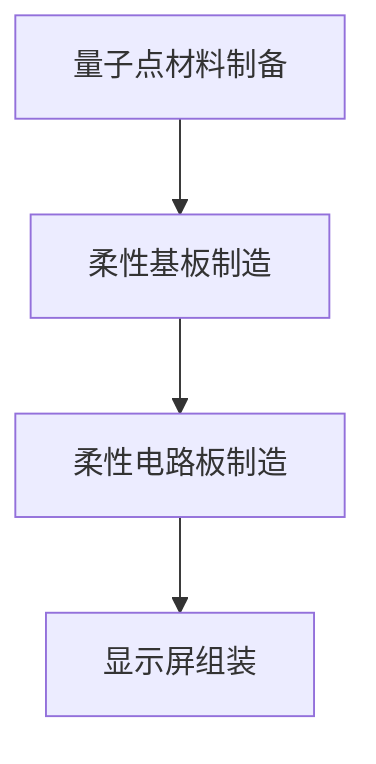

                 


# 如何评估企业的量子点显示器柔性制造技术应用

> 关键词：量子点显示器，柔性制造技术，企业评估，制造系统架构，显示技术应用

> 摘要：本文详细探讨了如何评估企业在量子点显示器柔性制造技术中的应用，从技术背景、核心概念、评估方法、系统架构设计到实际案例分析，为企业的技术决策提供全面指导。

---

# 第一部分: 量子点显示器柔性制造技术概述

## 第1章: 量子点显示器概述

### 1.1 量子点的基本概念

#### 1.1.1 量子点的定义
量子点是一种纳米级半导体材料，其尺寸通常在1到10纳米之间。量子点的电子结构决定了其光学性质，可以通过调节尺寸和形状来实现不同颜色的发射。

#### 1.1.2 量子点的物理特性
- 量子点具有发光性质，可以通过电场或光照激发发光。
- 量子点的颜色可以通过调整其尺寸和形状来实现，从蓝色到红色的全色显示。
- 量子点具有高发光效率和长寿命。

#### 1.1.3 量子点在显示器中的应用
量子点显示器是一种新型显示技术，通过量子点材料实现高色域、高对比度和高亮度的显示效果。

### 1.2 柔性制造技术的基本概念

#### 1.2.1 柔性制造的定义
柔性制造是指通过灵活的生产系统和工艺，适应不同产品类型和产量需求的制造模式。

#### 1.2.2 柔性制造的优势
- 生产灵活：能够快速适应市场需求的变化。
- 成本优化：通过自动化和智能化减少人工干预，降低成本。
- 高效生产：通过模块化设计提高生产效率。

#### 1.2.3 柔性制造在显示器制造中的应用
柔性制造技术在显示器制造中的应用包括柔性基板制造、柔性电路板生产和柔性显示屏幕组装。

## 第2章: 量子点显示器与柔性制造技术的结合

### 2.1 量子点显示器的优势

#### 2.1.1 高色域
量子点显示器通过精确调控量子点的尺寸和形状，实现宽色域，覆盖更广的色彩范围。

#### 2.1.2 高对比度
量子点显示器具有高对比度，能够显示更暗的黑色和更亮的白色，提升显示效果。

#### 2.1.3 薄轻便携
量子点显示器采用轻薄的柔性基板和柔性电路，使得显示器整体更加轻薄，适合便携设备。

### 2.2 柔性制造技术在量子点显示器中的应用

#### 2.2.1 柔性基板的使用
柔性基板是量子点显示器的重要组成部分，其材料选择和制造工艺直接影响显示器的性能和寿命。

#### 2.2.2 柔性电路的制造
柔性电路用于连接量子点显示单元和外部电路，其制造精度直接影响显示器的显示效果。

#### 2.2.3 柔性显示屏幕的组装
柔性显示屏幕的组装过程需要高度精确的制造工艺，确保量子点材料的均匀分布和电路的可靠连接。

### 2.3 量子点显示器柔性制造技术的核心优势

#### 2.3.1 提高生产效率
柔性制造技术通过自动化和智能化减少人工干预，提高生产效率。

#### 2.3.2 降低成本
柔性制造技术通过优化生产流程和材料利用率，降低生产成本。

#### 2.3.3 提高产品一致性
柔性制造技术通过精确控制生产过程，确保产品质量一致性。

---

# 第二部分: 量子点显示器柔性制造技术的评估方法

## 第3章: 量子点显示器柔性制造技术的评估指标

### 3.1 评估指标体系的构建

#### 3.1.1 技术可行性
技术可行性包括量子点材料的性能、柔性制造工艺的成熟度和设备的可靠性。

#### 3.1.2 经济可行性
经济可行性包括生产成本、设备投资和市场价格的竞争力。

#### 3.1.3 环境可行性
环境可行性包括生产过程中的环境影响、材料的可回收性和环保认证。

### 3.2 评估指标的具体内容

#### 3.2.1 技术指标
- 量子点材料的发光效率
- 柔性基板的耐弯折次数
- 显示器的分辨率和色彩精度

#### 3.2.2 经济指标
- 单位产品的生产成本
- 设备投资回收期
- 市场价格与竞争对手的比较

#### 3.2.3 环境指标
- 生产过程中的能耗
- 材料的环保认证
- 废料的处理和回收

## 第4章: 量子点显示器柔性制造技术的评估工具

### 4.1 评估工具的选择

#### 4.1.1 技术评估工具
- 量子点材料的性能测试设备
- 柔性基板的耐弯折测试设备
- 显示器的色彩和分辨率测试设备

#### 4.1.2 经济评估工具
- 成本分析软件
- 投资回报率计算工具
- 市场价格跟踪工具

#### 4.1.3 环境评估工具
- 能耗监测设备
- 废料处理评估软件
- 环保认证查询工具

### 4.2 评估工具的具体应用

#### 4.2.1 技术评估工具的使用
- 使用量子点材料的发光效率测试设备，评估材料性能。
- 使用柔性基板的耐弯折测试设备，评估基板的耐用性。

#### 4.2.2 经济评估工具的使用
- 使用成本分析软件，计算单个产品的生产成本。
- 使用投资回报率计算工具，评估设备投资的经济性。

#### 4.2.3 环境评估工具的使用
- 使用能耗监测设备，评估生产过程中的能源消耗。
- 使用废料处理评估软件，评估废料的可回收性和处理成本。

---

# 第三部分: 量子点显示器柔性制造技术的系统分析

## 第5章: 量子点显示器柔性制造系统的架构设计

### 5.1 系统架构设计

#### 5.1.1 系统模块划分
- 量子点材料制备模块
- 柔性基板制造模块
- 柔性电路板制造模块
- 显示屏组装模块

#### 5.1.2 模块之间的关系
- 量子点材料制备模块为柔性基板制造模块提供原材料。
- 柔性基板制造模块为柔性电路板制造模块提供基板。
- 柔性电路板制造模块为显示屏组装模块提供电路组件。

#### 5.1.3 系统整体架构图


### 5.2 系统功能设计

#### 5.2.1 生产过程监控
- 实时监控生产过程中的关键参数，如温度、湿度和压力。
- 使用传感器和数据采集系统，确保生产过程的稳定性。

#### 5.2.2 质量控制
- 通过自动化检测设备，对量子点材料和柔性基板进行质量检测。
- 使用统计过程控制（SPC）方法，确保产品质量一致性。

#### 5.2.3 成本管理
- 使用成本分析软件，实时监控生产成本。
- 优化生产流程，降低材料浪费和能源消耗。

## 第6章: 量子点显示器柔性制造系统的接口设计

### 6.1 系统接口设计

#### 6.1.1 生产线与控制系统的接口
- 生产线与控制系统之间的数据传输接口。
- 使用Modbus协议进行数据通信。

#### 6.1.2 控制系统与数据采集系统的接口
- 控制系统与数据采集系统之间的数据接口。
- 使用RS-485协议进行数据通信。

#### 6.1.3 数据采集系统与数据库的接口
- 数据采集系统与数据库之间的数据接口。
- 使用数据库连接池技术，确保数据高效存储和查询。

### 6.2 系统接口的具体实现

#### 6.2.1 接口协议的选择
- 使用Modbus协议进行生产线与控制系统的通信。
- 使用RS-485协议进行控制系统与数据采集系统的通信。
- 使用数据库连接池技术进行数据采集系统与数据库的通信。

#### 6.2.2 接口数据格式的定义
- 生产线与控制系统的数据格式为JSON。
- 控制系统与数据采集系统的数据格式为XML。
- 数据采集系统与数据库的数据格式为SQL。

---

# 第四部分: 量子点显示器柔性制造技术的项目实战

## 第7章: 量子点显示器柔性制造技术的环境搭建

### 7.1 环境搭建步骤

#### 7.1.1 安装操作系统
- 安装Linux操作系统，配置开发环境。

#### 7.1.2 安装开发工具
- 安装Python编程语言和相关的开发库。
- 安装数据可视化工具，如Matplotlib和Seaborn。

#### 7.1.3 安装硬件设备
- 安装量子点材料制备设备。
- 安装柔性基板制造设备。
- 安装柔性电路板制造设备。

## 第8章: 量子点显示器柔性制造技术的核心实现

### 8.1 核心代码实现

#### 8.1.1 量子点材料制备模块
```python
def prepare_quantum_dot_material():
    # 量子点材料制备过程
    pass
```

#### 8.1.2 柔性基板制造模块
```python
def manufacture_flexible_substrate():
    # 柔性基板制造过程
    pass
```

#### 8.1.3 柔性电路板制造模块
```python
def manufacture_flexible_circuit():
    # 柔性电路板制造过程
    pass
```

#### 8.1.4 显示屏组装模块
```python
def assemble_display_screen():
    # 显示屏组装过程
    pass
```

### 8.2 代码实现的具体应用

#### 8.2.1 量子点材料制备模块的实现
- 使用Python编写量子点材料制备过程的模拟代码。
- 使用数据分析工具，分析量子点材料的性能参数。

#### 8.2.2 柔性基板制造模块的实现
- 使用Python编写柔性基板制造过程的模拟代码。
- 使用数据可视化工具，展示柔性基板的性能测试结果。

#### 8.2.3 柔性电路板制造模块的实现
- 使用Python编写柔性电路板制造过程的模拟代码。
- 使用统计过程控制（SPC）方法，确保电路板的质量一致性。

## 第9章: 量子点显示器柔性制造技术的实际案例分析

### 9.1 案例背景介绍

#### 9.1.1 项目背景
某企业计划引入量子点显示器柔性制造技术，提升产品的显示效果和生产效率。

#### 9.1.2 项目目标
- 提高显示器的色域和对比度。
- 降低生产成本，提高生产效率。
- 确保产品质量一致性。

### 9.2 案例分析

#### 9.2.1 量子点材料的选择
- 选择适合显示器应用的量子点材料，确保其发光效率和颜色纯度。

#### 9.2.2 柔性基板的制造
- 优化柔性基板的制造工艺，提高其耐弯折性能。
- 使用高精度制造设备，确保基板的平整度和均匀性。

#### 9.2.3 柔性电路板的制造
- 优化柔性电路板的制造工艺，提高电路的导电性和可靠性。
- 使用先进的封装技术，确保电路板的防水性和耐久性。

### 9.3 案例总结

#### 9.3.1 成功经验
- 通过优化制造工艺，提高了显示器的显示效果。
- 通过引入柔性制造技术，降低了生产成本，提高了生产效率。
- 通过严格的质量控制，确保了产品质量一致性。

#### 9.3.2 改进方向
- 进一步优化量子点材料的性能，提高显示器的亮度和色彩饱和度。
- 进一步提高柔性基板的耐弯折性能，延长显示器的使用寿命。
- 进一步优化生产流程，提高生产效率和降低成本。

---

# 第五部分: 总结与展望

## 第10章: 量子点显示器柔性制造技术的总结与展望

### 10.1 总结

#### 10.1.1 核心内容回顾
- 量子点显示器柔性制造技术的核心优势包括高色域、轻薄便携和高对比度。
- 通过优化制造工艺和引入柔性制造技术，可以提高生产效率和降低成本。

#### 10.1.2 技术应用总结
- 量子点显示器柔性制造技术已经在一些高端显示器和柔性显示设备中得到应用。
- 通过严格的质量控制和成本管理，可以确保产品的市场竞争力。

### 10.2 展望

#### 10.2.1 技术发展趋势
- 量子点材料的性能将进一步优化，显示器的色域和亮度将得到进一步提升。
- 柔性制造技术将更加成熟，生产效率和产品质量将进一步提高。

#### 10.2.2 市场前景展望
- 量子点显示器将在高端市场中占据重要地位，市场需求将快速增长。
- 柔性制造技术将在更多领域得到应用，推动制造业的智能化和高效化。

---

通过以上详细的技术博客文章，您可以系统地评估企业在量子点显示器柔性制造技术中的应用，并为未来的技术发展和市场应用提供有益的指导和建议。

