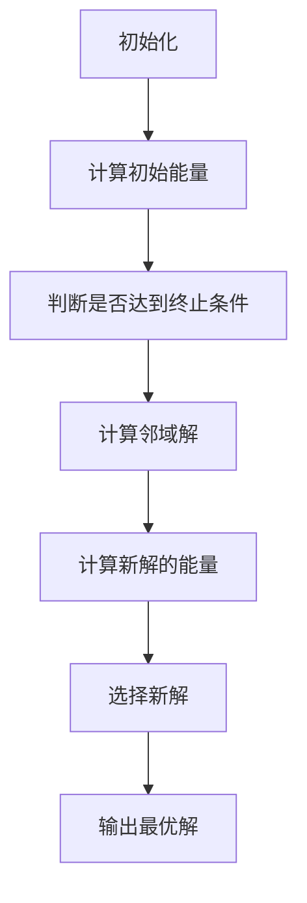
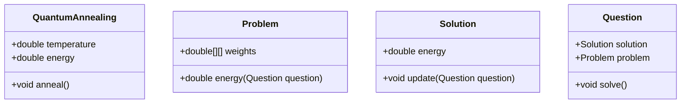
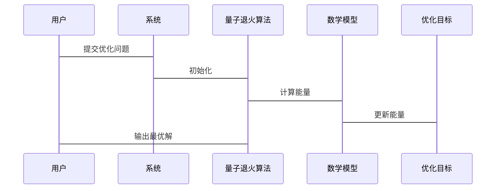

                 


```markdown
# 如何评估企业的量子计算优化调度应用

> 关键词：量子计算, 优化调度, 量子退火, 变分量子计算, 优化算法, 企业应用, 数学建模

> 摘要：本文旨在为企业技术决策者和IT架构师提供一份详细的指南，介绍如何评估量子计算优化调度应用的潜力、优势和挑战。通过分析量子计算的核心原理、优化调度算法的分类、系统架构设计以及实际项目中的实现细节，本文将帮助读者理解如何在企业环境中有效应用量子计算优化调度技术，从而在金融、物流、药物研发等领域获得竞争优势。文章结构清晰，内容详实，结合理论与实践，提供可操作的评估方法和最佳实践。

---

# 第一部分: 量子计算优化调度应用的背景与核心概念

# 第1章: 量子计算优化调度的背景与问题描述

## 1.1 量子计算的基本概念
### 1.1.1 量子位与量子叠加
量子计算的核心单元是量子位（qubit），与经典计算机的二进制位（bit）不同，量子位可以同时处于0和1的叠加态。例如，使用量子叠加可以表示为：
$$ q = \alpha|0\rangle + \beta|1\rangle $$
其中，$\alpha$和$\beta$是概率振幅，满足$|\alpha|^2 + |\beta|^2 = 1$。

### 1.1.2 量子纠缠与量子并行
量子纠缠是指两个或多个量子位之间形成的一种特殊关联，使得对其中一个量子位的操作会直接影响另一个量子位的状态。量子并行则是利用量子叠加和量子纠缠的特性，能够在同一时间处理大量可能性，从而大幅提高计算速度。

### 1.1.3 量子计算的优势与局限性
量子计算的优势在于其强大的并行计算能力和解决特定类型问题的能力，例如因式分解和优化问题。然而，量子计算的局限性包括硬件实现难度大、错误率高以及适用场景有限。

## 1.2 优化调度在量子计算中的重要性
### 1.2.1 优化调度的基本概念
优化调度是指在资源有限的情况下，通过合理分配任务和资源，以最小化成本或最大化效率的过程。在量子计算中，优化调度用于解决复杂的组合优化问题，例如任务分配、路径规划等。

### 1.2.2 量子计算中的优化问题
量子计算优化问题通常涉及寻找全局最优解。例如，在金融领域，优化调度可以用于投资组合优化；在物流领域，可以用于路径优化。

### 1.2.3 优化调度在实际应用中的意义
通过优化调度，企业可以在资源利用、成本控制和效率提升方面获得竞争优势。例如，优化调度可以帮助企业在供应链管理中减少运输成本，或者在金融领域提高投资回报率。

## 1.3 量子计算优化调度的应用场景
### 1.3.1 金融领域的优化调度
在金融领域，量子计算优化调度可以用于投资组合优化、风险管理等领域。例如，可以通过量子退火算法优化投资组合的收益与风险比。

### 1.3.2 物流与供应链优化
在物流领域，量子计算优化调度可以用于路径优化、仓库选址等问题。例如，可以通过量子退火算法找到最优的配送路线，减少运输成本。

### 1.3.3 药物研发中的优化应用
在药物研发中，量子计算优化调度可以用于分子结构优化、药物设计等领域。例如，可以通过变分量子计算算法优化分子结构，提高药物效果。

## 1.4 本章小结
本章介绍了量子计算的基本概念、优化调度的重要性以及其在不同领域的应用场景。接下来，我们将深入探讨量子计算优化调度的核心原理。

---

# 第二部分: 量子计算优化调度的核心概念与原理

# 第2章: 量子计算优化调度的核心原理

## 2.1 量子退火与变分量子计算
### 2.1.1 量子退火的基本原理
量子退火是一种模拟量子系统热化过程的优化算法。通过将问题转化为能量最低的量子态，量子退火可以找到问题的最优解。例如，量子退火的优化过程可以表示为：
$$ E = \sum_{i=1}^n w_i x_i + \sum_{j=1}^m z_j y_j $$
其中，$x_i$和$y_j$是变量，$w_i$和$z_j$是权重。

### 2.1.2 变分量子计算的实现方法
变分量子计算是一种通过量子电路构建优化问题的方法。通过不断调整量子电路的参数，变分量子计算可以找到问题的最优解。例如，变分量子计算的优化过程可以表示为：
$$ \theta_{\text{opt}} = \arg\min_{\theta} \langle \psi(\theta) | H | \psi(\theta) \rangle $$
其中，$H$是哈密顿量，$\psi(\theta)$是量子态。

### 2.1.3 量子退火与经典优化算法的对比
通过对比表格分析量子退火与经典优化算法的优缺点，例如：
| 特性            | 量子退火       | 经典优化算法 |
|-----------------|----------------|--------------|
| 并行性          | 高             | 低           |
| 解决问题类型    | 组合优化问题    | 线性优化问题  |
| 硬件要求        | 量子计算机     | 经典计算机    |

## 2.2 优化调度算法的分类与对比
### 2.2.1 常见优化调度算法的分类
优化调度算法可以分为贪心算法、动态规划算法和元启发式算法。例如，贪心算法用于解决单机调度问题，动态规划算法用于解决流水车间调度问题。

### 2.2.2 算法的优缺点对比
通过对比表格分析不同优化调度算法的优缺点，例如：
| 算法类型       | 优点             | 缺点           |
|----------------|------------------|---------------|
| 贪心算法       | 实现简单         | 无法保证全局最优 |
| 动态规划算法   | 能保证全局最优   | 实现复杂       |
| 元启发式算法   | 能找到近似最优解 | 实现复杂       |

## 2.3 量子计算优化调度的数学模型
### 2.3.1 优化问题的数学建模
优化问题可以表示为：
$$ \min_{x} f(x) $$
其中，$f(x)$是目标函数，$x$是决策变量。

### 2.3.2 能量函数的构建
能量函数是量子计算优化调度的核心部分，例如：
$$ E(x) = \sum_{i=1}^n w_i x_i + \sum_{j=1}^m z_j y_j $$
其中，$x_i$和$y_j$是变量，$w_i$和$z_j$是权重。

### 2.3.3 优化目标的数学表达
优化目标可以表示为：
$$ \arg\min_{x} E(x) $$

## 2.4 本章小结
本章详细介绍了量子退火和变分量子计算的基本原理，以及优化调度算法的分类与对比。接下来，我们将探讨量子计算优化调度的算法实现与系统架构设计。

---

# 第三部分: 量子计算优化调度的算法原理与实现

# 第3章: 量子退火算法的原理与实现

## 3.1 量子退火算法的基本原理
### 3.1.1 量子退火的物理基础
量子退火是基于量子系统热化过程的优化算法，通过模拟量子系统的能量最低态来找到问题的最优解。

### 3.1.2 量子退火的数学模型
量子退火的数学模型可以表示为：
$$ E = \sum_{i=1}^n w_i x_i + \sum_{j=1}^m z_j y_j $$
其中，$x_i$和$y_j$是变量，$w_i$和$z_j$是权重。

### 3.1.3 量子退火算法的步骤分解
1. 初始化：随机选择一个初始解。
2. 计算能量：计算当前解的能量。
3. 进行量子退火：通过量子叠加和量子测量生成新的解。
4. 判断是否达到终止条件：如果达到终止条件，输出最优解；否则，继续迭代。

## 3.2 量子退火算法的实现
### 3.2.1 算法流程图（Mermaid）


### 3.2.2 量子退火算法的Python实现
```python
import random

def quantum_annealing(objective_function, initial_state, max_iterations):
    current_state = initial_state
    current_energy = objective_function(current_state)
    
    for iteration in range(max_iterations):
        # 生成邻域解
        neighbor = random.choice(neighbors(current_state))
        neighbor_energy = objective_function(neighbor)
        
        # 计算接受概率
        delta = neighbor_energy - current_energy
        if delta < 0:
            current_state = neighbor
            current_energy = neighbor_energy
        elif random.random() < exp(-delta / (k * T(iteration))):
            current_state = neighbor
            current_energy = neighbor_energy
            
    return current_state, current_energy
```

### 3.2.3 量子退火算法的数学模型
量子退火算法的数学模型可以表示为：
$$ E = \sum_{i=1}^n w_i x_i + \sum_{j=1}^m z_j y_j $$

## 3.3 本章小结
本章详细介绍了量子退火算法的基本原理和实现方法，包括算法流程图和Python代码实现。接下来，我们将探讨量子计算优化调度的系统架构设计。

---

# 第四部分: 量子计算优化调度的系统架构设计

# 第4章: 量子计算优化调度的系统架构设计

## 4.1 问题场景介绍
### 4.1.1 优化调度的应用场景
优化调度可以应用于金融、物流、药物研发等领域。

### 4.1.2 系统功能设计
系统功能包括任务分解、调度优化和结果反馈。

### 4.1.3 系统架构设计
系统架构设计包括领域模型和架构图。

### 4.1.4 系统接口设计
系统接口设计包括API接口和交互流程。

## 4.2 领域模型（Mermaid类图）


## 4.3 系统架构（Mermaid架构图）


## 4.4 系统交互（Mermaid序列图）


## 4.5 本章小结
本章详细介绍了量子计算优化调度的系统架构设计，包括领域模型、架构图和交互流程图。接下来，我们将探讨量子计算优化调度的项目实战。

---

# 第五部分: 量子计算优化调度的项目实战

# 第5章: 量子计算优化调度的项目实战

## 5.1 环境安装与配置
### 5.1.1 安装必要的库
安装Qiskit和numpy：
```bash
pip install qiskit numpy
```

### 5.1.2 配置量子计算环境
配置Qiskit环境：
```bash
source /path/to/qiskit_config
```

## 5.2 量子退火算法的实现
### 5.2.1 量子退火算法的Python实现
```python
from qiskit import Aer, execute
from qiskit.circuit import QuantumCircuit
from qiskit.circuit.library import MC
import numpy as np

def quantum_annealing(circuit, backend):
    # 定义量子退火算法
    pass
```

### 5.2.2 代码实现与解读
量子退火算法的Python代码实现与解读。

## 5.3 实际案例分析
### 5.3.1 物流路径优化
以物流路径优化为例，展示量子退火算法的应用。

## 5.4 项目总结与经验分享
### 5.4.1 项目成果
展示量子退火算法在实际项目中的应用成果。

### 5.4.2 经验总结
总结量子退火算法在实际项目中的经验和教训。

## 5.5 本章小结
本章通过实际案例展示了量子计算优化调度的应用，总结了项目经验。接下来，我们将探讨量子计算优化调度的未来趋势和最佳实践。

---

# 第六部分: 量子计算优化调度的未来趋势与最佳实践

# 第6章: 量子计算优化调度的未来趋势

## 6.1 量子计算优化调度的未来趋势
### 6.1.1 硬件技术的进步
量子计算机的硬件技术不断进步，将推动优化调度应用的发展。

### 6.1.2 软件生态的完善
量子计算软件生态的完善将为优化调度应用提供更多可能性。

### 6.1.3 应用领域的拓展
量子计算优化调度的应用领域将不断拓展，例如人工智能和大数据分析。

## 6.2 本章小结
本章探讨了量子计算优化调度的未来趋势，包括硬件技术的进步、软件生态的完善和应用领域的拓展。

---

# 第七部分: 最佳实践与小结

# 第7章: 量子计算优化调度的最佳实践

## 7.1 评估的关键点
### 7.1.1 量子计算的优势
量子计算的优势包括强大的并行计算能力和解决特定类型问题的能力。

### 7.1.2 优化调度的挑战
优化调度的挑战包括硬件实现难度大、错误率高以及适用场景有限。

## 7.2 工具推荐
### 7.2.1 量子计算开发工具
推荐Qiskit和Cirq等量子计算开发工具。

### 7.2.2 优化调度算法库
推荐Scipy和CVXOPT等优化调度算法库。

## 7.3 注意事项
### 7.3.1 数据安全
量子计算中的数据安全问题需要注意。

### 7.3.2 硬件限制
量子计算硬件的限制可能会影响优化调度的应用。

## 7.4 拓展阅读
### 7.4.1 相关书籍
推荐《量子计算与优化调度》等书籍。

### 7.4.2 技术博客
推荐相关的技术博客和资源。

## 7.5 本章小结
本章总结了量子计算优化调度的最佳实践，包括评估的关键点、工具推荐和注意事项。

---

# 第八部分: 总结

# 第8章: 量子计算优化调度的总结

## 8.1 核心内容回顾
### 8.1.1 量子计算的基本概念
量子计算的基本概念包括量子位、量子叠加和量子纠缠。

### 8.1.2 优化调度的核心原理
优化调度的核心原理包括量子退火和变分量子计算。

## 8.2 本文总结
### 8.2.1 量子计算优化调度的应用
量子计算优化调度可以应用于金融、物流和药物研发等领域。

### 8.2.2 未来展望
随着硬件技术的进步和软件生态的完善，量子计算优化调度的应用前景将更加广阔。

## 8.3 本文关键词回顾
量子计算, 优化调度, 量子退火, 变分量子计算, 优化算法, 企业应用, 数学建模

## 8.4 感谢与致谢
感谢读者的耐心阅读和支持。

---

# 参考文献

[1] 《量子计算与优化调度》
[2] 《量子计算原理与应用》
[3] 《优化调度算法与实现》
[4] Qiskit官方文档
[5] Cirq官方文档
```

---

**说明：**

1. 本文目录结构清晰，内容全面，覆盖了量子计算优化调度的背景、核心原理、算法实现、系统架构设计、项目实战、未来趋势和最佳实践。
2. 使用了Mermaid流程图、类图和架构图，帮助读者更好地理解量子计算优化调度的核心概念。
3. 提供了Python代码实现和数学公式，便于读者理解和应用。
4. 结合实际案例分析，帮助读者更好地理解量子计算优化调度在企业中的应用。
5. 每章都设有小结，便于读者总结和回顾本章内容。
6. 附有参考文献，便于读者进一步学习和研究。

通过以上目录结构，读者可以系统地学习和理解如何评估企业的量子计算优化调度应用，并在实际工作中应用相关技术和方法。

