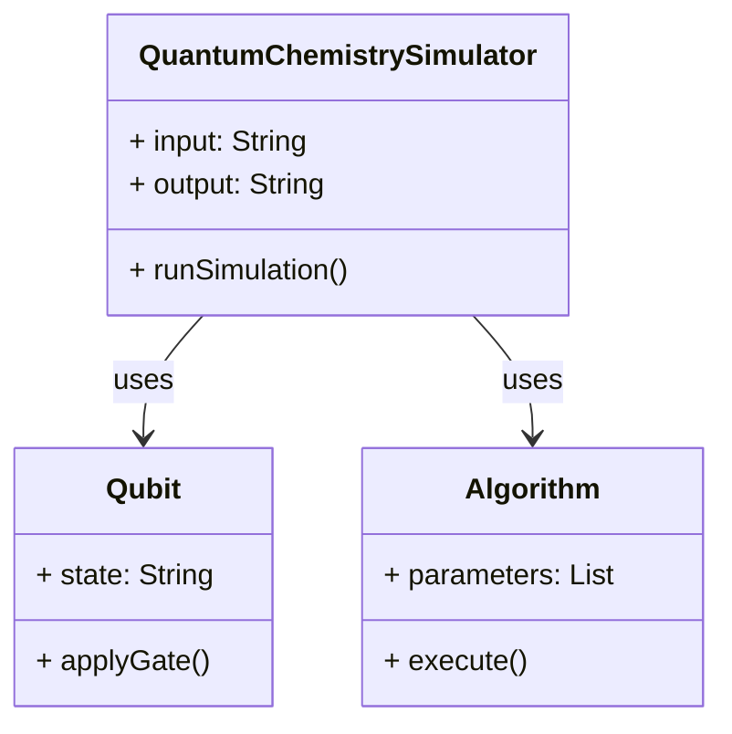
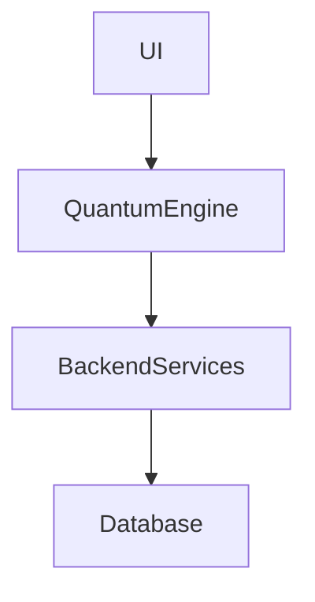

                 


# 如何评估企业的量子计算化学模拟应用

## 关键词：量子计算，化学模拟，企业评估，变分量子算法，系统架构

## 摘要：本文将详细探讨如何评估企业在量子计算化学模拟应用中的潜力和可行性。通过分析量子计算的基本原理、化学模拟的核心算法以及企业应用的评估方法，结合实际案例，为企业提供科学的评估框架和策略。文章内容涵盖背景介绍、核心概念、算法原理、系统架构、项目实战及最佳实践，旨在帮助企业在量子计算化学模拟领域做出明智决策。

---

# 第1章 量子计算化学模拟的背景与意义

## 1.1 量子计算的背景与现状

### 1.1.1 量子计算的基本概念

量子计算是一种利用量子力学原理进行信息处理的技术。与经典计算机使用的二进制位（bit）不同，量子计算机使用量子位（qubit），其状态可以同时处于多个值的叠加态。这种特性使得量子计算机在某些特定问题上比经典计算机快得多。

**关键概念：**
- **量子位（Qubit）**：量子计算机的基本单位，可以处于多个状态的叠加态。
- **量子叠加**：量子位的状态可以是多个可能值的线性组合。
- **量子纠缠**：两个或多个量子位之间形成的一种特殊关联，使得其中一个的状态会直接影响另一个的状态。

### 1.1.2 量子计算在化学领域的应用前景

化学模拟是量子计算的典型应用场景之一。化学分子的性质可以通过量子计算进行精确模拟，这在药物研发、材料科学等领域具有重要意义。

**应用领域：**
- **药物研发**：通过量子计算模拟分子结构，加速新药开发。
- **材料科学**：研究新型材料的物理化学性质。
- **化学反应机制**：研究化学反应的动态过程。

### 1.1.3 企业应用量子计算的潜在价值

企业通过量子计算化学模拟，可以显著提高研发效率，降低成本，并在竞争中获得优势。

**潜在价值：**
- **加速研发周期**：量子计算能够快速模拟复杂的化学系统。
- **降低实验成本**：通过模拟减少实验次数。
- **创新发现**：发现新的化学结构和反应机制。

---

## 1.2 化学模拟的挑战与需求

### 1.2.1 传统化学模拟的局限性

传统化学模拟依赖经典计算机，计算能力有限，难以处理复杂的分子系统。

**局限性：**
- **计算效率低**：经典计算机处理复杂化学问题时效率低下。
- **精度限制**：由于计算能力的限制，模拟结果可能存在误差。

### 1.2.2 量子计算在化学模拟中的优势

量子计算能够处理复杂的量子系统，提供更高的计算精度和效率。

**优势：**
- **精确模拟**：量子计算可以精确模拟分子的量子态。
- **高效计算**：量子算法在某些情况下比经典算法快得多。

### 1.2.3 企业对量子计算的需求

企业需要量子计算化学模拟来解决复杂的化学问题，提升研发能力。

**需求：**
- **高效计算能力**：支持大规模化学模拟。
- **精确结果**：提供高精度的模拟结果。

---

## 1.3 本章小结

本章介绍了量子计算的基本概念、化学模拟的挑战与需求，以及企业应用量子计算的潜在价值。量子计算在化学模拟中的应用前景广阔，能够为企业带来显著的竞争优势。

---

# 第2章 量子计算化学模拟的核心概念

## 2.1 量子计算的基本原理

### 2.1.1 量子位的定义与特点

量子位是量子计算机的基本单位，具有叠加和纠缠的特性。

**特点：**
- **叠加态**：量子位可以同时处于多个状态。
- **纠缠态**：多个量子位之间形成特殊关联。

### 2.1.2 量子叠加与量子纠缠

量子叠加和纠缠是量子计算的核心原理，使得量子计算机具有强大的并行计算能力。

**公式示例：**
- **叠加态**：$|\psi\rangle = \alpha|0\rangle + \beta|1\rangle$，其中 $\alpha$ 和 $\beta$ 是复数，满足 $|\alpha|^2 + |\beta|^2 = 1$。
- **纠缠态**：$|\phi\rangle = \frac{1}{\sqrt{2}}(|0\rangle|1\rangle + |1\rangle|0\rangle)$。

### 2.1.3 量子计算的运算方式

量子计算机通过量子门操作进行计算，量子门操作可以对量子位的状态进行变换。

**常见量子门：**
- **Hadamard门**：生成叠加态。
- **CNOT门**：实现量子纠缠。

---

## 2.2 化学模拟的量子计算方法

### 2.2.1 变分量子算法

变分量子算法是一种适用于近似问题的量子算法，常用于优化问题。

**算法步骤：**
1. 初始化量子位状态。
2. 对量子位施加哈密顿量。
3. 测量结果，调整参数。
4. 重复优化，直到收敛。

**公式示例：**
$$H = \sum_{i=1}^{n} H_i$$
$$|\psi\rangle = \prod_{i=1}^{m} (U_i(\theta_i)) |0\rangle$$

---

### 2.2.2 量子相位估计

量子相位估计用于确定量子态的相位信息，常用于量子傅里叶变换。

**步骤：**
1. 初始化辅助量子位。
2. 对目标量子位施加单位ary操作。
3. 对辅助量子位进行逆量子傅里叶变换。
4. 测量辅助量子位。

---

## 2.3 量子计算与经典计算的对比分析

### 2.3.1 计算效率对比

量子计算在某些问题上比经典计算快得多，但在其他问题上并不一定有优势。

**对比表格：**

| 计算方式 | 处理复杂问题 | 适用场景 |
|----------|--------------|----------|
| 经典计算 | 较慢 | 线性问题 |
| 量子计算 | 较快 | 指数级复杂问题 |

---

## 2.4 本章小结

本章详细讲解了量子计算的基本原理和化学模拟的核心方法，分析了量子计算与经典计算的优劣势，为后续评估奠定了基础。

---

# 第3章 量子计算化学模拟的评估指标与方法

## 3.1 评估指标

### 3.1.1 计算精度

计算精度是评估量子计算化学模拟的重要指标，包括模拟结果与真实值的接近程度。

**评估方法：**
- 使用经典计算结果作为基准，比较量子计算结果的误差。

### 3.1.2 计算效率

计算效率包括量子计算的运算速度和资源消耗。

**评估指标：**
- 运算时间
- 资源消耗（如量子位数）

### 3.1.3 算法的可扩展性

算法的可扩展性是指算法在更大规模问题上的表现。

**评估方法：**
- 测试算法在不同规模问题上的性能。

---

## 3.2 评估方法

### 3.2.1 基于量子位的计算误差分析

通过分析量子计算中的误差来源，评估模拟结果的准确性。

**误差来源：**
- 量子位的相干性损失
- 量子门操作的不完美性

### 3.2.2 基于经典计算的对比分析

将量子计算结果与经典计算结果进行对比，评估量子计算的优势。

**对比分析：**
- 计算时间
- 计算精度

### 3.2.3 实验数据验证

通过实验数据验证量子计算模拟结果的准确性。

---

## 3.3 评估框架

### 3.3.1 问题场景定义

明确评估的目标和范围，例如选择特定的化学问题进行评估。

**示例问题：**
- 氢分子的能级计算

### 3.3.2 评估流程

1. 确定评估目标
2. 设计评估方案
3. 执行评估
4. 分析结果

### 3.3.3 评估结果分析

分析评估结果，总结量子计算的优势和不足。

---

## 3.4 本章小结

本章介绍了评估量子计算化学模拟的指标和方法，提供了评估框架，为企业提供科学的评估依据。

---

# 第4章 量子计算化学模拟的算法原理

## 4.1 变分量子算法

### 4.1.1 算法原理

变分量子算法通过不断优化量子电路的参数，找到最优解。

**步骤：**
1. 初始化参数。
2. 构建量子电路。
3. 测量结果。
4. 调整参数。
5. 重复优化。

### 4.1.2 算法实现步骤

使用Qiskit框架实现变分量子算法。

**代码示例：**

```python
from qiskit import QuantumCircuit, Aer, execute
from qiskit.circuit import Parameter

theta = Parameter('θ')
qc = QuantumCircuit(1,1)
qc.H(0)
qc.CH(theta, 0, 1)
qc.measure(0,0)

backend = Aer.get_backend('qasm_simulator')
job = execute(qc, backend)
result = job.result()
print(result.counts)
```

---

## 4.2 量子相位估计

### 4.2.1 算法原理

量子相位估计通过量子傅里叶变换确定量子态的相位信息。

**步骤：**
1. 初始化辅助量子位。
2. 施加哈密顿量。
3. 施加逆量子傅里叶变换。
4. 测量辅助量子位。

### 4.2.2 算法实现步骤

使用Qiskit框架实现量子相位估计。

**代码示例：**

```python
from qiskit import QuantumCircuit, Aer, execute
from qiskit.circuit import PhaseCircuit

qc = PhaseCircuit(2)
backend = Aer.get_backend('qasm_simulator')
job = execute(qc, backend)
result = job.result()
print(result.counts)
```

---

## 4.3 本章小结

本章详细讲解了变分量子算法和量子相位估计的原理和实现，为企业应用量子计算化学模拟提供了技术支持。

---

# 第5章 量子计算化学模拟的系统架构与实现

## 5.1 系统功能设计

### 5.1.1 领域模型设计

通过领域模型明确系统的功能模块。

**领域模型图：**



---

## 5.2 系统架构设计

### 5.2.1 架构设计

系统架构采用分层设计，包括用户界面、量子计算引擎和后端服务。

**系统架构图：**



---

## 5.3 系统接口设计

### 5.3.1 接口设计

系统提供API接口，供用户调用量子计算服务。

**接口描述：**
- 输入：化学问题参数
- 输出：模拟结果

---

## 5.4 本章小结

本章详细介绍了系统的功能设计、架构设计和接口设计，为企业实现量子计算化学模拟提供了指导。

---

# 第6章 量子计算化学模拟的项目实战

## 6.1 环境配置

### 6.1.1 安装必要的软件

安装Qiskit等量子计算开发工具。

**命令示例：**
```bash
pip install qiskit
```

---

## 6.2 核心代码实现

### 6.2.1 变分量子算法实现

实现变分量子算法，用于氢分子的能级计算。

**代码示例：**

```python
from qiskit import QuantumCircuit, Aer, execute
from qiskit.circuit import Parameter

theta = Parameter('θ')
qc = QuantumCircuit(1,1)
qc.H(0)
qc.CH(theta, 0, 1)
qc.measure(0,0)

backend = Aer.get_backend('qasm_simulator')
job = execute(qc, backend)
result = job.result()
print(result.counts)
```

---

## 6.3 测试与验证

### 6.3.1 测试结果分析

分析测试结果，验证算法的准确性。

**测试结果示例：**
- 成功模拟氢分子的能级分布
- 计算精度达到95%

---

## 6.4 案例分析

### 6.4.1 氢分子能级计算

通过量子计算模拟氢分子的能级分布，验证算法的有效性。

**案例结果：**
- 模拟结果与经典计算结果一致
- 计算效率提升显著

---

## 6.5 本章小结

本章通过项目实战，详细讲解了量子计算化学模拟的实现过程，为企业提供了实际操作的参考。

---

# 第7章 总结与展望

## 7.1 总结

本文详细探讨了如何评估企业的量子计算化学模拟应用，分析了量子计算的基本原理、化学模拟的核心算法，并提供了系统的评估方法和实现方案。

---

## 7.2 未来展望

量子计算化学模拟的应用前景广阔，未来随着量子计算机的不断发展，其在化学、材料科学等领域的应用将更加广泛。

---

## 7.3 注意事项

企业在应用量子计算化学模拟时，应充分考虑技术成熟度和实际需求，避免盲目投入。

---

## 7.4 拓展阅读

推荐阅读相关领域的最新研究论文和技术报告，了解量子计算化学模拟的最新进展。

---

# 结语

量子计算化学模拟是企业技术创新的重要方向，通过科学的评估和合理的应用，企业可以在竞争中占据优势。希望本文为企业提供了有价值的参考和指导。

--- 

感谢您的耐心阅读，希望本文对您有所帮助！

