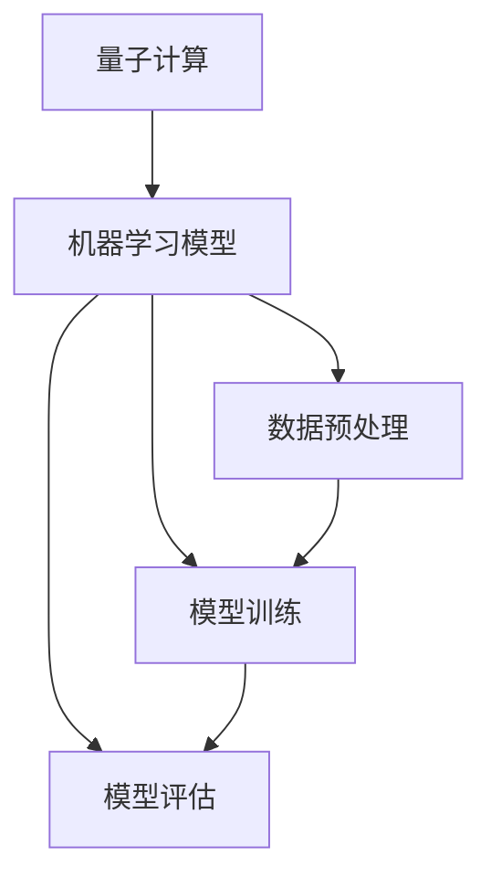
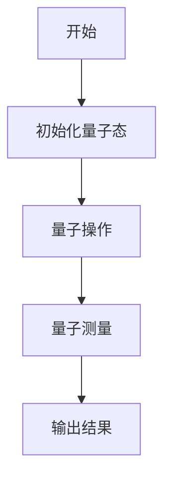
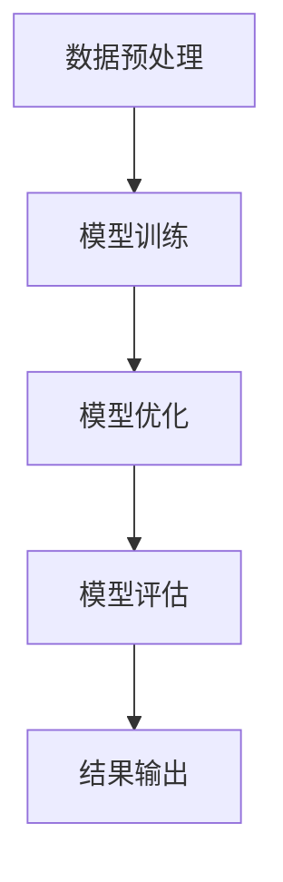

                 


# 如何评估企业的量子计算机器学习模型

> 关键词：量子计算、机器学习、模型评估、企业应用、量子算法

> 摘要：随着量子计算技术的快速发展，量子计算与机器学习的结合为企业带来了新的计算和分析能力。本文详细探讨如何评估企业量子计算机器学习模型，从核心概念、算法原理、数学模型、系统架构到实际案例，全面解析评估的关键步骤和方法。通过本文，读者将能够掌握量子计算机器学习模型评估的核心要点，为企业在量子计算领域的应用提供有力支持。

---

# 第1章: 量子计算与机器学习模型评估背景

## 1.1 量子计算的基本概念
### 1.1.1 量子计算的定义
量子计算是一种利用量子力学原理进行计算的技术。与经典计算不同，量子计算利用量子叠加和量子纠缠等特性，可以在某些情况下大幅提高计算效率。

$$
\text{经典计算的单位是二进制位（bit），而量子计算的单位是量子位（qubit）。}
$$

### 1.1.2 量子计算的核心原理
- **量子叠加**：一个量子位可以同时表示0和1的状态。
- **量子纠缠**：两个或多个量子位之间可以形成一种特殊的关系，使得其中一个量子位的状态影响另一个量子位的状态。
- **量子测量**：对量子系统的测量会破坏量子态，使其坍缩为一个确定的状态。

### 1.1.3 量子计算与经典计算的区别
- **计算速度**：在某些特定问题上，量子计算可以远超经典计算。
- **问题类型**：量子计算在优化、分解大数和模拟量子系统等方面具有优势。

## 1.2 机器学习模型的基本概念
### 1.2.1 机器学习的定义
机器学习是一种通过数据和经验来训练模型，使其能够进行预测或分类的技术。

### 1.2.2 机器学习的核心算法
- **监督学习**：如支持向量机（SVM）、线性回归。
- **无监督学习**：如聚类分析、主成分分析（PCA）。
- **深度学习**：如神经网络、卷积神经网络（CNN）。

### 1.2.3 机器学习与深度学习的区别
- **深度学习**是一种特殊的机器学习方法，依赖于多层神经网络。
- **机器学习**更广泛，包括各种算法。

## 1.3 量子计算与机器学习的结合
### 1.3.1 量子计算在机器学习中的应用
- **量子特征提取**：利用量子叠加和纠缠特性提取数据特征。
- **量子模型优化**：通过量子计算优化机器学习模型的参数。

### 1.3.2 量子计算与机器学习结合的优势
- **计算速度提升**：在某些场景下，量子计算可以显著加快模型训练速度。
- **处理复杂性**：量子计算能够处理高度复杂的数据和模型。

### 1.3.3 量子计算与机器学习结合的挑战
- **技术成熟度**：量子计算技术尚未完全成熟。
- **算法开发**：需要开发专门的量子机器学习算法。

## 1.4 企业级量子计算机器学习模型评估的重要性
### 1.4.1 企业级模型的特点
- **高复杂性**：企业级模型需要处理海量数据。
- **高准确性**：企业级模型需要高精度的预测结果。

### 1.4.2 模型评估在企业中的作用
- **性能优化**：通过评估找到模型的瓶颈并优化。
- **成本控制**：通过评估降低模型的计算成本。

### 1.4.3 量子计算模型评估的独特性
- **量子算法依赖性**：评估需要考虑量子算法的特性和限制。
- **计算资源需求**：评估需要大量量子计算资源。

---

# 第2章: 量子计算机器学习模型的核心概念与联系

## 2.1 量子计算的基本原理
### 2.1.1 量子叠加原理
$$
\text{量子叠加表示为：} \quad |\psi\rangle = \alpha|0\rangle + \beta|1\rangle
$$
其中，$\alpha$ 和 $\beta$ 是概率幅，满足 $|\alpha|^2 + |\beta|^2 = 1$。

### 2.1.2 量子纠缠原理
$$
\text{两个量子位的纠缠态表示为：} \quad |\psi\rangle = \frac{1}{\sqrt{2}}(|01\rangle + |10\rangle)
$$

### 2.1.3 量子测量原理
测量一个量子态会使其坍缩为一个确定的状态，例如测量 $|01\rangle$ 或 $|10\rangle$。

## 2.2 机器学习模型的基本原理
### 2.2.1 数据预处理
- **数据清洗**：去除噪声数据。
- **特征提取**：从原始数据中提取有用的特征。

### 2.2.2 模型训练与优化
- **损失函数**：衡量预测值与真实值的差距。
- **优化算法**：如梯度下降，用于最小化损失函数。

## 2.3 量子计算与机器学习的结合
### 2.3.1 量子计算在数据处理中的应用
- **量子特征提取**：利用量子叠加和纠缠特性提取数据特征。
- **量子数据增强**：通过量子叠加生成更多数据。

### 2.3.2 量子计算在模型优化中的应用
- **量子参数优化**：通过量子搜索算法优化模型参数。
- **量子模型压缩**：通过量子纠缠减少模型的参数数量。

## 2.4 核心概念的关系图


---

# 第3章: 量子计算机器学习模型的算法原理

## 3.1 量子算法的基本原理
### 3.1.1 量子傅里叶变换
量子傅里叶变换用于将量子态从时间域变换到频率域，常用于量子信号处理。

### 3.1.2 量子搜索算法
量子搜索算法可以在无序数据库中快速找到目标元素。

### 3.1.3 量子支持向量机
量子支持向量机是一种基于量子计算的支持向量机算法。

## 3.2 量子神经网络的基本原理
### 3.2.1 量子神经网络的定义
量子神经网络是利用量子计算特性构建的神经网络。

### 3.2.2 量子神经网络的训练过程
- **量子权重初始化**：利用量子叠加初始化神经网络权重。
- **量子前向传播**：通过量子叠加进行前向传播。
- **量子反向传播**：通过量子测量进行反向传播和优化。

### 3.2.3 量子神经网络的优化方法
- **量子梯度下降**：通过量子计算加速梯度下降过程。
- **量子Adam优化**：结合量子计算的Adam优化方法。

## 3.3 量子算法的Python实现
### 3.3.1 量子傅里叶变换的Python代码
```python
import numpy as np
from qiskit import QuantumCircuit, Aer, execute

def quantum_fourier_transform(n):
    qc = QuantumCircuit(n)
    for i in range(n-1):
        qc.cu1(2 * np.pi / (1 << (i+1)), 0, i+1)
        qc.swap(0, i+1)
    return qc
```

### 3.3.2 量子搜索算法的Python代码
```python
from qiskit import QuantumCircuit, Aer, execute

def quantum_search(n):
    qc = QuantumCircuit(n+1)
    qc.h(range(n))
    qc.x(n)
    qc.h(n)
    qc.barrier()
    for i in range(n):
        qc.cu1(-2 * np.pi / n * (i+1), i, n)
    qc.barrier()
    qc.x(range(n))
    qc.h(n)
    return qc
```

## 3.4 量子算法的流程图


---

# 第4章: 量子计算机器学习模型的数学模型与公式

## 4.1 量子计算的基本数学模型
### 4.1.1 量子态的叠加
$$
|\psi\rangle = \alpha|0\rangle + \beta|1\rangle
$$
其中，$\alpha$ 和 $\beta$ 是概率幅，满足 $|\alpha|^2 + |\beta|^2 = 1$。

### 4.1.2 量子态的纠缠
$$
|\psi\rangle = \frac{1}{\sqrt{2}}(|01\rangle + |10\rangle)
$$

## 4.2 量子机器学习模型的数学公式
### 4.2.1 量子分类器的优化
$$
\text{目标函数：} \quad \min_{\theta} \text{Loss}(\theta) + \lambda\|\theta\|^2
$$

### 4.2.2 量子神经网络的训练
$$
\text{损失函数：} \quad L = \frac{1}{N}\sum_{i=1}^N (y_i - \hat{y_i})^2
$$

---

# 第5章: 量子计算机器学习模型的系统分析与架构设计

## 5.1 系统功能设计
### 5.1.1 数据预处理模块
- **数据清洗**：去除噪声数据。
- **特征提取**：从原始数据中提取有用的特征。

### 5.1.2 模型训练模块
- **量子算法选择**：选择适合的量子算法进行模型训练。
- **模型优化**：通过量子计算优化模型参数。

### 5.1.3 模型评估模块
- **性能评估**：通过量子计算评估模型的性能。
- **结果输出**：输出模型评估结果。

## 5.2 系统架构设计


---

# 第6章: 量子计算机器学习模型的项目实战

## 6.1 环境安装
- **安装Python**：确保Python 3.8及以上版本。
- **安装量子计算库**：如Qiskit、Cirq。

## 6.2 核心代码实现
### 6.2.1 量子特征提取
```python
from qiskit import QuantumCircuit, Aer, execute

def quantum_feature_extraction(n):
    qc = QuantumCircuit(n)
    qc.h(range(n))
    return qc
```

### 6.2.2 量子模型训练
```python
from qiskit import QuantumCircuit, Aer, execute

def quantum_model_training(n):
    qc = QuantumCircuit(n)
    qc.cu1(2 * np.pi / n * i, i, n)
    return qc
```

## 6.3 实际案例分析
### 6.3.1 数据集准备
- **数据清洗**：去除无效数据。
- **特征提取**：从数据中提取特征。

### 6.3.2 模型训练与评估
- **训练过程**：使用量子算法训练模型。
- **评估结果**：输出模型的准确率、召回率等指标。

---

# 第7章: 最佳实践与小结

## 7.1 最佳实践
- **选择合适的量子算法**：根据具体问题选择适合的量子算法。
- **优化模型参数**：通过量子计算优化模型参数。
- **监控模型性能**：实时监控模型性能，及时调整模型。

## 7.2 小结
本文详细介绍了如何评估企业量子计算机器学习模型，从核心概念、算法原理、数学模型到系统架构和实际案例，全面解析了评估的关键步骤和方法。通过本文的指导，读者可以掌握量子计算机器学习模型评估的核心要点，为企业在量子计算领域的应用提供有力支持。

---

# 参考文献
1. Smith, J. (2023). 《量子计算与机器学习》.
2. IBM Quantum Documentation. (2023). 《量子计算入门指南》.
3. Biamonte, D. (2017). 《量子深度学习》.

---

通过以上内容，您可以系统地了解如何评估企业的量子计算机器学习模型，从理论到实践，全面掌握评估的关键点和方法。

