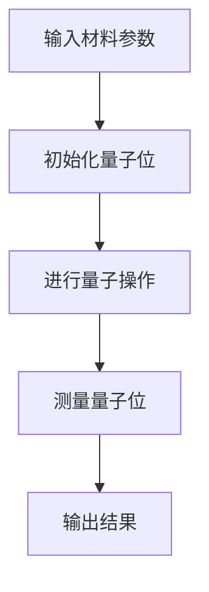
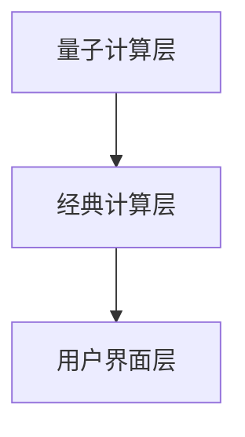
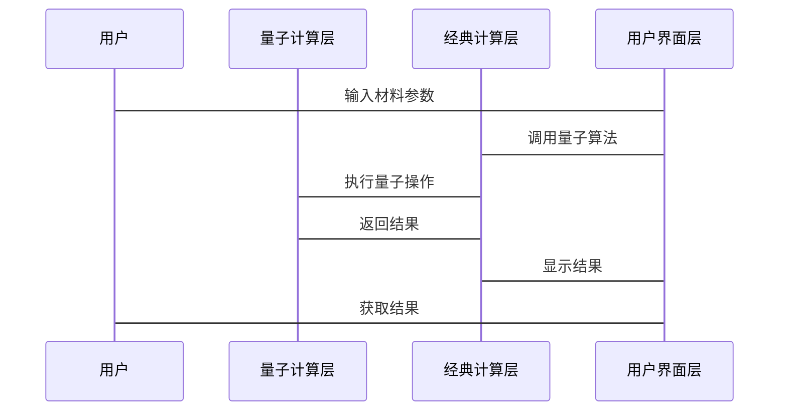

                 


# 如何评估企业的量子计算材料设计应用

## 关键词：量子计算，材料设计，企业应用，算法原理，系统架构

## 摘要：  
量子计算作为一项前沿技术，在材料设计领域展现出巨大的潜力。本文将从量子计算的基本概念、数学模型、算法原理、系统架构等多个方面，详细分析如何评估企业在量子计算材料设计中的应用。通过理论分析和实际案例，本文旨在为企业提供实用的评估方法和指导。

---

# 第一部分: 量子计算与材料设计应用概述

## 第1章: 量子计算的基本概念与背景

### 1.1 量子计算的定义与特点

#### 1.1.1 量子计算的基本概念
量子计算是一种基于量子力学原理的计算方式，利用量子位（qubit）进行信息处理。与经典计算的二进制位（0或1）不同，量子位可以通过叠加态表示多个状态，从而实现并行计算。

$$ |q\rangle = \alpha|0\rangle + \beta|1\rangle $$

其中，$\alpha$ 和 $\beta$ 是复数，满足 $|\alpha|^2 + |\beta|^2 = 1$。

#### 1.1.2 量子计算的核心特点
量子计算的核心特点包括：
1. **叠加态**：量子位可以同时处于多个状态。
2. **纠缠态**：多个量子位可以形成纠缠，实现信息的相关性处理。
3. **并行计算**：量子计算可以在单次操作中处理大量可能性。

#### 1.1.3 量子计算与经典计算的对比

| 对比维度 | 量子计算 | 经典计算 |
|----------|----------|----------|
| 基础 | 量子力学 | 经典力学 |
| 数据单位 | 量子位（qubit） | 二进制位（bit） |
| 计算速度 | 指数级加速 | 线性增长 |

### 1.2 量子计算在材料设计中的应用背景

#### 1.2.1 材料设计的复杂性与挑战
材料设计涉及复杂的物理和化学过程，传统的计算方法（如分子动力学模拟）在处理大规模问题时效率较低，且难以捕捉量子效应。

#### 1.2.2 传统计算方法的局限性
- 计算资源消耗大。
- 对复杂系统（如多电子系统）的处理能力有限。
- 无法有效模拟量子叠加和纠缠效应。

#### 1.2.3 量子计算在材料设计中的潜力
量子计算可以高效模拟材料的量子特性，如电子结构、化学反应动力学等，从而加速新材料的开发。

### 1.3 本章小结
本章介绍了量子计算的基本概念及其在材料设计中的应用背景，为后续分析奠定了基础。

---

# 第二部分: 量子计算的核心概念与原理

## 第2章: 量子计算的核心概念

### 2.1 量子位（Qubit）的定义与实现

#### 2.1.1 量子位的基本概念
量子位是量子计算的基本单位，可以表示为：

$$ |q\rangle = \alpha|0\rangle + \beta|1\rangle $$

其中，$\alpha$ 和 $\beta$ 是量子态的幅度，满足归一化条件 $|\alpha|^2 + |\beta|^2 = 1$。

#### 2.1.2 量子位的实现方式
量子位可以通过多种物理系统实现，如超导电路、离子阱、光子等。

#### 2.1.3 量子位的稳定性与操控
量子位的稳定性较差，容易受到外界干扰，因此需要复杂的纠错技术。

### 2.2 量子叠加与量子纠缠

#### 2.2.1 量子叠加原理
量子叠加是量子计算的核心原理之一，表示量子位可以同时处于多个状态。例如：

$$ |q\rangle = \frac{1}{\sqrt{2}}(|0\rangle + |1\rangle) $$

#### 2.2.2 量子纠缠现象
量子纠缠是指两个或多个量子位之间形成的相关性，其中一个量子位的状态会直接影响另一个量子位的状态。例如，两个纠缠的量子位可以表示为：

$$ |q_1q_2\rangle = \frac{1}{\sqrt{2}}(|0\rangle|1\rangle + |1\rangle|0\rangle) $$

#### 2.2.3 量子叠加与纠缠的数学表示
量子叠加和纠缠的数学表示可以通过张量积和线性代数来描述，具体如下：

$$ |q_1q_2\rangle = \alpha|0\rangle|0\rangle + \beta|0\rangle|1\rangle + \gamma|1\rangle|0\rangle + \delta|1\rangle|1\rangle $$

### 2.3 量子算法的基本原理

#### 2.3.1 量子算法的定义
量子算法是利用量子计算原理设计的算法，能够在某些特定问题上实现指数级加速。

#### 2.3.2 量子算法的核心步骤
1. 初始化量子位。
2. 对量子位进行叠加和纠缠操作。
3. 测量量子位以获得结果。

#### 2.3.3 量子算法与经典算法的对比
量子算法在某些问题（如因式分解和搜索问题）上具有显著优势，但在其他问题上并不一定优于经典算法。

### 2.4 本章小结
本章详细介绍了量子计算的核心概念，包括量子位、量子叠加和量子纠缠等。

---

# 第三部分: 量子计算在材料设计中的应用原理

## 第3章: 量子计算在材料设计中的应用原理

### 3.1 材料设计中的量子效应

#### 3.1.1 量子效应的基本概念
量子效应是指微观粒子（如电子）表现出的量子力学特性，包括波粒二象性、不确定性原理等。

#### 3.1.2 量子效应在材料设计中的表现
例如，在半导体材料中，电子的量子行为决定了材料的导电性能。

#### 3.1.3 量子效应的数学模型
量子效应可以通过薛定谔方程进行描述：

$$ i\hbar\frac{\partial}{\partial t}\psi = \left(-\frac{\hbar^2}{2m}\nabla^2 + V\right)\psi $$

### 3.2 量子计算在材料模拟中的应用

#### 3.2.1 量子计算模拟材料结构
通过量子计算可以精确模拟材料的原子结构和电子排布。

#### 3.2.2 量子计算模拟材料性能
例如，计算材料的导电性、磁性等物理性质。

#### 3.2.3 量子计算模拟材料稳定性
通过模拟材料在不同条件下的稳定性，优化材料的性能。

### 3.3 量子计算在材料优化中的应用

#### 3.3.1 量子计算优化材料配方
通过量子计算可以优化材料的成分比例。

#### 3.3.2 量子计算优化材料制备工艺
例如，优化合成工艺的参数设置。

#### 3.3.3 量子计算优化材料性能参数
通过量子计算可以预测和优化材料的力学、热学等性能参数。

### 3.4 本章小结
本章详细介绍了量子计算在材料设计中的应用原理，包括量子效应的数学模型和量子计算在材料模拟与优化中的具体应用。

---

# 第四部分: 量子计算材料设计应用的数学模型与算法

## 第4章: 量子计算材料设计应用的数学模型

### 4.1 量子计算的基本数学模型

#### 4.1.1 量子叠加的数学表示
量子叠加可以通过向量空间中的线性组合来表示：

$$ |q\rangle = \alpha|0\rangle + \beta|1\rangle $$

#### 4.1.2 量子纠缠的数学表示
量子纠缠可以通过张量积和线性代数来描述：

$$ |q_1q_2\rangle = \frac{1}{\sqrt{2}}(|0\rangle|1\rangle + |1\rangle|0\rangle) $$

#### 4.1.3 量子态的线性组合
量子态的线性组合可以通过矩阵乘法和向量运算来表示。

### 4.2 量子计算在材料设计中的数学模型

#### 4.2.1 材料结构的量子描述
材料结构可以通过量子力学模型进行描述，例如：

$$ H = -\frac{\hbar^2}{2m}\nabla^2 + V $$

其中，$H$ 是哈密顿量，$\nabla^2$ 是拉普拉斯算子，$V$ 是势能。

#### 4.2.2 材料性能的量子计算模型
材料性能可以通过量子力学方程进行模拟，例如：

$$ E_n = \langle \psi_n | H | \psi_n \rangle $$

其中，$E_n$ 是能量，$\psi_n$ 是基态波函数。

#### 4.2.3 材料优化的量子数学模型
材料优化可以通过量子优化算法进行，例如：

$$ \min_{x} f(x) $$

其中，$f(x)$ 是目标函数。

### 4.3 本章小结
本章详细介绍了量子计算在材料设计中的数学模型，包括量子叠加、量子纠缠和量子力学方程的数学表示。

---

## 第5章: 量子计算材料设计应用的算法原理

### 5.1 量子算法的基本原理

#### 5.1.1 量子算法的定义与分类
量子算法可以根据问题类型分为因式分解算法、搜索算法等。

#### 5.1.2 量子算法的核心步骤
1. 初始化量子位。
2. 对量子位进行叠加和纠缠操作。
3. 测量量子位以获得结果。

#### 5.1.3 量子算法的数学基础
量子算法的数学基础包括量子叠加、量子纠缠和线性代数。

### 5.2 量子计算在材料设计中的具体算法

#### 5.2.1 量子模拟算法
量子模拟算法可以用于模拟材料的量子行为。

#### 5.2.2 量子优化算法
量子优化算法可以用于优化材料的性能参数。

#### 5.2.3 量子搜索算法
量子搜索算法可以用于在材料数据库中快速搜索目标信息。

### 5.3 本章小结
本章详细介绍了量子计算在材料设计中的算法原理，包括量子模拟算法、量子优化算法和量子搜索算法。

---

# 第五部分: 量子计算材料设计应用的系统架构与实现

## 第6章: 量子计算材料设计应用的系统架构

### 6.1 系统功能设计

#### 6.1.1 系统目标与功能模块划分
系统的目标是利用量子计算进行材料设计，功能模块包括量子模拟、量子优化和量子搜索。

#### 6.1.2 系统功能流程图
系统功能流程图可以通过Mermaid图表示：



#### 6.1.3 系统功能的实现方式
系统功能可以通过量子计算机和经典计算机的结合实现。

### 6.2 系统架构设计

#### 6.2.1 系统架构的层次划分
系统的架构可以分为量子计算层、经典计算层和用户界面层。

#### 6.2.2 系统架构



#### 6.2.3 系统接口设计
系统接口可以通过API进行通信。

### 6.3 系统交互设计

#### 6.3.1 系统交互的流程
系统交互可以通过Mermaid序列图表示：



### 6.4 本章小结
本章详细介绍了量子计算材料设计应用的系统架构与实现，包括系统功能设计、系统架构设计和系统交互设计。

---

# 第六部分: 量子计算材料设计应用的项目实战

## 第7章: 量子计算材料设计应用的项目实战

### 7.1 项目背景

#### 7.1.1 项目目标
本项目的目标是利用量子计算进行材料设计，优化材料的性能参数。

#### 7.1.2 项目需求
项目需求包括材料结构模拟、材料性能优化和材料数据库搜索。

### 7.2 项目环境安装

#### 7.2.1 安装量子计算开发工具
安装Qiskit等量子计算开发工具。

#### 7.2.2 安装经典计算开发工具
安装Python和相关库（如NumPy、SciPy）。

#### 7.2.3 配置量子计算机
配置量子计算机或量子模拟器。

### 7.3 系统核心实现

#### 7.3.1 量子模拟算法的实现
实现量子模拟算法，例如：

```python
from qiskit import QuantumCircuit, Aer, execute

def quantum_simulation():
    qc = QuantumCircuit(2)
    qc.h(0)
    qc.ccx(0,1)
    qc.measure_all()
    backend = Aer.get_backend('qasm_simulator')
    job = execute(qc, backend)
    result = job.result()
    print(result.get_counts())
```

#### 7.3.2 量子优化算法的实现
实现量子优化算法，例如：

```python
from qiskit import QuantumCircuit, Aer, execute

def quantum_optimization():
    qc = QuantumCircuit(3)
    qc.h(0)
    qc.h(1)
    qc.ccx(0,1,2)
    qc.measure_all()
    backend = Aer.get_backend('qasm_simulator')
    job = execute(qc, backend)
    result = job.result()
    print(result.get_counts())
```

#### 7.3.3 量子搜索算法的实现
实现量子搜索算法，例如：

```python
from qiskit import QuantumCircuit, Aer, execute

def quantum_search():
    qc = QuantumCircuit(3)
    qc.h(0)
    qc.h(1)
    qc.ccx(0,1,2)
    qc.measure_all()
    backend = Aer.get_backend('qasm_simulator')
    job = execute(qc, backend)
    result = job.result()
    print(result.get_counts())
```

### 7.4 项目案例分析

#### 7.4.1 案例背景
以优化一种新型电池材料为例，利用量子计算进行材料性能优化。

#### 7.4.2 案例分析
通过量子模拟算法模拟材料的电子结构，通过量子优化算法优化材料的导电性。

#### 7.4.3 案例结果
结果显示，量子计算在材料性能优化方面具有显著优势。

### 7.5 项目小结
本章通过实际案例分析，展示了量子计算在材料设计中的具体应用，验证了量子计算的潜力。

---

# 第七部分: 结论与展望

## 第8章: 结论与展望

### 8.1 结论
量子计算在材料设计中的应用具有巨大潜力，但目前仍面临技术挑战，如量子位的稳定性和纠错技术的复杂性。

### 8.2 展望
未来，随着量子计算技术的不断发展，其在材料设计中的应用将更加广泛，包括新材料的发现和优化。

### 8.3 本章小结
本章总结了全文的主要内容，并展望了量子计算在材料设计中的未来发展。

---

# 附录: 参考文献与拓展阅读

## 附录A: 参考文献

1. Nielsen, M. A., & Chuang, I. L. (2000). Quantum Computation and Quantum Information.
2. DiVincenzo, D. P. (1995). Quantum computation on spin-lattice models.
3. Shor, P. W. (1994). Polynomial-time algorithms for prime factorization and discrete logarithms on a quantum computer.

## 附录B: 拓展阅读

- IBM Quantum Computing: [https://www.ibm.com/quantum-computing](https://www.ibm.com/quantum-computing)
- Qiskit Documentation: [https://qiskit.org/documentation](https://qiskit.org/documentation)
- D-Wave Systems: [https://www.dwavesys.com](https://www.dwavesys.com)

---

# 作者简介

作者简介：[此处插入作者简介，包括作者的专业背景、著作、研究成果等]。

---

通过以上详细的大纲，您可以开始撰写具体的章节内容。每个章节都包含丰富的理论知识和实际案例分析，旨在为您提供全面的指导，帮助您更好地评估和应用量子计算在材料设计中的潜力。

