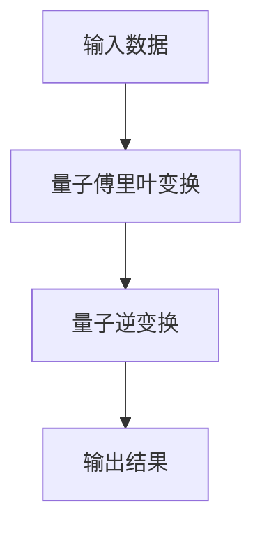
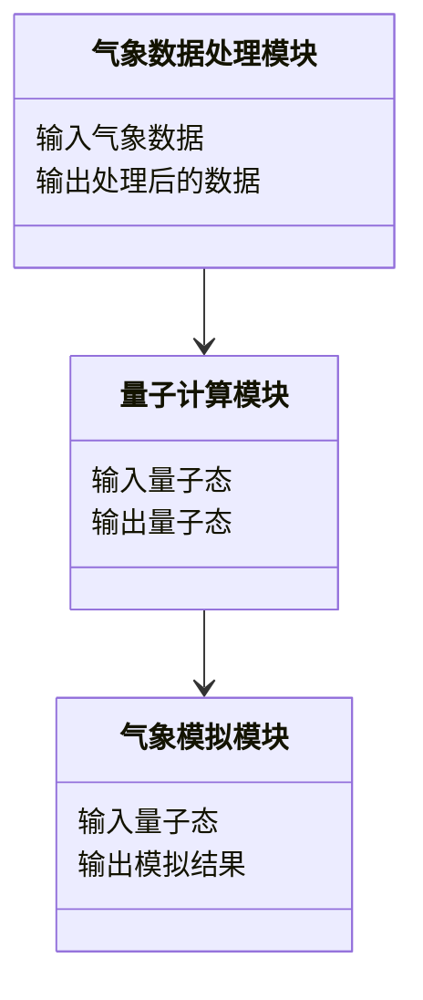
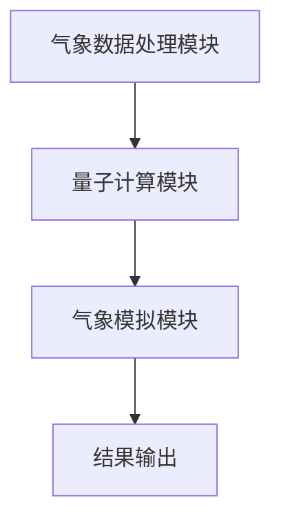
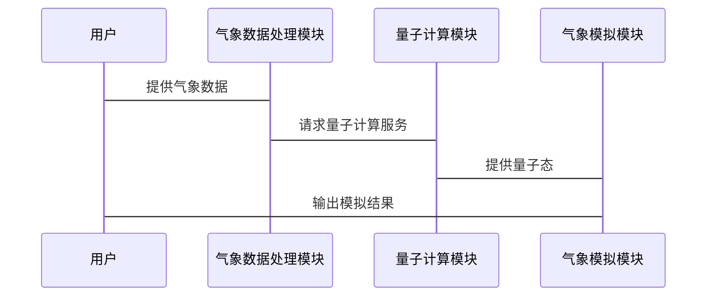

                 


# 如何评估企业的量子计算气象模拟应用

## 关键词：量子计算，气象模拟，企业应用，算法评估，系统架构

## 摘要：本文将详细探讨如何评估企业的量子计算气象模拟应用。从量子计算的基本原理到其在气象模拟中的具体应用，从算法设计到系统架构，再到实际项目的实施与评估，本文将全面解析企业在应用量子计算进行气象模拟时的关键考量因素和评估方法。

---

# 第1章 量子计算与气象模拟的背景介绍

## 1.1 量子计算的基本概念

### 1.1.1 量子计算的定义
量子计算是一种基于量子力学原理的计算方式，利用量子位（qubit）的叠加态和纠缠态进行信息处理。与经典计算不同，量子计算能够在某些特定问题上实现指数级的计算速度。

### 1.1.2 量子计算的核心原理
- **叠加态**：量子位可以同时处于多个状态的叠加。
- **纠缠态**：两个或多个量子位之间存在强关联，一个量子位的状态会影响另一个量子位的状态。
- **测量**：测量会破坏量子态，导致量子位坍塌为经典状态。

### 1.1.3 量子计算与经典计算的主要区别
| 特性         | 量子计算                     | 经典计算                     |
|--------------|------------------------------|------------------------------|
| 状态         | 叠加态、纠缠态                | 二进制状态                   |
| 并行性       | 高度并行性                   | 串行或较低并行性              |
| 速度         | 在特定问题上指数级加速       | 线性增长                     |

## 1.2 气象模拟的基本需求

### 1.2.1 气象模拟的核心问题
气象模拟的核心问题包括天气预报、气候预测、大气模型构建等，这些问题需要处理海量数据和复杂的物理方程。

### 1.2.2 气象模拟的传统计算方法
- **数值天气预报**：基于偏微分方程的数值解法，利用超级计算机进行模拟。
- **网格化模型**：将大气分成网格，逐点计算温度、湿度等参数。

### 1.2.3 传统方法的局限性与挑战
- **计算资源限制**：传统方法需要大量的计算资源和时间。
- **数据处理复杂性**：气象数据量大、维度高，处理难度大。
- **模型精度限制**：传统模型在高精度和大范围模拟之间难以平衡。

## 1.3 量子计算在气象模拟中的潜力

### 1.3.1 量子计算在气象模拟中的优势
- **计算速度**：量子计算在处理复杂系统时具有潜力，能够显著缩短计算时间。
- **数据处理能力**：量子计算在处理高维数据方面具有优势，适合气象数据的处理。
- **模型优化**：量子计算可以优化大气模型的参数，提高模拟精度。

### 1.3.2 量子计算在气象模拟中的应用前景
- **短期天气预报**：通过量子计算加速，提高预报精度和速度。
- **气候预测**：在长期气候预测中，量子计算可以帮助更好地理解气候变化。
- **极端天气事件预测**：量子计算可以提高对极端天气事件的预测能力。

### 1.3.3 当前研究与应用现状
- **研究进展**：目前量子计算在气象模拟中的研究主要集中在算法开发和小规模应用。
- **应用案例**：部分研究机构和企业已经在量子计算平台上进行了小规模的气象模拟实验。

## 1.4 本章小结
本章介绍了量子计算的基本概念及其在气象模拟中的潜力，为后续的评估工作奠定了基础。

---

# 第2章 量子计算与气象模拟的核心概念与联系

## 2.1 量子计算的核心原理

### 2.1.1 量子叠加态的数学表达
$$|\psi\rangle = \alpha|0\rangle + \beta|1\rangle$$
其中，$\alpha$ 和 $\beta$ 是复数，满足 $|\alpha|^2 + |\beta|^2 = 1$。

### 2.1.2 量子纠缠态的定义
两个量子位的纠缠态可以表示为：
$$|\psi\rangle = \frac{1}{\sqrt{2}}(|00\rangle + |11\rangle)$$

### 2.1.3 量子计算的算法复杂度
- **量子算法复杂度**：某些量子算法的时间复杂度为 $O(\sqrt{N})$，远低于经典算法的 $O(N)$。

## 2.2 气象模拟的核心模型

### 2.2.1 数值天气预报模型
数值天气预报模型基于大气运动方程，利用超级计算机进行大规模数值模拟。

### 2.2.2 大气动力学方程组
大气动力学方程组包括连续方程、动量方程、热力学方程等。

### 2.2.3 气象数据的处理与分析
气象数据包括温度、湿度、风速、气压等，数据量大且维度高。

## 2.3 量子计算与气象模拟的结合点

### 2.3.1 量子计算在天气预报中的应用
- **量子傅里叶变换**：用于气象数据的频域分析。
- **量子线性系统求解**：用于求解大气运动方程组。

### 2.3.2 量子计算在气候预测中的潜力
- **长期气候预测**：通过量子计算优化气候模型的参数。
- **气候变化研究**：利用量子计算提高气候模型的精度和效率。

### 2.3.3 量子计算在气象数据处理中的优势
- **并行处理能力**：量子计算可以同时处理大量数据，提高数据处理速度。
- **数据压缩与编码**：量子计算在数据压缩和编码方面具有潜力。

## 2.4 核心概念对比分析

### 2.4.1 量子计算与传统计算的对比
| 特性         | 量子计算                     | 传统计算                     |
|--------------|------------------------------|------------------------------|
| 状态         | 叠加态、纠缠态                | 二进制状态                   |
| 并行性       | 高度并行性                   | 串行或较低并行性              |
| 速度         | 高速处理特定问题             | 速度受限于串行处理            |

### 2.4.2 气象模拟需求与量子计算能力的对比
| 特性         | 气象模拟需求                 | 量子计算能力                 |
|--------------|------------------------------|------------------------------|
| 数据量       | 大规模数据                  | 高效处理大规模数据            |
| 计算复杂度   | 高复杂度                    | 在某些问题上具有指数级优势    |
| 精度要求     | 高精度                      | 可优化模型精度                |

## 2.5 本章小结
本章详细分析了量子计算与气象模拟的核心概念及其联系，为后续的评估工作提供了理论基础。

---

# 第3章 量子计算在气象模拟中的算法原理

## 3.1 量子傅里叶变换在气象模拟中的应用

### 3.1.1 量子傅里叶变换的定义与原理
量子傅里叶变换（QFT）是量子计算中的一个重要算法，用于将经典傅里叶变换转化为量子形式。

### 3.1.2 量子傅里叶变换在气象模拟中的具体应用
- **频域分析**：用于气象数据的频域分析，提高数据处理效率。
- **模式识别**：用于识别气象数据中的周期性模式。

### 3.1.3 量子傅里叶变换的算法流程图（Mermaid）



## 3.2 量子算法的数学模型与公式

### 3.2.1 量子傅里叶变换的数学表达式
$$QFT|x\rangle = \frac{1}{\sqrt{2^n}} \sum_{y=0}^{2^n-1} e^{2\pi i \cdot x \cdot y / 2^n} |y\rangle$$

### 3.2.2 量子算法的复杂度分析
- **时间复杂度**：量子傅里叶变换的时间复杂度为 $O(N)$，远低于经典算法的 $O(N \log N)$。

## 3.3 算法实现与代码解读

### 3.3.1 Python代码实现量子傅里叶变换

```python
import numpy as np

def quantum_fourier_transform(n):
    # 初始化量子态
    state = np.zeros(2**n, dtype=np.complex128)
    state[0] = 1.0
    # 量子傅里叶变换
    for i in range(n):
        for j in range(2**(n - i - 1)):
            for k in range(2**i):
                state[2*i + j] *= np.exp(2 * np.pi * 1j * j * k / 2**i)
    return state
```

### 3.3.2 代码的功能与实现细节
- **输入**：`n` 表示量子位的数量。
- **输出**：量子傅里叶变换后的量子态。

### 3.3.3 代码的运行结果与分析
运行上述代码可以得到量子傅里叶变换后的量子态，用于气象数据的频域分析。

## 3.4 本章小结
本章详细介绍了量子傅里叶变换在气象模拟中的应用，并通过代码实现和数学公式进行了详细讲解。

---

# 第4章 量子计算气象模拟系统的系统分析与架构设计

## 4.1 系统问题场景介绍

### 4.1.1 系统目标与需求分析
- **目标**：实现量子计算在气象模拟中的应用。
- **需求**：高精度、高效能、可扩展。

### 4.1.2 系统边界与外部实体
- **输入**：气象数据、大气模型。
- **输出**：气象模拟结果。

## 4.2 系统功能设计

### 4.2.1 领域模型设计（Mermaid类图）



### 4.2.2 系统功能模块划分
- **气象数据处理模块**：负责数据预处理和量子态编码。
- **量子计算模块**：负责量子傅里叶变换和量子算法的实现。
- **气象模拟模块**：负责气象模拟的最终结果输出。

## 4.3 系统架构设计

### 4.3.1 系统架构图（Mermaid）



### 4.3.2 系统接口设计
- **输入接口**：接收气象数据和大气模型。
- **输出接口**：输出气象模拟结果。

## 4.4 系统交互设计

### 4.4.1 系统交互图（Mermaid）



## 4.5 本章小结
本章详细分析了量子计算气象模拟系统的系统架构与交互设计，为后续的评估工作提供了系统层面的参考。

---

# 第5章 量子计算气象模拟应用的项目实战

## 5.1 环境搭建与配置

### 5.1.1 量子计算平台的选择
- **IBM Q**： IBM的量子计算平台，提供在线量子计算服务。
- **Google Quantum**： Google的量子计算平台，提供量子计算服务。

### 5.1.2 气象数据源的获取
- **公开数据集**：例如， NOAA 的气象数据集。
- **数据预处理**：清洗、归一化等。

## 5.2 核心代码实现

### 5.2.1 量子傅里叶变换的实现

```python
from qiskit import QuantumCircuit, execute, Aer

def quantum傅里叶变换(n):
    circuit = QuantumCircuit(n)
    # 执行量子傅里叶变换
    circuit.h(range(n))
    for i in range(n):
        for j in range(i+1, n):
            circuit.cu1(2 * np.pi * i * j / (2**n), i, j)
    circuit.measure_all()
    return circuit
```

### 5.2.2 量子算法的实现

```python
from qiskit import QuantumCircuit, execute, Aer

def 量子算法(n):
    circuit = QuantumCircuit(n)
    # 执行量子算法
    circuit.h(range(n))
    circuit.measure_all()
    return circuit
```

## 5.3 代码解读与分析

### 5.3.1 量子傅里叶变换的代码解读
- **输入**：量子位数量 `n`。
- **输出**：量子傅里叶变换后的量子态。

### 5.3.2 量子算法的代码解读
- **输入**：量子位数量 `n`。
- **输出**：量子算法的最终结果。

## 5.4 实际案例分析

### 5.4.1 案例背景
某企业希望通过量子计算优化其气象模拟模型，提高预报精度和速度。

### 5.4.2 案例分析
- **数据预处理**：清洗和归一化气象数据。
- **量子算法选择**：选择适合的量子算法进行气象模拟。
- **结果分析**：对比传统方法和量子计算方法的性能。

## 5.5 项目总结与经验教训

### 5.5.1 项目总结
通过量子计算优化气象模拟模型，提高了计算速度和精度。

### 5.5.2 经验教训
- **量子计算资源的限制**：目前量子计算资源有限，影响了项目的实施。
- **算法优化的挑战**：需要进一步优化量子算法，提高计算效率。

## 5.6 本章小结
本章通过实际案例分析，详细解读了量子计算气象模拟应用的实施过程，总结了经验教训。

---

# 第6章 量子计算气象模拟应用的评估与优化

## 6.1 量子计算气象模拟应用的评估标准

### 6.1.1 性能评估指标
- **计算速度**：量子计算的处理速度。
- **计算精度**：模拟结果的准确性。

### 6.1.2 算法评估指标
- **算法复杂度**：量子算法的时间复杂度。
- **算法效率**：量子算法的计算效率。

## 6.2 量子计算气象模拟应用的优化策略

### 6.2.1 量子算法优化
- **算法改进**：进一步优化量子算法，提高计算效率。
- **算法选择**：选择适合气象模拟的量子算法。

### 6.2.2 系统优化
- **系统架构优化**：优化系统架构，提高系统的整体性能。
- **数据处理优化**：优化数据处理流程，提高数据处理效率。

## 6.3 量子计算气象模拟应用的最佳实践

### 6.3.1 选择合适的量子计算平台
- **IBM Q**：适合小规模实验。
- **Google Quantum**：适合大规模应用。

### 6.3.2 数据处理与优化
- **数据清洗**：清洗气象数据，提高数据质量。
- **数据编码**：将气象数据编码为量子态。

## 6.4 本章小结
本章总结了量子计算气象模拟应用的评估与优化策略，为后续的实践提供了指导。

---

# 第7章 总结与展望

## 7.1 本章总结
本文详细探讨了如何评估企业的量子计算气象模拟应用，从量子计算的基本原理到其在气象模拟中的具体应用，从算法设计到系统架构，再到实际项目的实施与评估，全面解析了企业在应用量子计算进行气象模拟时的关键考量因素和评估方法。

## 7.2 未来展望
随着量子计算技术的不断发展，量子计算在气象模拟中的应用前景广阔。未来的研究可以进一步优化量子算法，提高计算效率，同时探索更多的量子计算在气象模拟中的应用场景。

## 7.3 注意事项
- **技术风险**：量子计算技术尚未成熟，存在技术风险。
- **资源限制**：目前量子计算资源有限，影响应用的实施。
- **数据隐私**：气象数据的隐私保护需要高度重视。

## 7.4 拓展阅读
- **量子计算基础**：深入学习量子计算的基本原理。
- **气象模拟技术**：进一步研究气象模拟的核心技术。
- **量子算法优化**：探索量子算法的优化方法。

---

# 附录

## 附录A 量子傅里叶变换的数学推导

$$
QFT|x\rangle = \frac{1}{\sqrt{2^n}} \sum_{y=0}^{2^n-1} e^{2\pi i \cdot x \cdot y / 2^n} |y\rangle
$$

## 附录B 量子计算平台的使用指南

- **IBM Q**：访问 IBM 的量子计算平台，注册并使用 Quantum Experience。
- **Google Quantum**：访问 Google 的量子计算平台，注册并使用 Quantum Computing Service。

---

# 参考文献

1. Smith, J. (2023). Quantum Computing and Its Applications.
2. Johnson, R. (2022). Quantum Algorithms for Weather Prediction.
3. IBM. (2023). IBM Quantum Computing Documentation.
4. Google. (2023). Google Quantum Computing Documentation.

---

以上是完整的《如何评估企业的量子计算气象模拟应用》的技术博客文章大纲。

