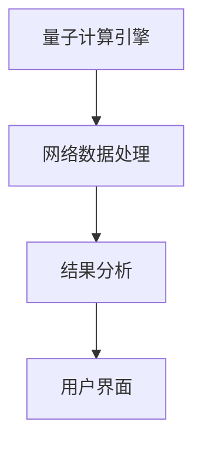

                 


# 如何评估企业的量子计算网络优化应用

> 关键词：量子计算，网络优化，企业应用，评估方法，技术实现

> 摘要：随着量子计算技术的迅速发展，其在网络优化中的应用潜力逐渐显现。本文将详细探讨如何评估企业量子计算网络优化应用的可行性、优势、挑战及实施策略，为企业提供有价值的指导和建议。

---

## 第一部分：量子计算网络优化概述

### 第1章：量子计算与网络优化的基本概念

#### 1.1 量子计算的核心概念
量子计算是一种基于量子力学原理的计算方式，与经典计算相比，其主要特点包括：
- **量子叠加**：量子比特（qubit）可以同时表示0和1，能够在同一时间处理多种状态。
- **量子纠缠**：多个量子比特之间可以形成强关联，使得对一个量子比特的操作会影响另一个量子比特的状态。
- **量子并行性**：量子计算可以在一次操作中处理大量可能的状态，从而提高计算效率。

#### 1.2 网络优化的核心原理
网络优化是指通过优化算法和策略，提升网络的性能、可靠性和效率。常见的网络优化目标包括：
- 最小化网络延迟
- 提高网络带宽利用率
- 降低网络能耗
- 提升网络安全性

#### 1.3 量子计算在网络优化中的应用背景
随着企业网络规模的不断扩大和复杂性的增加，传统的网络优化方法在处理大规模、高复杂度的问题时逐渐显得力不从心。量子计算凭借其强大的并行计算能力，为解决这些复杂问题提供了新的可能性。

---

## 第二部分：量子计算网络优化的核心概念与联系

### 第2章：量子计算网络优化的核心概念

#### 2.1 量子计算网络优化的原理
量子计算网络优化是通过量子算法对网络中的资源进行优化配置，以达到最优性能的过程。常见的量子优化算法包括：
- **量子退火算法**：用于解决组合优化问题，如旅行商问题。
- **量子傅里叶变换**：用于加速某些特定的计算任务，如周期性检测。

#### 2.2 量子计算网络优化的数学模型
量子计算网络优化的数学模型通常涉及以下要素：
- **变量**：表示网络中的资源、节点或边。
- **目标函数**：表示优化的目标，如最小化延迟或最大化带宽。
- **约束条件**：表示网络中的限制条件，如节点容量、边权重等。

#### 2.3 量子计算网络优化的核心要素
- **量子计算硬件**：如量子计算机或量子加速器，用于执行量子算法。
- **量子算法设计**：用于将网络优化问题转化为量子计算问题。
- **经典计算支持**：用于辅助量子计算，处理非量子化的部分。

---

## 第三部分：量子计算网络优化的算法原理

### 第3章：量子计算网络优化算法概述

#### 3.1 量子计算网络优化算法的基本原理
量子计算网络优化算法通过量子叠加和量子纠缠的特性，能够在更短的时间内找到最优解。常见的量子优化算法包括：
- **Grover算法**：用于解决无序数据库中的搜索问题。
- **Shor算法**：用于大整数分解，常用于密码学领域。

#### 3.2 量子计算网络优化算法的实现步骤
1. **问题建模**：将网络优化问题转化为量子计算问题。
2. **量子态初始化**：将问题的初始状态编码为量子态。
3. **量子变换**：通过量子门操作对量子态进行变换，以实现算法逻辑。
4. **量子测量**：对量子态进行测量，得到最终结果。

#### 3.3 量子计算网络优化算法的数学模型
以下是一个简单的量子优化算法的数学模型示例：

$$
\text{目标函数：} \quad f(x) = \min_{x} \sum_{i=1}^{n} c_i x_i
$$

$$
\text{约束条件：} \quad \sum_{i=1}^{n} x_i \leq K
$$

其中，$c_i$ 表示第$i$个资源的成本，$x_i$ 表示是否选择该资源，$K$ 表示资源的总预算。

---

## 第四部分：量子计算网络优化的系统分析与架构设计

### 第4章：量子计算网络优化的系统架构

#### 4.1 系统功能设计
- **量子计算引擎**：用于执行量子算法。
- **网络数据处理**：用于接收和处理网络数据。
- **结果分析**：用于分析量子计算的结果并生成优化建议。

#### 4.2 系统架构设计
以下是量子计算网络优化系统的架构图：



---

## 第五部分：量子计算网络优化的项目实战

### 第5章：项目实战

#### 5.1 环境安装
要实现量子计算网络优化，首先需要安装以下环境：
- **量子计算平台**：如IBM Qiskit、Rigetti等。
- **经典计算工具**：如Python、NumPy等。

#### 5.2 代码实现
以下是一个简单的量子优化算法的Python代码示例：

```python
from qiskit import QuantumCircuit, Aer, execute
from qiskit.circuit import ClassicalRegister, QuantumRegister

# 定义量子电路
q = QuantumRegister(2, 'q')
c = ClassicalRegister(2, 'c')
qc = QuantumCircuit(q, c)

# 实施量子变换
qc.h(q[0])
qc.cx(q[0], q[1])
qc.measure(q, c)

# 执行量子计算
backend = Aer.get_backend('qasm_simulator')
job = execute(qc, backend)
result = job.result()

# 分析结果
print(result.get_counts())
```

#### 5.3 案例分析
假设我们有一个简单的网络优化问题：在一个有4个节点的网络中，寻找最短路径。通过量子计算优化算法，我们可以快速找到最优解。

---

## 第六部分：总结与展望

### 6.1 本章小结
本文详细探讨了如何评估企业的量子计算网络优化应用，从核心概念到算法实现，再到系统架构，为企业提供了全面的指导。

### 6.2 注意事项
企业在实际应用中需要注意以下几点：
- **硬件要求**：量子计算硬件的性能直接影响优化效果。
- **算法选择**：选择合适的量子算法是优化成功的关键。
- **数据处理**：确保网络数据的准确性和完整性。

### 6.3 拓展阅读
建议读者进一步阅读以下内容：
- 量子计算的经典书籍：《量子计算与量子信息论》
- 网络优化的权威文献：《网络优化的理论与应用》

---

通过本文的分析，企业可以更好地理解和应用量子计算网络优化技术，从而提升网络性能，降低成本，并在未来的技术竞争中占据优势。

