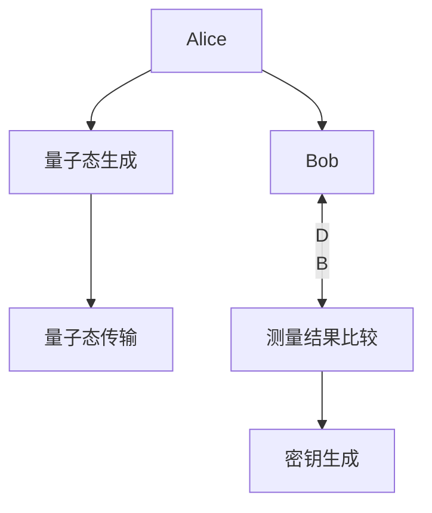
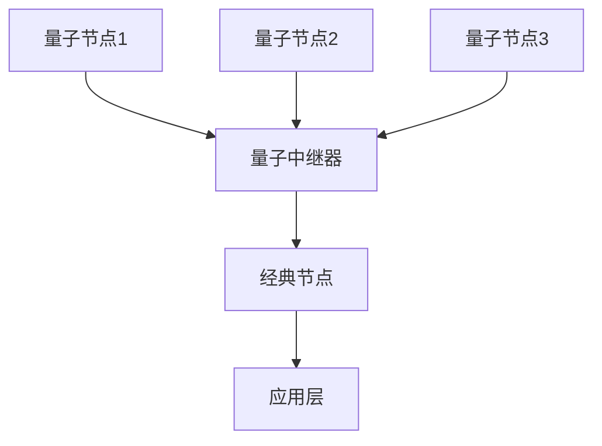
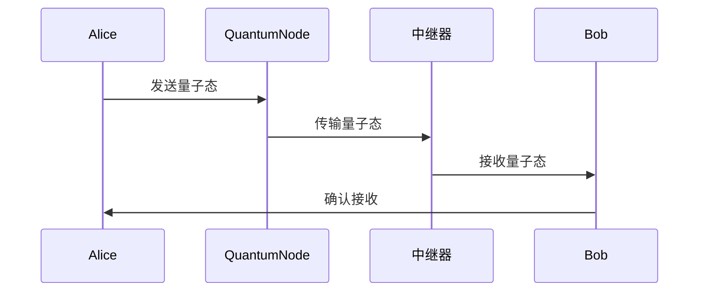

                 


# 如何评估企业的量子通信网络应用

**关键词**：量子通信，网络应用，安全性评估，技术原理，企业应用

**摘要**：  
本文旨在深入探讨如何评估企业的量子通信网络应用。通过分析量子通信的基本原理、核心技术、网络架构以及实际应用场景，本文为读者提供了一套系统化的评估方法。文章首先介绍了量子通信的背景与核心概念，接着详细讲解了量子通信的关键技术及其在企业中的应用，随后分析了量子通信网络的评估指标与方法，最后结合实际案例探讨了项目实战与最佳实践。通过本文，读者将能够全面了解如何在企业中有效评估和应用量子通信网络技术，确保数据通信的安全性与高效性。

---

## 第1章: 量子通信网络的核心概念与背景

### 1.1 量子通信的基本原理  
Quantum communication leverages the principles of quantum mechanics to enable secure communication. Unlike classical communication, which relies on classical physics, quantum communication exploits phenomena such as superposition and entanglement to achieve tasks like secure key distribution.

#### 1.1.1 量子通信的定义  
Quantum communication refers to the use of quantum phenomena to transmit information, primarily focusing on secure communication protocols like quantum key distribution (QKD).  

#### 1.1.2 量子通信与经典通信的区别  
- **数据传输方式**：经典通信基于电磁波的振幅、频率和相位，而量子通信利用量子叠加和纠缠状态。  
- **安全性**：经典通信易受截获攻击，而量子通信通过量子不可克隆性和纠缠态提供理论上无条件的安全性。  

#### 1.1.3 量子通信的核心技术特点  
- **安全性**：基于量子力学的基本原理，确保信息无法被窃听或篡改。  
- **高速性**：量子通信可以在极短时间内建立安全通信通道。  
- **抗干扰性**：量子通信对环境干扰具有较高的容忍度。  

### 1.2 量子通信网络的定义与特点  
Quantum communication networks are specialized networks designed to enable secure communication using quantum principles. They differ from classical networks in their reliance on quantum protocols and their ability to detect eavesdropping attempts.

#### 1.2.1 量子通信网络的定义  
A quantum communication network is a system that enables the transmission of quantum information, such as entangled particles or quantum keys, over a network of nodes.

#### 1.2.2 量子通信网络的主要特点  
- **量子纠缠**：网络中的节点通过共享量子纠缠态建立安全通信。  
- **量子密钥分发**：网络支持QKD协议，用于安全地分发加密密钥。  
- **抗量子计算攻击**：量子通信网络设计能够抵御未来可能出现的量子计算机攻击。  

#### 1.2.3 量子通信网络与传统通信网络的对比  
| 特性            | 量子通信网络                | 传统通信网络                |
|-----------------|-----------------------------|-----------------------------|
| 数据传输方式    | 利用量子叠加和纠缠          | 利用电磁波的振幅、频率和相位 |
| 安全性          | 理论上无条件安全            | 易受中间人攻击              |
| 传输速度        | 可实现超高速通信            | 速度受限于物理条件          |
| 抗干扰性        | 高度抗干扰                  | 易受环境干扰                |

### 1.3 企业量子通信网络的应用背景  
随着企业对数据安全需求的增加，传统通信技术的安全性逐渐成为瓶颈。量子通信技术的出现为企业提供了更高级别的安全解决方案。

#### 1.3.1 企业通信的安全性需求  
- 保护敏感数据，如商业机密、客户信息等。  
- 防范数据泄露和未经授权的访问。  

#### 1.3.2 传统通信技术的局限性  
- 易受中间人攻击，数据传输过程中可能被窃取。  
- 依赖于公钥基础设施，存在证书管理复杂性。  

#### 1.3.3 量子通信技术的潜在优势  
- 提供无条件安全性，确保数据传输过程中的机密性和完整性。  
- 抵御未来可能出现的量子计算机攻击。  

### 1.4 量子通信网络的应用场景  
Quantum communication networks have diverse applications across industries, including finance, government, and healthcare.

#### 1.4.1 金融行业的安全通信需求  
- 金融机构需要安全的通信通道来保护交易数据和客户信息。  
- 量子通信可以确保金融机构的数据传输过程中的安全性。  

#### 1.4.2 政府部门的关键信息保护  
- 政府部门处理大量敏感信息，如国家安全和外交事务。  
- 量子通信网络能够提供高等级的安全通信保障。  

#### 1.4.3 企业内部数据传输的安全性  
- 企业内部数据传输中，量子通信可以保护关键业务数据的安全。  
- 通过量子密钥分发，企业可以安全地分发加密密钥，确保数据加密的可靠性。  

---

## 第2章: 量子通信网络的核心技术

### 2.1 量子密钥分发（QKD）  
Quantum key distribution (QKD) is a protocol that enables two parties to share a secret key securely using quantum communication principles.

#### 2.1.1 QKD的基本原理  
QKD基于量子叠加和纠缠原理，通过量子态的测量实现密钥的分发。  

#### 2.1.2 QKD的实现方式  
- **BB84协议**：由 Bennett 和 Brassard 在1984年提出，利用正交基底（如垂直和45度）进行量子态编码和测量。  
- **EPR协议**：基于Einstein-Podolsky-Rosen (EPR)纠缠态的共享，实现密钥分发。  

#### 2.1.3 QKD的安全性分析  
QKD的安全性基于量子力学的基本原理，确保任何窃听行为都会破坏量子态的纠缠性，从而被检测到。  

#### 2.1.4 QKD协议的流程图  


### 2.2 量子中继技术  
Quantum relaying enables the extension of quantum communication networks by amplifying and retransmitting quantum signals over longer distances.

#### 2.2.1 量子中继的定义与作用  
- **定义**：量子中继是一种用于扩展量子通信网络的技术，通过量子中继器放大和重新传输量子信号。  
- **作用**：解决量子信号在传输过程中衰减的问题，延长通信距离。  

#### 2.2.2 量子中继的工作原理  
- **量子态放大**：利用量子放大器技术，增强量子信号的强度。  
- **量子态中继**：通过中继节点重新传输量子信号，确保信号的完整性和安全性。  

#### 2.2.3 量子中继在网络中的应用  
- **城市级网络**：通过量子中继技术，实现城市范围内量子通信网络的覆盖。  
- **长途通信**：在量子通信网络中，量子中继可以用于连接多个节点，形成广域量子通信网络。  

### 2.3 量子隐形传态  
Quantum teleportation is a process that transfers the state of a quantum system from one location to another, using entanglement and classical communication.

#### 2.3.1 量子隐形传态的基本概念  
- **定义**：量子隐形传态是一种通过量子纠缠和经典通信实现量子态传输的技术。  
- **应用场景**：在量子通信网络中，量子隐形传态可以用于快速传输量子信息。  

#### 2.3.2 量子隐形传态的实现步骤  
1. **创建纠缠态**：Alice 和 Bob 分别拥有一个纠缠粒子。  
2. **测量量子态**：Alice 对要传输的量子态和她的纠缠粒子进行联合测量。  
3. **经典通信**：Alice 将测量结果发送给 Bob。  
4. **量子态重构**：Bob 根据测量结果调整他的纠缠粒子，从而获得原始的量子态。  

#### 2.3.3 量子隐形传态在通信中的应用  
- **快速信息传输**：通过量子隐形传态，信息可以在瞬间传输到远距离的接收端。  
- **量子信息处理**：量子隐形传态可以用于分布式量子计算和量子存储。  

### 2.4 量子通信网络的协议  
Quantum communication networks rely on various protocols to ensure secure and efficient data transmission.

#### 2.4.1 BB84协议  
- **特点**：基于正交基底的量子态编码和测量，适用于点对点通信。  
- **优势**：安全性高，实现简单。  

#### 2.4.2 EPR协议  
- **特点**：基于EPR纠缠态的共享，适用于多点通信。  
- **优势**：支持更复杂的网络架构，适合大规模量子通信网络。  

#### 2.4.3 其他常见量子通信协议  
- **B92协议**：基于单光子的偏振编码，适用于特定场景。  
- **SARG0协议**：基于编码参考系的量子密钥分发协议。  

---

## 第3章: 量子通信网络的评估指标与方法

### 3.1 量子通信网络的评估指标  
评估量子通信网络的性能和安全性，需要从多个维度进行考量。

#### 3.1.1 传输距离  
- **定义**：量子通信网络的传输距离是指信号能够有效传输的最大距离。  
- **影响因素**：量子信号的衰减、中继节点的部署密度。  

#### 3.1.2 通信带宽  
- **定义**：量子通信网络的通信带宽是指单位时间内能够传输的量子信息量。  
- **影响因素**：量子通信技术的成熟度、网络架构设计。  

#### 3.1.3 安全性  
- **定义**：安全性是指量子通信网络在传输过程中抵御窃听和攻击的能力。  
- **评估方法**：通过QKD协议的安全性分析、网络攻击测试等方式进行评估。  

#### 3.1.4 稳定性  
- **定义**：稳定性是指量子通信网络在长期运行中的可靠性。  
- **评估方法**：通过网络节点的故障率、通信中断时间等指标进行评估。  

### 3.2 量子通信网络的评估方法  
为了全面评估量子通信网络的性能和安全性，需要采用多种评估方法。

#### 3.2.1 网络性能测试  
- **测试内容**：传输距离、通信带宽、数据传输延迟等。  
- **测试工具**：使用量子通信测试仪、网络模拟器等工具进行测试。  

#### 3.2.2 安全性评估  
- **评估内容**：量子通信网络的安全性，包括抗窃听能力、抗干扰能力等。  
- **评估方法**：通过模拟攻击测试、协议安全性分析等方式进行评估。  

#### 3.2.3 可扩展性分析  
- **分析内容**：量子通信网络的可扩展性，包括节点扩展能力、网络架构灵活性等。  
- **分析方法**：通过网络拓扑设计、协议兼容性测试等方式进行分析。  

#### 3.2.4 经济性评估  
- **评估内容**：量子通信网络的建设和运维成本。  
- **评估方法**：通过成本对比分析、投资回报率评估等方式进行评估。  

### 3.3 量子通信网络的评估工具  
为了高效地评估量子通信网络，需要使用专业的评估工具。

#### 3.3.1 量子通信测试仪  
- **功能**：用于测试量子信号的传输质量、通信距离等。  
- **应用**：在量子通信网络的部署和调试阶段，测试仪可以提供重要的数据支持。  

#### 3.3.2 量子网络模拟器  
- **功能**：用于模拟量子通信网络的运行环境，测试网络性能和安全性。  
- **应用**：在量子通信网络的设计和优化阶段，模拟器可以帮助研究人员进行理论验证和实验模拟。  

---

## 第4章: 量子通信网络的系统分析与架构设计

### 4.1 量子通信网络的系统架构  
Quantum communication networks have a unique architecture that differs from traditional networks.

#### 4.1.1 量子通信网络的分层架构  
- **物理层**：量子信号的生成、传输和接收。  
- **链路层**：量子信号的编码、解码和传输。  
- **网络层**：量子通信网络的路由和中继。  
- **应用层**：量子通信服务的实现和应用。  

#### 4.1.2 量子通信网络的节点设计  
- **量子节点**：负责量子信号的生成、处理和传输。  
- **经典节点**：负责经典信息的处理和传输，与量子节点协同工作。  

#### 4.1.3 量子通信网络的拓扑结构  
- **点对点拓扑**：适用于小规模量子通信网络。  
- **星型拓扑**：适用于大规模量子通信网络，中心节点连接多个边缘节点。  
- **网状拓扑**：适用于复杂场景，节点之间通过多条路径连接。  

### 4.2 量子通信网络的功能模块设计  
Quantum communication networks consist of multiple functional modules, each responsible for specific tasks.

#### 4.2.1 量子态生成模块  
- **功能**：生成量子态，如单光子、纠缠态等。  
- **实现**：使用量子光源和量子态操控技术。  

#### 4.2.2 量子态传输模块  
- **功能**：通过光纤或其他介质传输量子态。  
- **实现**：使用量子通信信道和量子中继技术。  

#### 4.2.3 量子态测量模块  
- **功能**：对量子态进行测量，提取经典信息。  
- **实现**：使用量子测量设备和相关算法。  

#### 4.2.4 经典信息处理模块  
- **功能**：处理与量子通信相关的经典信息，如密钥生成、协议协商等。  
- **实现**：使用经典计算机和相关软件。  

### 4.3 量子通信网络的系统架构图  


### 4.4 量子通信网络的接口设计  
Quantum communication networks require well-defined interfaces for seamless interaction between quantum and classical components.

#### 4.4.1 量子-经典接口  
- **定义**：量子节点与经典节点之间的接口。  
- **功能**：实现量子信息与经典信息的转换。  

#### 4.4.2 网络接口  
- **定义**：量子通信网络与其他网络（如传统互联网）之间的接口。  
- **功能**：实现量子通信网络与外部网络的互联。  

### 4.5 量子通信网络的交互流程  


---

## 第5章: 量子通信网络的项目实战与应用案例

### 5.1 项目环境安装  
为了进行量子通信网络的实验，需要搭建合适的实验环境。

#### 5.1.1 硬件设备  
- 量子光源  
- 量子测量设备  
- 量子中继器  
- 经典计算机  

#### 5.1.2 软件工具  
- 量子通信协议实现软件  
- 量子网络模拟器  
- 数据分析工具  

### 5.2 系统核心实现源代码  
以下是一个简单的量子密钥分发协议（BB84）的Python实现示例。

#### 5.2.1 QKD协议实现  
```python
import random

def generate_key():
    return [random.choice(['0', '1']) for _ in range(100)]

def send_qubits(key):
    # 模拟量子态的生成和传输
    return key

def compare_bases(alice_bases, bob_bases):
    # 比较基底，确定公共基底
    common_bases = [i for i in range(len(alice_bases)) if alice_bases[i] == bob_bases[i]]
    return common_bases

def extract_key(alice_bases, bob_bases, common_bases):
    # 提取密钥
    key = ''.join([alice_bases[i] for i in common_bases])
    return key

# 实验过程
alice_bases = generate_key()
bob_bases = generate_key()
common_bases = compare_bases(alice_bases, bob_bases)
shared_key = extract_key(alice_bases, bob_bases, common_bases)
print("共享密钥:", shared_key)
```

#### 5.2.2 代码解读与分析  
- **generate_key()**: 生成随机的二进制密钥。  
- **send_qubits()**: 模拟量子态的生成和传输过程。  
- **compare_bases()**: 比较Alice和Bob的基底，确定公共基底。  
- **extract_key()**: 根据公共基底提取共享密钥。  

### 5.3 实际案例分析  
以下是一个量子通信网络在金融行业中的实际应用案例。

#### 5.3.1 案例背景  
某大型金融机构需要在多个分支机构之间建立安全的通信通道，以保护敏感数据的安全。

#### 5.3.2 案例分析  
- **需求分析**：分支机构之间的通信需要高度安全，防止数据泄露。  
- **解决方案**：部署量子通信网络，使用QKD协议实现密钥分发，确保数据传输的安全性。  
- **实施过程**：在分支机构之间部署量子通信设备，建立量子中继网络，实现安全通信。  
- **效果评估**：通信安全性显著提升，数据传输过程中的机密性和完整性得到保障。  

#### 5.3.3 案例总结  
通过部署量子通信网络，金融机构能够有效保护敏感数据的安全，抵御潜在的网络攻击。

### 5.4 项目小结  
本章通过实际案例分析，展示了量子通信网络在企业中的实际应用。通过实验和案例分析，验证了量子通信技术的有效性和安全性。

---

## 第6章: 量子通信网络的最佳实践与未来展望

### 6.1 最佳实践  
为了确保量子通信网络的高效运行和安全性，需要遵循以下最佳实践。

#### 6.1.1 合理规划网络架构  
- 根据企业的实际需求，设计合理的网络架构，包括节点分布、中继器部署等。  

#### 6.1.2 定期进行安全性测试  
- 定期对量子通信网络进行安全性测试，确保网络的安全性和可靠性。  

#### 6.1.3 建立完善的运维体系  
- 建立专业的运维团队，制定完善的运维流程，确保网络的稳定运行。  

### 6.2 小结  
本章总结了企业在应用量子通信网络时的关键点，包括网络架构设计、安全性测试和运维体系建立。

### 6.3 注意事项  
- **技术选型**：选择合适的量子通信技术，确保满足企业的实际需求。  
- **成本控制**：合理控制建设和运维成本，避免过度投资。  
- **人才储备**：培养专业的量子通信技术人才，确保网络的顺利运行。  

### 6.4 拓展阅读  
- **量子通信技术的发展趋势**：了解量子通信领域的最新进展。  
- **量子计算与量子通信的结合**：探索量子计算与量子通信的协同应用。  

---

## 附录: 量子通信网络相关工具与资源

### 附录A: 量子通信测试仪  
- **工具名称**：Quantum Communication Tester  
- **功能**：用于测试量子信号的传输质量、通信距离等。  

### 附录B: 量子网络模拟器  
- **工具名称**：Quantum Network Simulator  
- **功能**：用于模拟量子通信网络的运行环境，测试网络性能和安全性。  

### 附录C: 量子通信协议库  
- **协议库名称**：QKD Protocol Library  
- **功能**：提供多种量子密钥分发协议的实现代码和文档。  

---

## 参考文献  
（此处列出相关的学术论文、技术报告和书籍）

---

**结语**  
通过本文的详细分析，读者可以全面了解如何评估企业的量子通信网络应用。从核心概念到实际应用，从技术原理到系统设计，本文为企业在量子通信网络的部署和应用提供了全面的指导和参考。未来，随着量子通信技术的不断发展，企业在通信安全领域的竞争力也将得到显著提升。

