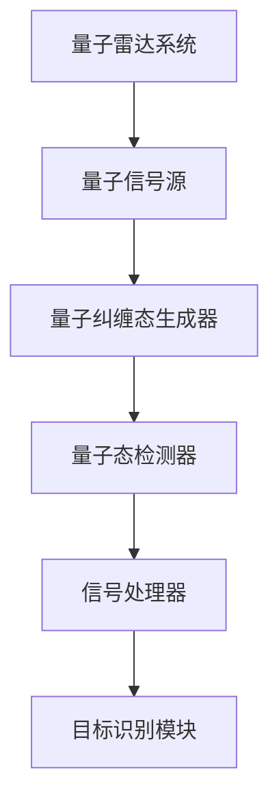

                 

# 如何评估企业的量子雷达技术潜力

---

## 关键词：量子雷达，企业潜力，技术评估，应用场景，算法原理，系统架构，项目实战

---

## 摘要：  
本文将深入探讨如何评估企业量子雷达技术的潜力，从背景介绍、核心概念、算法原理到系统架构和项目实战，帮助读者全面了解量子雷达技术在企业中的应用价值和技术挑战。通过详细的技术分析和实际案例，为企业的技术决策提供有力支持。

---

# 目录大纲：如何评估企业的量子雷达技术潜力

---

## 第一部分: 量子雷达技术背景与核心概念

### 第1章: 量子雷达技术的背景与问题背景

#### 1.1 量子雷达技术的定义与核心概念
- 量子雷达技术的基本定义
- 量子雷达与传统雷达的主要区别
- 量子雷达技术的核心要素与组成

#### 1.2 量子雷达技术的应用场景与问题背景
- 量子雷达技术的应用场景分析
- 量子雷达技术在企业中的潜在问题
- 量子雷达技术的核心问题描述

#### 1.3 量子雷达技术的边界与外延
- 量子雷达技术的边界定义
- 量子雷达技术的外延分析
- 量子雷达技术与其他相关技术的联系

### 第2章: 量子雷达技术的核心概念与联系

#### 2.1 量子雷达技术的核心原理
- 量子纠缠态生成原理
- 量子态检测原理
- 量子雷达信号处理原理

#### 2.2 量子雷达技术的核心概念对比分析
- 量子雷达与传统雷达的性能对比
- 量子雷达技术的优缺点分析
- 量子雷达技术在不同应用场景中的表现

#### 2.3 量子雷达技术的ER实体关系图

---

## 第二部分: 量子雷达技术的算法原理

### 第3章: 量子雷达技术的算法原理

#### 3.1 量子纠缠态生成算法
- 算法描述
- 算法流程
- 算法实现
- 算法优缺点分析

#### 3.2 量子态检测算法
- 算法描述
- 算法流程
- 算法实现
- 算法优缺点分析

#### 3.3 量子信号处理算法
- 算法描述
- 算法流程
- 算法实现
- 算法优缺点分析

### 第4章: 量子雷达技术的对比分析

#### 4.1 量子雷达信号处理与传统雷达信号处理的对比
- 传统雷达信号处理算法
- 量子雷达信号处理算法
- 对比分析

#### 4.2 量子雷达检测算法的对比分析
- 量子雷达检测算法的优势
- 量子雷达检测算法的劣势
- 量子雷达检测算法的应用场景

---

## 第三部分: 量子雷达技术的系统分析与架构设计

### 第5章: 量子雷达技术的系统分析

#### 5.1 量子雷达技术的问题场景
- 问题场景描述
- 问题场景分析
- 问题场景解决方案

#### 5.2 量子雷达技术的项目介绍
- 项目目标
- 项目范围
- 项目计划
- 项目资源

### 第6章: 量子雷达技术的系统架构设计

#### 6.1 量子雷达技术的系统功能设计
- 系统功能模块
- 系统功能描述
- 系统功能流程

#### 6.2 量子雷达技术的系统架构设计
- 系统架构分层
- 系统架构模块
- 系统架构交互

#### 6.3 量子雷达技术的系统接口设计
- 系统接口定义
- 系统接口流程
- 系统接口实现

#### 6.4 量子雷达技术的系统交互设计
- 系统交互场景
- 系统交互流程
- 系统交互实现

---

## 第四部分: 量子雷达技术的项目实战

### 第7章: 量子雷达技术的项目实战

#### 7.1 量子雷达技术的环境安装
- 环境配置
- 工具安装
- 依赖管理

#### 7.2 量子雷达技术的核心代码实现
- 核心代码实现
- 代码解读
- 代码优化

#### 7.3 量子雷达技术的案例分析
- 案例背景
- 案例分析
- 案例结论

#### 7.4 量子雷达技术的项目小结
- 项目总结
- 项目经验
- 项目改进

---

## 第五部分: 量子雷达技术的最佳实践

### 第8章: 量子雷达技术的最佳实践

#### 8.1 量子雷达技术的总结
- 总结内容
- 总结分析
- 总结结论

#### 8.2 量子雷达技术的注意事项
- 技术注意事项
- 应用注意事项
- 安全注意事项

#### 8.3 量子雷达技术的拓展阅读
- 相关书籍
- 相关论文
- 相关技术文档

---

## 结语  
通过以上步骤，我们可以全面评估企业的量子雷达技术潜力，结合理论与实践，为企业技术决策提供有力支持。

