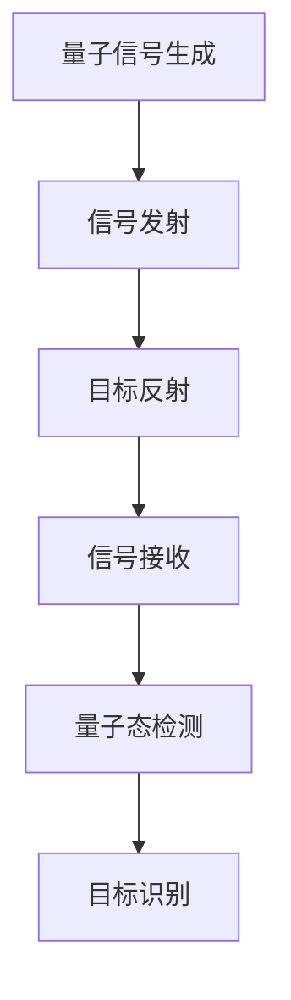
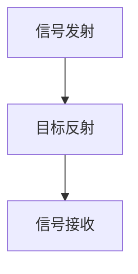
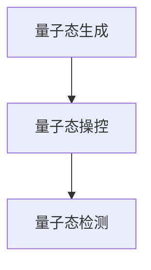

                 


# 如何评估企业的量子雷达隐身探测技术潜力

## 关键词：量子雷达、隐身探测、技术潜力、系统架构、算法原理、项目实战

## 摘要：本文详细探讨了如何评估企业在量子雷达隐身探测技术领域的潜力。通过分析量子雷达的核心概念、算法原理、系统架构，结合实际项目案例，为读者提供了一套系统的方法论，帮助企业在技术评估中做出明智决策。

---

# 第1章: 量子雷达隐身探测技术概述

## 1.1 量子雷达的基本概念与工作原理

### 1.1.1 量子雷达的定义
量子雷达是一种利用量子态（如量子叠加和纠缠）进行信号生成和检测的新型雷达技术，能够在复杂环境中实现对隐身目标的探测。

### 1.1.2 量子雷达的核心工作原理
- **量子叠加**：信号的状态可以同时处于多个可能值的叠加态。
- **量子纠缠**：信号之间的关联性极强，能够通过纠缠态实现信息的高效传递。
- **量子测量**：通过测量量子态，获取目标的反射信号信息。

### 1.1.3 量子雷达与传统雷达的主要区别
| 特性        | 传统雷达           | 量子雷达           |
|-------------|--------------------|--------------------|
| 信号生成    | 非量子信号         | 量子叠加态信号     |
| 信号检测    | 基于经典测量       | 基于量子测量       |
| 抗干扰能力  | 较弱               | 较强               |

---

## 1.2 量子雷达隐身探测技术的背景与现状

### 1.2.1 隐身技术的发展历程
- **传统隐身技术**：通过吸收或散射雷达波实现隐身。
- **量子隐身技术**：利用量子态的特性，实现更高效的隐身探测。

### 1.2.2 量子雷达在隐身探测中的应用潜力
- **高灵敏度**：量子雷达能够检测到更弱的反射信号。
- **抗干扰能力**：量子态的纠缠特性使其不易受到环境干扰。
- **隐蔽性**：量子信号难以被敌方截获和干扰。

### 1.2.3 当前技术发展面临的挑战
- **技术成熟度**：量子雷达技术仍处于研发阶段。
- **成本问题**：量子雷达的制造成本较高。
- **技术门槛**：需要高水平的量子技术人才。

---

## 1.3 量子雷达隐身探测技术的核心问题

### 1.3.1 量子态的叠加与纠缠特性
- **量子叠加**：信号可以同时处于多个状态。
- **量子纠缠**：信号之间存在强关联，能够实现高效的信息传递。

### 1.3.2 量子雷达在隐身探测中的优势与劣势
| 特性        | 优势               | 劣势               |
|-------------|--------------------|--------------------|
| 检测灵敏度   | 高                 | 成本高             |
| 抗干扰能力  | 强                 | 技术复杂           |
| 隐身能力     | 优秀               | 需要特殊设备       |

### 1.3.3 量子雷达隐身探测技术的边界与外延
- **边界**：量子雷达的技术实现依赖于量子计算和通信技术的进步。
- **外延**：量子雷达的应用范围包括军事、民用等领域。

---

## 1.4 量子雷达隐身探测技术的核心要素

### 1.4.1 量子态的生成与操控
- **量子态生成**：通过量子比特生成量子叠加态或纠缠态。
- **量子态操控**：通过量子门操作对量子态进行变换。

### 1.4.2 量子雷达的信号处理与检测
- **信号生成**：生成量子叠加态信号。
- **信号检测**：通过量子测量获取目标反射信号信息。

### 1.4.3 量子雷达隐身探测系统的整体架构


---

## 1.5 本章小结
本章详细介绍了量子雷达的基本概念、工作原理以及其在隐身探测中的潜力和挑战。通过对比传统雷达和量子雷达的特性，明确了量子雷达的优势和劣势，为后续的技术评估奠定了基础。

---

# 第2章: 量子雷达隐身探测技术的核心概念与联系

## 2.1 量子态的叠加与纠缠原理

### 2.1.1 量子叠加原理的数学表达
$$|\psi\rangle = \alpha|0\rangle + \beta|1\rangle$$
其中，$|\psi\rangle$ 表示量子态，$\alpha$ 和 $\beta$ 是叠加系数。

### 2.1.2 量子纠缠的特性与应用
- **量子纠缠**：两个或多个量子态之间存在强关联。
- **应用**：量子纠缠可用于实现高效的量子通信和量子计算。

### 2.1.3 量子态与经典信号的区别
| 特性        | 量子态          | 经典信号        |
|-------------|-----------------|-----------------|
| 叠加性      | 是             | 否             |
| 纠缠性       | 是             | 否             |
| 干扰性       | 是             | 否             |

---

## 2.2 量子雷达隐身探测技术的系统架构

### 2.2.1 量子雷达的信号发射与接收模块


### 2.2.2 量子态的操控与检测模块


### 2.2.3 系统整体架构的ER实体关系图
```mermaid
erd
    actor 企业
    actor 量子雷达系统
    actor 目标
    actor 环境
    goal 生成量子信号
    goal 检测量子信号
    goal 实现隐身探测
```

---

## 2.3 量子雷达隐身探测技术的系统流程

### 2.3.1 信号生成与发射
1. 生成量子叠加态信号。
2. 发射信号到目标区域。

### 2.3.2 信号接收与量子态检测
1. 接收目标反射信号。
2. 对量子态进行测量，获取目标信息。

### 2.3.3 数据处理与目标识别
1. 对检测到的量子态进行数据处理。
2. 实现目标的识别和定位。

---

## 2.4 本章小结
本章详细阐述了量子态的叠加与纠缠原理，以及量子雷达系统的整体架构和流程。通过ER实体关系图和系统流程图，明确了各个模块之间的关系和功能。

---

# 第3章: 量子雷达隐身探测技术的算法原理

## 3.1 量子态的叠加与纠缠算法

### 3.1.1 量子态叠加算法的数学模型
$$|\psi\rangle = \alpha|0\rangle + \beta|1\rangle$$
其中，$\alpha$ 和 $\beta$ 是复数，满足 $|\alpha|^2 + |\beta|^2 = 1$。

### 3.1.2 量子纠缠算法的实现步骤
1. 生成两个量子比特的叠加态。
2. 对两个量子比特进行CNOT操作，实现纠缠。
3. 对纠缠态进行测量，验证纠缠特性。

### 3.1.3 量子态检测算法的实现流程
1. 对量子态进行基矢测量。
2. 根据测量结果判断量子态的状态。

---

## 3.2 量子雷达信号处理算法

### 3.2.1 量子信号的生成与编码
1. 生成量子叠加态信号。
2. 对信号进行编码，使其适合雷达探测。

### 3.2.2 量子信号的接收与解码
1. 接收目标反射信号。
2. 对信号进行解码，恢复原始信号。

### 3.2.3 量子信号的干扰与消除
1. 识别干扰信号。
2. 对干扰信号进行消除，恢复清晰信号。

---

## 3.3 量子雷达隐身探测技术

### 3.3.1 量子态的操控与检测
1. 对量子态进行操控，实现信号的生成与检测。
2. 对检测到的量子态进行分析，提取目标信息。

---

## 3.4 本章小结
本章详细介绍了量子态的叠加与纠缠算法，以及量子雷达信号处理算法的实现步骤。通过数学模型和算法流程图，明确了量子雷达的技术实现过程。

---

接下来的章节将结合实际项目案例，详细介绍量子雷达隐身探测技术的系统实现和应用潜力，为企业的技术评估提供参考。

