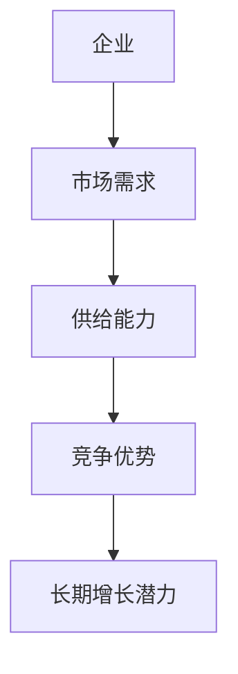
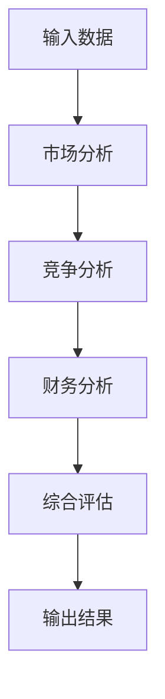
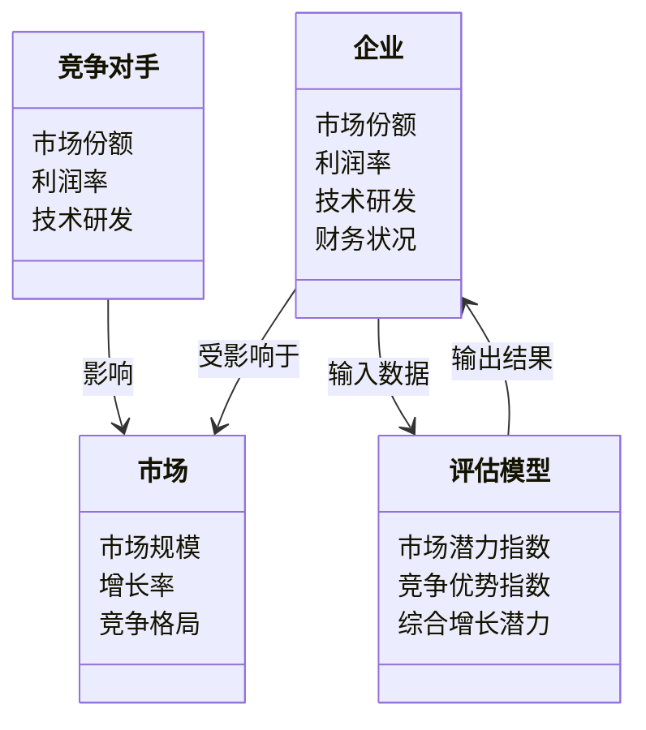
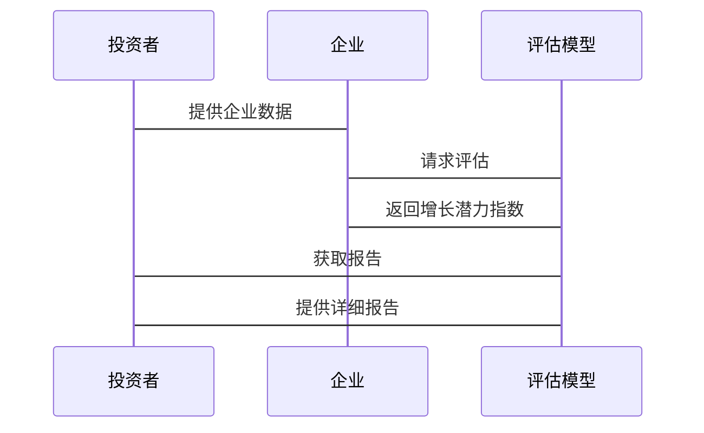

                 


# 如何评估企业的长期增长潜力

> 关键词：企业增长潜力、评估模型、竞争力分析、市场需求、财务健康度

> 摘要：评估企业的长期增长潜力是投资者和企业管理者关注的核心问题之一。本文从背景、核心概念、数学模型、系统分析和项目实战五个方面，详细阐述了如何科学、系统地评估企业的长期增长潜力。通过案例分析和工具解读，帮助读者掌握从战略规划到实际操作的关键步骤，为企业价值评估和投资决策提供有力支持。

---

## 第1章：企业长期增长潜力评估的背景与核心概念

### 1.1 企业长期增长潜力的定义与内涵

#### 1.1.1 什么是企业长期增长潜力
企业的长期增长潜力是指企业在未来较长一段时间内，通过内部资源优化和外部市场机会的把握，实现收入、利润和市场份额持续增长的能力。这种潜力不仅依赖于当前的经营状况，更取决于企业在市场中的竞争力、技术创新能力以及应对变化的灵活性。

#### 1.1.2 长期增长潜力的核心要素
- **市场需求**：行业规模和增长趋势决定了企业的潜在空间。
- **竞争优势**：企业的核心竞争力，包括技术、成本、品牌等。
- **财务健康度**：企业的盈利能力、现金流和资产负债情况。
- **管理能力**：领导层的战略规划和执行力。
- **外部环境**：宏观经济、政策法规和行业趋势。

#### 1.1.3 企业生命周期与增长潜力的关系
企业从初创期到成熟期，其增长潜力在不同阶段呈现不同特征。例如，初创期注重市场拓展，成熟期则关注效率提升和创新。

### 1.2 评估企业长期增长潜力的重要性

#### 1.2.1 投资者视角：企业价值发现与风险控制
投资者通过评估企业的长期增长潜力，可以判断其投资价值和风险。例如，选择具有持续增长潜力的企业，可以带来超额收益。

#### 1.2.2 企业管理者视角：战略规划与资源分配
企业领导者需要根据长期增长潜力评估结果，制定合理的发展战略和资源配置计划。

#### 1.2.3 企业自身发展：可持续增长与竞争优势
通过自我评估，企业可以发现自身优势和不足，优化内部管理和外部合作，提升竞争力。

### 1.3 企业长期增长潜力的边界与外延

#### 1.3.1 短期增长与长期增长的区分
短期增长关注的是季度或年度的业绩表现，而长期增长潜力关注的是未来3-5年的持续增长能力。

#### 1.3.2 行业周期性对增长潜力的影响
不同行业的周期性差异会影响企业的增长潜力。例如，科技行业变化快，而传统制造业相对稳定。

#### 1.3.3 宏观经济环境与政策因素的边界
宏观经济波动和政策变化是外部因素，可能影响企业的增长潜力。例如，经济衰退可能导致市场需求下降，但技术创新型企业可能依然保持增长。

---

## 第2章：企业长期增长潜力的核心概念与联系

### 2.1 核心概念原理

#### 2.1.1 企业增长潜力的驱动因素
- **市场需求**：市场规模和增长速度是企业增长的基础。
- **供给能力**：企业的生产能力、技术创新能力和成本控制能力。
- **竞争环境**：行业竞争格局和企业的竞争优势。

#### 2.1.2 市场需求与供给的动态平衡
市场需求和供给能力的动态平衡决定了企业的增长空间。例如，市场需求旺盛但供给能力不足时，企业可以通过扩大产能或技术创新来提升增长潜力。

#### 2.1.3 竞争环境对企业增长的影响
竞争格局直接影响企业的市场份额和利润率。例如，寡头垄断市场中的企业可能通过价格战或差异化竞争来提升增长潜力。

### 2.2 核心概念属性特征对比表格

| 概念       | 驱动因素 | 评估维度 | 时间跨度 | 影响因素 |
|------------|----------|----------|----------|----------|
| 长期增长潜力 | 市场需求、技术能力、管理效率 | 市场份额、利润率、研发投入 | 5年以上 | 宏观经济、行业趋势、政策环境 |

### 2.3 ER实体关系图（Mermaid流程图）



---

## 第3章：企业长期增长潜力评估的数学模型与算法原理

### 3.1 数学模型与公式

#### 3.1.1 市场需求预测模型

$$ 预测需求 = a \times 当前需求 + b \times 增长率 $$

其中，a 和 b 是权重系数，需求增长率通常基于历史数据计算得出。

#### 3.1.2 竞争优势评估模型

$$ 优势指数 = \frac{市场份额 + 利润率}{行业平均值} $$

通过比较企业的市场份额和利润率与行业平均水平的差异，可以评估其竞争优势。

#### 3.1.3 综合增长潜力指数

$$ GPI = \alpha \times 市场潜力 + \beta \times 竞争优势 + \gamma \times 财务健康度 $$

其中，α、β、γ是各维度的权重系数，通常根据行业特点和企业具体情况调整。

### 3.2 算法原理与流程图



### 3.3 代码实现与案例分析

#### 3.3.1 环境安装

```bash
pip install numpy pandas scikit-learn
```

#### 3.3.2 核心代码实现

```python
import numpy as np
import pandas as pd

def calculate_growth_potential(company_data):
    market_share = company_data['market_share']
    profit_margin = company_data['profit_margin']
    industry_avg_profit = company_data['industry_avg_profit']
    
    advantage_index = (market_share + profit_margin) / industry_avg_profit
    growth_potential = 0.4 * company_data['market_potential'] + \
                       0.3 * advantage_index + 0.3 * company_data['financial_health']
    return growth_potential

# 示例数据
data = {
    'market_share': 0.25,
    'profit_margin': 0.15,
    'industry_avg_profit': 0.10,
    'market_potential': 1.2,
    'financial_health': 0.8
}

result = calculate_growth_potential(data)
print(f"企业增长潜力指数：{result}")
```

#### 3.3.3 算法原理的数学公式

$$ GPI = \alpha \times 市场潜力 + \beta \times 竞争优势 + \gamma \times 财务健康度 $$

---

## 第4章：企业长期增长潜力评估的系统分析

### 4.1 问题场景介绍

企业长期增长潜力评估是一个复杂的系统工程，需要从市场、竞争、财务等多个维度进行综合分析。

### 4.2 系统功能设计（领域模型Mermaid类图）



### 4.3 系统架构设计（Mermaid架构图）

```mermaid
docker
    service 企业增长潜力评估系统 {
        service 数据采集模块 {
            provides 数据接口
        }
        service 数据分析模块 {
            provides 分析结果
        }
        service 评估模型模块 {
            provides 评估报告
        }
    }
```

### 4.4 系统接口设计与交互（Mermaid序列图）



---

## 第5章：项目实战与案例分析

### 5.1 项目介绍

以某科技公司为例，评估其长期增长潜力。数据包括市场份额、利润率、研发投入、市场潜力等。

### 5.2 核心代码实现与解读

```python
import numpy as np
import pandas as pd

def calculate_growth_potential(company_data):
    market_share = company_data['market_share']
    profit_margin = company_data['profit_margin']
    industry_avg_profit = company_data['industry_avg_profit']
    
    advantage_index = (market_share + profit_margin) / industry_avg_profit
    growth_potential = 0.4 * company_data['market_potential'] + \
                       0.3 * advantage_index + 0.3 * company_data['financial_health']
    return growth_potential

# 示例数据
data = {
    'market_share': 0.25,
    'profit_margin': 0.15,
    'industry_avg_profit': 0.10,
    'market_potential': 1.2,
    'financial_health': 0.8
}

result = calculate_growth_potential(data)
print(f"企业增长潜力指数：{result}")
```

### 5.3 案例分析与详细解读

假设某科技公司的数据如上，计算得出其增长潜力指数为：

$$ GPI = 0.4 \times 1.2 + 0.3 \times \frac{0.25 + 0.15}{0.10} + 0.3 \times 0.8 = 0.48 + 1.2 + 0.24 = 1.92 $$

---

## 第6章：最佳实践与总结

### 6.1 小结与回顾

企业长期增长潜力评估需要从市场、竞争、财务等多个维度综合分析。通过科学的数学模型和系统化的分析方法，可以有效提升评估的准确性和实用性。

### 6.2 实用Tips

- **数据收集**：确保数据的准确性和完整性。
- **模型调整**：根据行业特点调整各维度的权重。
- **动态评估**：定期更新数据和评估结果，以应对变化。

### 6.3 未来展望与拓展阅读

随着人工智能和大数据技术的发展，企业增长潜力评估将更加智能化和精准化。建议读者进一步学习相关领域的前沿技术，如机器学习在企业评估中的应用。

---

## 总结

企业长期增长潜力评估是投资者和企业管理者关注的核心问题。通过本文的系统分析和实战案例，读者可以掌握从理论到实践的关键步骤，为企业价值评估和投资决策提供有力支持。

