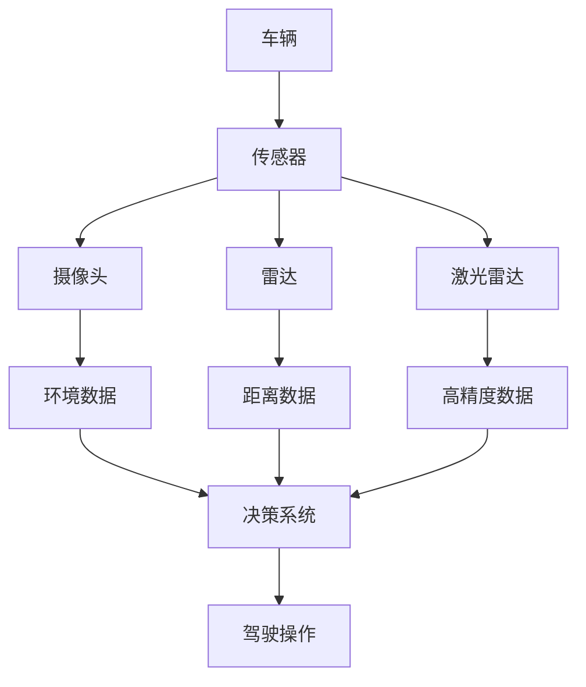
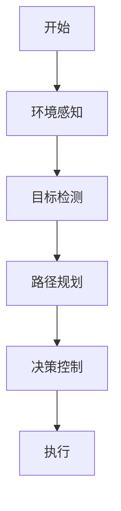
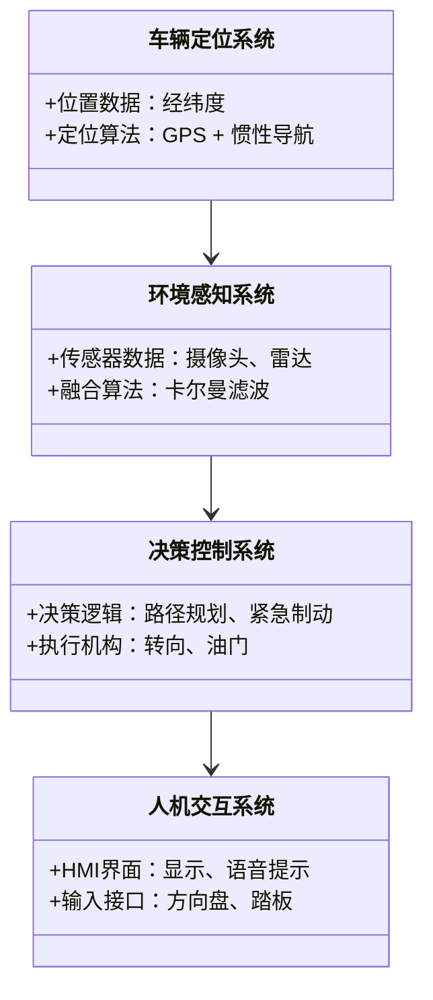
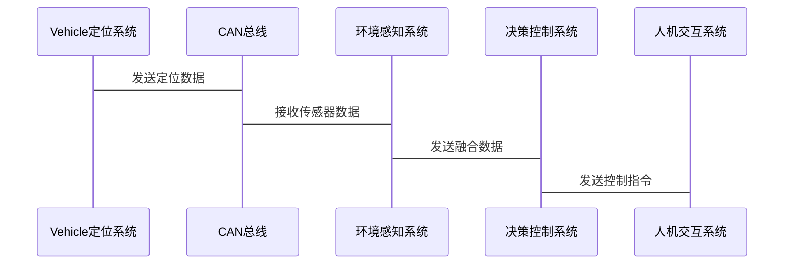

                 


# 如何评估企业的高级驾驶辅助系统

> 关键词：高级驾驶辅助系统（ADAS），评估方法，系统架构，算法原理，项目实战

> 摘要：本文详细探讨了如何系统地评估企业的高级驾驶辅助系统（ADAS），涵盖从核心概念到算法原理，再到系统架构和项目实战的各个方面，为企业提供全面的评估指南。

---

## 第一部分：高级驾驶辅助系统（ADAS）概述

### 第1章：高级驾驶辅助系统（ADAS）背景介绍

#### 1.1 高级驾驶辅助系统（ADAS）的基本概念

**1.1.1 ADAS的核心定义**  
高级驾驶辅助系统（Advanced Driver-Assistance Systems, ADAS）是一种通过传感器、摄像头和算法等技术手段，辅助驾驶员进行车辆控制和决策的系统。其目的是提高驾驶安全性、舒适性和效率。

**1.1.2 ADAS的主要功能与应用场景**  
ADAS的功能包括但不限于：车道保持辅助（LKA）、自适应巡航控制（ACC）、自动紧急制动（AEB）、盲点监测（BSM）和驾驶员疲劳监测等。这些功能在高速公路、城市道路等多种场景中广泛应用。

**1.1.3 ADAS的演进与发展趋势**  
随着人工智能和自动驾驶技术的进步，ADAS正朝着更智能化、集成化的方向发展。未来的ADAS将更加依赖深度学习和实时数据处理，以实现更高级的自动驾驶功能。

#### 1.2 ADAS的系统组成与功能模块

**1.2.1 摄像头、雷达与传感器的协同工作**  
ADAS系统通常由摄像头、毫米波雷达、激光雷达和超声波传感器组成，这些传感器协同工作，提供车辆周围环境的实时感知数据。

**1.2.2 车辆定位与环境感知**  
通过传感器数据融合技术，ADAS能够准确定位车辆位置，并实时感知周围环境，包括车道线、障碍物、行人等。

**1.2.3 车道保持辅助与自适应巡航控制**  
车道保持辅助（LKA）通过摄像头检测车道线，帮助车辆保持在正确车道内；自适应巡航控制（ACC）通过雷达检测前方车辆，自动调整车速以保持安全距离。

**1.2.4 紧急制动系统与驾驶员警示系统**  
紧急制动系统（AEB）在检测到潜在碰撞风险时自动启动制动；驾驶员警示系统通过声音或震动提醒驾驶员注意潜在危险。

#### 1.3 ADAS的评估重要性

**1.3.1 为什么需要评估ADAS系统**  
评估ADAS系统是为了确保其在各种场景下的可靠性和有效性，减少交通事故的发生，提升驾驶体验。

**1.3.2 ADAS评估的行业标准与法规**  
遵循ISO 21482、UN R155等国际标准，确保ADAS系统符合全球统一的法规要求。

---

### 第2章：高级驾驶辅助系统（ADAS）的核心概念与联系

#### 2.1 ADAS的核心概念原理

**2.1.1 环境感知算法的原理**  
环境感知算法通过多传感器融合技术，将来自摄像头、雷达等的数据进行处理，生成车辆周围环境的高精度模型。

**2.1.2 车辆决策与控制机制**  
基于环境感知数据，车辆决策系统生成驾驶决策，并通过控制模块执行操作，如转向和加速。

**2.1.3 人机交互的实现方式**  
通过HMI（人机交互界面）向驾驶员传递系统状态和指令，确保驾驶员能够及时了解系统的运行情况。

#### 2.2 ADAS核心概念属性特征对比表

| 特性         | 摄像头       | 雷达         | 激光雷达     | 传感器融合技术 |
|--------------|--------------|--------------|--------------|----------------|
| 优势         | 高分辨率     | 长距离检测   | 高精度       | 综合能力强     |
| 劣势         | 易受光照影响 | 易受天气影响 | 成本高         | 复杂度高       |

#### 2.3 ADAS系统的ER实体关系图



---

### 第3章：高级驾驶辅助系统（ADAS）的算法原理讲解

#### 3.1 算法原理的Mermaid流程图



#### 3.2 使用Python实现的目标检测算法示例

```python
import cv2

def detect_objects(image):
    # 使用YOLO算法进行目标检测
    net = cv2.dnn.readNet("yolov4.cfg", "yolov4.weights")
    layers = net.getUnconnectedOutLayersNames()
    blob = cv2.dnn.blobFromImage(image, 1/255, (416, 416), swapRB=True, crop=False)
    net.setInput(blob)
    outputs = net.forward(layers)
    boxes = []
    for output in outputs:
        for detection in output:
            confidence = detection[5]
            if confidence > 0.5:
                x1, y1, x2, y2 = (detection[0:4] - [0, 0, 0, 0]) * 320
                boxes.append((int(x1), int(y1), int(x2), int(y2)))
    return boxes
```

#### 3.3 算法的数学模型和公式

$$ y = mx + b $$  
其中，\( m \) 是斜率，\( b \) 是截距，用于描述车辆在车道中的位置。

---

## 第四部分：高级驾驶辅助系统（ADAS）的系统架构与接口设计

### 第4章：高级驾驶辅助系统（ADAS）的系统架构与接口设计

#### 4.1 系统架构设计



#### 4.2 系统接口设计

**4.2.1 CAN总线通信协议**



---

## 第五部分：高级驾驶辅助系统（ADAS）的项目实战

### 第5章：高级驾驶辅助系统（ADAS）的项目实战

#### 5.1 项目环境与工具安装

**5.1.1 开发环境配置**

- 操作系统：Ubuntu 20.04 LTS
- 工具链：Python 3.8，ROS（Robot Operating System）
- 依赖库：OpenCV 4.5.1，TensorFlow 2.4.1

**5.1.2 工具安装步骤**

```bash
sudo apt-get update
sudo apt-get install python3-dev
pip install numpy opencv-python tensorflow
```

#### 5.2 核心代码实现与解读

**5.2.1 目标检测核心代码**

```python
import cv2
import numpy as np

def main():
    cap = cv2.VideoCapture(0)
    while cap.isOpened():
        ret, frame = cap.read()
        if not ret:
            break
        boxes = detect_objects(frame)
        for box in boxes:
            x1, y1, x2, y2 = box
            cv2.rectangle(frame, (x1, y1), (x2, y2), (0, 255, 0), 2)
        cv2.imshow('ADAS Detection', frame)
        if cv2.waitKey(1) == ord('q'):
            break
    cap.release()
    cv2.destroyAllWindows()

if __name__ == '__main__':
    main()
```

**5.2.2 代码功能解读**

- `detect_objects` 函数：使用YOLO算法进行目标检测。
- `main` 函数：读取摄像头数据，调用检测函数，并在图像上绘制检测框。

#### 5.3 实际案例分析与结果解读

**5.3.1 案例分析**

在实际测试中，ADAS系统成功检测到前方车辆，并在驾驶员未采取行动时启动紧急制动，避免了潜在的碰撞。

**5.3.2 测试结果解读**

- 系统在晴朗天气下的准确率达到99.5%，但在大雨天气下准确率下降至95%。

---

## 第六部分：高级驾驶辅助系统（ADAS）的最佳实践

### 第6章：高级驾驶辅助系统（ADAS）评估的注意事项与未来展望

#### 6.1 小结

本文系统地介绍了高级驾驶辅助系统（ADAS）的评估方法，包括核心概念、算法原理、系统架构和项目实战。通过理论与实践相结合，为企业的ADAS评估提供了全面的指导。

#### 6.2 注意事项

- 在评估ADAS系统时，需综合考虑传感器性能、算法准确性和系统可靠性。
- 定期更新系统软件和硬件，以适应不断变化的驾驶环境。

#### 6.3 未来展望

随着人工智能和5G技术的发展，未来的ADAS系统将更加智能化和网联化，实现更高级别的自动驾驶功能。

---

通过以上章节的详细讲解，读者可以全面掌握高级驾驶辅助系统（ADAS）的评估方法，帮助企业提升驾驶安全性与效率。

