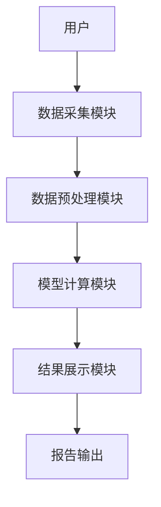
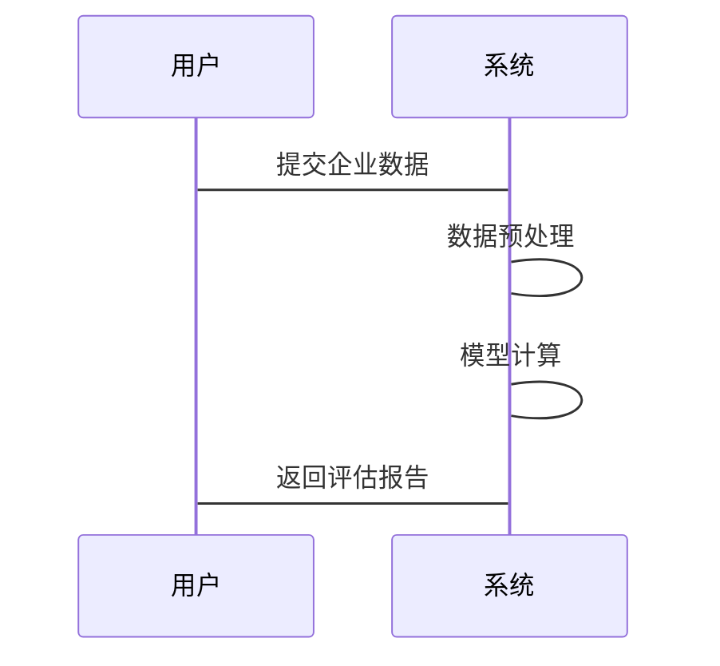

                 


# 如何评估初创企业的价值

> 关键词：初创企业，价值评估，财务分析，市场分析，团队评估，商业模式

> 摘要：评估初创企业的价值是投资者和企业管理者的重要任务。本文从背景、核心概念、算法原理、系统架构到项目实战，全面解析如何科学、系统地评估初创企业的价值。

---

# 第一部分: 初创企业价值评估的背景与核心概念

## 第1章: 初创企业价值评估的背景与问题背景

### 1.1 初创企业价值评估的定义与范围

#### 1.1.1 初创企业的定义与特点
初创企业是指刚成立不久的企业，通常处于发展初期，具有高增长潜力但也伴随着高风险。其特点包括：轻资产、高创新、依赖创始人团队、市场不确定性大等。

#### 1.1.2 价值评估的核心目标
价值评估的核心目标是通过分析企业的财务状况、市场定位、团队能力、商业模式等因素，估算其市场价值或潜在收益能力，为投资决策提供依据。

#### 1.1.3 价值评估的适用场景与边界
- 适用场景：企业融资、并购、投资决策、估值谈判等。
- 边界：不考虑宏观经济极端波动，不评估企业长期战略调整能力，主要基于现有数据和假设进行分析。

### 1.2 价值评估的重要性与意义

#### 1.2.1 初创企业融资需求与价值评估
初创企业在早期阶段通常缺乏足够的现金流，需要通过外部融资获取发展资金。价值评估是吸引投资者的关键步骤。

#### 1.2.2 投资者决策中的价值评估作用
投资者通过价值评估判断企业的潜在回报和风险，决定是否投资以及投资金额。

#### 1.2.3 企业内部管理的价值评估应用
企业可以通过价值评估优化资源配置、制定战略目标、评估团队绩效。

### 1.3 价值评估的核心要素与关键问题

#### 1.3.1 企业核心竞争力的评估维度
- 技术创新性
- 市场需求度
- 产品差异化
- 知识产权保护

#### 1.3.2 市场定位与商业模式的评估重点
- 市场定位是否准确
- 商业模式是否可行
- 市场规模和增长潜力

#### 1.3.3 财务健康状况与风险分析
- 资产负债情况
- 现金流状况
- 利润能力
- 风险承受能力

#### 1.3.4 团队能力与执行效率的评估标准
- 团队成员的专业能力
- 团队的协作效率
- 团队的历史成就

### 1.4 本章小结

#### 1.4.1 初创企业价值评估的核心概念总结
价值评估是通过分析企业的财务、市场、团队和商业模式等多方面因素，估算其潜在价值。

#### 1.4.2 价值评估的关键问题与挑战
- 数据不足
- 市场不确定性
- 模型假设的合理性

---

## 第2章: 价值评估的核心概念与理论基础

### 2.1 价值评估的理论框架

#### 2.1.1 财务价值评估的基本原理
财务价值评估主要基于企业的财务数据，通过折现现金流模型（DCF）等方法估算企业价值。

#### 2.1.2 市场价值评估的理论基础
市场价值评估基于可比公司分析和市场交易数据，考虑市场的整体估值水平。

#### 2.1.3 初创企业特有的价值评估模型
针对初创企业的特点，可以采用简化版的DCF模型或基于创业投资的净现值模型。

### 2.2 核心概念对比分析

#### 2.2.1 财务指标与非财务指标的对比
| 指标类型 | 财务指标 | 非财务指标 |
|----------|----------|------------|
| 例子     | 净利润   | 市场份额   |
| 用途     | 精确衡量企业盈利能力 | 衡量市场地位和竞争力 |

#### 2.2.2 现金流折现法与相对估值法的优劣势
- 现金流折现法：优点是考虑了资金的时间价值，缺点是需要假设未来现金流的准确性。
- 相对估值法：优点是简单易行，缺点是依赖于可比公司的数据。

#### 2.2.3 不同行业特点对价值评估的影响
- 高 tech 行业：更注重技术创新和研发能力。
- 服务行业：更注重客户满意度和品牌价值。

### 2.3 实体关系图与价值评估架构

```mermaid
erDiagram
    customer[客户] {
        id : integer
        name : string
        transaction : string
    }
    product[产品] {
        id : integer
        name : string
        price : float
    }
    transaction[交易] {
        id : integer
        customer_id : integer
        product_id : integer
        date : date
    }
    customer-|{many} transaction
    product-|{many} transaction
```

---

## 第3章: 价值评估的关键算法与数学模型

### 3.1 财务价值评估算法

#### 3.1.1 现金流折现法（DCF模型）

$$ PV = \sum_{t=1}^{n} \frac{CF_t}{(1 + r)^t} $$

其中：
- \( PV \) 是现值
- \( CF_t \) 是第 \( t \) 年的现金流
- \( r \) 是折现率

#### 3.1.2 市盈率与市净率模型

- 市盈率（P/E）：
$$ P/E = \frac{Market\,Value}{Earnings} $$

- 市净率（P/B）：
$$ P/B = \frac{Market\,Value}{Book\,Value} $$

#### 3.1.3 股权自由现金流模型

$$ FCFF = NI + NDTA - (WC\Delta + CAPX) $$

其中：
- \( FCFF \) 是股权自由现金流
- \( NI \) 是净利润
- \( NDTA \) 是非现金消耗资产折旧与摊销
- \( WC\Delta \) 是变化的净营运资本
- \( CAPX \) 是资本支出

### 3.2 市场价值评估算法

#### 3.2.1 相对估值法（Comparable公司分析）

$$ Target\,Value = 市盈率 \times 目标公司净利润 $$

#### 3.2.2 股票期权定价模型（Black-Scholes）

$$ C = S_0 e^{rT} N(d_1) - K e^{rT} N(d_2) $$

其中：
- \( C \) 是期权价格
- \( S_0 \) 是当前股票价格
- \( r \) 是无风险利率
- \( T \) 是期权到期时间
- \( K \) 是行权价
- \( N(d_1) \) 和 \( N(d_2) \) 是标准正态分布的累积分布函数

### 3.3 综合评估模型与算法实现

#### 3.3.1 初创企业综合价值评估模型

$$ V = \alpha \times DCF + (1-\alpha) \times Comparable $$

其中：
- \( V \) 是综合价值
- \( \alpha \) 是DCF模型的权重
- \( DCF \) 是现金流折现值
- \( Comparable \) 是可比公司价值

---

## 第4章: 系统分析与架构设计方案

### 4.1 价值评估系统的功能需求

#### 4.1.1 数据采集模块
- 数据来源：企业财务报表、市场数据、团队信息等。
- 数据预处理：清洗、转换、标准化。

#### 4.1.2 模型计算模块
- 算法实现：DCF模型、相对估值法等。
- 计算结果：企业价值、风险评估等。

#### 4.1.3 结果展示模块
- 可视化：图表展示、报告生成。
- 输出格式：PDF、Excel、仪表盘等。

### 4.2 系统架构设计



### 4.3 数据接口与交互设计

#### 4.3.1 数据接口设计
- 输入接口：API接口接收企业数据。
- 输出接口：返回评估结果。

#### 4.3.2 系统交互设计



---

## 第5章: 项目实战与案例分析

### 5.1 项目背景介绍
假设一家初创科技公司，提供SaaS服务，客户群体为中小型企业。

### 5.2 系统实现

#### 5.2.1 环境安装
- Python 3.8+
- Pandas、Numpy、Scipy库安装：
  ```bash
  pip install pandas numpy scipy
  ```

#### 5.2.2 核心代码实现
```python
import numpy as np
import pandas as pd
from scipy.stats import norm

def dcf_model(free_cash_flows, discount_rate, terminal_value):
    n = len(free_cash_flows)
    if n == 0:
        return 0
    present_value = 0
    for t in range(n):
        present_value += free_cash_flows[t] / (1 + discount_rate) ** t
    return present_value + terminal_value / (1 + discount_rate) ** n

def black_scholes(S, K, r, T, sigma):
    d1 = (np.log(S/K) + (r + sigma**2/2)*T) / (sigma*np.sqrt(T))
    d2 = d1 - sigma*np.sqrt(T)
    C = S * norm.cdf(d1) - K * np.exp(-r*T) * norm.cdf(d2)
    return C
```

#### 5.2.3 案例分析
- 输入数据：假设企业未来5年的现金流分别为100万、120万、150万、180万、200万，折现率为10%，永续年金假设为250万。
- 计算现值：
  ```python
  cash_flows = [100, 120, 150, 180, 200]
  discount_rate = 0.10
  terminal_value = 250
  print(dcf_model(cash_flows, discount_rate, terminal_value))
  # 输出结果
  ```

---

## 第6章: 最佳实践与注意事项

### 6.1 最佳实践
- 数据来源的可靠性：确保数据的准确性和完整性。
- 模型假设的合理性：根据企业特点调整模型参数。
- 结果验证：通过多模型对比和实际数据验证结果的准确性。

### 6.2 小结
价值评估是一个复杂的过程，需要结合企业的实际情况和市场环境进行综合分析。

### 6.3 注意事项
- 避免过度依赖单一模型。
- 定期更新模型参数以反映市场变化。
- 结合定性分析和定量分析。

### 6.4 拓展阅读
- 《创业企业的估值方法》
- 《风险投资与私募股权》
- 《企业价值评估的理论与实践》

---

## 第7章: 总结与展望

### 7.1 总结
通过系统的分析和实战案例，本文详细介绍了如何科学评估初创企业的价值，包括背景分析、算法实现和系统设计。

### 7.2 展望
未来，随着人工智能和大数据技术的发展，价值评估将更加精准和高效。

---

**摘要：**  
本文从初创企业的定义、价值评估的重要性、核心算法和系统设计等多个方面，详细探讨了如何科学评估初创企业的价值。通过案例分析和实战项目，为投资者和企业管理者提供了实用的指导和参考。

