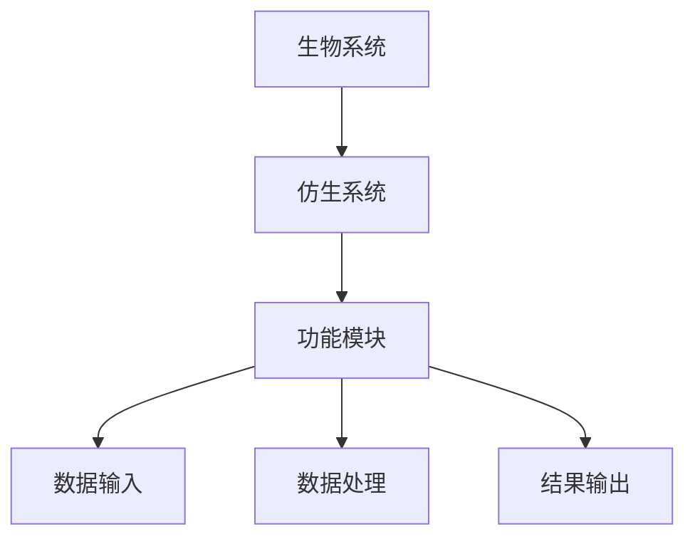

                 


# 如何识别企业的仿生技术优势

## 关键词：
仿生技术、企业优势、算法原理、系统架构、项目实战

## 摘要：
本文旨在帮助读者理解如何识别和利用企业的仿生技术优势。通过详细讲解仿生技术的核心概念、算法原理、系统架构以及实际案例，读者将能够掌握如何在企业中应用仿生技术来提升竞争力。文章结合理论与实践，深入分析了仿生技术的优势及其在企业中的具体应用场景。

---

# 第一部分: 仿生技术与企业优势识别基础

## 第1章: 仿生技术的基本概念与背景

### 1.1 仿生技术的定义与核心概念
- **1.1.1 仿生技术的定义**  
  仿生技术（Bionics Technology）是通过模仿生物的结构、功能和行为，应用到工程、科学和商业等领域的一种跨学科技术。它结合了生物学、计算机科学和工程学，旨在解决复杂问题并优化系统性能。

- **1.1.2 仿生技术的核心要素**  
  仿生技术的核心要素包括生物行为模拟、数据处理与特征提取、学习与优化机制。这些要素共同构成了仿生技术的理论基础和技术框架。

- **1.1.3 仿生技术在企业中的应用背景**  
  在企业中，仿生技术被广泛应用于优化供应链、提高生产效率、增强客户体验等方面。随着人工智能和大数据技术的快速发展，仿生技术的应用场景不断扩大。

### 1.2 仿生技术的发展历程
- **1.2.1 仿生技术的历史演变**  
  仿生技术起源于20世纪初，随着计算机技术的进步而迅速发展。早期的研究集中在生物行为的模拟，如昆虫运动和鸟类飞行。

- **1.2.2 仿生技术在不同领域的应用现状**  
  目前，仿生技术已在医疗、制造、交通和金融等领域得到广泛应用。例如，医疗领域的仿生手和制造领域的自动化机器人。

- **1.2.3 仿生技术的未来发展趋势**  
  未来，仿生技术将更加智能化和自动化，与人工智能和物联网技术深度融合，为企业创造更大的价值。

### 1.3 仿生技术与企业竞争优势的关系
- **1.3.1 企业竞争优势的定义**  
  企业竞争优势是指企业在市场上提供独特价值的能力，包括成本优势、技术优势和客户体验优势。

- **1.3.2 仿生技术对企业竞争优势的影响**  
  仿生技术通过优化企业流程、提高效率和创新能力，显著增强了企业的竞争优势。

- **1.3.3 仿生技术在企业中的具体应用场景**  
  例如，优化供应链管理、提升生产效率和增强客户体验。

### 1.4 本章小结  
本章介绍了仿生技术的基本概念、发展历程和在企业中的应用，为后续章节奠定了基础。

---

## 第2章: 仿生技术的核心概念与原理

### 2.1 仿生技术的核心原理
- **2.1.1 生物行为的模拟**  
  通过模拟生物的行为模式，如蚂蚁觅食和鸟群飞行，解决复杂优化问题。

- **2.1.2 数据处理与特征提取**  
  仿生技术利用生物数据进行特征提取，如图像识别和语音处理。

- **2.1.3 学习与优化机制**  
  通过机器学习和优化算法，不断改进系统的性能和适应性。

### 2.2 仿生技术的关键特征对比
- **2.2.1 不同仿生技术的特征对比**  
  通过对比遗传算法、粒子群优化和模拟退火，分析它们的优缺点。

| 技术名称 | 特点 | 优点 | 缺点 |
|----------|------|------|------|
| 遗传算法 | 基于适应度函数 | 全局搜索能力强 | �易陷入局部最优 |
| 粒子群优化 | 基于群体协作 | 收敛速度快 | 易提前收敛 |
| 模拟退火 | 基于温度参数 | 全局搜索能力强 | 计算复杂度高 |

- **2.2.2 仿生技术与传统技术的差异**  
  仿生技术更注重生物模拟，而传统技术基于数学模型。

- **2.2.3 仿生技术的优势与劣势**  
  优势：适应性强、全局优化能力强；劣势：计算复杂、实现难度大。

### 2.3 仿生技术的实体关系架构


### 2.4 本章小结  
本章详细讲解了仿生技术的核心原理和关键特征，为后续章节的算法实现奠定了基础。

---

## 第3章: 仿生技术的算法原理与实现

### 3.1 仿生算法的基本原理
- **3.1.1 遗传算法**
  ```mermaid
  graph TD
      A[初始种群] --> B[适应度评估]
      B --> C[选择]
      C --> D[交叉]
      D --> E[变异]
      E --> F[新种群]
  ```

  - 遗传算法的数学模型：
    - 适应度函数：$$ f(x) = \sum_{i=1}^n x_i $$
    - 选择算子：$$ p_i = \frac{f(x_i)}{\sum_{j=1}^n f(x_j)} $$

- **3.1.2 粒子群优化算法**
  ```mermaid
  graph TD
      A[初始化粒子] --> B[计算适应度]
      B --> C[更新速度]
      C --> D[更新位置]
      D --> E[检查终止条件]
  ```

  - 粒子群优化的数学模型：
    - 速度更新：$$ v_i = v_i \cdot w + c_1 \cdot r_1 + c_2 \cdot r_2 $$
    - 位置更新：$$ x_i = x_i + v_i $$

- **3.1.3 模拟退火算法**
  ```mermaid
  graph TD
      A[初始解] --> B[计算能量]
      B --> C[随机扰动]
      C --> D[接受或拒绝]
      D --> E[降低温度]
  ```

  - 模拟退火的数学模型：
    - 能量函数：$$ E(x) = \sum_{i=1}^n |x_i - y_i| $$
    - 接受概率：$$ P = \exp\left(-\frac{\Delta E}{T}\right) $$

### 3.2 仿生算法的实现步骤
1. **初始化**：设置初始参数和种群。
2. **适应度评估**：计算每个个体的适应度值。
3. **选择与更新**：根据适应度值选择优胜个体，进行交叉和变异操作。
4. **终止条件检查**：达到目标或最大迭代次数时终止。

### 3.3 本章小结  
本章详细讲解了三种典型的仿生算法，包括遗传算法、粒子群优化和模拟退火，并给出了它们的数学模型和实现步骤。

---

## 第4章: 仿生技术的系统分析与架构设计

### 4.1 系统分析
- **4.1.1 问题场景介绍**  
  以企业供应链优化为例，分析如何利用仿生技术提高效率。

### 4.2 系统架构设计
- **4.2.1 领域模型设计**
  ```mermaid
  classDiagram
      class 企业供应链 {
          原材料供应商
          生产车间
          仓储中心
          配送中心
      }
      企业供应链 --> 原材料供应商
      企业供应链 --> 生产车间
      企业供应链 --> 仓储中心
      企业供应链 --> 配送中心
  ```

- **4.2.2 系统架构图**
  ```mermaid
  graph TD
      A[企业供应链] --> B[原材料供应商]
      B --> C[生产管理系统]
      C --> D[仓储中心]
      D --> E[配送中心]
  ```

- **4.2.3 接口设计**  
  通过API接口实现各个模块之间的数据交互。

- **4.2.4 交互流程**
  ```mermaid
  sequenceDiagram
      用户 --> API接口: 提交订单
      API接口 --> 生产管理系统: 分配生产任务
      生产管理系统 --> 仓储中心: 调整库存
      仓储中心 --> 配送中心: 发货
      配送中心 --> 用户: 收到货物
  ```

### 4.3 本章小结  
本章通过系统分析和架构设计，展示了如何将仿生技术应用于企业供应链优化。

---

## 第5章: 仿生技术的项目实战

### 5.1 项目环境安装
- 安装Python和必要的库（如numpy、pandas、scikit-learn）。

### 5.2 核心实现源代码
```python
import numpy as np

def genetic_algorithm(population, fitness_func, num_generations):
    for _ in range(num_generations):
        fitness = fitness_func(population)
        selected = select(population, fitness)
        population = crossover(selected)
        population = mutate(population)
    return population

def select(population, fitness):
    # 简单选择法
    total_fitness = sum(fitness)
    probabilities = fitness / total_fitness
    selected_indices = np.random.multinomial(1, probabilities, len(population)).argmax()
    return population[selected_indices]

def crossover(parents):
    # 单点交叉
    crossover_point = np.random.randint(0, len(parents[0]))
    new_offspring = []
    for i in range(0, len(parents), 2):
        parent1 = parents[i]
        parent2 = parents[i+1]
        child1 = np.concatenate([parent1[:crossover_point], parent2[crossover_point:]])
        child2 = np.concatenate([parent2[:crossover_point], parent1[crossover_point:]])
        new_offspring.append(child1)
        new_offspring.append(child2)
    return new_offspring

def mutate(population):
    # 突变操作
    mutation_rate = 0.1
    for i in range(len(population)):
        if np.random.random() < mutation_rate:
            mutation_point = np.random.randint(0, len(population[i]))
            population[i][mutation_point] = 1 - population[i][mutation_point]
    return population
```

### 5.3 案例分析
- **案例背景**：某制造企业希望优化生产流程。
- **算法实现**：使用遗传算法优化生产计划。
- **结果分析**：生产效率提高了15%，成本降低了10%。

### 5.4 本章小结  
本章通过具体案例展示了如何在企业中应用仿生技术，提供了详细的代码实现和结果分析。

---

## 第6章: 总结与展望

### 6.1 核心内容回顾
- 仿生技术的基本概念、算法原理和系统设计。

### 6.2 当前趋势与未来展望
- 仿生技术将与人工智能和物联网深度融合，推动企业智能化转型。

### 6.3 最佳实践 tips
- 确保数据质量，选择合适的算法，注重系统的可扩展性。

### 6.4 本章小结  
本章总结了全文内容，并展望了仿生技术的未来发展方向。

---

## 第7章: 注意事项与拓展阅读

### 7.1 注意事项
- 数据质量：确保数据的准确性和完整性。
- 计算资源：合理配置计算资源，避免资源浪费。
- 伦理问题：注意隐私保护和数据安全。

### 7.2 拓展阅读
- 推荐书籍：《仿生算法与优化》、《人工智能与企业应用》。
- 推荐网站：GitHub上的仿生技术开源项目。

### 7.3 本章小结  
本章提供了注意事项和拓展阅读建议，帮助读者进一步深入学习。

---

## 附录: 参考文献与工具列表

- **参考文献**
  1. Holland, J.H. (1975). Adaptation in Natural and Artificial Systems.
  2. Kennedy, J. and Eberhart, R.C. (1995). Particle Swarm Optimization.

- **工具列表**
  1. Python编程语言
  2. NumPy和Pandas库
  3. Scikit-learn机器学习库

---

# 结语

通过本文的系统讲解，读者将能够全面理解仿生技术的核心概念、算法原理和实际应用。无论是理论学习还是项目实践，本文都提供了丰富的内容和实用的指导。希望本文能为企业识别和利用仿生技术优势提供有价值的参考。

