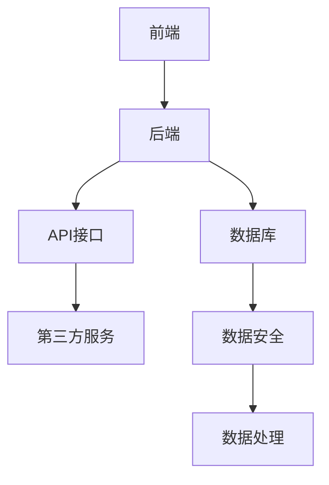
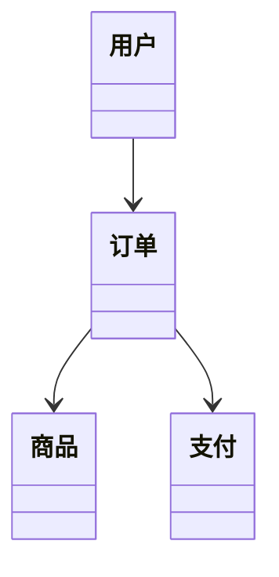

                 


# 如何识别企业的平台化转型优势

## 关键词：平台化转型、企业优势识别、系统架构、平台架构、业务模式优化、竞争分析

## 摘要：  
在数字化转型的浪潮中，企业平台化转型已成为重塑商业模式、提升竞争力的关键策略。本文从平台化转型的背景、核心概念、评估方法、系统架构、案例分析等多个维度，深入探讨如何识别和利用企业的平台化转型优势。通过理论分析与实际案例结合，为企业制定转型策略提供实践指导。

---

## 第1章 平台化转型的背景与概念

### 1.1 平台化转型的定义  
平台化转型是指企业通过构建共享、开放的平台，整合内外部资源，优化业务流程，形成以平台为核心的新商业模式。其本质是将企业的能力转化为可扩展的平台服务，以支持多业务线和生态合作伙伴的协同发展。

#### 1.1.1 平台化转型的核心要素  
- **平台架构**：包括技术架构、数据架构和业务架构。  
- **生态系统**：通过平台吸引上下游合作伙伴，形成互利共赢的生态。  
- **数据驱动**：利用数据优化平台运营和决策。  

#### 1.1.2 平台化转型与传统业务模式的区别  
- **资源利用**：传统模式注重垂直整合，平台化模式注重共享和协作。  
- **扩展性**：传统模式扩展成本高，平台化模式更具灵活性和扩展性。  
- **创新速度**：平台化模式通过生态合作，快速引入创新资源。  

### 1.2 平台化转型的背景  
- **技术驱动**：云计算、大数据和AI技术为企业构建平台提供了技术支撑。  
- **市场竞争加剧**：企业需要通过差异化竞争提升市场份额。  
- **客户需求变化**：客户对个性化、定制化服务的需求增加，推动企业向平台化转型。  

### 1.3 平台化转型的优势与挑战  
#### 1.3.1 优势  
- **成本降低**：通过资源共享和协同工作，降低边际成本。  
- **创新加速**：平台化模式能够快速整合外部资源，推动创新。  
- **生态价值**：通过平台吸引合作伙伴，形成更大的商业价值。  

#### 1.3.2 挑战  
- **平台构建难度**：技术架构复杂，需要投入大量资源。  
- **生态系统建设**：吸引合作伙伴并维持生态的活跃度是关键。  
- **数据安全**：平台化转型涉及大量数据共享，数据安全和隐私保护是重要问题。  

### 1.4 相关概念对比  
- **平台化与数字化**：数字化转型侧重于技术应用，而平台化转型更注重商业模式的重构。  
- **平台化与敏捷化**：敏捷化强调快速响应，平台化强调构建可持续的平台能力。  
- **平台化与生态化**：平台化是生态化的一种实现方式，生态化强调多方协作，而平台化更注重通过平台实现协作。

---

## 第2章 平台化转型的核心概念与联系

### 2.1 平台化转型的核心概念  
- **平台架构**：平台架构是平台化转型的基础，包括技术架构、数据架构和业务架构。  
- **业务模式**：平台化转型需要重新设计业务模式，例如从卖产品转向提供服务。  
- **竞争优势**：通过平台化转型，企业可以构建差异化竞争优势。  

#### 2.1.1 平台化转型的核心要素  
- **平台能力**：包括技术能力、数据能力和生态能力。  
- **业务流程**：优化业务流程，使其适合平台化运营。  
- **组织结构**：组织结构需要从传统科层制向更灵活的平台型组织转型。  

### 2.2 平台化转型的核心原理  
- **资源优化配置**：通过平台整合资源，实现资源的高效利用。  
- **价值网络构建**：通过平台构建价值网络，连接供需双方。  
- **持续创新**：平台化转型允许企业快速迭代和创新，以应对市场变化。  

### 2.3 平台化转型与企业战略  
- **战略定位**：平台化转型需要明确企业的战略定位，例如是否成为平台的主导者或参与者。  
- **生态合作**：平台化转型需要构建生态系统，与合作伙伴共同创造价值。  
- **风险管理**：平台化转型涉及外部合作伙伴，需要建立有效的风险管理机制。  

---

## 第3章 平台化转型的评估模型与算法

### 3.1 平台化转型优势的评估指标  
- **资源利用率**：通过平台整合资源后，资源利用率的提升情况。  
- **生态系统活跃度**：合作伙伴的数量和活跃度。  
- **用户增长速度**：平台吸引用户的速度和用户粘性。  
- **收入增长**：平台化转型对收入增长的贡献。  

### 3.2 平台化转型优势的评估模型  
#### 3.2.1 基于层次分析法（AHP）的评估模型  
层次分析法（AHP）是一种常用的决策分析方法，适用于多因素评估。  
- **步骤1：确定评估因素**：资源利用率、生态系统活跃度、用户增长速度、收入增长。  
- **步骤2：构建判断矩阵**：根据专家意见，对各因素的重要性进行打分。  
- **步骤3：计算权重**：通过计算判断矩阵的最大特征值和特征向量，得到各因素的权重。  
- **步骤4：计算综合得分**：根据权重和实际数据，计算各因素的综合得分，得出平台化转型的优势排序。  

#### 3.2.2 AHP算法实现  
以下是一个简单的AHP算法实现的Python代码示例：

```python
import numpy as np

def calculate_weights(matrix):
    # 计算判断矩阵的最大特征值和特征向量
    eigenvalues, eigenvectors = np.linalg.eigh(matrix)
    max_eigenvalue = eigenvalues.max()
    max_eigenvector = eigenvectors[:, np.argmax(eigenvalues)]
    return max_eigenvector / max_eigenvector.sum()

# 示例判断矩阵（资源利用率、生态系统活跃度、用户增长速度、收入增长）
matrix = [
    [1, 3, 2, 4],
    [1/3, 1, 2, 3],
    [1/2, 1/2, 1, 2],
    [1/4, 1/3, 1/2, 1]
]

weights = calculate_weights(matrix)
print("各因素权重：", weights)
```

### 3.3 算法原理的数学模型  
层次分析法的数学模型如下：  
$$ A = \{a_{ij}\} \quad (i,j=1,2,...,n) $$  
其中，$a_{ij}$ 表示第 $i$ 个因素相对于第 $j$ 个因素的重要性。  
通过计算特征向量和特征值，得到各因素的权重 $w_i$，并计算综合得分：  
$$ S_i = \sum_{k=1}^{m} w_k \cdot x_{ki} $$  
其中，$x_{ki}$ 是第 $k$ 个因素的得分，$m$ 是因素数量。

---

## 第4章 平台化转型的系统架构与设计

### 4.1 平台化转型的系统架构  
- **技术架构**：包括前端、后端、数据库和API接口。  
- **数据架构**：包括数据存储、数据处理和数据安全。  
- **业务架构**：包括核心业务流程和平台功能模块。  

#### 4.1.1 系统架构图  
以下是一个平台化转型的系统架构图（使用Mermaid）：



### 4.2 平台化转型的系统设计  
- **领域模型**：定义平台的核心业务领域和实体关系。  
- **系统架构设计**：包括模块划分和模块交互流程。  
- **接口设计**：定义平台与其他系统之间的接口。  

#### 4.2.1 领域模型图  
以下是一个领域模型图（使用Mermaid）：



---

## 第5章 项目实战：平台化转型的案例分析

### 5.1 项目背景  
以某电商平台的平台化转型为例，分析其在资源利用率、生态系统活跃度、用户增长速度和收入增长方面的提升。  

### 5.2 项目环境配置  
- **技术选型**：使用React搭建前端，Node.js搭建后端，MySQL存储数据。  
- **开发工具**：使用VS Code和Docker进行开发和部署。  

### 5.3 核心代码实现  
#### 5.3.1 前端代码示例  
```javascript
function PlatformPage() {
    const [users, setUsers] = useState([]);
    const [orders, setOrders] = useState([]);

    useEffect(() => {
        fetch('/api/users')
            .then(res => res.json())
            .then(data => setUsers(data));
    }, []);

    return (
        <div>
            <h1>平台化转型案例</h1>
            <p>用户数量：{users.length}</p>
            <p>订单数量：{orders.length}</p>
        </div>
    );
}
```

#### 5.3.2 后端代码示例  
```javascript
const express = require('express');
const app = express();

app.get('/api/users', (req, res) => {
    // 这里连接数据库并获取用户数据
    res.json([{ id: 1, name: '用户1' }]);
});

app.listen(3000, () => {
    console.log('Server is running on http://localhost:3000');
});
```

### 5.4 实际案例分析  
通过实际数据对比，分析平台化转型后企业在资源利用率、生态系统活跃度、用户增长速度和收入增长方面的提升情况。  

---

## 第6章 最佳实践与注意事项

### 6.1 最佳实践  
- **明确目标**：企业在进行平台化转型前，需要明确转型目标和核心优势。  
- **生态系统建设**：注重平台生态系统的建设和维护，吸引合作伙伴。  
- **数据安全**：加强数据安全和隐私保护，确保平台的可信度。  

### 6.2 小结  
平台化转型是企业在数字化时代的重要战略选择，通过构建共享、开放的平台，企业可以实现资源的高效利用和业务的快速创新。然而，平台化转型也面临诸多挑战，需要企业在实践中不断探索和优化。

### 6.3 注意事项  
- **避免过度复杂化**：平台化转型需要循序渐进，避免一次性构建过于复杂的平台。  
- **注重用户体验**：平台设计需要以用户体验为核心，确保用户粘性和平台活跃度。  
- **持续优化**：平台化转型是一个持续优化的过程，需要企业不断根据市场反馈调整策略。

---

## 附录：参考文献与扩展阅读  
- 《平台革命》  
- 《数字化转型》  
- 《企业架构设计》  

---

以上是《如何识别企业的平台化转型优势》的技术博客文章的完整目录和内容概要，涵盖了从理论到实践的各个方面，为企业识别和实施平台化转型提供了全面的指导和实践建议。

