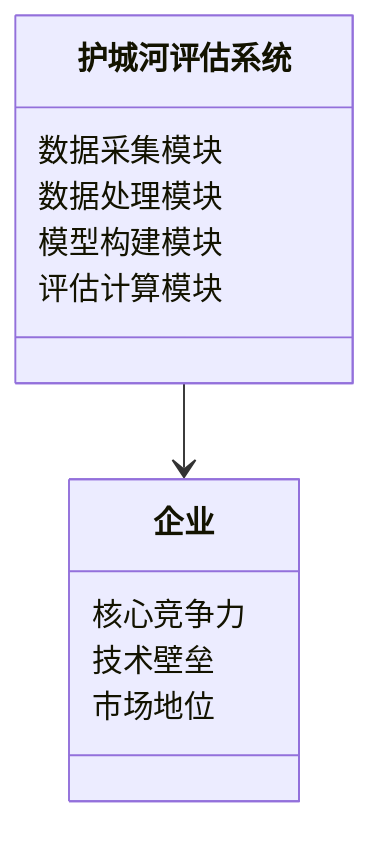
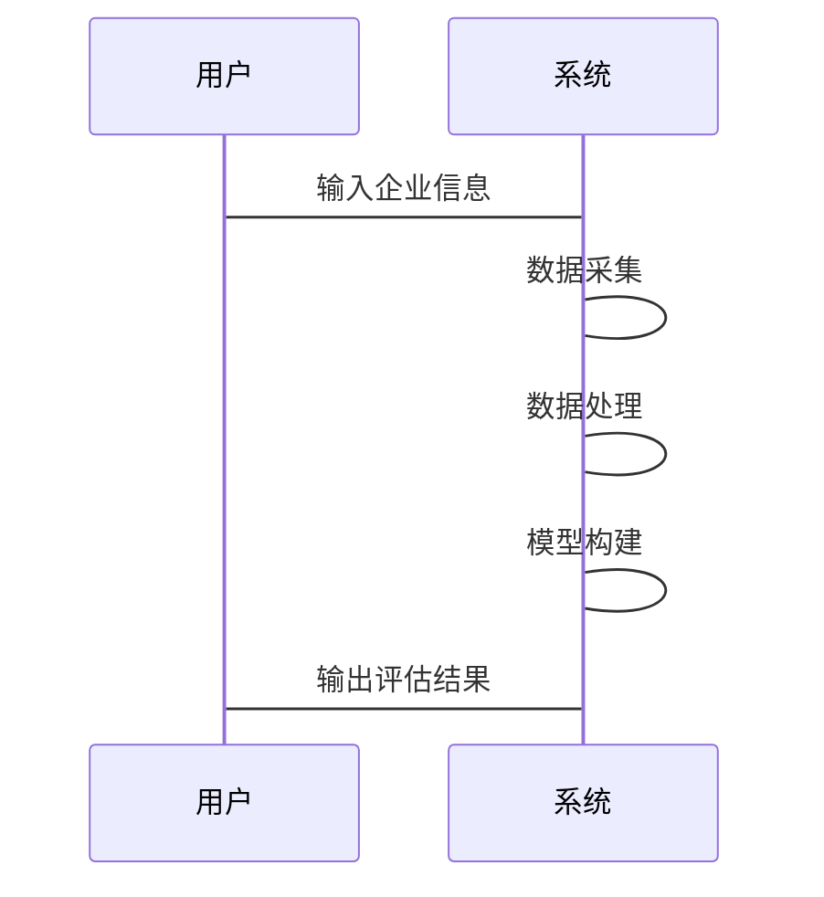

                 


# 如何识别企业的护城河持久性

> 关键词：企业护城河、持久性分析、核心竞争力、技术壁垒、市场地位、动态评估、竞争力评估

> 摘要：企业护城河是企业在市场竞争中建立的长期竞争优势，本文将从核心竞争力、技术壁垒、市场地位等多个维度，系统地分析企业护城河的持久性，并结合实际案例，深入探讨如何识别和维持企业的护城河。通过本文的分析，读者将能够掌握企业护城河持久性的评估方法，从而更好地制定企业战略。

---

# 第1章: 企业护城河的定义与背景

## 1.1 什么是企业护城河

### 1.1.1 护城河的定义
企业护城河是指企业在市场竞争中所建立的长期竞争优势，这种优势可以是技术、品牌、成本、资源等多个方面的综合体现。护城河的核心在于能够有效阻止竞争对手进入市场或削弱企业的市场地位。

### 1.1.2 护城河的核心特征
1. **独特性**：护城河必须是竞争对手难以复制或超越的核心优势。
2. **持久性**：护城河的持久性是指这种优势能够在较长的时间内保持竞争力。
3. **防御性**：护城河能够有效防御竞争对手的进攻，保护企业的市场份额。

### 1.1.3 护城河的分类
1. **技术型护城河**：基于企业的技术优势，如专利、研发能力等。
2. **品牌型护城河**：基于强大的品牌影响力，如高端品牌溢价能力。
3. **成本型护城河**：通过成本控制，实现价格优势。
4. **资源型护城河**：基于独特的资源储备，如原材料供应。

## 1.2 护城河的持久性问题

### 1.2.1 护城河持久性的定义
护城河的持久性是指企业在市场竞争中能够长期维持其竞争优势的能力，这种能力取决于企业的核心竞争力、技术创新能力、市场适应能力等因素。

### 1.2.2 护城河失效的常见原因
1. **技术落后**：竞争对手通过技术创新超越企业的技术优势。
2. **成本失控**：成本优势被削弱，导致价格优势丧失。
3. **市场变化**：市场需求发生变化，企业无法及时调整战略。
4. **管理不善**：内部管理问题导致竞争优势逐渐丧失。

### 1.2.3 护城河持久性的重要性
护城河的持久性直接关系到企业的长期竞争力和市场地位。企业需要通过持续创新和优化管理，确保护城河的持久性，从而在竞争激烈的市场中立于不败之地。

---

# 第2章: 护城河持久性的关键要素

## 2.1 核心竞争力分析

### 2.1.1 核心竞争力的定义
核心竞争力是指企业在市场上能够长期竞争优势的关键能力，这种能力是企业长期发展的基石。

### 2.1.2 核心竞争力的构成要素
1. **技术能力**：包括研发能力、专利储备等。
2. **创新能力**：包括产品创新、服务创新等。
3. **成本控制**：包括生产效率、采购成本等。
4. **品牌影响力**：包括品牌知名度、客户忠诚度等。

### 2.1.3 核心竞争力与护城河的关系
核心竞争力是护城河的重要组成部分，强大的核心竞争力能够有效提升企业的市场地位和竞争优势。

## 2.2 技术壁垒

### 2.2.1 技术壁垒的定义
技术壁垒是指企业通过技术优势建立的竞争优势，这种优势通常难以被竞争对手复制。

### 2.2.2 技术壁垒的类型
1. **专利壁垒**：通过专利技术保护企业的竞争优势。
2. **技术标准壁垒**：通过制定行业标准，掌握市场话语权。
3. **技术储备壁垒**：通过持续的研发投入，保持技术领先性。

### 2.2.3 技术壁垒的持久性分析
技术壁垒的持久性取决于企业的技术创新能力和技术储备。企业需要持续投入研发，保持技术领先性，才能确保技术壁垒的持久性。

## 2.3 市场地位与品牌价值

### 2.3.1 市场地位的定义
市场地位是指企业在市场中的位置和影响力，通常表现为市场份额、品牌知名度等。

### 2.3.2 品牌价值的衡量标准
1. **品牌知名度**：品牌在市场上的认知度。
2. **品牌忠诚度**：客户对品牌的忠诚程度。
3. **品牌溢价能力**：品牌能够实现的溢价能力。

### 2.3.3 市场地位对护城河持久性的影响
强大的市场地位和品牌价值能够有效提升护城河的持久性，尤其是在高端市场和细分市场中，品牌影响力是企业的重要竞争优势。

---

# 第3章: 护城河持久性的评估框架

## 3.1 护城河评估模型

### 3.1.1 评估模型的构建逻辑
护城河评估模型需要从多个维度综合考虑企业的核心竞争力、技术壁垒、市场地位等因素，通过量化分析，评估企业的护城河持久性。

### 3.1.2 评估模型的指标体系
1. **核心竞争力指标**：技术领先性、创新能力、成本控制能力。
2. **技术壁垒指标**：专利数量、技术标准影响力、技术储备。
3. **市场地位指标**：市场份额、品牌知名度、客户忠诚度。

### 3.1.3 评估模型的应用方法
通过定量分析和定性分析相结合，评估企业的护城河持久性，并根据评估结果制定相应的战略。

## 3.2 护城河持久性的影响因素

### 3.2.1 行业环境的影响
行业环境的变化，如市场需求、竞争格局、政策法规等，都会影响护城河的持久性。

### 3.2.2 竞争格局的变化
竞争对手的动态调整、新兴企业的崛起等都会对护城河的持久性产生影响。

### 3.2.3 内部管理与创新
企业的内部管理能力、创新能力是护城河持久性的关键因素。

## 3.3 护城河持久性的动态分析

### 3.3.1 动态评估的必要性
市场竞争的动态变化要求企业必须定期评估护城河的持久性，及时调整战略。

### 3.3.2 动态评估的步骤与方法
1. **收集数据**：通过市场调研、竞争对手分析等方式收集数据。
2. **分析评估**：结合定量分析和定性分析，评估护城河的持久性。
3. **制定策略**：根据评估结果，制定相应的战略调整措施。

### 3.3.3 动态评估的工具与技术
1. **SWOT分析**：分析企业的优势、劣势、机会和威胁。
2. **PEST分析**：分析政治、经济、社会、技术环境。
3. **波特五力模型**：分析行业竞争格局。

---

# 第4章: 护城河持久性分析方法论

## 4.1 护城河持久性原理

### 4.1.1 护城河持久性的基本原理
护城河的持久性是企业在市场竞争中通过核心竞争力、技术壁垒、市场地位等因素，长期维持竞争优势的能力。

### 4.1.2 护城河持久性的影响机制
1. **核心竞争力的持续提升**：通过技术创新、管理优化等方式，保持核心竞争力。
2. **技术壁垒的巩固**：通过专利保护、技术标准制定等方式，巩固技术壁垒。
3. **市场地位的强化**：通过品牌建设、市场拓展等方式，强化市场地位。

### 4.1.3 护城河持久性与企业生命周期的关系
护城河的持久性与企业生命周期密切相关，企业在不同阶段需要根据市场环境和自身能力，动态调整护城河策略。

## 4.2 核心概念对比分析

### 4.2.1 护城河与核心竞争力的对比
1. **护城河**：企业竞争优势的综合体现。
2. **核心竞争力**：企业竞争优势的核心要素。

### 4.2.2 技术壁垒与市场地位的对比
1. **技术壁垒**：企业通过技术优势建立的竞争优势。
2. **市场地位**：企业通过市场影响力和品牌价值建立的竞争优势。

### 4.2.3 护城河持久性与企业绩效的对比
1. **护城河持久性**：企业长期竞争优势的体现。
2. **企业绩效**：企业经营成果的直接反映。

## 4.3 ER实体关系图

```mermaid
er
  actor(企业) {
    id: string
    name: string
  }
  entity(护城河) {
    id: string
    type: string
    strength: integer
  }
  entity(持久性) {
    id: string
    duration: integer
    status: string
  }
  relation(拥有) {
    from: actor
    to:护城河
  }
  relation(具备) {
    from: actor
    to:持久性
  }
```

---

# 第5章: 护城河持久性评估算法

## 5.1 护城河评估算法原理

### 5.1.1 算法概述
护城河评估算法通过对企业核心竞争力、技术壁垒、市场地位等指标的量化分析，评估企业的护城河持久性。

### 5.1.2 算法流程
1. **数据收集**：收集企业的核心竞争力、技术壁垒、市场地位等数据。
2. **数据处理**：对数据进行清洗、标准化处理。
3. **模型构建**：建立护城河评估模型，量化各项指标的权重。
4. **评估计算**：根据模型计算护城河的持久性评分。

### 5.1.3 算法公式
护城河持久性评分 = ∑ (各指标评分 × 权重)

---

# 第6章: 护城河持久性系统架构设计

## 6.1 问题场景介绍
企业需要通过系统化的架构设计，评估和维护护城河的持久性，确保企业在市场竞争中保持长期竞争优势。

## 6.2 系统功能设计

### 6.2.1 领域模型设计


### 6.2.2 系统架构设计


## 6.3 系统接口设计

### 6.3.1 API接口设计
1. 数据采集接口：用于采集企业的核心竞争力、技术壁垒、市场地位等数据。
2. 评估计算接口：用于计算护城河的持久性评分。

## 6.4 系统交互设计

### 6.4.1 交互流程设计
1. 用户输入企业信息。
2. 系统采集数据并进行处理。
3. 系统构建模型并计算护城河持久性评分。
4. 系统输出评估结果。

### 6.4.2 交互序列图


---

# 第7章: 护城河持久性项目实战

## 7.1 环境安装与配置

### 7.1.1 系统环境要求
1. 操作系统：Windows 10 或更高版本，或 Linux 系统。
2. 开发工具：Python 3.8 或更高版本，Jupyter Notebook，IDE（如PyCharm）。

### 7.1.2 安装依赖库
```bash
pip install numpy
pip install pandas
pip install scikit-learn
pip install mermaid
```

## 7.2 核心代码实现

### 7.2.1 数据采集模块
```python
import pandas as pd

def collect_data():
    data = {
        '企业': ['企业A', '企业B', '企业C'],
        '核心竞争力': [85, 70, 90],
        '技术壁垒': [70, 85, 60],
        '市场地位': [90, 80, 70]
    }
    return pd.DataFrame(data)
```

### 7.2.2 数据处理模块
```python
from sklearn.preprocessing import StandardScaler

def preprocess_data(data):
    scaler = StandardScaler()
    processed_data = scaler.fit_transform(data[['核心竞争力', '技术壁垒', '市场地位']])
    return processed_data
```

### 7.2.3 模型构建模块
```python
from sklearn.linear_model import LinearRegression

def build_model(X, y):
    model = LinearRegression()
    model.fit(X, y)
    return model
```

### 7.2.4 评估计算模块
```python
def calculate_persistence_score(model, X):
    scores = model.predict(X)
    return scores
```

## 7.3 实际案例分析

### 7.3.1 案例背景
假设我们有三家竞争企业，需要评估它们的护城河持久性。

### 7.3.2 数据分析与结果解读
1. 企业A的核心竞争力和市场地位较高，但技术壁垒相对较低。
2. 企业B的技术壁垒和核心竞争力较强，但市场地位相对较低。
3. 企业C的核心竞争力和市场地位较低，但技术壁垒较高。

---

# 第8章: 总结与展望

## 8.1 最佳实践 tips
1. 定期评估护城河的持久性，及时调整战略。
2. 加强技术创新，保持技术壁垒的领先性。
3. 提升品牌影响力，强化市场地位。

## 8.2 小结
企业护城河的持久性是企业在市场竞争中长期维持竞争优势的关键。通过本文的分析，读者可以系统地识别和评估企业的护城河持久性，并制定相应的战略。

## 8.3 注意事项
1. 护城河的持久性需要动态评估，及时调整。
2. 技术创新和管理优化是护城河持久性的关键。

## 8.4 拓展阅读
1. 《竞争优势：如何建立和维护企业的核心竞争力》
2. 《技术壁垒：企业创新与竞争优势的构建》
3. 《品牌管理：从0到1建立强大的品牌影响力》

---

# 结语

企业护城河的持久性是企业在市场竞争中立于不败之地的关键。通过系统化的分析和实践，企业可以更好地识别和评估护城河的持久性，从而制定有效的战略，确保企业在长期竞争中保持优势。

