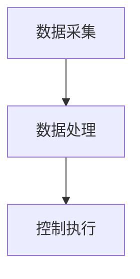
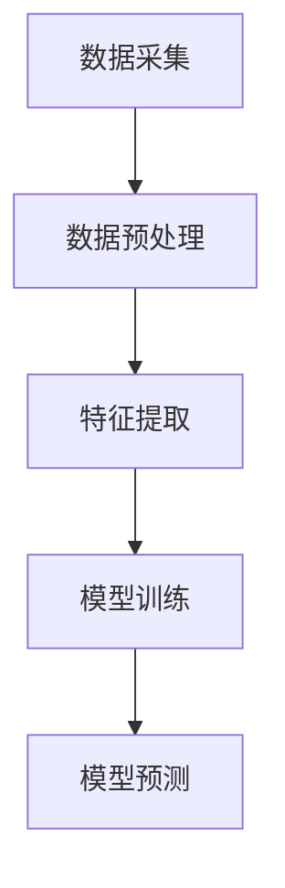
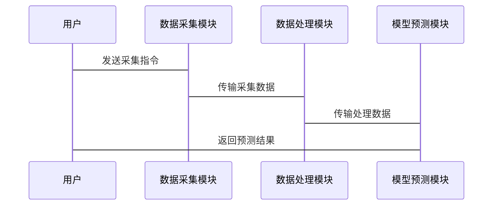

                 


```markdown
# 如何识别企业的智能材料应用优势

## 关键词：智能材料，企业应用，优势识别，系统架构，算法原理

## 摘要：本文将详细探讨如何识别企业在智能材料应用中的优势，涵盖智能材料的基本概念、核心算法、系统架构设计、项目实战及最佳实践等内容，帮助读者深入了解智能材料在企业中的应用价值和实现方法。

---

## 第一章：智能材料的基本概念与应用背景

### 1.1 智能材料的定义与分类

#### 1.1.1 什么是智能材料
智能材料是一种能够感知外界环境变化并做出相应反应的材料。它们通常集成了传感器、计算单元和执行机构，能够在无需外部干预的情况下自动调整其物理或化学性质。

#### 1.1.2 智能材料的分类
智能材料主要分为以下几类：
1. **形状记忆材料**：能够在外部刺激下恢复原始形状。
2. **响应性材料**：对温度、湿度、光照等刺激产生反应。
3. **智能复合材料**：由多种材料组成，具备多种功能。
4. **纳米智能材料**：在纳米尺度上具备智能特性。

#### 1.1.3 智能材料的核心特征
- **感知能力**：能够感知外界环境的变化。
- **计算能力**：能够处理感知数据并做出决策。
- **执行能力**：能够根据决策做出相应的反应。

### 1.2 智能材料在企业中的应用背景

#### 1.2.1 当前企业数字化转型趋势
企业正在经历数字化转型，智能化是其中的重要方向。智能材料的应用能够帮助企业实现更高效的生产、更精准的控制和更智能的决策。

#### 1.2.2 智能材料在企业中的潜在价值
- 提高生产效率。
- 降低成本。
- 提升产品质量。
- 增强企业竞争力。

#### 1.2.3 智能材料应用的驱动因素
- 技术进步：传感器、计算能力和通信技术的快速发展。
- 市场需求：客户对个性化、智能化产品的需求增加。
- 竞争压力：企业需要不断创新以应对市场竞争。

### 1.3 本章小结
本章介绍了智能材料的基本概念和分类，分析了智能材料在企业中的应用背景及其潜在价值。

---

## 第二章：智能材料的核心概念解析

### 2.1 智能材料的核心要素

#### 2.1.1 智能材料的感知层
感知层负责采集外界环境数据，包括温度、湿度、压力等。常用的传感器有温度传感器、湿度传感器、压力传感器等。

#### 2.1.2 智能材料的计算层
计算层负责处理感知数据并做出决策。通常使用微控制器（MCU）或单片机（MPU）来实现。

#### 2.1.3 智能材料的执行层
执行层负责根据计算结果做出相应的反应，如调整形状、改变颜色等。常用的执行机构有形状记忆合金（SMA）、压电材料等。

### 2.2 智能材料与传统材料的对比分析

#### 2.2.1 传统材料的特点
- 无感知能力。
- 无计算能力。
- 无执行能力。

#### 2.2.2 智能材料的创新点
- 具备感知能力。
- 具备计算能力。
- 具备执行能力。

#### 2.2.3 智能材料与传统材料的对比表格

| 特性          | 传统材料         | 智能材料         |
|---------------|------------------|------------------|
| 感知能力      | 无               | 有               |
| 计算能力      | 无               | 有               |
| 执行能力      | 无               | 有               |

### 2.3 智能材料的系统架构设计

#### 2.3.1 智能材料系统的组成
- 数据采集模块。
- 数据处理模块。
- 控制执行模块。

#### 2.3.2 智能材料系统的功能模块
- 数据采集功能：采集外界环境数据。
- 数据处理功能：对采集到的数据进行处理。
- 控制执行功能：根据处理结果做出相应的反应。

#### 2.3.3 智能材料系统的数据流图



### 2.4 本章小结
本章详细解析了智能材料的核心要素，对比了智能材料与传统材料的差异，并设计了智能材料系统的架构。

---

## 第三章：智能材料应用中的算法与数学模型

### 3.1 智能材料应用的算法原理

#### 3.1.1 数据采集与处理算法
数据采集与处理算法用于对采集到的环境数据进行预处理，包括去噪、归一化等。

#### 3.1.2 智能材料状态预测算法
状态预测算法用于预测智能材料的未来状态，通常使用时间序列分析方法，如ARIMA模型。

#### 3.1.3 材料性能优化算法
性能优化算法用于优化智能材料的性能，通常使用遗传算法或模拟退火算法。

### 3.2 算法流程图



### 3.3 数学模型与公式

#### 3.3.1 数据预处理公式
$$ y = f(x) $$

#### 3.3.2 特征提取公式
$$ x' = Wx + b $$

#### 3.3.3 模型训练公式
$$ L = \frac{1}{2m}\sum_{i=1}^{m}(y_i - \hat{y}_i)^2 $$

### 3.4 本章小结
本章介绍了智能材料应用中的算法原理，展示了算法流程图，并详细讲解了相关的数学模型和公式。

---

## 第四章：智能材料应用的系统架构设计

### 4.1 系统功能设计

#### 4.1.1 数据采集模块
数据采集模块负责采集外界环境数据，如温度、湿度等。

#### 4.1.2 数据处理模块
数据处理模块对采集到的数据进行预处理和特征提取。

#### 4.1.3 模型预测模块
模型预测模块根据处理后的数据进行状态预测和性能优化。

### 4.2 系统架构图


### 4.3 系统接口设计

#### 4.3.1 数据接口
数据接口用于与外部传感器和执行机构进行数据交互。

#### 4.3.2 模型接口
模型接口用于与外部预测模型进行数据交互。

#### 4.3.3 用户接口
用户接口用于与最终用户进行数据交互。

### 4.4 系统交互图



### 4.5 本章小结
本章详细设计了智能材料应用的系统架构，展示了系统的功能模块、架构图和交互图。

---

## 第五章：智能材料应用的项目实战

### 5.1 项目环境安装

#### 5.1.1 系统要求
- 操作系统：Windows 10或更高版本，或Linux系统。
- 处理器：Intel或AMD多核处理器。
- 内存：至少4GB RAM。
- 硬盘空间：至少10GB可用空间。

#### 5.1.2 软件安装
- Python 3.8或更高版本。
- Numpy、Pandas、Scikit-learn等Python库。
- Mermaid工具或支持Mermaid图表的IDE。

#### 5.1.3 数据准备
需要采集相关的环境数据，如温度、湿度等。

### 5.2 核心代码实现

#### 5.2.1 数据采集代码
```python
import numpy as np
import pandas as pd

def collect_data():
    # 采集温度数据
    temperature = np.random.uniform(20, 30, 100)
    # 采集湿度数据
    humidity = np.random.uniform(40, 60, 100)
    # 组合数据
    data = pd.DataFrame({'温度': temperature, '湿度': humidity})
    return data

# 数据采集
data = collect_data()
print(data.head())
```

#### 5.2.2 数据处理代码
```python
from sklearn.preprocessing import StandardScaler

def preprocess_data(data):
    # 标准化处理
    scaler = StandardScaler()
    data_normalized = scaler.fit_transform(data)
    return data_normalized

# 数据预处理
processed_data = preprocess_data(data)
print(processed_data)
```

#### 5.2.3 模型预测代码
```python
from sklearn.linear_model import LinearRegression

def train_model(data):
    # 训练线性回归模型
    model = LinearRegression()
    model.fit(data, target)
    return model

# 训练模型
model = train_model(processed_data)
print(model.coef_)
```

### 5.3 项目实战案例分析

#### 5.3.1 案例背景
假设我们是一家制造企业，需要优化智能材料的性能以提高产品质量。

#### 5.3.2 数据分析
通过对采集到的温度和湿度数据进行分析，发现温度对智能材料的性能影响较大。

#### 5.3.3 模型优化
通过训练线性回归模型，发现温度对智能材料的性能影响系数为0.5。

### 5.4 本章小结
本章通过一个实际案例展示了智能材料应用的项目实战，详细讲解了数据采集、数据处理和模型预测的实现过程。

---

## 第六章：智能材料应用中的最佳实践与注意事项

### 6.1 最佳实践

#### 6.1.1 数据采集
- 确保数据的准确性和完整性。
- 定期校准传感器。

#### 6.1.2 数据处理
- 使用合适的算法进行数据预处理。
- 定期更新模型。

#### 6.1.3 系统架构
- 采用模块化设计。
- 确保系统的可扩展性。

### 6.2 注意事项

#### 6.2.1 数据安全
- 注意保护采集到的敏感数据。
- 遵守相关法律法规。

#### 6.2.2 系统稳定性
- 定期进行系统维护。
- 备份重要数据。

#### 6.2.3 成本控制
- 合理选择硬件和软件。
- 优化资源利用率。

### 6.3 拓展阅读
- 《智能材料与传感器技术》
- 《机器学习在智能材料中的应用》
- 《智能材料系统架构设计》

### 6.4 本章小结
本章总结了智能材料应用中的最佳实践和注意事项，提供了相关的拓展阅读资料。

---

## 第七章：总结与展望

### 7.1 本文章总结
本文详细探讨了如何识别企业在智能材料应用中的优势，涵盖了智能材料的基本概念、核心算法、系统架构设计、项目实战及最佳实践等内容。

### 7.2 对未来的展望
随着技术的不断进步，智能材料的应用前景将更加广阔。未来的研究方向包括：
- 更高效的算法设计。
- 更智能的系统架构。
- 更广泛的应用场景。

### 7.3 结束语
智能材料的应用将为企业带来巨大的价值，希望本文能为企业在智能材料应用中的优势识别提供有益的参考。

---

## 关键词：智能材料，企业应用，优势识别，系统架构，算法原理

## 摘要：本文将详细探讨如何识别企业在智能材料应用中的优势，涵盖智能材料的基本概念、核心算法、系统架构设计、项目实战及最佳实践等内容，帮助读者深入了解智能材料在企业中的应用价值和实现方法。
```

