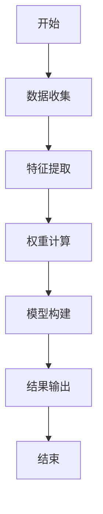

                 


# 如何识别企业的核心技术优势

> 关键词：企业核心技术优势，技术识别，战略规划，竞争优势，技术分析

> 摘要：本文详细探讨了如何识别企业的核心技术优势，从定义和重要性出发，结合系统架构、算法原理和项目实战，为企业提供一套完整的识别方法论。通过案例分析和最佳实践，帮助企业在竞争激烈的市场中找到自身的核心技术优势，从而制定有效的战略规划。

---

## 第1章: 核心技术优势的定义与重要性

### 1.1 核心技术优势的定义

核心技术优势是指企业在特定领域内拥有的独特技术和能力，这些技术和能力是企业的核心竞争力，能够为企业在市场竞争中提供显著的优势。核心技术优势不仅包括技术本身的先进性，还包括技术的可扩展性、可维护性和市场适应性。

### 1.2 核心技术优势的重要性

核心技术优势是企业生存和发展的关键。在现代商业环境中，技术是企业的核心资产之一，核心技术优势能够帮助企业抵御市场竞争的压力，提高企业的市场地位和盈利能力。此外，核心技术优势还能为企业提供创新和转型的动力，使企业能够更好地适应市场变化和技术进步。

### 1.3 核心技术优势的识别方法论

识别核心技术优势需要遵循一定的方法论。首先，企业需要明确自身的战略目标和市场需求，然后通过技术分析和竞争分析，找出自身的独特技术优势。此外，还需要考虑技术的可扩展性和可维护性，确保核心技术优势能够长期为企业提供竞争优势。

### 1.4 核心技术优势的边界与外延

核心技术优势的边界和外延需要清晰界定。核心技术是指企业的核心业务所需的关键技术，而非核心技术则是辅助性技术。核心技术优势的边界会因行业而异，不同行业的核心技术可能不同。同时，核心技术优势具有动态变化的特点，随着技术进步和市场需求的变化，核心技术优势也会不断调整。

---

## 第2章: 核心技术优势的核心概念与联系

### 2.1 核心技术优势的核心要素

核心技术优势的核心要素包括技术的先进性与创新性、可扩展性与可维护性、以及市场适应性与用户需求匹配度。这些要素共同构成了核心技术优势的内涵。

### 2.2 核心技术与非核心技术的对比分析

核心技术与非核心技术在特征上存在明显差异。核心技术具有较高的技术门槛和市场竞争力，而非核心技术则不具备这些特点。通过对比分析，可以帮助企业明确哪些技术是核心，哪些是非核心。

### 2.3 核心技术优势的系统架构

核心技术优势的系统架构包括企业战略、技术团队、市场需求、产品开发等多个部分。这些部分相互作用，共同构成了企业核心技术优势的实现路径。

### 2.4 核心技术优势的ER实体关系图

```mermaid
erDiagram
    actor 企业战略 "企业战略"
    actor 技术团队 "技术团队"
    actor 市场需求 "市场需求"
    actor 产品开发 "产品开发"
    actor 用户反馈 "用户反馈"
    actor 行业竞争 "行业竞争"
    actor 资源分配 "资源分配"
    actor 企业绩效 "企业绩效"

    企业战略 --> 技术团队: 指导
    技术团队 --> 市场需求: 分析
    市场需求 --> 产品开发: 引导
    产品开发 --> 用户反馈: 收集
    用户反馈 --> 技术团队: 优化
    技术团队 --> 行业竞争: 对比
    行业竞争 --> 资源分配: 调整
    资源分配 --> 企业绩效: 影响
    企业绩效 --> 企业战略: 反馈
```

---

## 第3章: 核心技术优势的识别算法原理

### 3.1 核心技术优势识别算法的概述

核心技术优势识别算法是一种通过数据分析和模型构建，帮助企业识别自身核心技术优势的方法。该算法基于企业内外部数据，结合技术特征和市场表现，构建数学模型，最终识别出企业的核心技术优势。

### 3.2 核心技术优势识别算法的数学模型

核心技术优势识别算法的数学模型如下：

$$
C = \sum_{i=1}^{n} w_i \cdot f_i
$$

其中，$C$ 表示核心技术优势，$w_i$ 表示第 $i$ 个技术特征的权重，$f_i$ 表示第 $i$ 个技术特征的值。

### 3.3 核心技术优势识别算法的流程图



### 3.4 核心技术优势识别算法的实现代码

```python
import pandas as pd
from sklearn.metrics import pairwise_distances

# 数据收集
data = pd.read_csv('technologies.csv')

# 特征提取
features = data[['技术创新性', '市场适应性', '可扩展性']]

# 权重计算
weights = [0.4, 0.3, 0.3]

# 模型构建
def calculate_core_technology优势(features, weights):
    return pd.Series(features.multiply(weights).sum(axis=1))

# 结果输出
result = calculate_core_technology优势(features, weights)
print(result)
```

---

## 第4章: 系统分析与架构设计

### 4.1 系统功能设计

系统功能设计包括数据收集、特征提取、权重计算、模型构建和结果输出五个部分。每个部分都需要进行详细设计，确保系统的高效运行。

### 4.2 系统架构设计

系统架构设计采用分层架构，包括数据层、业务逻辑层和用户界面层。各层之间通过接口进行交互，确保系统的模块化和可维护性。

### 4.3 系统接口设计

系统接口设计需要明确各个模块之间的接口定义，确保系统的各个部分能够协同工作，实现核心技术优势的识别。

### 4.4 系统交互设计

系统交互设计采用序列图的形式，展示系统在识别核心技术优势过程中的交互流程。用户输入数据，系统进行处理并输出结果。

---

## 第5章: 项目实战

### 5.1 环境安装

需要安装Python、Pandas、Scikit-learn等工具，确保系统的正常运行。

### 5.2 核心代码实现

编写Python代码，实现核心技术优势的识别算法。代码包括数据收集、特征提取、权重计算和模型构建等部分。

### 5.3 案例分析

通过具体案例分析，展示如何通过算法识别企业的核心技术优势。例如，分析一家科技公司的技术数据，找出其核心技术优势。

### 5.4 项目总结

总结项目实施过程中的经验和教训，提出改进建议，为后续项目提供参考。

---

## 第6章: 最佳实践与总结

### 6.1 小结

核心技术优势的识别是企业战略规划的重要组成部分，通过系统的识别方法和算法的支持，可以帮助企业明确自身的竞争优势。

### 6.2 注意事项

在识别核心技术优势时，需要注意数据的准确性和算法的合理性，确保识别结果的有效性。

### 6.3 未来展望

随着技术的进步，核心技术优势的识别方法将更加智能化和自动化，为企业提供更强大的支持。

---

通过以上步骤，企业可以系统地识别自身的核心技术优势，制定有效的战略规划，提升市场竞争力。

