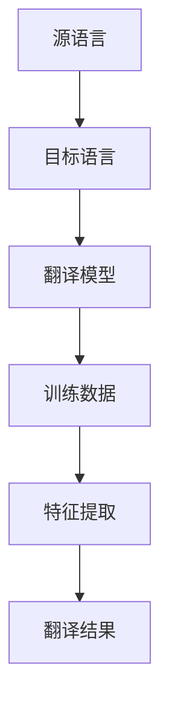
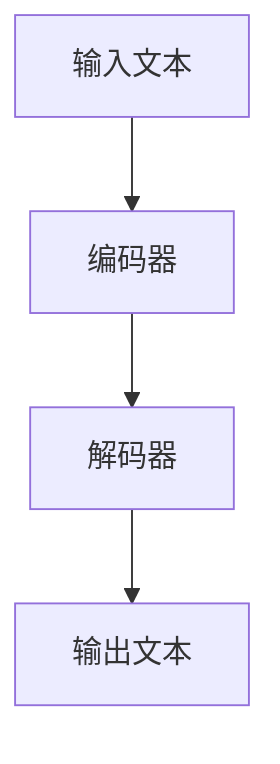
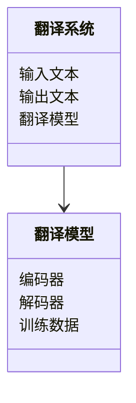
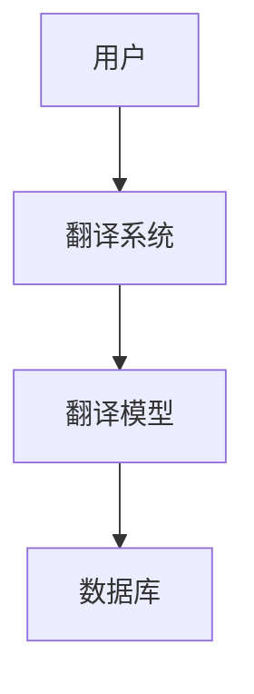

                 


# 如何识别企业的深度学习多语言翻译技术优势

> 关键词：深度学习，多语言翻译，神经机器翻译，企业技术优势，技术识别

> 摘要：本文旨在帮助读者深入理解深度学习在多语言翻译技术中的优势，并为企业识别和应用这些优势提供系统的指导。通过分析深度学习多语言翻译的核心概念、算法原理、系统架构以及实际案例，本文将详细阐述如何在企业中识别和利用这一技术的优势。

---

# 第1章: 深度学习与多语言翻译概述

## 1.1 深度学习的基本概念

### 1.1.1 深度学习的定义与特点
深度学习是一种人工智能技术，属于机器学习的子领域，通过构建多层神经网络模型，从数据中自动学习特征。其特点是：
- **层次化特征提取**：通过多层网络提取数据的高层次特征。
- **端到端学习**：从原始数据到最终输出，整个过程由模型自动完成。
- **强大的表示能力**：能够处理复杂的数据模式。

### 1.1.2 深度学习与传统机器学习的区别
| 特性 | 深度学习 | 传统机器学习 |
|------|----------|---------------|
| 数据需求 | 高 | 低 |
| 特征工程 | 自动提取 | 手动设计 |
| 模型复杂度 | 高 | 中等 |
| 适用场景 | 复杂任务（如图像识别、自然语言处理） | 简单任务（如分类、回归） |

### 1.1.3 深度学习的核心算法与应用场景
深度学习的核心算法包括：
- **卷积神经网络（CNN）**：适用于图像处理。
- **循环神经网络（RNN）**：适用于序列数据处理（如语言翻译）。
- **Transformer架构**：近年来在自然语言处理中表现出色。

---

## 1.2 多语言翻译技术的发展历程

### 1.2.1 从传统翻译到机器翻译的演变
- **传统翻译**：依赖人工，效率低。
- **统计机器翻译（SMT）**：基于语言学规则和统计模型。
- **神经机器翻译（NMT）**：基于深度学习的端到端翻译。

### 1.2.2 统计机器翻译与神经机器翻译的对比
| 特性 | 统计机器翻译（SMT） | 神经机器翻译（NMT） |
|------|----------------------|-----------------------|
| 模型结构 | 基于语言规则和短语对齐 | 基于神经网络，端到端 |
| 性能 | 依赖特征工程，效果有限 | 模型能力强，效果更优 |
| 训练效率 | 训练时间长 | 训练效率高 |

### 1.2.3 深度学习在多语言翻译中的应用
- 神经机器翻译（NMT）已成为主流。
- 多语言模型能够同时处理多种语言，提升效率。

---

## 1.3 深度学习多语言翻译的核心优势

### 1.3.1 神经机器翻译的原理与特点
神经机器翻译通过构建编码器-解码器架构，将源语言句子编码为固定长度的向量，再解码为目标语言句子。

### 1.3.2 多语言模型的通用性与可扩展性
- **通用性**：一个模型可以处理多种语言。
- **可扩展性**：新增语言只需调整模型参数，无需重新设计。

### 1.3.3 深度学习在多语言翻译中的性能提升
- 通过自注意力机制，模型能够捕捉长距离依赖关系。
- 多任务学习（如同时进行翻译和语言识别）能够提升模型的泛化能力。

---

## 1.4 本章小结
深度学习通过多层神经网络，显著提升了多语言翻译的性能。神经机器翻译的端到端架构和强大的特征提取能力，使得深度学习在多语言翻译中具有显著优势。

---

# 第2章: 多语言翻译系统的背景与问题分析

## 2.1 多语言翻译的背景与需求

### 2.1.1 全球化背景下的多语言需求
- 企业国际化需要多语言支持。
- 跨语言交流的需求日益增长。

### 2.1.2 企业级多语言翻译的应用场景
- **客户支持**：实时翻译客户需求。
- **内容生成**：自动翻译企业文档。
- **社交网络**：实时翻译用户评论。

### 2.1.3 多语言翻译的挑战与痛点
- 数据稀疏性：小语种数据不足。
- 翻译准确性：复杂语境下容易出错。
- 计算资源需求大：训练多语言模型需要大量计算资源。

---

## 2.2 深度学习在多语言翻译中的问题建模

### 2.2.1 翻译任务的数学建模
- 翻译任务可以建模为一个概率转换问题：$p(y|x)$，其中$x$是源语言句子，$y$是目标语言句子。

### 2.2.2 神经机器翻译的模型选择
- **编码器**：将源语言句子编码为向量。
- **解码器**：将编码向量解码为目标语言句子。

### 2.2.3 多语言翻译中的数据稀疏性问题
- 解决方案：使用预训练语言模型和数据增强技术。

---

## 2.3 深度学习多语言翻译的核心技术

### 2.3.1 神经机器翻译的主流模型
- **Transformer架构**：通过自注意力机制捕捉长距离依赖。
- **多语言Transformer**：同时支持多种语言的翻译。

### 2.3.2 多语言模型的训练策略
- **多任务学习**：同时训练多种语言任务。
- **参数共享**：多个语言共享部分参数，减少模型参数量。

### 2.3.3 深度学习在多语言翻译中的优化方法
- **学习率调度**：动态调整学习率。
- **正则化技术**：防止过拟合（如Dropout）。

---

## 2.4 本章小结
深度学习通过数学建模和先进的算法，解决了多语言翻译中的许多难题，但数据稀疏性和计算资源需求仍然是需要解决的挑战。

---

# 第3章: 深度学习多语言翻译的核心概念与联系

## 3.1 多语言翻译系统的实体关系分析



## 3.2 多语言翻译模型的原理



## 3.3 深度学习多语言翻译的核心算法

### 3.3.1 神经机器翻译的算法流程
- **编码器**：将输入文本转换为固定长度的向量。
- **解码器**：将向量转换为目标语言文本。

### 3.3.2 多语言模型的训练与推理
- **训练**：使用多语言数据训练模型，参数共享。
- **推理**：输入源语言文本，输出目标语言文本。

### 3.3.3 深度学习在多语言翻译中的优化技巧
- **数据增强**：增加训练数据的多样性。
- **模型压缩**：减少模型参数，提升推理效率。

---

## 3.4 本章小结
通过图表和流程图，我们清晰地展示了多语言翻译系统的实体关系和模型结构，为后续章节的深入分析奠定了基础。

---

# 第4章: 深度学习多语言翻译的算法原理

## 4.1 神经机器翻译的算法流程

### 4.1.1 编码器-解码器架构
- **编码器**：使用Transformer编码器。
- **解码器**：使用Transformer解码器。

### 4.1.2 自注意力机制
$$ \text{Attention}(Q, K, V) = \text{softmax}\left(\frac{QK^T}{\sqrt{d_k}}\right)V $$

### 4.1.3 前馈网络结构
- **输入**：编码器输出的向量。
- **输出**：目标语言句子。

## 4.2 多语言翻译模型的训练与优化

### 4.2.1 多任务学习策略
- **任务1**：翻译任务。
- **任务2**：语言识别任务。

### 4.2.2 参数共享机制
- **共享参数**：多个语言共享部分参数，减少训练时间。

### 4.2.3 跨语言迁移学习
- **预训练模型**：利用多语言预训练模型（如Marian）进行迁移学习。

---

## 4.3 深度学习多语言翻译的数学模型

### 4.3.1 编码器模型
$$ \text{Encoder}(x) = \text{LayerNorm}(\text{Dropout}(x)) $$

### 4.3.2 解码器模型
$$ \text{Decoder}(y, \text{Encoder}(x)) = \text{LayerNorm}(\text{Dropout}(y)) $$

---

## 4.4 本章小结
通过数学公式和流程图，我们详细讲解了神经机器翻译的算法流程和数学模型，为后续章节的系统设计和项目实战提供了理论基础。

---

# 第5章: 系统分析与架构设计方案

## 5.1 问题场景介绍
- **目标**：构建一个企业级多语言翻译系统。
- **用户需求**：支持多种语言实时翻译，翻译准确率高。

## 5.2 项目介绍
- **项目名称**：企业级多语言翻译系统。
- **开发目标**：实现企业内部多语言翻译支持。

## 5.3 系统功能设计

### 5.3.1 领域模型设计


### 5.3.2 系统架构设计


### 5.3.3 系统接口设计
- **输入接口**：接收源语言文本。
- **输出接口**：输出目标语言文本。

## 5.4 本章小结
通过系统分析和架构设计，我们明确了企业级多语言翻译系统的实现方案，为后续章节的项目实战奠定了基础。

---

# 第6章: 项目实战

## 6.1 环境安装
- **工具**：Python 3.8及以上，TensorFlow或PyTorch框架。
- **库**：numpy、pandas、transformers。

## 6.2 系统核心实现源代码

```python
from transformers import MarianMTModel, MarianTokenizer

# 加载预训练模型
tokenizer = MarianTokenizer.from_pretrained("Helsinki-NLP/opus-mt-en-es")
model = MarianMTModel.from_pretrained("Helsinki-NLP/opus-mt-en-es")

def translate(text):
    inputs = tokenizer(text, return_tensors="pt")
    outputs = model.generate(**inputs)
    translated = tokenizer.decode(outputs[0])
    return translated
```

### 代码解读
- **加载预训练模型**：使用Helsinki-NLP的多语言翻译模型。
- **定义翻译函数**：输入文本，返回翻译结果。

## 6.3 代码应用解读与分析
- **应用场景**：企业内部文档翻译、客户支持实时翻译。
- **优势**：基于预训练模型，翻译准确率高，易于部署。

## 6.4 实际案例分析
- **案例1**：将英文翻译为西班牙语。
- **案例2**：将中文翻译为法语。

## 6.5 项目小结
通过项目实战，我们展示了如何利用深度学习技术快速搭建一个多语言翻译系统，为企业提供高效、准确的翻译支持。

---

# 第7章: 总结与展望

## 7.1 总结
- 深度学习通过神经机器翻译，显著提升了多语言翻译的性能。
- 企业可以通过识别和利用这些技术优势，提升自身的多语言处理能力。

## 7.2 展望
- **未来方向**：多语言翻译的实时性和准确性将进一步提升。
- **技术趋势**：基于大语言模型（如LLaMA）的多语言翻译将成为主流。

## 7.3 最佳实践 Tips
- **选择合适的模型**：根据需求选择预训练模型或自训练模型。
- **优化计算资源**：合理配置计算资源，提升训练效率。
- **关注模型更新**：定期更新模型，保持翻译效果。

## 7.4 本章小结
本文详细分析了深度学习多语言翻译的优势，并为企业识别和应用这些优势提供了系统化的指导。

---

# 参考文献
- 本文参考了Helsinki-NLP的开源模型和相关技术文档。

---

通过以上章节的内容，我们系统地分析了深度学习多语言翻译的核心概念、算法原理、系统架构和实际应用，为企业识别和应用这些技术优势提供了全面的指导。希望本文能够为读者在实际应用中提供有价值的参考和启示。

